# 不要过滤咖啡 TDS 样品

> 原文：<https://towardsdatascience.com/dont-filter-coffee-tds-samples-bd662acaa4d9?source=collection_archive---------24----------------------->

## 咖啡数据科学

## 数据挑战惯例

在咖啡的世界里，惯例通常是由专业的咖啡师和几个毫无疑问的专家的多年经验来推动的。几年前，咖啡师开始使用折光仪来更好地了解他们通过多种咖啡技术提取咖啡的效果。折射仪测量总溶解固体量(TDS ),然后通过咖啡渣的流入和咖啡液体的流出来确定提取率(EY)。这种类型的数据被用来以更客观的方式评估咖啡，并挑战一些现有的惯例。

> 惯例:如果你能负担得起，在使用注射器过滤器测量 TDS 之前过滤所有的样品。

我并没有试图推翻这个惯例，但是我相信我能够进行一个简单的实验来证明过滤样本是没有意义的，或者至少，你没有过滤掉你认为你在过滤的咖啡。

我开始这个实验是为了更好地理解使用糖水的折光仪。然后我决定做一个小小的测试，那就变成了这篇文章。我之前发现注射器过滤器只能线性改变 TDS 读数，所以它们不是很有效。

# 惯例

注射器过滤器并不便宜。在 VST 的 T2 网站上，50 或 2 美元一个的 T3 大约是 100 美元(含税和运费)。VST 声称，你应该过滤样本，甚至可能两三次，以取得良好的测量结果。他们说，他们的过滤器消除了可能干扰 TDS 测量的细小、未溶解的固体和 CO2。

已经有一些关于折射仪的[研究](/espresso-measurement-solubility-b1f53b91c2b9)，但是没有一个表明过滤样品是必要的。

# 糖测试

我开始将 2 克糖加入 30 克水中，因此 TDS 应该是 6.2%，但实际上，它是 5.2%，所以 EY 是 84%。

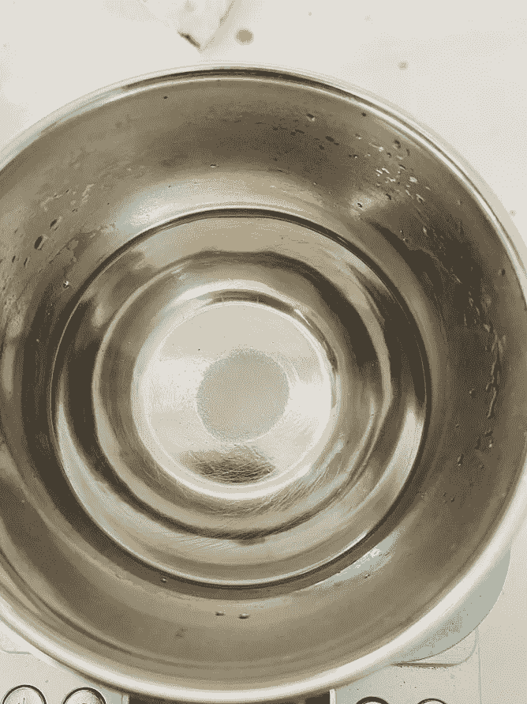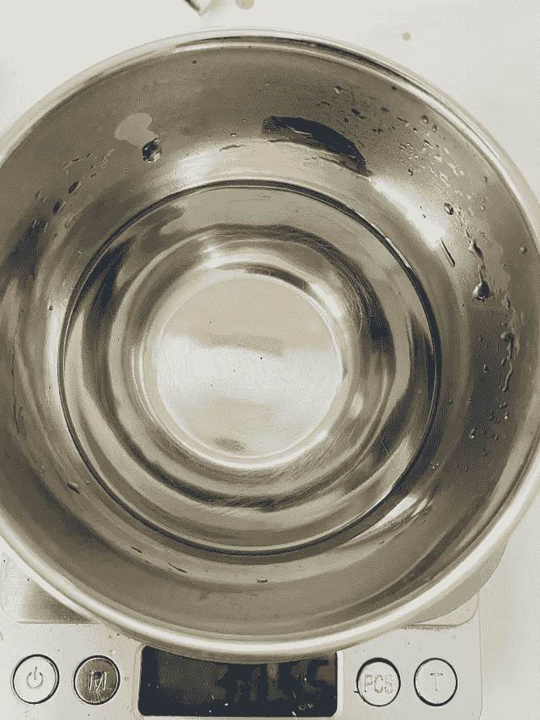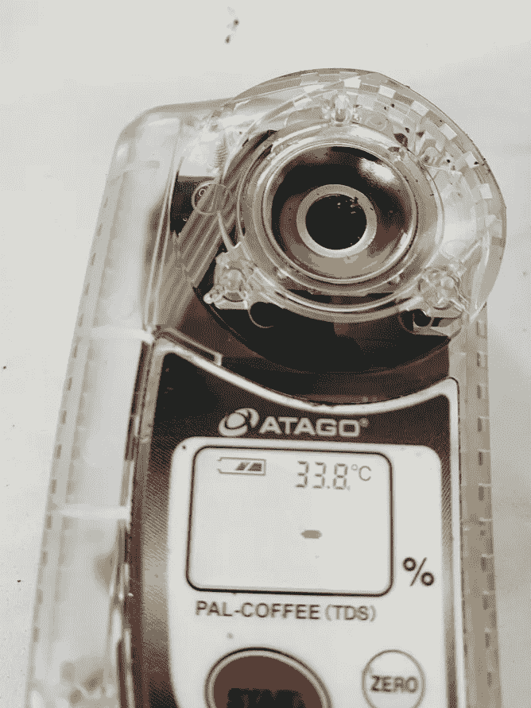

所有图片由作者提供

然后，我对糖水进行了一些测量，以查看测量的一致性，没有任何咖啡沉淀在样品中的潜在误差。

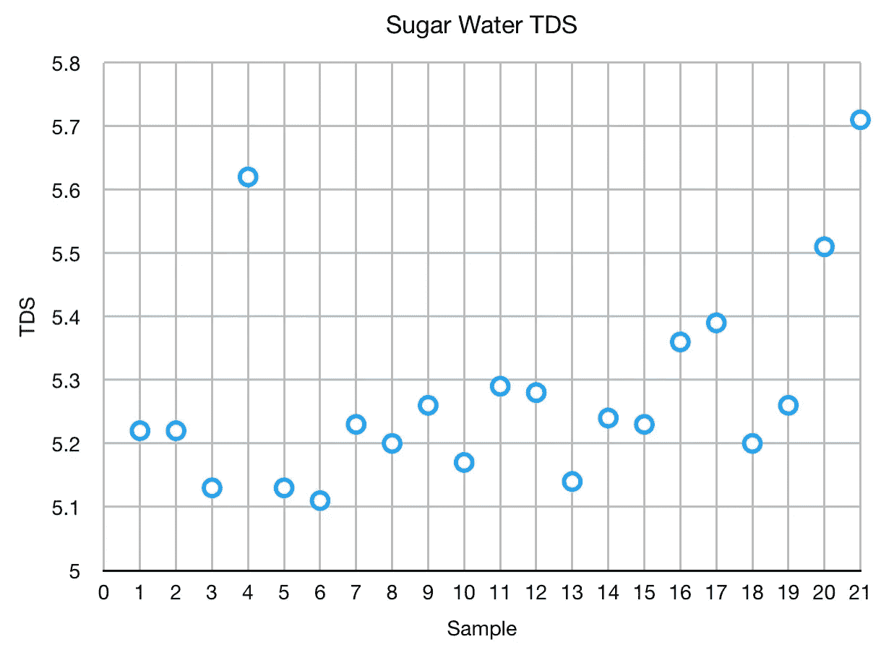

后来，我想我会把一些[废粉末](/producing-good-spent-coffee-grounds-for-experiments-637dcd9f4c53)放入样品中。我为一些实验制作了没有任何东西可提取的废粉末，我认为如果样品中的固体真的改变了读数，那么一堆粒子真的会扰乱读数。

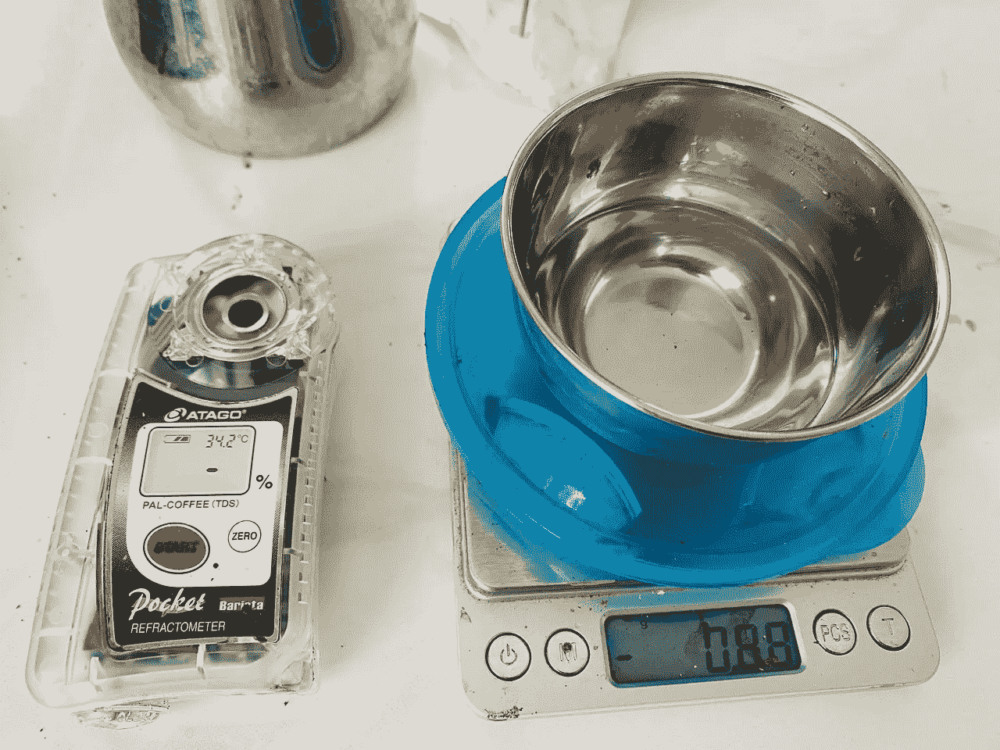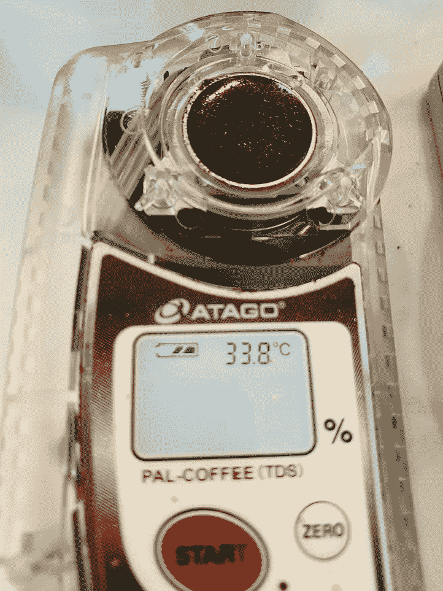

我会加入用过的咖啡渣，搅拌它们。我在加入用过的咖啡渣之前和之后读了一遍。

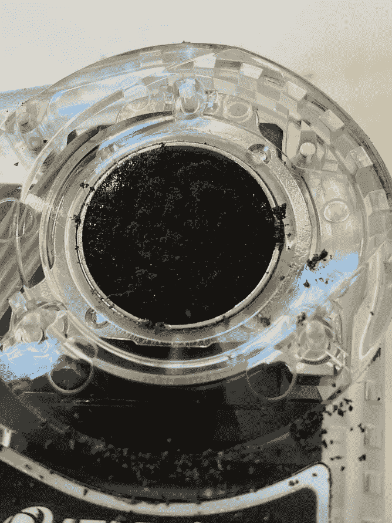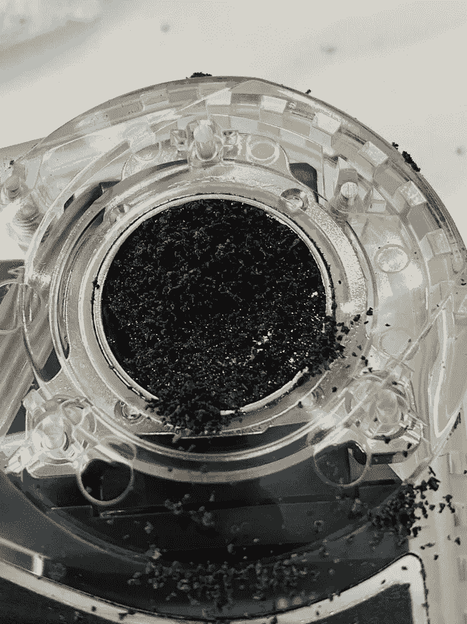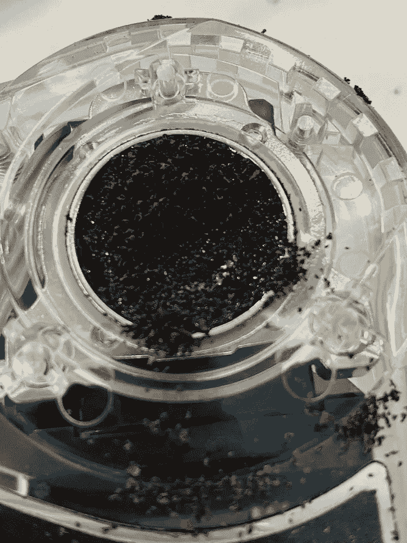

为了进一步增加乐趣，我在这些测试中使用了三级筛选过的废咖啡。在没有添加任何东西的情况下，我没有看到测量值超出样本可变性的界限。

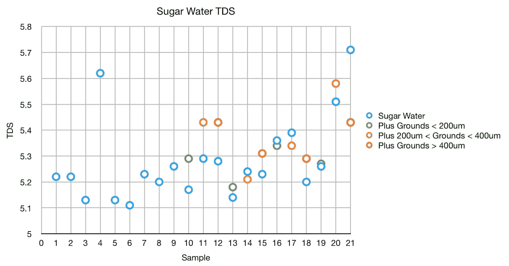

这次测试搞得一团糟。

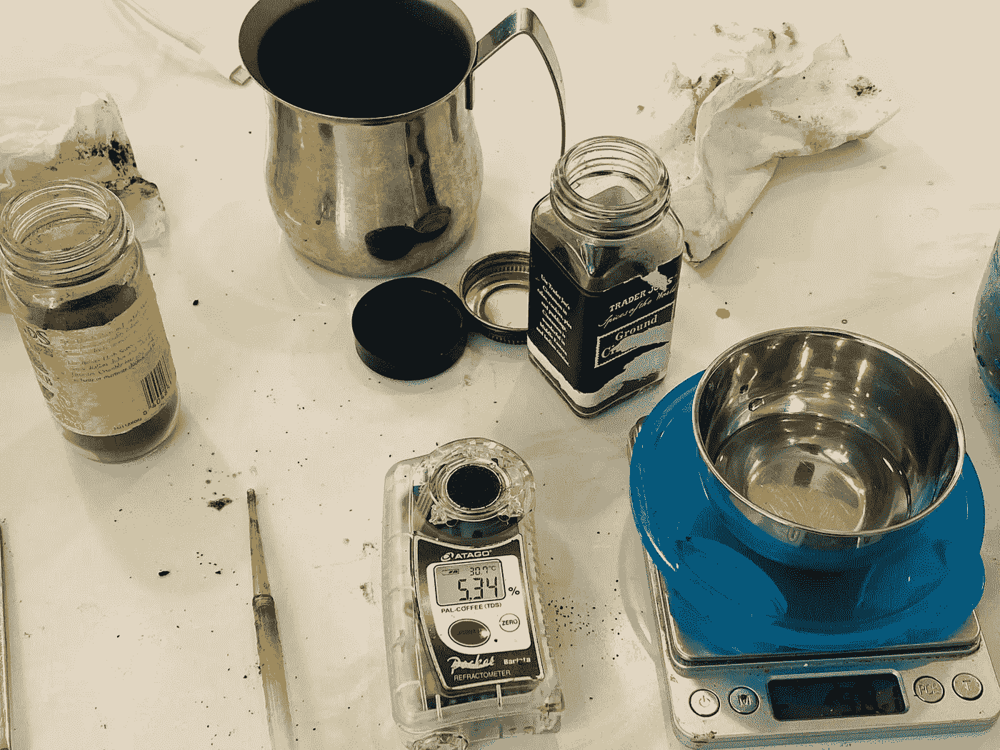

然而，我在测量中没有发现太大的差异。

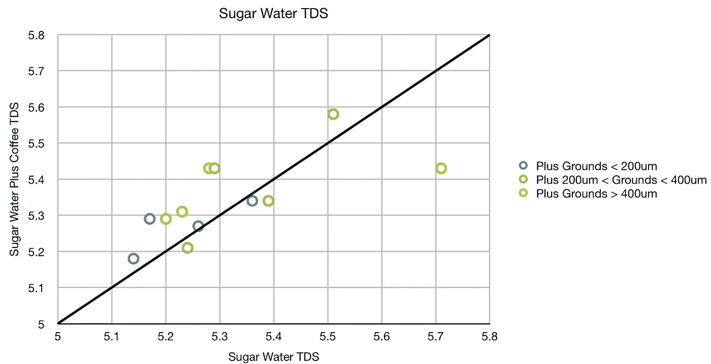

# 最坏情况测试

最好的测试是使用粒度小于 200um 的细磨过的粉末。这次，我从用过的咖啡开始，加入糖水。

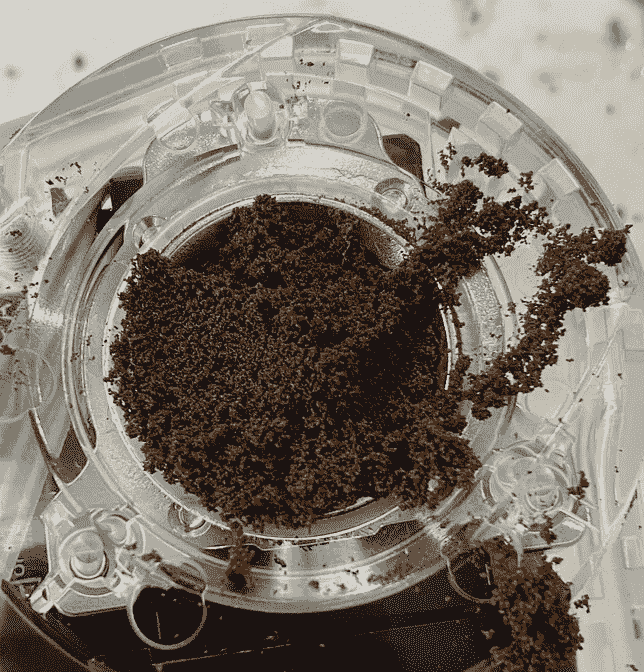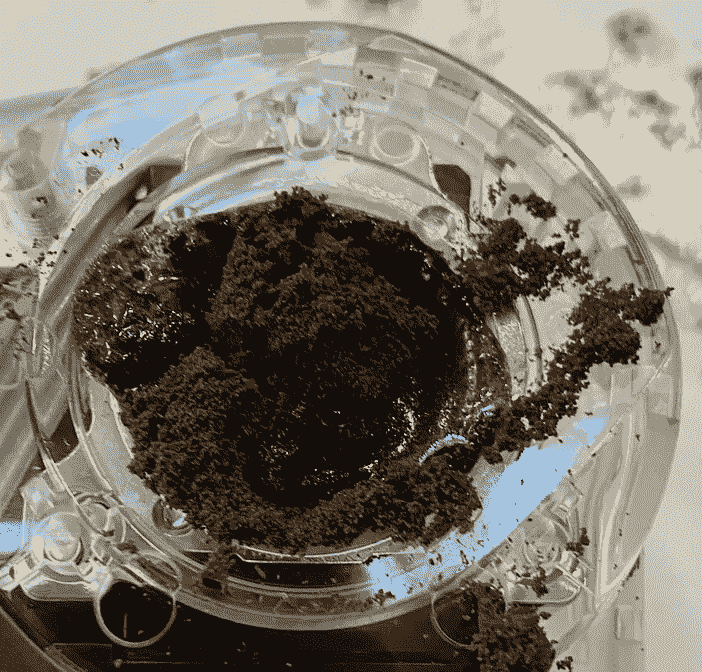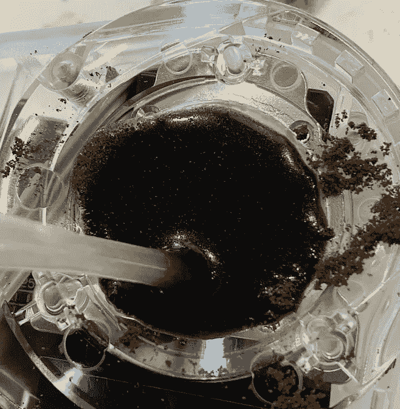

同样，这些并没有表现出很大的性能差异。

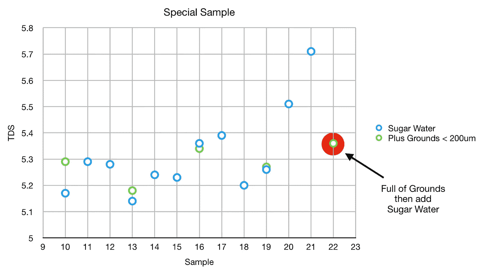

这个实验使用糖水和废咖啡来显示未经过滤的样品的绝对更差的效果，我没有找到证据来支持未溶解的固体影响 TDS 测量的假设。

根据这些数据，我认为在测量前过滤 TDS 样本是浪费时间和金钱。

考虑到注射器过滤器在咖啡中如此普遍，我建议使用它们的人再看一看。重复这个实验并不困难，我向那些仍然相信注射器过滤器的人提出挑战，以证明过滤器正在去除咖啡样品中可能不公平地改变折射率的东西。

如果你愿意，可以在 Twitter 和 YouTube 上关注我，我会在那里发布不同机器上的浓缩咖啡视频和浓缩咖啡相关的东西。你也可以在 [LinkedIn](https://www.linkedin.com/in/robert-mckeon-aloe-01581595?source=post_page---------------------------) 上找到我。也可以关注我[中](https://towardsdatascience.com/@rmckeon/follow)。

# [我的进一步阅读](https://rmckeon.medium.com/story-collection-splash-page-e15025710347):

[浓缩咖啡系列文章](https://rmckeon.medium.com/a-collection-of-espresso-articles-de8a3abf9917?postPublishedType=repub)

[工作和学校故事集](https://rmckeon.medium.com/a-collection-of-work-and-school-stories-6b7ca5a58318?source=your_stories_page-------------------------------------)

[个人故事和关注点](https://rmckeon.medium.com/personal-stories-and-concerns-51bd8b3e63e6?source=your_stories_page-------------------------------------)

[乐高故事启动页面](https://rmckeon.medium.com/lego-story-splash-page-b91ba4f56bc7?source=your_stories_page-------------------------------------)

[摄影启动页面](https://rmckeon.medium.com/photography-splash-page-fe93297abc06?source=your_stories_page-------------------------------------)

[使用图像处理测量咖啡研磨颗粒分布](https://link.medium.com/9Az9gAfWXdb)

[改良浓缩咖啡](https://rmckeon.medium.com/improving-espresso-splash-page-576c70e64d0d?source=your_stories_page-------------------------------------)

[断奏生活方式概述](https://rmckeon.medium.com/a-summary-of-the-staccato-lifestyle-dd1dc6d4b861?source=your_stories_page-------------------------------------)

[测量咖啡研磨分布](https://rmckeon.medium.com/measuring-coffee-grind-distribution-d37a39ffc215?source=your_stories_page-------------------------------------)

[咖啡萃取](https://rmckeon.medium.com/coffee-extraction-splash-page-3e568df003ac?source=your_stories_page-------------------------------------)

[咖啡烘焙](https://rmckeon.medium.com/coffee-roasting-splash-page-780b0c3242ea?source=your_stories_page-------------------------------------)

[咖啡豆](https://rmckeon.medium.com/coffee-beans-splash-page-e52e1993274f?source=your_stories_page-------------------------------------)

[浓缩咖啡用纸质过滤器](https://rmckeon.medium.com/paper-filters-for-espresso-splash-page-f55fc553e98?source=your_stories_page-------------------------------------)

[浓缩咖啡篮及相关主题](https://rmckeon.medium.com/espresso-baskets-and-related-topics-splash-page-ff10f690a738?source=your_stories_page-------------------------------------)

[意式咖啡观点](https://rmckeon.medium.com/espresso-opinions-splash-page-5a89856d74da?source=your_stories_page-------------------------------------)

[透明 Portafilter 实验](https://rmckeon.medium.com/transparent-portafilter-experiments-splash-page-8fd3ae3a286d?source=your_stories_page-------------------------------------)

[杠杆机维修](https://rmckeon.medium.com/lever-machine-maintenance-splash-page-72c1e3102ff?source=your_stories_page-------------------------------------)

[咖啡评论和想法](https://rmckeon.medium.com/coffee-reviews-and-thoughts-splash-page-ca6840eb04f7?source=your_stories_page-------------------------------------)

[咖啡实验](https://rmckeon.medium.com/coffee-experiments-splash-page-671a77ba4d42?source=your_stories_page-------------------------------------)