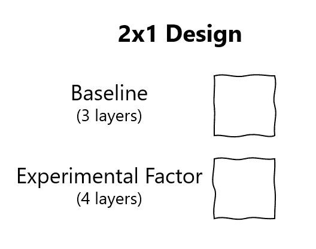
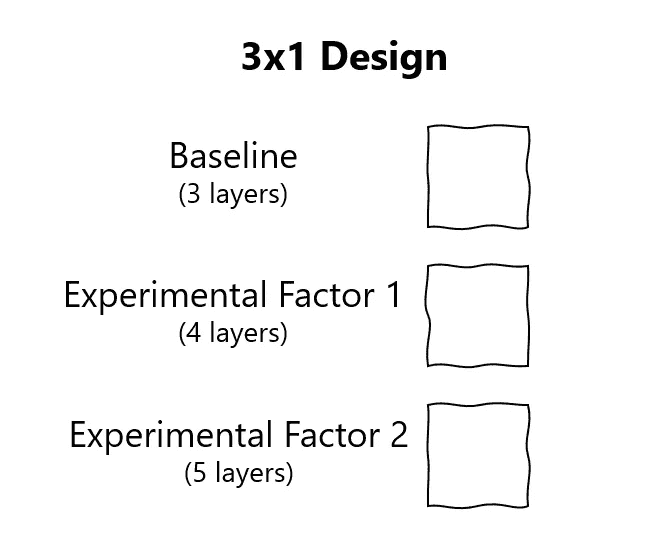
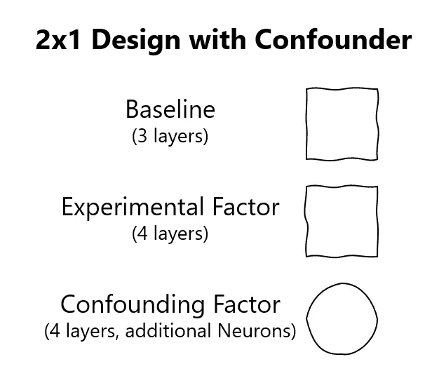

# 不要忘记你的数据科学家头衔中的“科学家”

> 原文：<https://towardsdatascience.com/dont-forget-about-the-scientist-in-your-data-scientist-title-824f2c4110b?source=collection_archive---------26----------------------->

## [办公时间](https://towardsdatascience.com/tagged/office-hours)

## 使用实验性设计框架如何能够更快地发现错误，并使您成为更有效的数据科学家

构建一个性能良好的神经网络通常需要多次反复调整模型，然后检查结果，然后是更多的调整和更多的检查。像 grid 和 random search 这样的方法可以自动完成一些繁重的工作，但是在选择了超参数之后，很容易受到诱惑而继续进行小的调整。实验设计提供了一个心理框架，在不使结果明显偏离基线结果的情况下，减少了做出改变的障碍。

我在研究生院的一位教授总是督促我们以实验设计的形式提交所有的作业。当时，我觉得这非常乏味，但现在回想起来，我明白了为什么。它让我以一种结构化的方式进行建模，这也让我远离了麻烦。每当我发现自己在试图训练神经网络时陷入困境，我就会问自己:“我是在使用实验设计原则吗？”

# 问题是

开发精确建模问题的深度学习神经网络并不容易。像 Tensorflow、PyTorch，特别是 Keras 这样的库使得任何人在学习了库的 API 中的几个命令后都可以创建一个神经网络。然而，这些工具可能会使编写构建神经网络的代码变得容易，但它们不会教授如何以一种允许构建高级模型的方式进行思考。

由[朱莉娅·科布利茨](https://unsplash.com/@jkoblitz?utm_source=medium&utm_medium=referral)在 [Unsplash](https://unsplash.com?utm_source=medium&utm_medium=referral) 上拍摄的照片

# 什么是实验设计

实验设计是一种“技术，使科学家和工程师能够有效地评估多种输入或因素对性能测量或响应的影响。”[1]这对数据科学家来说实际上意味着，当构建一个项目时，考虑哪些变量(不一定是代码中的变量)可以被改变以测试不同的结果。换一种方式说，在模型内可以改变什么来测试不同的结果。

# 这在实践中看起来如何？

构建模型既复杂又繁琐。实验设计为数据科学提供了一个框架来简化这一点。

实验设计有两个重要的关键因素。第一，在做出改变之前，清楚地陈述要测试的假设。无论是把假设写下来，还是把它记在脑子里，都取决于你自己，只要确保它是清晰的，你不会偏离它。

例如，如果模型过于简单，无法准确地学习数据，假设将是，“向我的神经网络添加额外的层将提高模型性能。”同样重要的是，提前决定使用哪些指标来评估模型的变化。

接下来，使用陈述的假设，一次只进行影响模型的一个区域的变更。变更后，模型性能应该有一个清晰的区分，“这是变更前的模型性能，这是变更后的模型性能。”这很重要，因为如果进行了不止一个变更，那么就不清楚是哪个变更导致了整体模型性能的变化。影响模型性能的假设之外的变化称为混杂因素。

扩展之前的例子，假设涉及改变另一层的添加，这非常诱人地说，“如果我除了添加层之外还增加了神经元的数量，然后与我的基线相比，会怎么样呢？”忍住冲动！在没有完全评估因素的不同水平的情况下增加另一个因素会导致你产生一个混杂因素。

我们有办法在实验设计中适应多种因素，但这是另一篇文章的主题。

> 底线:提前陈述你的因素。不要更改未指定为因素的内容。当你改变一个因素时，不要在没有测量结果的情况下改变另一个因素

# 在因素中思考

每一个可能导致结果改变的变化都被认为是一个因素。但是每个因素可以有多个层次。这些因素倾向于用变化的级别数来描述。继续我们的示例，如果我们的基线模型中有 3 个层，并且我们想看看如果我们添加另一个层会发生什么，那么我们将有一个 2x1 设计(2 表示因子中的级别数，1 表示没有正在评估的第二个因子)。

作者图片:一个超级简单的因素实验，你只是评估一个额外的层

您可以构建这个例子，在这个例子中，您不仅将基线与单个变更(相同因素的)进行比较，而且与多个变更进行比较。假设我们想看看增加五层会有什么效果。

作者图片:三层设计示例

最后，回到混杂因素的想法，如果不先添加另一个因素，你就无法在实验中添加一种方法来评估神经元数量的变化。为了了解如何做到这一点，我将在这篇文章的后续部分进行介绍。

作者图片:该设计中的混杂因素不符合简单的 2x1 设计。这种设计需要重新配置，以获得可信的结果。

# 包扎

实验设计是构建数据科学实验的一种很好的方式。使用析因实验[2]，您可以评估模型的变化，以便在调整超参数时移动到更优的条件。只是要小心抵制同时进行多个更改的诱惑，并确保避免添加混淆因素。

作为数据科学家，关注标题的数据方面很容易，但使用实验设计等技术将显著提高模型的质量。

有关如何创建避免混杂因素并允许您同时测试多个条件的实验设计的更多信息，请阅读第二部分。

## 来源

[1][https://www . jmp . com/en _ us/articles/what-is-experimental-design . html](https://www.jmp.com/en_us/articles/what-is-experimental-design.html)

[2]https://en.wikipedia.org/wiki/Factorial_experiment