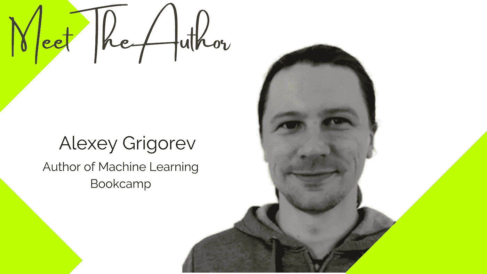
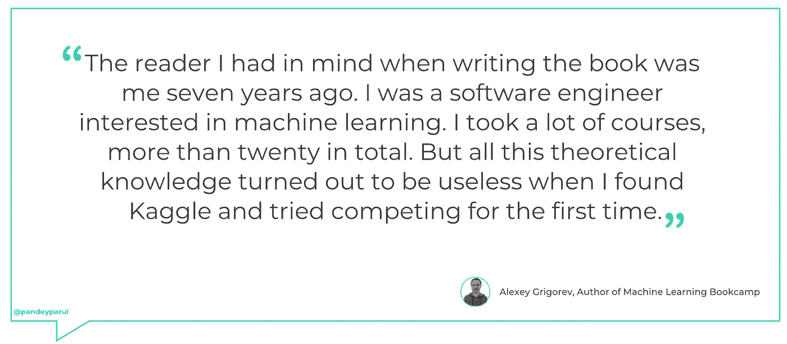
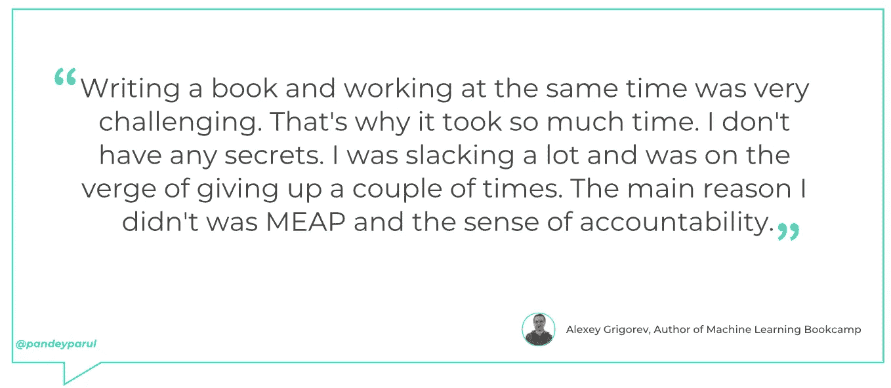

# 不要只是做笔记——把它们变成文章并与他人分享

> 原文：<https://towardsdatascience.com/dont-just-take-notes-turn-them-into-articles-and-share-them-with-others-72aa43b83e29?source=collection_archive---------34----------------------->

## 采访《机器学习图书营》一书的作者阿列克谢·格里戈里耶夫

*一系列采访，重点介绍数据科学领域作家的不可思议的工作以及他们的写作之路。*

照片由阿列克谢·格里戈里耶夫提供

> *虽然从经验中学习是明智的，但从别人的经验中学习更明智- [华理克](https://quotefancy.com/rick-warren-quotes)*

华理克的上述引文强调了向他人学习的重要性。在数据科学的背景下，这甚至更有意义。我们中的许多人(包括我)从其他人的工作中受益匪浅。无论是开源软件、博客文章和论文形式的内容，还是 meetup 活动和会议，我们都在不断学习该领域其他人的工作和经验。

为了将这种引人注目的工作推向前沿，我去年开始了一系列采访。在 [**第一季**](https://github.com/parulnith/What-I-learnt-by-interviewing-numerous-Kaggle-Grandmasters) 中，我展示了一些来自知名数据科学家和 Kaggle 大师的故事，他们分享了自己的旅程、灵感和成就。第二季，我在采访书籍作者。作为一名作家，我非常尊重写书的人。一篇写得很好的文章需要大量的时间、精力和耐心，而为一本书复制同样的内容绝非易事。因此，本期访谈将揭示数据科学领域一些知名作者的故事。

# 见见作者:阿列克谢·格里戈里耶夫

如果你对数据科学感兴趣并关注这个领域的社区，我相信你一定听说过[数据讲座。俱乐部](https://datatalks.club/) —数据爱好者的社区。就数据科学而言，它是目前最活跃的社区之一。顾名思义，该俱乐部组织关于数据、机器学习和工程的讲座，包括每周活动、会议和办公时间。顶端的樱桃——该俱乐部目前还在举办免费的机器学习课程！

这个庞大计划的幕后推手是阿列克谢·格里戈里耶夫，OLX 大学的首席数据科学家。他与妻子和儿子住在柏林。我见证了这个社区的稳步发展，并有幸成为其中一个活动的发言人。阿列克谢也写了几本书，这次采访是为了更多地了解他最近出版的名为[机器学习图书营](https://www.manning.com/books/machine-learning-bookcamp)的书。

**问:这本书的想法是如何产生的？**

***Alexey:*** 这不是我的第一本书。在机器学习图书营之前，我写过几本其他的书。其中一本是我与人合著的( [TensorFlow 深度学习项目](https://www.packtpub.com/product/tensorflow-deep-learning-projects/9781788398060))，是一本基于项目的书——每一章都是一个端到端的项目。我喜欢这种格式，当曼宁伸出手，建议写一本书时，我们决定遵循类似的格式。我们让它基于项目，这就是它的起源。在那之后，我们花了几个月的时间来思考，创建一个大纲，让它得到审查，并对它进行迭代。

**问:你能为读者总结一下这本书的要点吗？**

***阿列克谢:*** 这本书通常涵盖三个要点:

*   **机器学习不是魔术**。你需要数据——一个特征矩阵 *X* 和一个目标变量 *y* 。然后你把它放入机器学习算法——一堆用编程语言编码的数学——然后得到一个模型。之后，您可以使用模型进行预测。
*   **入门** **机器学习**不需要懂很多数学。有像`Scikit-Learn`这样的库可以用来构建机器学习服务。首先，集中学习如何使用这些库。
*   **部署模型是机器学习过程**中最关键的 **部分之一。如果您不能部署您的模型，其他人就不能从中受益——甚至最准确的模型也变得毫无用处。**

问:这本书的目标读者是谁？

***阿列克谢:*** 我写这本书时脑海中的读者是七年前的我。我是一名对机器学习感兴趣的软件工程师。我选了很多课程，总共二十多门。但是这些理论知识在我找到 Kaggle，第一次尝试参赛的时候，都被证明是没有用的。

正是在 Kaggle 上，我学会了机器学习。这对我很有效，因为我必须专注于问题，然后通过解决问题来学习。我认为这是软件工程师进入机器学习的最佳途径。这正是我在机器学习图书营中遵循的方法。

作者图片

尽管我是为软件工程师写的，但许多其他人也发现这本书很有用。数据分析师喜欢模型评估章节，数据科学家喜欢模型部署章节。

问:读者怎样才能充分利用这本书？

***阿列克谢:*** 为了充分利用这本书，我建议如下:

*   不要只是读这本书——打开你的 Jupyter 笔记本，跟着读。
*   不要跳过“探索更多”部分，做建议的项目来巩固你的学习。
*   不要跳过部署章节，它们是必不可少的。一个模型只有在别人能用的时候才是有用的。

问:对于一个刚刚起步的新作家，你有什么建议？

***阿列克谢:*** 当众学习。不要只是做笔记——把它们变成文章，与他人分享。另外，如果你这样做了，你会发现你学得更好。想写书，可以从志愿当书评人开始。在写我的第一本书之前，我复习了一些书。此外，我还采访了尤金·严，他非常擅长写作。以下是他的几个链接:

*   [DataTalksClub——写作在科技职业中的重要性](https://eugeneyan.com/speaking/writing-for-a-tech-career/)
*   [我从网上写作中学到了什么——写给非作家同行们](https://eugeneyan.com/writing/what-i-learned-from-writing-online/)

问:你花了多长时间写完这本书？更重要的是，你是如何在工作之余写了一本书的？

阿列克谢: 从曼宁联系我开始，到我收到印刷本，差不多花了三年时间。在最初的六个月里，我们在制定大纲，并得到了很多反馈。然后我写了前两章。后来，我们将这两章分成五章，作为 MEAP(Manning 的早期访问程序)发布。

随着时间的推移，我不得不放弃很多我最初计划要包含的章节，并专注于解释基础知识。我还重复了现有章节的内容。

作者图片

曼宁在确保质量方面帮了很大的忙。他们组织了三次来自书评人的反馈——第一次在发布 MEAP 之前，第二次在 60%完成之后，最后一次在整本书完成之后。

写一本书同时工作是非常具有挑战性的。所以花了这么多时间。我没有任何秘密。我懈怠了很多，有几次处于放弃的边缘。我没有这么做的主要原因是因为 MEAP 和责任感。许多人已经买了这本书，所以我不能就此停止工作。

**问:你有喜欢的书和作者吗(在技术或非技术领域)？**

***阿列克谢:*** 我以前很喜欢托尔金，但这几天我不看非技术性的书了。

在技术领域，我最喜欢的是 Martin Kleppmann 的“ [**设计数据密集型应用**](https://www.amazon.com/Designing-Data-Intensive-Applications-Reliable-Maintainable/dp/1449373321) ”。我无法想象马丁为这本书付出了多少努力。它的结构非常好，即使您对数据工程不感兴趣，我也推荐您阅读它。通过阅读这本书，你会学到很多关于技术写作的知识。

👉**阅读本系列其他访谈:**

</you-do-not-become-better-by-employing-fancy-techniques-but-by-working-on-the-fundamentals-17d5c471c69c>  

👉**期待与 Alexey 连线？在**[**Twitter**](http://@Al_Grigor)**和**[**LinkedIn**](https://www.linkedin.com/in/agrigorev/?originalSubdomain=de)**上关注他。**