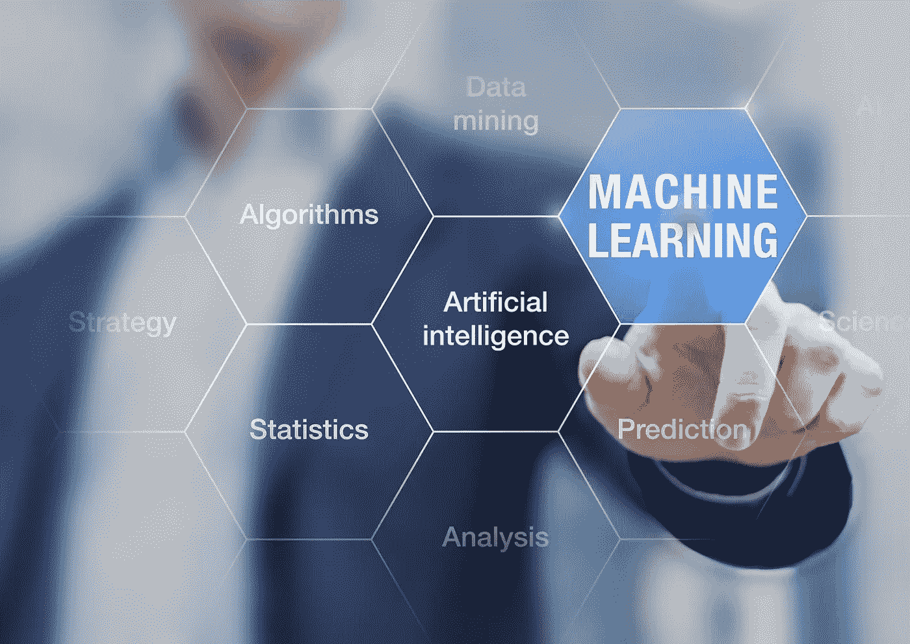

# 不要让机器学习工程师独自工作

> 原文：<https://towardsdatascience.com/dont-let-a-machine-learning-engineer-work-alone-6280fb7fabba?source=collection_archive---------35----------------------->

## 与这两个关键角色合作取得成功

图片授权给来自 Shutterstock 的 Mary Alfheim

机器学习工程师需求量很大。如果你在过去几年里试图雇佣一个头衔与此相近的人，你就会痛苦地意识到这一点。这些工程师非常擅长获取数据科学的输出，比如模型，并将其投入生产以发布新的应用程序。雇佣 MLEs 对你的组织来说可能是一笔巨大的投资，你可能会想当然地认为你不需要在其他地方花费就能获得成功。不幸的是，你错了。

假设您负责一项新功能，向您的数字产品用户显示零售产品、歌曲、视频甚至工作列表的推荐。也许你是一名数据科学或 AI/ML 主管，或者是一名数据驱动功能的产品经理。您已经与客户或其他产品经理仔细合作，定义了您想要构建的内容，并扩展了您的数据科学团队，以提供初始推荐模型。让这个模型扩展到实时交付，并在你的产品中向用户展示新的推荐，看起来是下一个大障碍。幸运的是，您团队中的机器学习工程师能够扩展这个解决方案，并构建管道来向正确的用户显示正确的推荐。完成了，对吗？

没有。

虽然一个伟大的数据科学和机器学习团队已经训练和测试了模型，并使用类似混淆矩阵的东西评估了它的精度，但你仍然不知道这个建议在你的实际产品中如何工作。用户对此的反应会如预期吗？有我们没有预料到的错误吗？这真的推动了我们假设的结果吗？我们怎样才能做得更好？

# **会见可视化工程师**

你需要确保你的团队也配备了可视化工程师。这个角色的人将根据观察到的与您的推荐相关的用户行为提供实际的跟踪或报告，或者无论您的面向用户的功能是什么，一旦它出现在面向客户的 UI 中。

该工程师将与您的 MLEs 密切合作，以了解特性和模型意图、其部署日期及其预期结果。然后，他们将使用您的事件数据来构建能够可视化实际用户行为的仪表板。将此用于实际分析——您是否看到任何意外的行为，采用看起来像什么，以及用户正在采取什么样的行动？

# 不要忘记实验

你还需要把那些观察到的、现实生活中的互动与你的机器学习功能联系起来。理想情况下，您应该向一组随机的用户公开您的新特性，而不让其他组看到它。然后，您可以根据谁可以使用或已经看到新功能，以及谁没有看到新功能，来衡量集团层面的成果，包括收入、留存率、销售额、客户终身价值或其他与您的业务相关的指标。可视化工程师还可以将这种商业智能放入仪表板，并清楚地指出各组之间的行为模式。利用实验及其结果，对你所交付的工作和经验的实际价值进行衡量。利用这一点来帮助通知新的投资，并确保您为客户创造价值。

您还想知道为您的功能提供动力的算法本身是否是最好的。除了仅仅测试特性/无特性组，训练模型的新版本，或者一起尝试新的方法。在 A/B 测试中一次部署两个(或更多)版本，并再次与您的可视化工程师合作，以测量和描述组间行为和结果的差异。确定新的冠军模型，并依靠 MLE 为所有用户部署到生产中。只要您能够创建新的 challenger 模型进行测试，就可以重复这个循环。

# 将团队整合在一起

机器学习工程师、可视化工程师和实验负责人可以一起工作来完成机器学习产品的生命周期。如果不在产品中观察你的特性，并围绕它的方法进行实验，你将无法改进你当前的工作或确保你为你的用户提供价值。

招募和留住机器学习工程师可能非常困难。如果你能做到这一点，一定要用可视化和实验能力来激励团队，让他们从头到尾看到 AI/ML 项目。