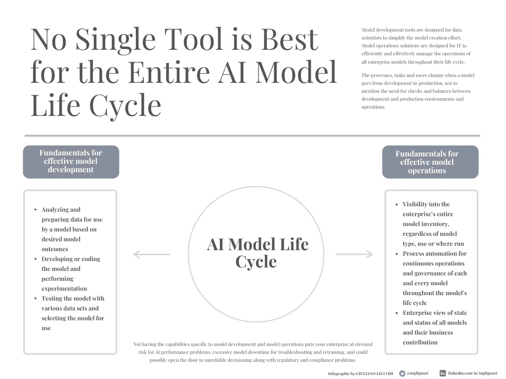

# 不要让工具和管理方法扼杀你的人工智能创新

> 原文：<https://towardsdatascience.com/dont-let-tooling-and-management-approaches-stifle-your-ai-innovation-5fcee5ec8b2f?source=collection_archive---------31----------------------->

与 [ModelOp](http://www.modelop.com) 合作的文章

图片来自 Canva

在企业面临巨大的创新压力之际，它们对人工智能的投资达到前所未有的水平，这绝非巧合。数据科学家开发的人工智能模型为企业提供了新的见解，实现了新的更高效的工作方式，并有助于发现降低成本和推出有利可图的新产品和服务的机会。

人工智能应用的可能性几乎每天都在增长，所以不限制创新很重要。不幸的是，许多组织正是通过将自己束缚于专有工具和解决方案来做到这一点的。随着新的创新变得可用，这可能会束缚数据科学家和 IT，并导致比支持最佳人工智能模型开发和管理的开放环境更高的成本。本文介绍了在企业人工智能中避免专有锁定的指南，以及这样做的重要性。

# 人工智能进化与分析有相似之处，但区别更重要

人工智能产生于数据分析，后来演变为商业分析和商业智能。早期的分析由少数专有解决方案主导，这些解决方案拥有一个由创新公司开发补充工具和技术来增强供应商平台的有限生态系统。这减缓了分析的采用。

相比之下，人工智能市场是蛮荒的西部。数百家公司，从一些最知名的科技公司到令人难以置信的创新创业公司，都在为人工智能和人工智能模型生命周期的每个阶段提供解决方案。企业不必像竞争对手一样使用同样有限的工具和技术，他们正在利用优势。根据 [2021 年 ModelOps 报告](https://business-of-data.com/reports/state-of-modelops-2021/)的数据，2021 年，81%的金融服务公司正在使用一种以上的人工智能模型开发工具，42%的公司正在使用至少五种。这甚至还没有算上用于人工智能其他阶段和模型生命周期的工具和解决方案。

许多工具都是为特定目的(如欺诈检测、辅助购物)或执行环境(如内部硬件或 AWS 和其他超级云服务)开发模型。为数据科学家提供多种专门构建的最佳模型开发选项，拓宽了可能和有价值的用例的范围，这有助于人工智能在组织内的使用增长。

# 没有一个工具是适合整个人工智能模型生命周期的

当组织依赖于他们用来创建模型的相同工具在生产中运行和管理它们时，就会发生人工智能锁定。在分析的早期，模型和模型操作更加透明，这可能还可以，但现在模型太复杂了。模型开发的需求和工具与模型操作非常不同。生产中的模型必须与更多的系统交互，包括业务应用程序、风险管理框架、IT 系统、信息安全控制等等。

模型开发工具是为数据科学家设计的，用于简化模型创建工作。模型操作解决方案是为 IT 而设计的，以便在所有企业模型的整个生命周期中高效地管理它们的操作。

> 也请阅读【ModelOps 如何帮助你执行你的人工智能策略

当一个模型从开发到生产时，过程、任务和用户都会改变，更不用说开发和生产环境和操作之间的检查和平衡了。

有效模型开发的基础是:

*   *根据期望的模型结果分析和准备模型使用的数据*
*   *开发或编码模型并进行实验*
*   *用各种数据集测试模型并选择使用的模型*

有效模型操作的基础是:

*   *了解企业的整个模型库存，无论模型类型、用途或运行位置如何*
*   *在模型的整个生命周期中，为每个模型的持续操作和治理提供流程自动化*
*   *所有模型的状态和状态及其业务贡献的企业视图*

不具备特定于模型开发和模型操作的能力会使您的企业面临更高的 AI 性能问题风险、用于故障排除和再培训的过多模型停机时间，并可能导致不可靠的决策以及法规和合规性问题。

不一定非要那样。模型操作(ModelOps)管理解决方案不受技术限制，因此可以支持您的数据科学团队可能想要使用的所有开发工具和执行环境。你需要的管理工具越少，你的人工智能程序就越容易扩展、协调和管理。

作者精心制作的信息图

# 灵活性有助于赢得人才大战

众所周知，数据科学家需求量很大。假设你是一名经验丰富的数据科学家，正在仔细考虑招聘人员每周为你提供的一些高薪工作机会。你更有可能回应以下哪个职位？

> 另请阅读[安全可靠人工智能的模型操作](https://medium.com/codex/model-operations-for-secure-and-reliable-ai-2cf0ced9945b)

“拥有[特定人工智能编程语言]经验的数据科学家需要创建和维护在[特定 IT 基础设施]中运行的模型。”或者

“使用您喜欢的工具和开发环境，在我们的行业中用人工智能开创新局面。”

你的组织不应该因为你没有让这个人变得有价值的经验，而错过雇佣一个拥有令人垂涎的专业技能的人的机会。

# 云不会带来更多的清晰度

有一个学派认为，随着人工智能的成熟，其生态系统将变得稀薄，最终大多数人工智能模型将在云中运行。因此，这种想法是，企业可以通过为其喜爱的云环境开发或由其开发的解决方案来满足其人工智能模型运营管理需求。事实上，这不是今天的情况，也可能永远不会。混合、多云环境是人工智能的标准:58%的金融服务公司至少在 AWS 中运行一些人工智能模型，但是，58%的公司也在谷歌云平台(GCP)中运行模型，27%的公司在 Azure 中运行模型，48%的公司在内部执行人工智能模型[【1】](#_ftn1)。这些数字总计超过 100%，这意味着企业正在采用混合基础架构并在不同的地方运行模型，选择最佳环境来执行每个特定的模型。管理模型操作也应该采用这种方法。致力于为一个云平台优化的 AI ModelOps 解决方案会产生经典的供应商锁定问题。这种锁定给业务运营的任何领域带来了问题；对于人工智能来说，它可能会对人工智能为企业所做的事情施加昂贵而不必要的限制。

> 也阅读[在你的人工智能策略中包含模型操作](/dont-let-tooling-and-management-approaches-stifle-your-ai-innovation-5fcee5ec8b2f)

你的人工智能创新和努力太重要了，不能相信单一的解决方案、执行环境或有限的供应商。你不能用开发 IT 系统或业务应用程序时所用的工具来管理它们——为什么不对人工智能采取同样的方法呢？企业需要开放自己，以利用人工智能成熟和进步带来的所有可能性。开发一个人工智能模型操作平台，该平台可以支持广泛的工具和未来发展，让您的数据科学团队能够自由创新，让您的 IT 团队能够高效和有效地治理和管理整个企业中的所有人工智能模型，而不管它们是如何开发的、用于什么目的或在哪里运行。

[【1】](#_ftnref1)Corinium Intelligence 与 ModelOp《2021 年 ModelOps 状态报告》2021 年 4 月 14 日。

**关注我的每日技术和创新更新**

【https://bit.ly/m/ingliguori 