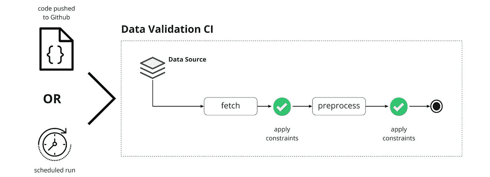

# 不要让你的数据让你失望

> 原文：<https://towardsdatascience.com/dont-let-your-data-fail-you-4666ed7911b3?source=collection_archive---------36----------------------->

## 使用 whylogs 和 Github 操作进行连续数据验证


照片由[扬西·敏](https://unsplash.com/@yancymin?utm_source=unsplash&utm_medium=referral&utm_content=creditCopyText)在 [Unsplash](https://unsplash.com/?utm_source=unsplash&utm_medium=referral&utm_content=creditCopyText) 上拍摄

从 ML 管道的开始到结束，数据是最小的公分母。但是数据的普及也有其不利的一面，因为几乎你的 ML 管道中的每一个问题都以这样或那样的方式源于或影响数据，并且可能以复杂和错综复杂的方式。例如，服务期间出现的坏数据——无论是从外部来源引入的还是在数据转换过程中产生的——不仅会影响当前的预测结果，还会在未来的模型重新训练过程中重新引入循环。

这是许多例子中的一个。底线是，在开发您的 ML 管道时，确保数据质量应该是您的首要任务之一。为了做到这一点，数据验证无疑是一个关键的组成部分。在本文中，我们将展示 whylogs 如何帮助您实现这一目的。我们将首先介绍*约束*的概念以及如何生成它们。一旦创建了这些约束，就可以通过在 whylogs 日志记录会话中应用它们，将它们直接集成到管道中。在最后一节中，我们将看到另一种验证数据的方法，即在 Github 动作的帮助下，将这些约束集作为持续集成管道的一部分来应用。

本文的代码和文件可以在[项目的资源库](https://github.com/whylabs/whylogs-constraint-example)中找到。您还可以在这个[示例笔记本](https://github.com/whylabs/whylogs/blob/mainline/notebooks/constraints.ipynb)中找到关于生成约束的更多信息，以及在这个[示例存储库](https://github.com/whylabs/whylogs-examples/tree/mainline/github-actions)中找到关于 whylogs 与 Github 动作集成的更多信息。

让我们开始吧。

# 目录

1.  [why logs 中的约束生成](#e740)
    ∘ [值约束 vs 汇总约束](#46e6)
    ∘ [组装数据集约束](#c4f3)
    ∘ [将约束应用于数据集](#3ceb)
2.  [github actions with whylogs](#a200)
    ∘[概述](#9f5d)
    ∘ [配置工作流](#8bda)
    ∘ [工作流语法](#8f93)
    ∘ [约束定义](#f6a9)
3.  [接下来是什么](#0521)

# 为什么日志中的约束生成

为了验证您的数据，我们需要一种有效的方式来表达我们的期望。这是在 whylogs 中通过*约束*完成的——您创建的规则用于断言您的数据位于预期范围内。这些约束反过来会应用于数据集的要素，并且可以通过一种方式进行组织，即一个要素可以有多个约束，一个约束可以应用于多个要素。

## 值约束与汇总约束

可以针对单个值或完整的数据集配置文件检查约束。对于值约束，将根据数据集中要素的每个值来验证布尔关系。但是，对于 summary 约束，这种关系是根据 whylogs“profile”来验证的，它是 why logs 已经处理的数据集的汇总统计信息的集合。

例如，假设我们要创建一个约束，以确保数据集中每条记录的特征值都小于 3.6。这可以通过一个*值约束*来实现:

`ValueConstraint`接受两个参数:二进制比较运算符的类型(“小于”)和要与传入流进行比较的静态值。

然后，我们简单地将约束从 protobuf 转换成 JSON，这将产生 JSON 格式的输出:

默认情况下，名称是自动生成的，但是也可以通过向`ValueConstraint`传递一个名称参数来定制。

类似地，我们可以用`SummaryConstraint`生成一个针对统计属性的约束:

上面的代码产生:

## 组装数据集约束

我们已经了解了如何创建单个约束，但是对于给定的数据集，我们希望将多个约束组合在一起，以便对数据的外观有一个总体的描述，然后将约束列表应用到我们的数据集。

为了演示，让我们使用 Kaggle **中的 [**LendingClub 数据集。**已用子集包含 1000 条通过](https://www.kaggle.com/wordsforthewise/lending-club) [LendingClub](https://www.lendingclub.com/investing/peer-to-peer) 平台进行的贷款记录。我们将创建一些约束来验证数据集的三个特征:**

*   **loan_amnt** —借款人申请的贷款金额；
*   **fico_range_high —** 借款人 fico 在贷款发放时的上限范围属于；
*   **年度 _ 公司—** 借款人的年收入。

对于 **loan_amnt** ，我们将设置上限和下限为 548250 和 2500，对于 **fico_range_high** 最小值为 400 **。最后，让我们断言 **annual_inc** 只有非负值。**

这将为我们提供以下信息:

为了保持约束并重用它们，我们可以将它们保存在一个 JSON 文件中。我们将在下一节中需要这个文件，在这里我们将在 CI/CD 管道中集成我们的约束。

## 将约束应用于数据集

一旦创建了约束，我们就可以最终将它们应用到数据集。为此，我们只需将约束作为参数传递给 log_dataframe()，同时将记录记录到数据集中。

该报告可通过`dc.report()`访问，并在一些基本格式化后显示，以使其更具可读性:

```
Constraint failures by feature - 
loan_amnt:
    test_name          total_run    failed
    value LT 548250         1000         2
    value GT 2500.0         1000        20
fico_range_high:
    test_name        total_run    failed
    value GT 4000         1000      1000
annual_inc:
    test_name                total_run    failed
    summary min GE 0/None            0         0
```

在这种情况下，每个规则的值约束被应用了 1000 次，失败列显示了我们的数据有多少次没有达到我们的预期。然而，从`total_run`字段可以看出，汇总约束还没有应用。

汇总约束可以应用于现有的概要文件。由于在创建概要文件时已经提供了约束，我们可以不带参数地调用`apply_summary_constraints()`:

```
Constraint failures by feature -annual_inc:test_name                total_run    failedsummary min GE 0/None            1         0
```

我们也可以用一个新的汇总约束来覆盖原来的汇总约束，例如:

# GitHub 操作和原因日志

到目前为止，我们已经看到了如何将 whylogs 约束直接应用到我们的管道中。或者，我们可以用 **Github Actions** 来验证我们的数据，作为我们持续集成管道的一部分。

Github 动作通过支持工作流的创建，帮助您自动化软件开发生命周期。工作流是您添加到项目存储库中的自动化过程，它由一个*、*事件触发，例如每当推送提交或者创建拉取请求时。工作流本身是通过组合一系列构建块来创建的，其中最小的一个被称为*动作。*使用 Github Actions，您可以以自动化的方式测试、构建和部署您的代码。

## 概观

有了 whylogs，我们可以将 Github 动作的范围扩展到不仅测试代码，还测试数据。让我们通过想象一个简单的数据管道来演示，在这个管道中，我们从一个数据源获取数据，然后对它应用一个预处理例程。



作者图片

每个验证步骤都有不同的目的:当对源数据应用一组约束时，我们感兴趣的是评估数据本身的质量。外部数据源中的更改可能随时发生，因此，为此，我们将安排作业以固定的时间间隔运行。在用内部代码预处理数据之后，应用第二个验证步骤。在这种情况下，我们的目标是测试数据管道的质量。因为我们希望在每次代码更改时运行这些约束，所以每当有人提交时，我们也将执行作业。出于演示的目的，我们只创建一个由两个不同事件触发的作业。另一种方法是在测试数据管道时，通过修复数据集的一个版本来保持事物的分离。

每次触发工作流时，Github 都会记录信息，因此您可以从项目存储库中的 Actions 选项卡检查输出。此外，每当您的数据不符合您的预期时，它都会向您发出警告。


作者 Gif

## 配置工作流

要构建工作流，需要通过在`.github/workflows`文件夹下创建一个. yml 配置文件来定义它的配置。我们将只定义一个作业——`whylogs_constraints`——每当有人向存储库提交一个提交时，就会触发这个作业。

概括地说，工作流程很简单——我们将使用`fetch_data.py`从给定的源获取数据，这将生成`lending_club_1000.csv`文件。csv 文件根据`github-actions/constraints-source.json`中定义的一组约束进行验证。如果数据符合我们的预期，下一步就是对其进行预处理。预处理例程将依次创建一个名为`lending_post.csv`的预处理数据集，该数据集将根据`github-actions/constraints-processed.json`中定义的一组单独的约束再次进行验证。在本例中，我们将简单地删除带有`nan`的行，并将其缩放到 0–1 区间，用于 **loan_amnt** 列。

值得注意的是，在提交之前，csv 文件不需要存在于我们的存储库中。这些文件将在工作流执行期间在运行器中创建，并且不会保存在我们项目的存储库中。

## 工作流语法

让我们讨论一下配置文件中的一些行:

**on: [push]** —指定工作流的触发事件。每个推送事件都会触发工作流。

**on: [schedule]** —指定工作流的触发事件。它将按计划触发。在本例中，工作流将在每天的 05:30 和 17:30 执行。

**runs-on:Ubuntu-latest**—指定虚拟机的环境。

**用途:actions/checkout@v2** —为了对我们的代码运行操作，我们需要首先将存储库签出到 runner 中，这是通过使用 actions/checkout 社区操作来完成的。

**用途:why labs/whylogs-action @ v1**—预打包的 why logs 操作，用于将我们的约束应用到所需的数据集。要使用它，我们还需要提供一些参数:

*   *constraints file*:JSON 中要应用的约束集
*   *数据文件*:包含应用约束的数据的文件。熊猫可以加载的任何格式都可以，但是 CSV 效果很好。
*   *expect-failure:* 即使我们通常编写预期成功的操作，whylogs 也允许您通过设置该标志来创建预期失败的操作。默认为 false。

## 约束定义

在这个例子中，我们使用了两组约束:`constraints-source.json`和`constraints-processed.json`。对于第一个问题，我们将使用本文前一节中生成的相同约束:

对于已处理的文件，我们将定义一个`summaryConstraint`来验证规范化的 **loan_amnt** 特性确实在 0–1 范围内:

如前所述，我们可以创建预期失败或成功的操作。为了演示这两种情况，我们预计`constraints-source.json`会失败而`constraints-processed.json`会成功。

# 下一步是什么

Whylabs 团队不断扩展 whylogs 以支持更多功能。关于制约因素，正在考虑以下特点:

*   [正则表达式操作符](https://github.com/whylabs/whylogs/issues/160) —匹配字符串上正则表达式模式的约束
*   [自动约束生成](https://github.com/whylabs/whylogs/issues/254) —基于学习的阈值从基线配置文件自动生成约束。实际上是已经存在的功能的扩展[。](https://github.com/whylabs/whylogs/blob/32f14d89e1ce0196a96c7f05e0b3f5cf0793b9d3/src/whylogs/core/datasetprofile.py#L369)

如果你也喜欢/想要这些功能，请随意喜欢/评论上面相关的 Github 问题！

至于 CI 管道，在数据验证方面可以做得更多。真实的场景肯定会有更复杂的数据管道，因此需要对数据进行更多的验证。为了进一步提高系统的可靠性，我们不仅可以对模型输入施加约束，还可以对输出和实时推理施加约束。结合 whylogs 配置文件，约束使数据科学家和 ML 工程师能够信任他们的 ML 管道！

如果你对探索项目中的 whylogs 感兴趣，考虑加入 [Slack 社区](http://join.slack.whylabs.ai/)来获得支持并分享反馈！