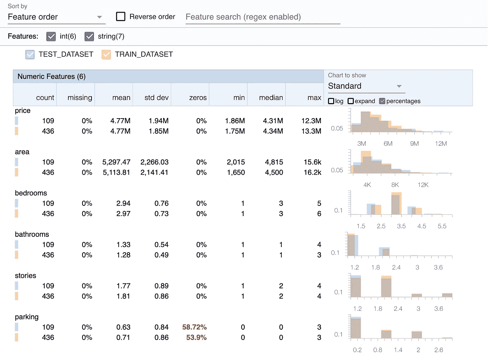

# 不要让你的模型质量渐行渐远

> 原文：<https://towardsdatascience.com/dont-let-your-model-s-quality-drift-away-53d2f7899c09?source=collection_archive---------10----------------------->

## MLOps

## 解决生产 ML 系统中的数据漂移和概念漂移


丹尼·斯莱文霍克在 [Unsplash](https://unsplash.com?utm_source=medium&utm_medium=referral) 上拍摄的照片

您已经收集和清理了您的数据，试验了各种机器学习模型和数据预处理变体，并微调了您的模型的超参数，最终提出了足以解决您的问题的解决方案。然后，您已经构建了一个健壮的自动化数据管道，为模型编写了一个 API，将它放在一个容器中，并将其部署到生产环境中。您甚至确保检查模型在生产中运行顺畅且正确。终于，你完成了！还是你？差远了。事实上，这只是旅程的开始。

在机器学习系统被部署到生产中后，它可能会出现很多问题！概括地说，我们可以将所有这些潜在的问题分为两类:统计问题和基础设施问题。后者包括像计算资源和内存这样的东西(是否足够？)，延迟(模型响应是否足够快？)，吞吐量(我们能回答所有进来的请求吗？)，等等。但是在本文中，我们将关注前者:统计问题，它有两种主要形式:*数据漂移*和*概念漂移*。


# 数据漂移

数据漂移也称为*协变量漂移*是指模型输入的分布发生变化的情况。它可能以多种方式出现。例如:

*   当数据由某个传感器收集时，设备可能会发生故障或收到影响测量方式的软件更新。
*   当数据是关于人类时，它会随着时尚或用户统计数据而变化。

因此，模型看到的定型数据并不代表实际到达生产环境的数据。

让我们介绍一些温和的符号。设 *P(x)* 为输入特征 *x* 的边际概率，而 *P(y|x)* 为给定输入特征 *x* 时目标 *y* 的条件概率。此外，我们将把概率下标为 *Pₜ* 来指代训练数据，下标为 *Pₛ* 来指代服务数据，即生产中的模型要为其提供预测的数据。

在这种表示法中，我们可以将数据漂移定义如下:

*pₜ(y|x)= pₛ(y|x)
pₜ(x)*≠*pₛ(x)*

这实际上意味着，在训练数据和服务数据之间，输入特征的分布发生了变化，但是输入和目标之间的关系没有改变。

> 数据漂移是训练数据和服务数据之间输入要素分布的变化。

数据漂移可能会对模型的性能产生不利影响，尽管不一定需要如此。考虑下面的图片。


数据漂移，作者带给你的。

在训练时，模型已经学习了蓝色类和橙色类之间的合理决策边界。在首次展示后，发生了数据漂移。在顶部的场景中，orange 类示例的分布发生了变化，因此现在只能观察到 y 轴要素的低值。在这种情况下，模型用来对新示例进行分类的决策边界仍然工作正常。

> 数据漂移可能会也可能不会降低模型的性能。

然而，在底部的场景中，橙色类的分布发生了变化，从而出现了 y 轴要素的高值。在这种情况下，模型的性能可能会恶化。


# 概念漂移

概念漂移是模型的输入和输出之间的关系已经改变的情况。这可能是由多种原因造成的。毕竟，世界一直在变化。风格和时尚来来去去，企业扩张到(或收缩到)新的地理位置，竞争对手进入或离开市场，宏观经济条件也各不相同。

根据之前定义的符号，概念漂移可以描述如下:

*pₜ(y|x)*≦*pₛ(y|x)
pₜ(x)=**pₛ(x)*

它是输入要素和目标之间映射的变化，而输入的分布保持不变。

> 概念漂移是输入特征和目标之间关系的变化。在大多数情况下，它会降低模型的性能。

概念漂移几乎总是对机器学习系统的性能有害。考虑下图。


概念漂移，作者带给你的。

概念漂移发生后，现实世界中的 x-y 映射发生了变化，但模型没有办法知道。因此，它会根据在训练阶段学到的过时映射对一些示例进行错误分类。


# 探测漂移

我们已经定义了威胁生产机器学习系统的两个主要统计问题:数据漂移和概念漂移。但是如何去探测它们呢？这一切都归结为监控模型输入、输出以及训练和服务数据中的实际值。

> 监控训练和服务数据中的模型输入、输出和实际值是漂移检测的关键。

要发现数据漂移，我们需要逐个要素地比较训练数据和服务数据之间的输入要素分布。另一方面，为了检测概念漂移，我们应该查看给定特征的真实和预测目标的条件分布。由于服务数据通常会持续不断地进入系统，因此这种监视和比较分布的行为需要定期进行，并且尽可能地自动化。此时，问题归结为决定两个数据样本是否来自相同的概率分布。如何做到这一点？

## 使用 TensorFlow 数据验证监控数据统计

判断两个数据样本是否来自同一个分布的最基本方法是对两个样本计算一些简单的统计数据并进行比较。使用 TensorFlow 数据验证可以轻松完成。

TensorFlow 数据验证(TFDV)是一套有用的数据监控工具。它有两个重要的实用功能:

*   `generate_statistics_from_dataframe()`-计算数据帧的统计数据，例如平均值、标准偏差、最小值和最大值、缺失数据的百分比或零值的百分比。
*   `visualize_statistics()` —生成交互式图表，允许直观检查和比较数据统计。

让我们在实践中看到它。让我们以 Kaggle housing 数据集为例，将其随机分为训练集和测试集，并使用 TFDV 比较数据统计。



TFDV 关于住房数据集的数据统计比较，由作者编写。

上面你看到的是数字特征的图表，还有一个对应的分类特征的图表。它可以很容易地比较特征分布和现场报警的情况，如许多零在一个特征。

## 假设检验

虽然直观检查和比较训练数据和服务数据之间的简单统计数据很容易，但涉及主观判断，很难自动化。更严格的方法是依靠统计假设检验。

> 假设检验提供了一种比较特征分布的严格和自动化的方法。

如果我们希望比较的两个数据样本(例如给定特性的训练数据样本和服务数据样本)是[正态分布](/central-limit-theorem-70b12a0a68d8)，我们可以运行 t-test。这是一个统计程序，用来检查两个样本的平均值是否相同。让我们看看在我们的训练和测试数据中，平均价格是否相同。

```
Ttest_indResult(
    statistic=0.0021157257949561813, 
    pvalue=0.9983126733473535
)
```

几乎为 1 的大 p 值告诉我们，没有证据拒绝平均价格相等的检验的零假设。如果你需要重温假设检验背后的哲学，以及 p 值、检验统计和显著性水平的意义，请查阅我的假设检验者指南:

</the-hypothesis-testers-guide-75f7db2e4d0d>  

我们也可以一次测试多个特性。为了检查一对数字特征的平均值是否相同，我们可以运行 ANOVA 测试。对于分类变量，卡方检验将比较它们的频率。在我关于概率分布的文章中，你可以找到这两个测试的详细描述和 Python 例子。只需向下滚动到方差分析的“f 分布”部分，以及 *χ* 2 检验的“卡方分布”部分。

如果数据样本不是正态分布，我们仍然可以使用非参数检验来比较它们。 [Kruskall-Wallis](https://en.wikipedia.org/wiki/Kruskal%E2%80%93Wallis_one-way_analysis_of_variance) 检验或 [Kolmogorov-Smirnov](https://en.wikipedia.org/wiki/Kolmogorov%E2%80%93Smirnov_test) 都旨在验证两个数据样本是否来自同一个分布。更具体地说，Kruskall-Wallis 检验了两个数据样本的总体中位数相等的零假设。你可以把它想象成 ANOVA 的非参数版本。另一方面，Kolmogorow-Smirnov 通过检查经验分布之间的距离直接测试两个样本是否来自同一分布(它只对连续特征有效)。

```
KruskalResult(statistic=0.03876427, pvalue=0.8439164)
KstestResult(statistic=0.05504587, pvalue=0.9469318)
```

对于我们的住房数据中的价格，两种测试都表明，训练和测试数据中的价格分布是相同的。这有道理；毕竟，我们已经随机进行了训练测试。


# 对抗漂移

一旦我们检测到系统发生漂移，该怎么办？一个快速的回答是:再培训！但真正的问题是如何去做。


这并不像看起来那么容易。图片由作者提供。

最简单的方法是根据最新数据(包括漂移后收集的数据)重新训练模型的参数。然而，如果漂移被早期检测到，则可能不会有大量的漂移后数据。如果是这样的话，这么简单的再培训也帮不了多少。

> 简单地对所有数据重新训练模型可能不起作用。

另一种方法是给训练样本分配权重，使得模型更加关注漂移后的数据。然而，这些最近的数据可能并不代表正在建模的问题。例如，后漂移期可能会错过之前发生的一些与漂移无关的事件。在这种情况下，将更多的权重放在漂移后的例子上会阻止模型学习有用的模式。

在实践中，正确的解决方案通常依赖于问题和领域，它可能涉及使用新旧数据集成模型，甚至添加全新的数据源。最后，如果漂移很大，可能有必要重新调整模型的超参数，以适应漂移后的新世界。


感谢阅读！

如果你喜欢这篇文章，为什么不在我的新文章上 [**订阅电子邮件更新**](https://michaloleszak.medium.com/subscribe) ？通过 [**成为媒介会员**](https://michaloleszak.medium.com/membership) ，你可以支持我的写作，并无限制地访问其他作者和我自己的所有故事。

需要咨询？你可以问我任何事情，也可以在这里 预定我 1:1 [**。**](http://hiretheauthor.com/michal)

也可以试试 [**我的其他文章**](https://michaloleszak.github.io/blog/) 中的一篇。不能选择？从这些中选择一个:

</6-useful-probability-distributions-with-applications-to-data-science-problems-2c0bee7cef28>  </the-gentlest-of-introductions-to-bayesian-data-analysis-74df448da25> [## 贝叶斯数据分析最温和的介绍

towardsdatascience.com](/the-gentlest-of-introductions-to-bayesian-data-analysis-74df448da25) </the-hypothesis-testers-guide-75f7db2e4d0d> 