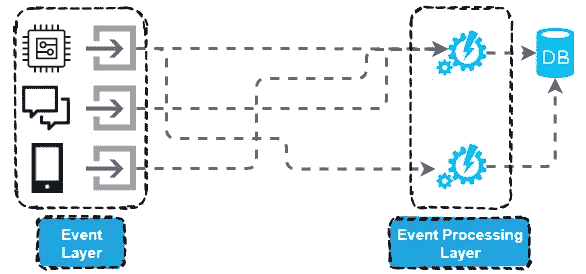
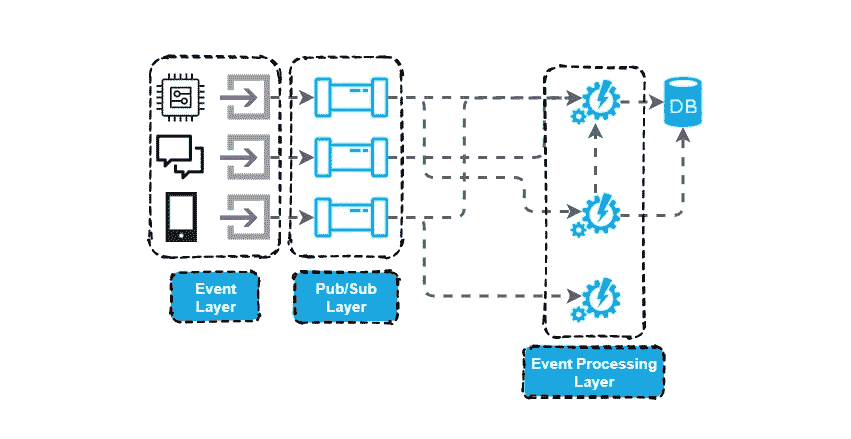

# 不要错过酒吧/餐馆

> 原文：<https://towardsdatascience.com/dont-miss-out-on-pub-sub-5dbfa15cf3d0?source=collection_archive---------50----------------------->

## 对发布/订阅模式的高层次概述，以及为什么您应该将它合并到您的项目中

[发布/订阅模式](https://en.wikipedia.org/wiki/Publish%E2%80%93subscribe_pattern)并不是什么新东西，但是随着事件系统的日益复杂以及分布式计算的进步，发布/订阅越来越受欢迎。在本文中，我将解释高层次的发布/订阅模式，并尝试为您提供一些在不同规模的项目中包含该模式的理由。

## 不带发布/订阅

当构建需要两个或更多不同组件相互通信的复杂事件驱动系统时，传统且最简单的方法是将这些组件直接连接在一起。在某些情况下，这是通过使用 web 服务 API、平面文件交换或通过共享数据存储(如数据库)来完成的。这些方法可行，但也带来了一系列挑战:

1.  **模块耦合在一起**，一个组件的改变可能需要更新与之交互的任何其他组件
2.  **构建和测试新的集成变得非常耗时**
3.  随着事件数量和集成点数量的增长，通常缺乏可伸缩性

作者图表

> *对于只涉及 2 到 3 个组件和很少数据的小型爱好项目，我发现这种典型的直接集成方法是极其有害的，它阻碍了我进行迭代增强。我发现添加一个新模块需要重新访问和重新配置几个组件，这令人望而生畏。*

## 发布/订阅模式

输入发布/订阅模式。通信是通过一组通道完成的，而不是将基础设施的各个部分直接连接在一起。基础结构中的模块可以是发送事件的通道的发布者，也可以是读取事件的订阅者。这带来了一些好处，并有助于解决上述一些缺点。

1.  **模块变得彼此完全解耦**，当涉及到集成时，它们的工作就是简单地正确格式化和发布数据，或者作为订阅者接收有效负载并知道如何处理它们
2.  **新组件的开发得到了简化**，因为开发人员不需要担心各种集成点和网络层
3.  通过为主题订阅单元测试脚本或者发布模拟输入，测试可以被隔离和简化
4.  如果使用了正确的发布/订阅解决方案，您的系统应该变得**无限可伸缩**而不需要接触基础设施的任何其他组件

作者图表

## 结论

发布/订阅模式正在成为构建可伸缩和可维护解决方案的标准。如果您目前没有将这种模式作为基础设施的一部分，我强烈建议至少将它作为一种选择进行评估，因为减少维护和未来开发成本的好处可能会超过将您的解决方案迁移到这种可伸缩模式所需的努力。正如我前面提到的，我强烈推荐这种模式用于更小的爱好项目，以提高解决方案未来的灵活性，并获得使用发布/订阅模式的经验。我使用谷歌的 Pub/Sub 来完成我的大部分个人项目，因为它每月提供 10GB 的免费数据传输，这足以满足我的所有需求。

*原载于 2021 年 2 月 15 日*[*【http://www.theappliedarchitect.com】*](http://www.theappliedarchitect.com/why-you-should-be-using-googles-pub-sub/)*。*