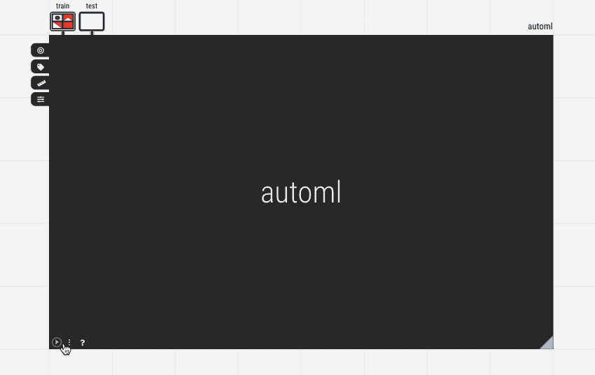
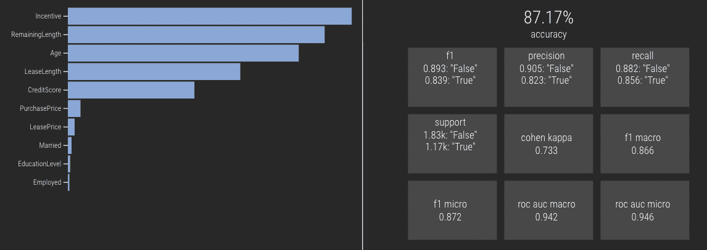

# 不要过度投资:如何有效地支持 ML 能力

> 原文：<https://towardsdatascience.com/dont-over-invest-be-efficient-when-standing-up-ml-capabilities-e7f0ac11e58e?source=collection_archive---------36----------------------->

## 组织不应该建立大项目来创建完美的模型，而是应该创建快速原型，并开始更快地从未接触的用例中获取价值。

通常被称为“80 / 20”的帕累托原则表明，大部分价值是在第一次小规模的努力中获得的。将这一概念应用于数据分析项目的战略管理，下面是这一效率原则的两个简单但有用的应用:

**收益递减:可以在 20%的时间内发现 80%的模型精度。** 在创造一个完美模型的时间里，我们可以创造五个不完美的模型。挖掘以获得更好的结果和手动调整模型最终成为一种“奢侈”的活动，应该应用于这样的情况，即花费时间来增加质量显然是有意义的。但在大多数情况下，即使是一个只有几个变量的基本线性回归方法，也是一个针对特定反应的更全面的方法，而不仅仅是目测或猜测。

*正如这里举例说明的，在渐进采样 AutoML 中运行的模型质量迅速收敛(作者在 Einblick 自己的软件中)*

**快速失败:80%的价值存在于 20%的潜在建模问题中。我们需要创建一个流程来快速发现最有价值的时间投资领域，因为并非所有的分析最终都是有价值的。有些结果是不可预测的——要么是因为我们错过了正确的驱动程序，要么只是因为随机机会发挥了太大的作用。在这两种情况下，重要的是不要过度管理和项目管理分析。有效地获得第一个答案有助于确定讨论的优先顺序。**

这个模型是在上面的 30 秒运行中构建的，是您与营销领导进行讨论所需的全部内容。(作者在 Einblick 自己的软件中)

这两个命题其实是趋同的:做出很多不完美的模型。快速原型化让我们过滤并快速击落糟糕的模型，快速部署让我们立即开始实现价值。更多的工作有递减的回报，并且考虑到团队的带宽有限，超过某个点的进一步投资是不明智的，因为它不会有效地产生结果。

当然，一些数据科学项目应该小心谨慎:例如，自动驾驶汽车或受监管的银行风险模型的对象识别。但是对于绝大多数实际的商业应用来说，要清除的障碍不是 100%的准确性，而是直觉的提高。

最终，在大多数组织中，有一长串决策是在有限的数据驱动指导下做出的，即使简单的 ML 也能够轻松实现增量。快速浏览一系列主题，找到“相当好”的答案，并广泛普及 AI/ML 是一个值得立即采用的数据策略。

*最初发表于 ein blick:*[https://ein blick . ai/don-over-invest-efficiency-is-the-name-the-game-when-operationaling-ml/](https://einblick.ai/dont-over-invest-efficiency-is-the-name-of-the-game-when-operationalizing-ml/)

*Einblick 是世界上第一个可视化数据计算平台，创造了与数据最自然的交互。在 https://einblick.ai/try-einblick/*报名试听