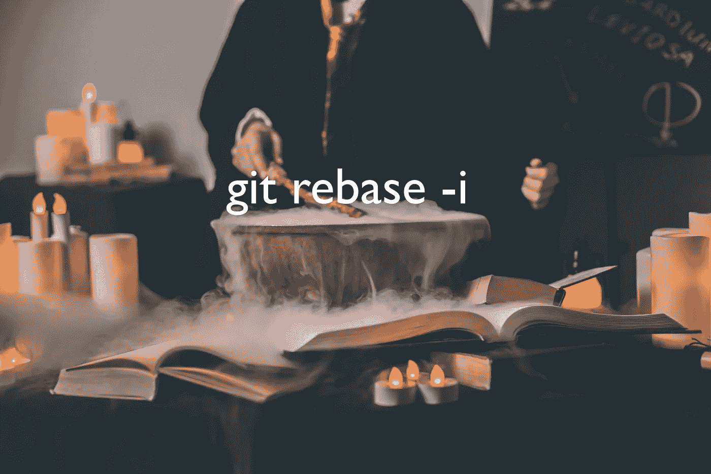

# 如果你犯了错误，不要惊慌。我掩护你

> 原文：<https://towardsdatascience.com/dont-panic-if-you-ever-make-the-wrong-git-commit-i-ve-got-you-covered-e7cd8d196130?source=collection_archive---------12----------------------->

## 交互式 rebase 小指南。此命令允许您更改过去并撤消提交



Artem Maltsev 在 [Unsplash](https://unsplash.com/s/photos/magician?utm_source=unsplash&utm_medium=referral&utm_content=creditCopyText) 上拍摄的照片以及作者的注释

5 个月前，当我第一次开始为开源做贡献时，有些事情让我一直很紧张。

分支上的每一条提交消息都必须遵循一种格式，否则您的拉请求就不会被合并。

具体来说，应该是:“前缀:该提交内容的摘要”。

如果您已经处理一个拉请求两个月了，但是最后一个提交消息是错误的，会发生什么？

嗯…..

我决定我不想知道。

我习惯屏住呼吸，在用力前检查三遍。我甚至推迟了开分店，因为我不想冒这个险。

静下心来学习 git，并最终学习交互式 rebase，无疑是我这个阶段的 git 用户所能做的最好的投资之一。

好消息是:这不是火箭科学。看一看，然后告诉我你的想法。

# 先决条件:一些 Git

许多其他作者更好地解释了诸如克隆、添加、提交、推送等 Git 基础知识。我会充分利用您的时间，将它们的链接放在这里:

对于那些认为自己完全是初学者的人，我推荐这本带有动手项目的清晰指南。这是《走向数据科学》的副主编安妮·邦纳带给你的。

</getting-started-with-git-and-github-6fcd0f2d4ac6>  

## Git 如何工作

如果你喜欢一道菜。我强烈推荐这一个。

这门课程比这篇文章先进得多。它深入机制，从根本上解释事情。它也充满了动画和真实的，具体的例子。因为我很喜欢它，所以把它放在这里给有兴趣了解更多的人是很自然的。

  

## 专业书籍

这本书也是有帮助的。在最初的几次尝试中，我并没有理解*中 Git 如何工作*的大部分概念，但是读完这篇文章后，大部分概念都变得清晰了。

<https://git-scm.com/book/en/v2>  

# 先决条件:打乱提交的方法

我最常犯的两个错误

*   错误的提交消息(例如，混淆了前缀)
*   错误的提交内容(例如，额外的行、额外的空间)

交互式 rebase 比修复这些问题更有能力，但是我主要关注这两个问题，因为我遇到它们的次数最多。

# 什么是 Rebase？

简单地说，它正在重新定义过去发生的事情的顺序。

所以当我们改变过去的时候，我们实际上在做的是首先让一件新的事情发生。

然后，我们用实际发生提交替换新事件。


之前和之后

然而，交互式 rebase 使事情变得非常简单。即使你不懂这部分，也不妨碍你获取这篇文章的核心外卖。

# 改变过去

## 第一步—选择您想要修改的历史部分

执行`git log`并复制提交的散列。应该是下面例子中的`5a6e6cdc63ecd1ad4c03ed004099d298b776e06a`

```
% git logcommit 5a6e6cdc63ecd1ad4c03ed004099d298b776e06a (**HEAD -> branch-name**, **origin/branch-name**)Author: my-username <myemail@gmail.com>Date:   Tue Sep 7 19:14:08 2021
```

## 第二步——复制数字，并开始重建基数

命令如下

```
git rebase -i 5a6e6cdc63ecd1ad4c03ed004099d298b776e06a^
```

请注意，它包括

1.  git rebase -i
2.  哈希代码
3.  ^

简单地说，^意味着你想从这一点开始改变过去。它就像一个箭头，指向我们要开始的地方。

如果你愿意，像`git rebase -i 5a6e6cdc^`这样的东西也可以工作，因为它们只会寻找以前缀开头的散列。

## 额外步骤——使用 vim 作为您的编辑器

如果前一步因为编辑器不工作而不起作用，请尝试这一步，然后再次执行第二步:

```
git config --global core.editor vim
```

这将允许您在终端窗口中进行交互式重置。我更喜欢这一点，并将在下面提供关于如何使用它的进一步说明。

## 第三步—选择要修改的提交

这是最复杂的一步。

您应该会看到这样的内容:

```
% git rebase -i 5a6e6^hint: Waiting for your editor to close the file...pick 5a6e6cdc63 The commit message here. Note by the author # Rebase 71b43c0db0..5a6e6cdc63 onto 71b43c0db0 (1 command)## Commands:# p, pick <commit> = use commit# r, reword <commit> = use commit, but edit the commit message# e, edit <commit> = use commit, but stop for amending# s, squash <commit> = use commit, but meld into previous commit# f, fixup <commit> = like "squash", but discard this commit's log message# x, exec <command> = run command (the rest of the line) using shell# b, break = stop here (continue rebase later with 'git rebase --continue')# d, drop <commit> = remove commit# l, label <label> = label current HEAD with a name# t, reset <label> = reset HEAD to a label# m, merge [-C <commit> | -c <commit>] <label> [# <oneline>]# .       create a merge commit using the original merge commit's# .       message (or the oneline, if no original merge commit was# .       specified). Use -c <commit> to reword the commit message.
```

看看所有的命令！Git rebase -i 有这么多能力。然而现在，我只打算坚持使用唯一一个我经常使用的:`edit`。

去把`pick`改成`edit`，然后保存并关闭文件。

如果你像我一样使用 vim 编辑器，这里有一些关键信息:

`i` =开始编辑。向上/向下/向左/向右浏览各行。

`backspace`删除“选择”文本。正常打字。

`esc`=停止编辑

`:wq` =保存`w`并关闭`q`

`enter`执行

## 第四步—编辑内容

您有想要更改的代码。做`git status`自己看。就好像您还没有暂存那些文件一样。

立即进行更改。

如果您只想更改提交消息，只需跳过这一部分。

## 额外提示——如何通过编译来测试代码，然后在 rebase 期间进行更改

残酷的事实是，我们不能在 git rebase 期间编译和测试代码，但好消息是我有几乎一样好的东西。

如果您想要编辑的提交是最新的，应该可以:

在重定基础之前，按照你的意愿进行修改和编译。

然后做`git stash`。这是一个有点像“cmd/ctrl + z”或者“cut”的命令。它带走所有的变化并储存起来。

稍后，当你重新设定基础并到达这个阶段时，做`git stash pop`。这将把修改“cmd/ctrl + v”或“粘贴”到这里。瞧。你有零钱。

## 第五步——git 添加、提交、git 重置基础继续

这个提示信息应该出现在终端上—

```
You can amend the commit now, withgit commit --amendOnce you are satisfied with your changes, rungit rebase --continue
```

照它说的做，但首先`git add`所有的变化。这是继续进行的必要条件。

然后`git commit --amend`

您的编辑器中应该会显示以下内容:

```
Commit message here. Note by the author# Please enter the commit message for your changes. Lines starting# with '#' will be ignored, and an empty message aborts the commit.## Date:      Tue Sep 7 19:14:08 2021## interactive rebase in progress; onto 71b43c0db9# Last command done (1 command done):#    edit 5a6e6cdc62 SCI: Set name of new file to tts, function name to ttsPickLB2NotebookTopic, and remove extra lines# No commands remaining.# You are currently editing a commit while rebasing branch 'sci-tts' on '71b43c0db9'.
```

编辑提交消息的最佳时间。您应该可以使用我上面提到的 vim 编辑器键。他们以同样的方式工作。

然后用这个包起来。

```
git rebase --continue
```

## 第六步——用力推

是时候展示你的作品了。

不做`git push`，做:

```
git push --force
```

这是因为我们对历史进行了更改，这与远程(Github 上)存储的内容相冲突。

`--force`表示“无论如何都要做”。我确信我有正确的版本”。

在这之后，你应该会在 Github 上看到你想要的改变。

## 如果出了什么差错…

```
git rebase --abort
```

这停止了时间旅行，带你回到正常状态。

# 我希望这篇文章对你有帮助

我真诚地希望你会好起来，不管你正面临什么样的问题，或者将来可能会面临什么样的问题。

与其希望你永远不会遇到任何问题，我会说…

> 持久的幸福来自于处理生活中糟糕事情的能力。

我希望你能处理好自己的问题。

中级会员资格使我有可能学到足够的知识，并为数据科学写作。[用我的个人链接](https://twanchen.medium.com/membership)注册，然后告诉我，我会给你发一份分享我整个旅程的 pdf。