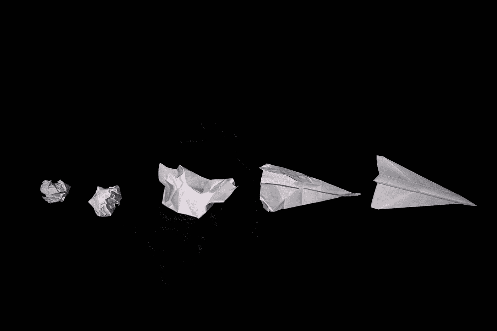
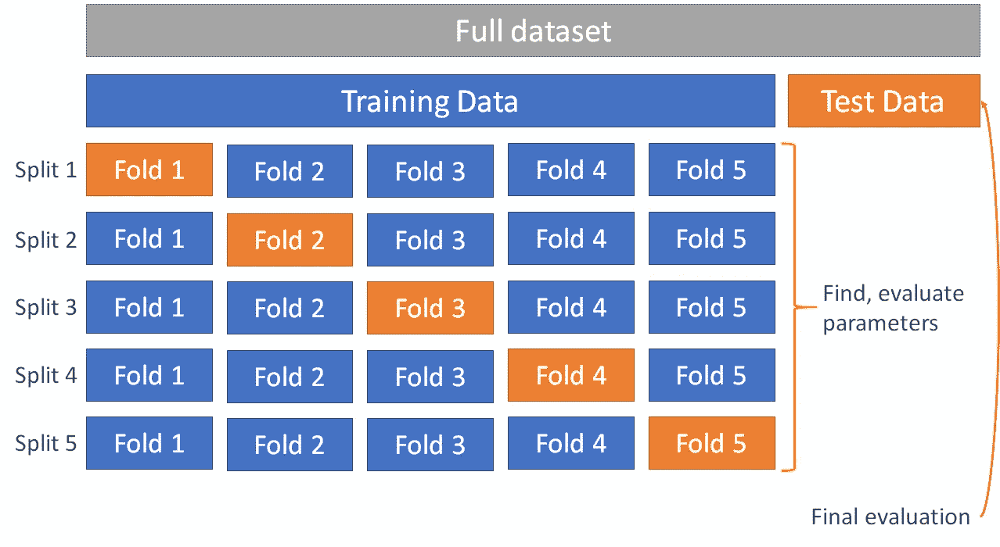
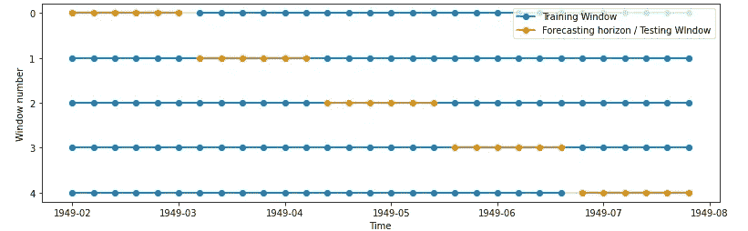
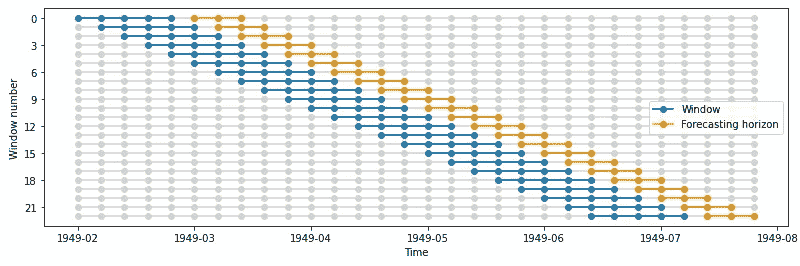
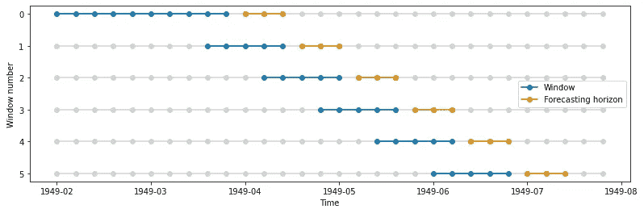
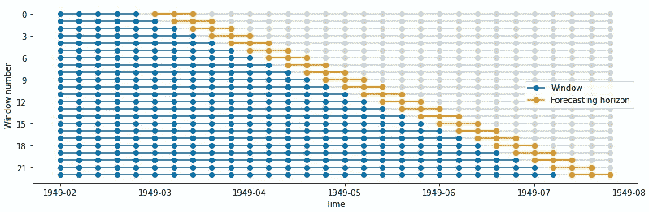

# 不要对时间序列预测使用 K-fold 验证

> 原文：<https://towardsdatascience.com/dont-use-k-fold-validation-for-time-series-forecasting-30b724aaea64?source=collection_archive---------4----------------------->

## 如何用 python 中的 sktime 执行时态交叉验证

由[乔舒亚·迪克森](https://unsplash.com/@joshdixon00?utm_source=medium&utm_medium=referral)在 [Unsplash](https://unsplash.com?utm_source=medium&utm_medium=referral) 拍摄的照片

交叉验证是帮助为机器学习模型选择最佳超参数的有用程序。这对于较小的数据集特别有用，因为没有足够的数据来创建代表性的训练、验证和测试集。简而言之，交叉验证将单个训练数据集分成多个训练和测试数据集子集。

最简单的形式是*k*-折叠交叉验证，将训练集拆分成 *k* 个更小的集合，或者说*折叠*。对于每次分割，使用训练数据的 *k-1* 倍训练模型。然后根据剩余折叠验证模型。然后，对于每一次拆分，模型都在保留的折叠上进行评分。分数是通过拆分得到的平均值。

作者图片

然而，这种超参数调整方法并不适用于时间序列预测！

下图说明了为什么标准的 *k* -fold 验证(和其他非时间的数据分割)不适合时间序列机器学习。该图显示了分成五个窗口的单变量序列，并指出序列中的哪些日期被分配给哪个折叠。

作者图片

这些褶皱有三个突出的问题:

1.  **预测/测试数据出现在训练数据**之前。在 0 号窗口中，预测范围(测试数据)出现在训练数据之前！
2.  **数据泄露**。在 windows 2–4 中，一些训练数据出现在测试数据之后*。这是有问题的，因为模型能够预见“未来”。*
3.  **串联间隙**。在 windows 2–4 中，由于测试数据是从系列的中间获取的，因此训练系列中会有间隙。

(有关交叉验证的更多背景信息，请参见 [scikit-learn 文档](https://scikit-learn.org/stable/modules/cross_validation.html)。)

# 如何用 sktime 将数据分割成时态折叠

`scikit-learn`提供了用类似`model_selection.KFold`的类将数据分割成文件夹的方法。`sktime`提供了相应的类，“窗口拆分器”，工作方式类似。

窗口拆分器有几个可以配置的参数:

*   `window_length` —每次折叠的训练窗口长度
*   `fh` —预测范围；指定在训练窗口之后要包含在测试数据中的值。它可以是整数、整数列表或 sktime `ForecastingHorizon`对象。
*   `initial_window` —第一个折叠中训练窗口的长度。如果未设置，`window_length`用作第一次折叠的长度。
*   `step_length` —褶皱之间的步长。默认值为 1 步。

初始化后，窗口拆分器可以像`KFold`验证类一样使用，为数据的每次拆分提供训练和测试索引:

## 滑动窗口拆分器

该拆分器随着时间的推移在滑动窗口上生成折叠。每个折叠的训练系列和测试系列的大小是恒定的。

在这个例子中，window_length=5，意味着训练窗口总是包含 5 个值。预测范围`fh`是一个整数列表，指示训练窗口之后的哪些值应该在测试数据中。

来源:[sk time/window _ splitters . ipynb](https://github.com/alan-turing-institute/sktime/blob/main/examples/window_splitters.ipynb)

如果您将`initial_window`设置为 10，并将`step_length`更改为 3，则如下所示:

如下所示，第一个折叠的训练窗口是 10 个时间步长；后续折叠具有长度为 5 的训练窗口。此外，每次折叠都比前一次折叠滑动 3 步。

(代码模板由 sktime 提供，图片由作者提供)

## 展开 WindowSplitter

与`SlidingWindowSplitter`一样，`ExpandingWindowSplitter`随着时间的推移会在滑动窗口上生成褶皱。但是，训练系列的长度会随着时间的推移而增长，随后的每个折叠都会保留到该点为止的完整系列历史记录。每个折叠的测试系列长度是恒定的。

来源:[sk time/window _ splitters . ipynb](https://github.com/alan-turing-institute/sktime/blob/main/examples/window_splitters.ipynb)

# 预测模型选择

`sktime`提供了两个使用交叉验证来搜索预测模型最佳参数的类:`[ForecastingGridSearchCV](https://www.sktime.org/en/latest/api_reference/modules/auto_generated/sktime.forecasting.model_selection.ForecastingGridSearchCV.html#sktime.forecasting.model_selection.ForecastingGridSearchCV)`(评估所有可能的参数组合)和`[ForecastingRandomizedSearchCV](https://www.sktime.org/en/latest/api_reference/modules/auto_generated/sktime.forecasting.model_selection.ForecastingRandomizedSearchCV.html#sktime.forecasting.model_selection.ForecastingRandomizedSearchCV)`(随机选择要评估的超参数)。这些类通过反复拟合和评估同一个模型来工作。

这两个类都类似于`scikit-learn`中的交叉验证方法，遵循相似的接口。调谐器用以下实例化:

*   要调整的预测者
*   交叉验证构造器(如`SlidingWindowSplitter`)
*   参数网格(例如`{'window_length':[1,2,3]}`)
*   调谐参数
*   评估指标(可选)

在下面的示例中，跨时间滑动窗口使用了带交叉验证的网格搜索来为指数平滑预测选择最佳模型参数。参数网格指定应该测试模型参数`sp`(季节周期数)和`seasonal`(季节成分类型)的哪些值。

预测器适合历史数据的 60 个时间步长的初始窗口。后续窗口的长度为 20。预测范围设置为 1，这意味着测试窗口仅包含在训练窗口之后出现的单个值。

那么时间网格搜索交叉验证方法可以被拟合并用于进行预测:

拟合对象包含两个有用的属性:

*   `gscv.best_params_`:调谐参数
*   `gscv.best_forecaster_`:具有最优超参数的最佳预测器的实例

有关使用 sktime 进行预测的更多详细信息，包括模型选择和调整，请参见此处的 sktime 预测教程:[https://www . sk time . org/en/latest/examples/01 _ forecasting . html](https://www.sktime.org/en/latest/examples/01_forecasting.html)

# 结论

感谢您的阅读！在这篇文章中，我们介绍了交叉验证的基础知识，以及为什么需要对时间序列进行调整，如何将时间序列分割成多个折叠进行时间交叉验证，以及如何进行时间网格搜索和随机搜索交叉验证。

 [## 阅读亚历山德拉·阿米登(以及媒体上成千上万的其他作家)的每一个故事

### 作为一个媒体会员，你的会员费的一部分会给你阅读的作家，你可以完全接触到每一个故事…

alexandra-amidon.medium.com](https://alexandra-amidon.medium.com/membership) 

# 参考资料和资源

*   [https://sci kit-learn . org/stable/modules/cross _ validation . html](https://scikit-learn.org/stable/modules/cross_validation.html)
*   [sk time/window _ splitters . ipynb at main 艾伦图灵研究所/sktime GitHub](https://github.com/alan-turing-institute/sktime/blob/main/examples/window_splitters.ipynb)
*   [时间序列嵌套交叉验证| Courtney Cochrane |走向数据科学](/time-series-nested-cross-validation-76adba623eb9)

 [## Sktime:用于时间序列机器学习的统一 Python 库

### 用于时间序列预测、分类和回归的“sklearn”

towardsdatascience.com](/sktime-a-unified-python-library-for-time-series-machine-learning-3c103c139a55)