# 当 Pathlib 可以使用 Python OS 库时，不要再使用它

> 原文：<https://towardsdatascience.com/dont-use-python-os-library-any-more-when-pathlib-can-do-141fefb6bdb5?source=collection_archive---------2----------------------->


由[拍摄的照片](https://pixabay.com/users/free-photos-242387/)在 [Pixabay](https://pixabay.com/photos/way-path-outdoor-landscape-nature-918900/) 上

## 更直观、更方便、更多功能

近年来，Python 被更多的非程序员所了解。这不仅是因为它在机器学习领域很受欢迎，还因为它可以用来自动化许多重复的工作，如批量编辑具有特定模式的文件。

在我以前的一篇文章(如下)中，我介绍了 Python 中的 OS 库，它将处理几乎所有基本的文件系统操作。对于那些刚刚开始使用 Python 来自动化一些重复任务的人，强烈推荐这些操作。

</8-must-know-file-system-operations-in-python-7dc185daeccd>  

然而，在我们掌握了操作系统库之后，我还建议升级到另一个库来完成大多数基本的文件系统操作。那就是 Pathlib，也是 Python 内置库。它在语法方面更直观，更容易使用，并且有更多现成的功能。

在本文中，我将首先比较使用 OS 库和 Pathlib 的一些基本操作，以展示它们的区别，并讨论为什么推荐使用 Pathlib。

# 1.显示当前目录

我想开始的第一个操作是显示当前的工作目录(CWD)。这很重要，因为我们可能大部分时间都想使用相对路径。因此，有时知道我们此刻在哪里是很重要的。

## 操作系统库

```
import osos.getcwd()
```

## Pathlib

```
from pathlib import PathPath.cwd()
```

## 差异

如果我们把它们打印出来，结果似乎是一样的。

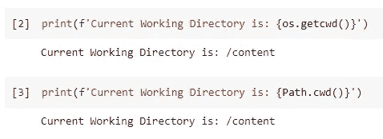

然而，如果我们检查对象的类型，我们会发现它们是不同的。

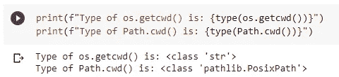

OS 库将返回一个字符串，而 Pathlib 将返回一个 PosixPath 对象。返回 PosixPath 的好处是我们可以直接使用返回的对象做更多的操作。这将在后面的章节中演示。

# 2.检查目录或文件是否存在

就我而言，我使用的是 Google Colab，每次配置新笔记本时，都会自动创建一个名为“sample_data”的文件夹。如果我想检查是否有这样的目录，下面的代码就可以了。

## 操作系统库

函数`os.path.exists()`接受一个字符串类型的参数，它可以是目录名或文件名。

```
os.path.exists('sample_data/README.md')
```

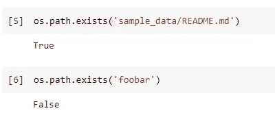

## Pathlib

当使用 pathlib 时，我们只需将路径作为字符串传递给“Path”类，这将为我们提供一个“PosixPath”对象。要测试“PosixPath”实例是否存在于文件系统中，只需调用它的方法`exist()`，比 OS 库更直观。

```
Path('sample_data/README.md').exists()
```

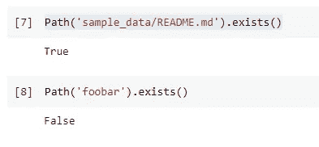

## 差异

在这个操作方面，两个库几乎没有区别。然而，当使用 Pathlib 时，我们有可能以这种风格编写代码。

```
readme = Path('sample_data/README.md')
readme.exists()
```

虽然我们使用多一行代码实现了这个操作，但是我们已经获得了对`readme.md`文件的引用。换句话说，我们可以稍后将变量`readme`用于任何其他操作，而不必再次将完整路径作为字符串传递。

# 3.创建目录

现在，让我们在工作目录中创建一个名为`test_dir`的目录，看看 OS 库和 Pathlib 有什么区别。

## 操作系统库

在操作系统库中创建一个目录是相当容易的。

```
os.mkdir('test_dir')
```

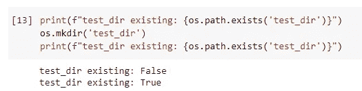

## Pathlib

对于 Pathlib，语法非常直观。

```
Path('test_dir').mkdir()
```

## 抑制 FileExistsError 的区别

在操作系统库中，当我们试图创建一个已经存在的目录时，将会抛出一个错误。

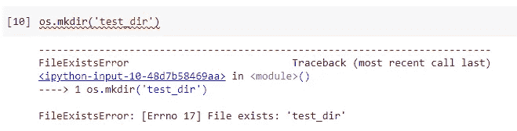

在我以前的文章中，有人建议我们应该在创建目录之前检查它是否存在。

```
if not os.path.exists('test_dir'):
    os.mkdir('test_dir')
```

然而，如果我们使用 Pathlib，处理这个错误就容易多了。

```
Path('test_dir').mkdir(exist_ok=True)
```

函数`mkdir()`接受一个标志`exist_ok`。当它被设置为 true 时，`FileExistsError`错误被自动忽略，这相当于我们通过添加一个 if-condition 对 OS 版本实现所做的。

## 创建多级深度目录的区别

另一个主要区别是在父目录不存在时创建目录。在操作系统库中，我们必须使用不同的函数来实现这一点。我们必须使用`makedirs()`，而不是`mkdir()`。

```
os.makedirs(os.path.join('test_dir', 'level_1a', 'level_2a', 'level_3a'))
```

它确实起作用了。然而，我们必须永远记住使用不同的功能。

如果我们使用 Pathlib，我们只需要将标志`parents`设置为 true。

```
Path(os.path.join('test_dir', 'level_1b', 'level_2b', 'level_3b')).mkdir(parents=True)
```

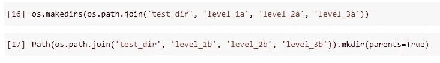

不要忘记这些都是同一个函数的标志。换句话说，我们可以同时使用`exist_ok`和`parents`标志！

# 4.显示目录内容

## 操作系统库

当我们想显示一个目录的内容时，在 OS 库中很容易。

```
os.listdir('sample_data')
```

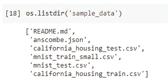

## Pathlib

在 Pathlib 中显示目录内容的语法并不令人惊讶，如下所示。

```
Path('sample_data').iterdir()
```

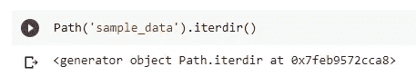

## 返回格式的差异

如果我们注意 Pathlib 的返回格式，它实际上提供了一个生成器，而不是一个字符串列表。我们可以通过将这个生成器中的所有对象放入一个列表中来获取所有内容。

```
list(Path('sample_data').iterdir())
```

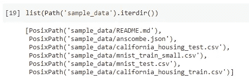

然而，在大多数情况下，我们想要获得一个目录中的所有文件的原因是为了一个接一个地执行一些动作。因此，如果我们只想让它们循环一次，生成器会更有效。

## 使用 Glob 的区别

操作系统库不提供使用通配符搜索文件的功能。因此，我们必须导入另一个名为 Glob 的库来帮助。

```
from glob import glob
list(glob(os.path.join('sample_data', '*.csv')))
```

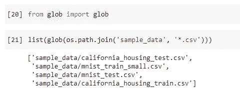

如果我们使用 Pathlib，非常幸运的是，它带有“glob”特性。

```
list(Path('sample_data').glob('*.csv'))
```

# 5.快速读取/写入文件

这个特性是 Pathlib 独有的。当我们想在文件中读或写一些东西时，通常使用下面的方法。

```
with open("test.txt", 'rw') as file:
    print(file.read())
```

这确实是 Python 中的标准。然而，有时我们可能只想在一个文件中写入很少的字节。在这种情况下，我们可以使用 Pathlib 非常容易地做到这一点。

```
f = Path('test_dir/test.txt'))
f.write_text('This is a sentence.')
```

当然，我们也可以快速地将文件的内容读入一个字符串变量。

```
f.read_text()
```

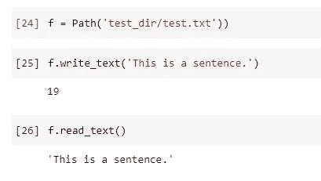

# 6.文件的元数据

在实践中，我们需要一些关于文件的特定信息是很常见的。现在，让我演示一下 Pathlib 如何为我们轻松地提取关于文件的信息和统计数据。

让我们继续使用我们在上一节中使用过的文件，它是变量`f`。

```
print(f'Path of the file is:\n{f}')
```

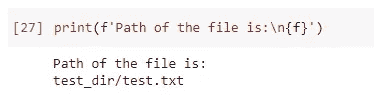

尽管在大多数情况下我们希望使用相对路径，但有时仍然有必要检查文件的绝对路径。我们可以使用 Pathlib 非常容易地做到这一点。

```
f.resolve()
```

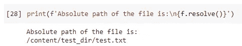

有时，我们可能只想通过去掉文件扩展名来获得文件名。或者，相反，我们希望提取文件的扩展名。通过访问文件的属性，这两种方法都很容易。

```
f.stem
f.suffix
```

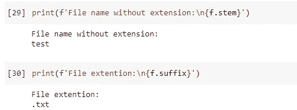

更令人吃惊的是，Pathlib 可以从一个 PosixPath 实例轻松地返回统计数据、创建/更新时间等等。这相当于`os.stat_result`，但是更容易访问和使用。

```
f.stat()
```

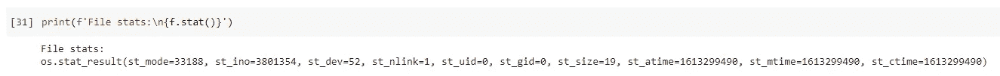

例如，如果我们想显示文件的大小，只需如下。

```
f.stat().st_size
```

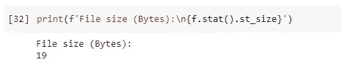

# 摘要


由[赫尔曼](https://pixabay.com/users/hermann-130146/)在 [Pixabay](https://pixabay.com/photos/mountaineering-man-trail-path-455338/) 上拍摄的照片

在本文中，我介绍了另一个 Python 内置库 Pathlib。它被认为比操作系统库更先进、更方便，并提供了更多令人惊叹的功能。

当然，我们仍然需要知道如何使用 OS 库，因为它是 Python 中最强大和最基本的库之一。然而，当我们在典型场景中需要一些文件系统操作时，强烈建议使用 Pathlib。

<https://medium.com/@qiuyujx/membership>  

如果你觉得我的文章有帮助，请考虑加入 Medium 会员来支持我和成千上万的其他作者！(点击上面的链接)