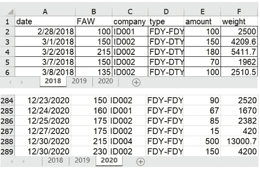
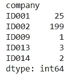
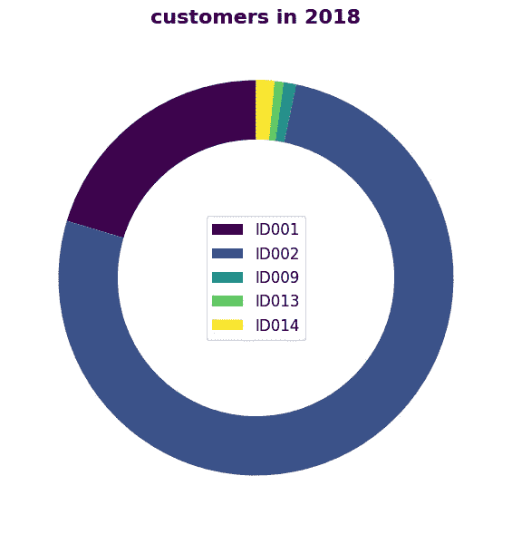
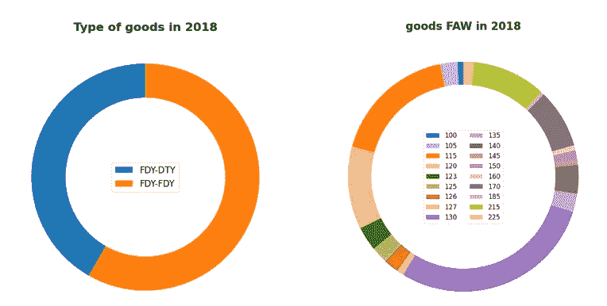

# 用于数据分析的环形图

> 原文：<https://towardsdatascience.com/donut-plot-for-data-analysis-5aacac591741?source=collection_archive---------35----------------------->

## 在这个故事中，我们演示了如何使用 python 工具从复杂的 excel 表格中绘制圆环图。


在 [Unsplash](https://unsplash.com/s/photos/donut-shop?utm_source=unsplash&utm_medium=referral&utm_content=creditCopyText) 上由 [Rodion Kutsaev](https://unsplash.com/@frostroomhead?utm_source=unsplash&utm_medium=referral&utm_content=creditCopyText) 拍照

像往常一样，我们的工作从数据开始，就像有些人的早餐由甜甜圈组成。食物和数据之间没有关系，除了甜甜圈图有一个甜甜圈形状的图形。

首先我们有一个 excel 文件，记录了一个行业部门从 2018 年到 2020 年的所有销售信息。该部门成立于 2018 年，在中国刚刚经历了新冠肺炎年。幸运的是，它幸存了下来，并庆祝 2021 年新年的开始。

# 原始数据的解释

现在我们可以回顾一下这个部门在过去三年里发生的事情。excel 由 3 张表组成，包含每日销售额(E 列)和商品总重量(F 列)。收货人(C 列)实际上是付款的公司。该产品有 3 种类型(D 列),取决于其成分，FDY 和 DTY。一般来说，这些原材料有 3 种组合，即 FDY-FDY，DTY-DTY，以及混合 FDY-DTY。FAW(B 列)决定了产品的厚度，因为成品是坯布，是纺织工业的基本产品。



作者图片:excel 文件的截图

# 有熊猫和 Matplotlib 的圆环图

```
**import pandas as pd**
df2018=pd.read_excel("outbound_with_company.xlsx",sheet_name='2018',header=0)
df2019=pd.read_excel("outbound_with_company.xlsx",sheet_name='2019',header=0)
df2020=pd.read_excel("outbound_with_company.xlsx",sheet_name='2020',header=0)
```

我们将每个 excel 表格写入一个数据框。数据框具有与初始数据相同的列。我们可以在头脑中重组数据。如果我们想探究订单和客户之间的关系，换句话说，C 列和 E 列(或 F 列)之间的数字比例，我们可以通过 groupby 操作对数据帧进行重组，该操作使用函数 [*pandas。data frame . group by*。](https://pandas.pydata.org/pandas-docs/stable/reference/api/pandas.DataFrame.groupby.html)

代码示例:

```
group_2018_2 = df2018.groupby('company')
print(group_2018_2.size())
```



作者图片:代码输出

```
**import** **matplotlib.pyplot as plt**
**from** **matplotlib** **import** **cm**
fig, ax = plt.subplots(figsize=(6, 6), subplot_kw=dict(aspect="equal"))
cs_customer= cm.get_cmap('viridis')(np.linspace(0, 1, 5))
component = group_2018_company.index
data = group_2018_company['weight']

wedges, texts = ax.pie(data, wedgeprops=dict(width=0.3), startangle=90,colors=cs_customer)

plt.legend(wedges, component, loc="center",fontsize=12)

ax.set_title("customers in 2018",fontdict={'fontsize': 16, 'fontweight': 'bold'})

fig.tight_layout()
plt.savefig('donutplot2.png',dpi=100, format='png', bbox_inches='tight')
plt.show()
```



作者图片:plt.show()的输出，圆环图

从甜甜圈图中，我们可以清楚地看到每个客户对销售额的贡献。ID 为 003 的客户在 2018 年做出了最大贡献。

同样，我们对其他组的数据和计算操作进行分组，如“type”、“FAW”。因此，我们在 2018 年获得了三个环形地块。



作者图片

这份电子表格记录了这个部门 3 年的销售额。这意味着我们可以得到 9 个甜甜圈🍩图表。

在下一个版本中，我们将解释如何用 Matplotlib 通过 DIY 设计来构建一个漂亮的年报。

[](/creative-report-designed-only-with-matplotlib-without-office-software-9d8b5af4f9c2) [## 只用 Matplotlib 设计的创意报告，不用办公软件

### 使用 Matplotlib 创建直观的报告。我们只是用 Python。不会使用任何办公软件。

towardsdatascience.com](/creative-report-designed-only-with-matplotlib-without-office-software-9d8b5af4f9c2) 

报告的一页如下所示:


作者图片:用 Matplotlib 构建的年度报告

所有代码和文件(png 和 excel)已经在 [**Github**](https://github.com/Kopfgeldjaeger/Medium_blogs_code/tree/master/4_donut_plot_and_report) 提交。

# 故事评论

到目前为止，我已经基于同一个 excel 文件编写了一系列故事，为此我已经发布了其他相关的故事，这些故事可以通过真实的数据和案例帮助您理解数据和数据分析。

[](https://medium.com/datadriveninvestor/a-short-interview-about-a-chinese-sweatshop-in-the-textile-industry-aefa9c2229ef) [## 关于中国纺织业血汗工厂的简短采访

### 来自亚洲最大的纺织品集散地——中国轻纺城——柯桥

medium.com](https://medium.com/datadriveninvestor/a-short-interview-about-a-chinese-sweatshop-in-the-textile-industry-aefa9c2229ef) [](/view-a-chinese-factory-from-the-data-aspect-with-python-ad698461f40a) [## 用 python 从数据角度看中国工厂

### 这个故事是在采访了一个工厂老板后，在熊猫的帮助下揭开工厂隐藏的真面目…

towardsdatascience.com](/view-a-chinese-factory-from-the-data-aspect-with-python-ad698461f40a) [](/data-analytics-helps-warehouse-management-f6a7f44f47af) [## 数据分析有助于仓库管理

### 在这个故事中，我们可以体验如何利用所有的交货凭证来监控仓库库存。

towardsdatascience.com](/data-analytics-helps-warehouse-management-f6a7f44f47af)