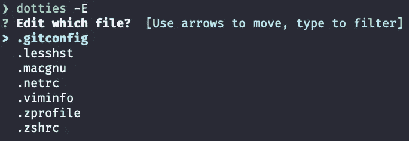

# 点文件可能是你电脑上最重要的文件。你支持他们吗？

> 原文：<https://towardsdatascience.com/dotfiles-could-be-the-most-important-files-on-your-computer-are-you-backing-them-up-99f8f8d99e68?source=collection_archive---------21----------------------->

## Dotties 是一个 Bash 脚本，它使用 Gist 管理你的点文件


[在](https://unsplash.com/@thecreative_exchange?utm_source=medium&utm_medium=referral) [Unsplash](https://unsplash.com?utm_source=medium&utm_medium=referral) 上创意交流的照片

# 介绍

点文件是类 Unix 环境中隐藏的纯文本配置文件。它们包含用户首选项和应用程序配置。您的编辑器、终端、Python 环境、Git 和其他日常使用的工具很可能会创建点文件。这些文件可能是你电脑上最重要的文件。

由于文件名中有一个点，所以它们被称为点文件。当您需要恢复配置时，保存这些点文件可以让您高枕无忧。您可以在几分钟内使用点文件建立一个新系统。


Dotties 是一个简单的点文件管理脚本和 GitHub CLI Gist 函数的包装器。它从终端管理主目录中的点文件。

# 要求

Dotties 需要 [Github CLI](https://cli.github.com/) 来管理你的点文件要点。

# 装置

使用[棒极了的软件包管理器](https://medium.com/mkdir-awesome/a-new-simple-package-manager-for-script-languages-a1228fd0972a)，安装 Dotties 很容易。

## [牛逼的包经理](https://github.com/shinokada/awesome)

```
curl -s [https://raw.githubusercontent.com/shinokada/awesome/main/install](https://raw.githubusercontent.com/shinokada/awesome/main/install) | bash -s install
```

然后安装 Dotties:

```
awesome install shinokada/dotties
```

## 家酿/Linuxbrew

```
brew tap shinokada/dotties
brew install dotties
```

## Linux/Debian/Ubuntu

从[发布页面](https://github.com/shinokada/dotties/releases)下载最新的 deb 文件。

```
sudo apt install dotties_XXXXXXX.deb
```

用最新版本替换`XXXXXXX`。

# 如何使用 Dotties

运行`dotties`将创建一个新的`~/.dotties/dottiesfile`文件。`dottiesfile`包含您主目录中的所有点文件。

```
dotties
```

如果你还没有设置你的 GitHub CLI 编辑器，它会要求你选择一个。


如果你已经有了一个`dottiesfile`，它会询问你是否要创建一个新的`dotties`文件或者编辑它。第一次选择`n`或`new`:


## 编辑 dotties 文件

再次运行`dotties`，但这次使用`-e`或`--edit`标志。这允许您编辑`dotties`文件:

```
dotties -e
# or
dotties --edit
```

您的 GitHub 编辑器将打开`dotties`文件。


随意编辑文件并保存。

## 查看 dotties 内容

如果您只想查看`dotties`文件的内容，使用`-r`或`--read`标志来读取:

```
dotties -r
# or
dotties --read
```


## 查看本地点文件

使用`-l`或`--local`标志查看主目录中的**所有**你的点文件**。**

```
dotties -l
# or
dotties --local
```


## 创造一个要点

让我们使用`-g`或`--gist`标志将您的`dotfiles`内容保存到一个要点中。所有与要点相关的标志都用大写字母表示。

```
dotties -G
# or
dotties --Gist
```


它将创建一个秘密要点，并打开一个浏览器窗口显示您上传的要点。当您运行`dotties -G`时，它将创建`~/.dotties/gisturl`来存储 Gist URL。

## 编辑要点文件

您可以使用`-E`或`--Edit`标志编辑点文件要点:

```
dotties -E 
# or
dotties --Edit
```



当您选择一个文件时，您的 GitHub CLI 编辑器将打开该文件。

## 查看要点文件

您可以使用`-V`或`--View`标志查看点文件要点的内容:

```
dotties -V 
# or
dotties --View
```


## 克隆要点文件

稍后，您可能希望克隆所有的点文件。

使用`-C`或`--clone`标志从一个要点克隆所有点文件:

```
dotties -C
# or
dotties --Clone
```


## 删除要点文件

您可以使用`-D`或`--delete`标志删除点文件要点:

```
dotties -D
# or
dotties --Delete
```

## 其他选项

打印帮助。

```
dotties -h
# or
dotties --help
```

打印版本。

```
dotties -v
# or
dotties --version
```

# 结论

这里是[Github dotties 回购链接](https://github.com/shinokada/dotties)。

要了解更多关于点文件的信息，请访问 GitHub repo。互联网上有许多管理点文件的方法。找到最适合自己情况和技能的方式，开始行动。

请让我知道你如何管理你的网络文件。如果你想增加更多的功能，请写在评论区。

**通过** [**成为**](https://blog.codewithshin.com/membership) **会员，获得媒体上所有故事的访问权限。**


[https://blog.codewithshin.com/subscribe](https://blog.codewithshin.com/subscribe)

# 参考

*   [https://dotfiles.github.io/tutorials/](https://dotfiles.github.io/tutorials/)
*   [https://github.com/webpro/awesome-dotfiles](https://github.com/webpro/awesome-dotfiles)