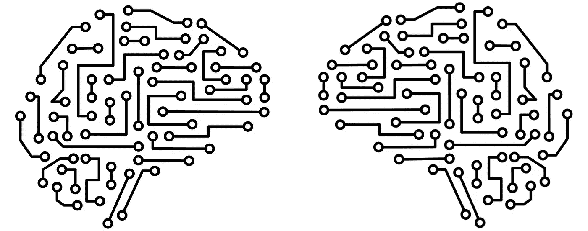
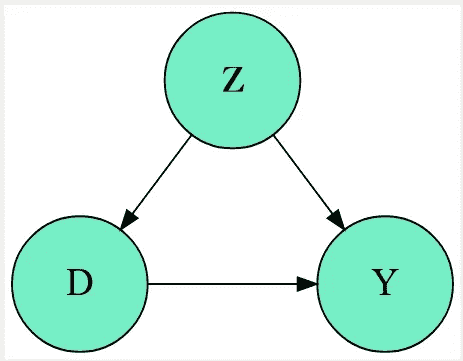
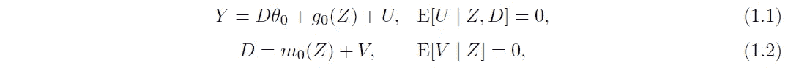
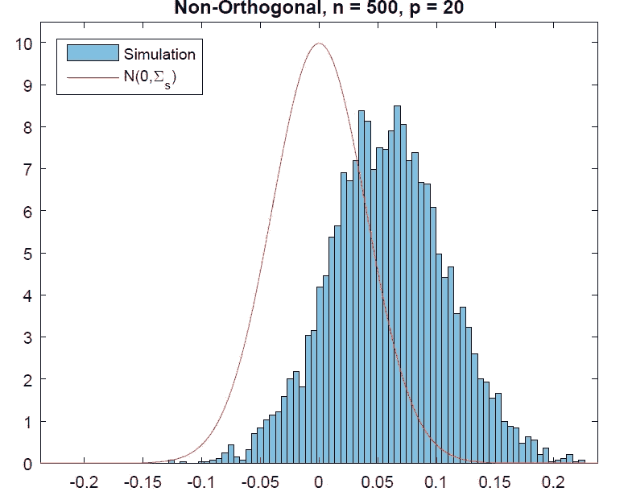
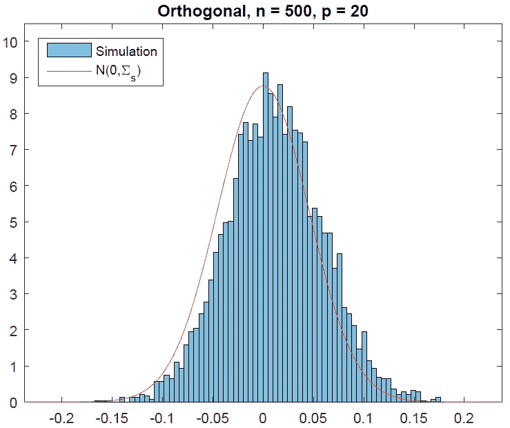
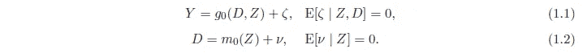
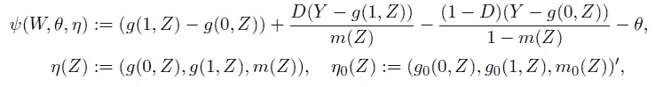
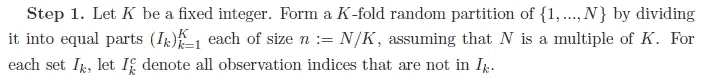
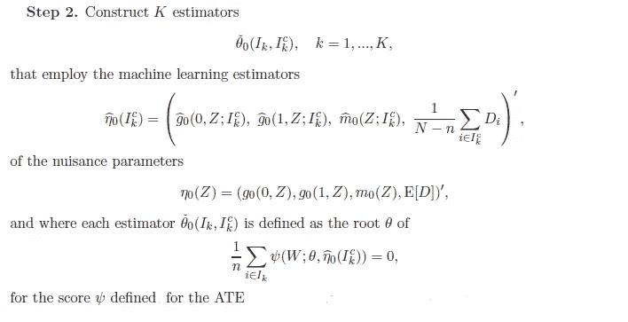
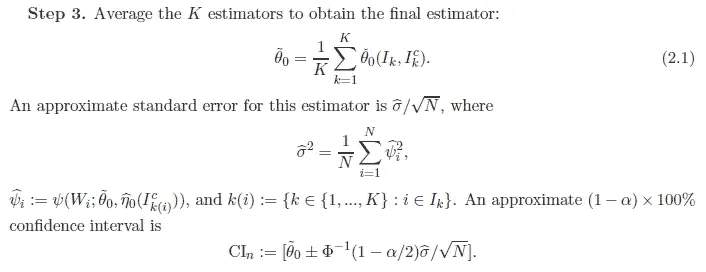

# 因果推理的双机器学习

> 原文：<https://towardsdatascience.com/double-machine-learning-for-causal-inference-78e0c6111f9d?source=collection_archive---------0----------------------->

## [思想与理论](https://towardsdatascience.com/tagged/thoughts-and-theory)， [BCN 因果 ALGO](https://towardsdatascience.com/tagged/bcn-causal-algo)

## 因果推理的双机器学习如何工作，从理论基础到应用实例。

这篇文章是与[阿莱克斯·鲁伊斯·德·维拉](https://www.linkedin.com/in/aleixrvr/)、[耶稣·塞奎兹](https://www.linkedin.com/in/cerquide/)以及整个[因果关系 ALGO·BCN](https://www.linkedin.com/groups/12501806/)团队共同努力的成果。注意:我们假设读者熟悉因果推理的基本概念。

如果你在因果推理的水域潜水，你可能听说过双机器学习的概念。如果你还没有听说过，我个人打赌你可能会，在不久的将来。或者更好的是，你可能甚至不知道你正在使用它。正如任何伟大的技术一样，用于因果推理的双机器学习有可能变得非常普遍。但是让我们让这位作家的热情平静下来，回到我们的任务上来。这篇文章试图简单而全面地解释什么是双机器学习以及它是如何工作的。为此，我们将从理论基础到因果推理应用的典型例子来讨论这个主题。

## 介绍

那么什么是双机器学习呢？Chernozukov 等人在一系列论文([本](https://arxiv.org/pdf/1608.00060.pdf)、[本](https://ifs.org.uk/uploads/cemmap/wps/cwp491616.pdf)和[本](https://arxiv.org/pdf/1701.08687.pdf))中介绍并发展了这一思想，总体上旨在提供以下内容:

1.  使用机器学习技术估计因果效应的一般框架
2.  这些估计的置信区间
3.  “根 n 一致”的估计量，即在收敛性和数据效率方面具有良好特性的估计量。

这整个想法从何而来？一方面，显而易见，它来自于使用机器学习进行因果推理的想法。但是，如果我们看得更深入一点，就会发现两个不那么明显的关键想法:

1.  从统计学的角度来看，机器学习是非参数或半参数估计方法的集合，
2.  有大量关于非参数和半参数估计方法的理论工作(关于界限、效率等)。)

双机器学习将这两点联系起来，从第二点中获取灵感和有用的结果，用于与第一点进行因果推理。

## 背景

让我们开始吧。我们首先定义数据生成流程的 DAG，我们将在该流程下工作，如下图所示:

数据生成过程的 DAG。作者配图

此外，我们定义了以下控制 DAG 变量之间关系的部分线性模型:

部分线性模型

其中 Y 是结果变量，D 是二元处理，Z 是协变量的向量，U 和 V 是扰动。等式 1.1 是主等式，θ₀是我们想要估计的目标参数，它是 ate 相对于 d 的导数。等式 1.2 跟踪混杂因素，即治疗对协变量的依赖性。这种依赖性是通过 m₀(Z 函数建模的，而结果对协变量的依赖性是通过 g₀(Z).函数建模的我们将在后面看到，双机器学习也适用于完全非线性的模型，但我们开始假设这种部分线性的模型，以使该方法的解释和说明更容易。还要注意的是，我们假设了因果推理中可识别性的所有典型条件，即没有隐藏的混杂因素、阳性和一致性。

然后，回顾并完成引言中给出的双机器学习的定义，该方法的目标是在存在(潜在的高维)有害参数η₀=(g₀、m₀).的情况下，获得感兴趣的(低维)参数θ₀的根 n 一致估计量和置信区间在这种情况下，滋扰意味着我们不直接关心我们的η₀估计的正确性，只要我们得到一个好的(根 n 一致的)θ₀.估计

但是为什么我们首先对使用机器学习来完成这项任务感兴趣呢？主要有三个原因。首先也是最显而易见的是，机器学习方法在建模功能和/或预期方面的能力。第二，因为在处理高维数据时，机器学习模型比传统的统计方法(即线性回归和 OLS)更擅长预测，这在我们的世界中正在成为规范。最后也是最重要的，因为与传统的统计方法相比，机器学习方法没有对 m₀(Z(尤其是 g₀(Z)的函数形式强加如此强的假设，而是从数据中学习那些形式。这是一个很好的防止模型设定错误的措施，在我们的例子中，即使没有不可测量的混杂因素，这也是一个会导致有偏估计的问题。

## 天真的估计者

那么，为什么不简单地用机器学习来直接估计θ₀呢？例如，我们可以使用交替迭代方法，用随机森林估计 g₀，然后用 OLS 估计θ₀，重复直到收敛(注意，在这种情况下，对θ₀使用 OLS 并不意味着模型设定错误，因为模型在θ₀).是线性的嗯，生活没那么容易。下图显示了这种方法的θ₀-θ分布，并与平均值为 0 的正态分布进行了比较。从两个分布的差异可以看出，估计量是有偏的。请注意，g₀已被设置为具有很少参数的平滑函数，原则上应该由随机森林很好地近似。

θ₀-θ分布，朴素估计量。原文[此处](https://arxiv.org/pdf/1608.00060.pdf)。

理解这一现象的关键观察是 g₀(Z)≠𝔼[Y|Z].因此，通常不可能通过对 z 上的 y 进行“回归”来获得对 g₀(Z 的良好估计，这又导致不可能获得对θ₀.的良好估计然而，给定 Z 和 d，完全有可能获得 Y 的非常好的预测。这就是为什么我们通常说机器学习对预测有好处，但对因果推理不利。偏差有两个来源，正则化和过拟合。双机器学习旨在纠正两者:通过正交化的方式纠正正则化偏差，以及通过交叉拟合的方式纠正过拟合偏差。接下来的部分将解释这两种偏差校正策略是如何工作的。关于偏差来源和形状的详细解释，请参见作者的原始工作或[本次演讲](https://scholar.princeton.edu/sites/default/files/bstewart/files/felton.chern_.slides.20190318.pdf)。

## 正交化和奈曼正交条件

为了说明正交化是如何工作的，我们首先提到并简要解释弗里希-沃-洛弗尔定理。该定理指出，给定线性模型 Y=β₀+β₁D+β₂Z+U，估计β₁的以下两种方法产生相同的结果:

1.  使用 OLS 对 D 和 Z 上的 Y 进行线性回归。
2.  三步程序:1)在 Z 上回归 D；2)在 Z 上回归 Y；3)对来自 1 的残差回归来自 2 的残差，以获得β₁(所有回归都使用 OLS)。

以类似的方式，回到我们的部分线性例子，我们可以如下进行:

1.  使用机器学习基于 Z 预测 D；
2.  使用机器学习基于 Z 预测 Y；
3.  来自 2 的残差对来自 1 的残差的线性回归，用于获得θ₀.的估计

这个过程确保了来自步骤 3 的模型是“正交化的”，产生了无偏的、根 n 一致的估计量。这种方法的θ₀-θ分布见下图。

θ₀-θ分布，正交估计量。原文[此处](https://arxiv.org/pdf/1608.00060.pdf)。

我们如何将这个过程形式化和一般化？为此，我们首先需要引入得分函数和矩条件的概念(关于广义矩方法的介绍，参见[本页](https://en.wikipedia.org/wiki/Generalized_method_of_moments))。具体来说，在这种情况下使用的得分函数具有ψ=(d−m₀(z))×(y−g₀(z)−(d−m₀(z))θ形状，其中乘法项是我们的部分线性模型的误差项，尽管其他替代方案是可用的。现在，我们要求这个得分函数等于零，ψ=0，这就构成了我们的矩条件。这在数学上表达了我们希望回归量和误差正交，这类似于我们希望它们不相关。从操作上讲，这意味着一旦我们有了对 g₀和 m₀的估计，我们就能从力矩条件方程中得到θ₀。

我们终于准备好将**奈曼正交性** **条件**表达和定义为

∂η𝔼[ψ(w；θ₀,η₀)][η−η₀] = 0

其中 W 是我们的数据。该方程解释如下:左手边是我们的得分函数相对于我们的干扰参数η在η₀.附近的 gateaux 方向导数我们说我们希望这个导数消失。而且，因为导数是瞬时变化率，所以我们要说的是，我们的得分函数(以及我们对θ₀的估计)对于干扰参数η的“小”扰动应该是稳健的。

总之，将这个内曼正交条件应用于我们的得分函数(从而应用于我们的θ₀和η₀的估计量)使得我们的θ₀的估计量摆脱了两个偏差源之一，正则化偏差。

## 样本分割和交叉拟合

现在，是时候消除偏置的另一个来源，即过拟合偏置(同样，有关这些偏置形状的详细解释，请参见本演示文稿)。为此，一种可能的策略是所谓的**样本分割**方法。其运作方式如下:

1.  我们将数据随机分成两个子集。
2.  我们在第一个子集上为 D 和 Y 拟合我们的机器学习模型。
3.  我们使用步骤 2 中获得的模型来估计第二个子集中的θ₀。

这种策略的缺点是它降低了效率和统计能力。但这可以通过**交叉拟合**的方式解决，这是双机学习方法遵循的策略。内容如下:

1.  我们将数据随机分成两个子集。
2.  我们在第一个子集上为 D 和 Y 拟合我们的机器学习模型。
3.  我们使用步骤 2 中获得的模型估计第二个子集中的θ₀,₁。
4.  我们将我们的机器学习模型放在第二个子集中。
5.  我们使用步骤 4 中获得的模型来估计第一个子集中的θ₀,₂。
6.  我们得到了θ₀作为θ₀,₁和θ₀,₂.平均值的最终估计量

注意，我们可以通过对 K 个折叠重复该过程来获得鲁棒性，其中 K 大于 2。

## 该算法

我们终于到了这篇文章的结尾，是时候收集所有之前解释过的成分，并将它们放在一个算法中了。

让我们定义一个完全交互的模型，比部分线性的模型更一般。这个模型没有假设 D(处理)是可加性分离的:

通用模型

我们感兴趣的因果参数是 ATE，𝔼[g₀(1；z)-g₀(0；Z)]，我们的得分函数是

它是由 Robins 和 Rotnizsky (1995)提供的，并且是 neyman 正交的(并且是双重鲁棒的)，满足∂𝔼ψ(w；θ₀, η)= 0.

在这种设置中，双机器学习通过以下步骤提供 ATE 的**无偏、根 n 一致估计量**及其**置信区间**(置信水平为α):

因此，我们已经完成了我们的任务。请注意，在 https://github.com/DoubleML[的](https://github.com/DoubleML)中可以找到实现这个和其他相关算法的 Python 和 R 的可用包。