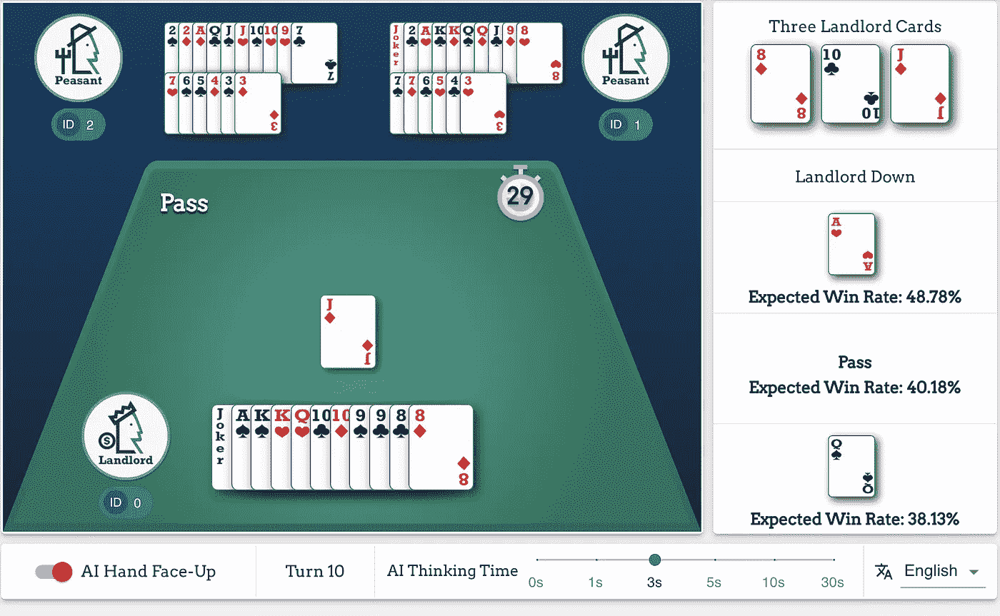
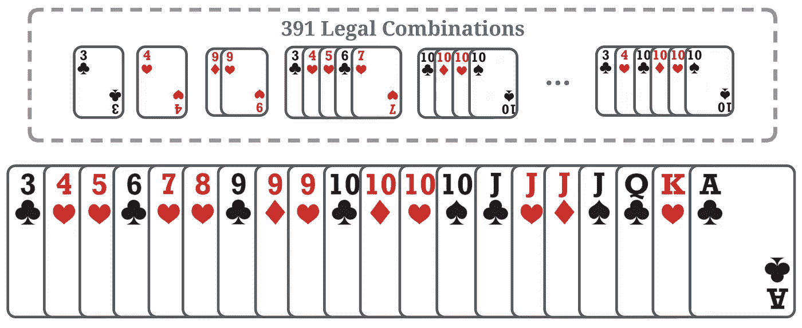
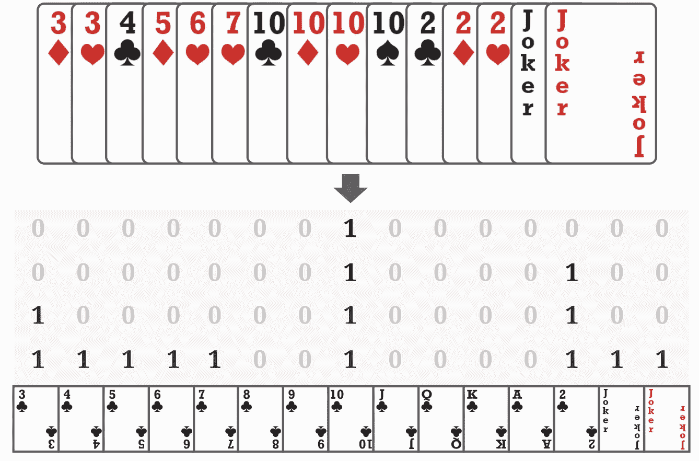
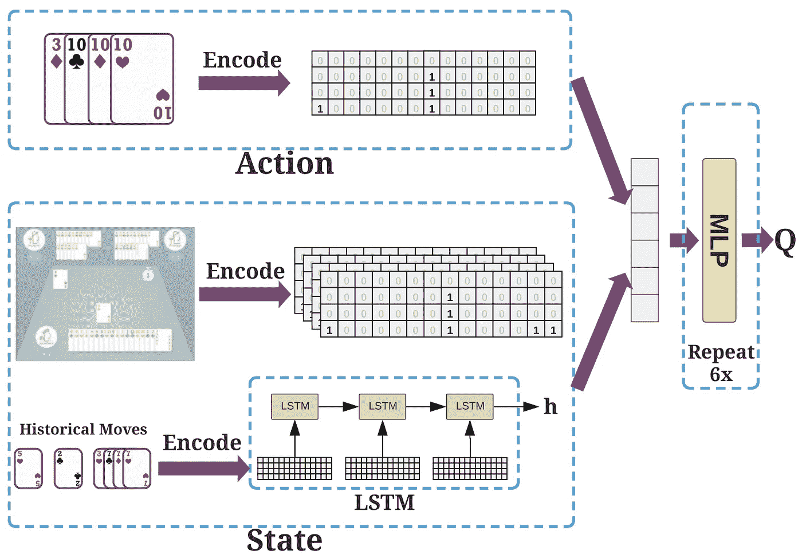

# DouZero:通过强化学习掌握斗地主

> 原文：<https://towardsdatascience.com/douzero-mastering-doudizhu-with-reinforcement-learning-864363549c6a?source=collection_archive---------43----------------------->

## 解释最受欢迎的中国扑克斗地主的强大人工智能系统

[https://douzero.org/](https://douzero.org/)。图片作者。

从 [AlphaGo](https://www.nature.com/articles/nature16961) 和 [AlphaZero](https://www.nature.com/articles/nature24270?sf123103138=1) 开始，人工智能(AI)近年来取得了令人鼓舞的进步，在围棋、象棋、德州扑克、DOTA、星际争霸等方面击败了人类顶级选手。那么，下一个挑战是什么？

In this article, I would like to introduce an [ICML paper](https://arxiv.org/abs/2106.06135) that presents a new AI System for a Chinese Poker game [DouDizhu](https://en.wikipedia.org/wiki/Dou_dizhu) (斗地主 in Chinese). DouDizhu is the most popular poker game in China with hundreds of millions of daily active players, with many tournaments held every year. It is easy to learn but difficult to master. Interestingly, DouDizhu remains to be a grand challenge for AI because of competition, collaboration, and a large number of possible moves from turn to turn.

## 斗地主是什么，为什么有挑战性？

> 这是一种脱牌游戏，玩家的目标是在其他玩家之前清空自己手中的所有牌。两个农民玩家组队对抗另一个地主玩家。如果任何一个农民玩家第一个没有牌剩下，农民就赢了。每场游戏都有一个叫牌阶段，玩家根据手中牌的强弱为地主叫牌，还有一个出牌阶段，玩家依次出牌。

简而言之，以下特性使得斗地主对 AI 来说非常具有挑战性:

1.  **缺陷信息:**与围棋或象棋不同，斗地主的棋手无法观察其他棋手的手牌。这导致了可能性的爆炸。
2.  **既竞争又合作**:两个农民玩家需要合作对抗地主玩家。大多数以前的扑克人工智能是为竞争环境(如德州扑克)或合作环境(如 Hanabi)设计的。既竞争又合作是一个公开的挑战。
3.  **大而复杂的动作空间:**由于牌的组合，有 27，472 种可能的移动。不同回合的法律行动大相径庭。现有的人工智能往往只支持非常简单和小的行动空间。

一只手及其合法组合的例子。图片由作者提供，来源:[https://arxiv.org/abs/2106.06135](https://arxiv.org/abs/2106.06135)

## 用 DouZero 从零开始掌握斗地主

尽管面临这些挑战，我还是很兴奋地向大家介绍最近的 [ICML 论文](https://arxiv.org/abs/2106.06135)和 [DouZero](https://github.com/kwai/DouZero) 项目。DouZero 首次实现了一个强大的斗地主 AI，可以通过深度强化学习从零开始训练，达到人类水平的性能。有趣的是，DouZero 背后的魔法出奇的简单却非常有效。作者还基于我们的 [RLCard 项目](https://github.com/datamllab/rlcard)开发了一个在线演示。你可以试试这里的演示。

让我们深入探讨 DouZero 背后的技术。使用的核心算法称为深度蒙特卡罗(DMC)，这是经典[蒙特卡罗(MC)方法](https://web.stanford.edu/class/psych209/Readings/SuttonBartoIPRLBook2ndEd.pdf)的深度版本，用于强化学习。MC 方法的目标是优化 Q 值 *Q(s，a)* ，其中 *s* 代表状态， *a* 代表动作。MC 方法的关键思想是通过迭代执行以下过程来优化策略:

1.  使用当前策略生成剧集。
2.  对于每一个出现在剧集中的 *s，a* ，计算并更新 *Q(s，a)* ，返回关于 *s* 、 *a* 的所有样本的平均值。
3.  对于剧集中的每个 s，用导致最大 *Q(s，a)* 的动作更新策略。

第二步的平均回报通常是通过折现的累计回报得到的。在步骤 1 中，我们可以使用ε-greedy 来平衡勘探和开发。MC 方法是最基本的强化学习算法。它们直接逼近目标值，而无需自举(即，像在 DQN 那样，使用下一个状态的值来估计当前状态的值)。

让我们来看看 DMC，它结合了 MC 和神经网络。在 MC 中， *Q(s，a)是用表格表示的*。现在，我们用 Q 网络代替 Q 表，它可以是多层神经网络。然后，在步骤 2 中，我们使用均方误差(MSE)损失来更新 Q 网络。这就产生了所谓的 DMC，也就是深度版的 MC。

虽然 MC 方法被批评为不能处理不完整的情节，并且由于高方差而被认为是低效的，但是作者发现 DMC 非常适合斗地主。一方面，斗地主是一个情节任务，因此我们不需要处理不完整的情节。另一方面，DMC 可以很容易地并行化，以有效地每秒生成许多样本，从而缓解高方差问题。DMC 的一个好处是，由于实施和运行非常简单，因此可以通过多个流程轻松高效地加速。DouZero 通过多进程和动作编码进一步增强了 DMC(我将在后面详述)，并令人惊讶地实现了非常强大的性能。

## 与 DQN 和政策梯度的比较

深度 Q 学习(DQN)和策略梯度(PG)是最流行的强化学习算法。为什么选择 DMC 而不是 DQN 或 PG？

在 PG 中，我们经常使用一个类似分类器的函数逼近器，它的输出与动作的数量成线性关系。然而，在斗地主中，有 27，472 个可能的动作，这使得输出非常大并且难以训练。在实际操作中，通常每回合的合法动作并不多，斗地主中的动作可以自然地编码成卡片矩阵。因此，更有希望的方法是将动作作为输入，这样我们就可以避免将 27，472 个动作作为输出。基于值的方法可以自然地处理这种情况，因为 Q 值自然地将状态和动作作为输入。

同样，DQN 也接近 Q 值。然而，在斗地主实施 DQN 教是很棘手的。斗地主有一大组可能的行动，其中不同的行动子集在不同的回合中是合法的。DQN 中的自举步骤依赖于最大值运算，这在计算上是昂贵的，并且在可变动作空间上实现起来是棘手的。此外，当行动空间较大时，DQN 可能会遭受高估。

相比之下，DMC 非常容易实现，并且易于通过多个流程加速。虽然 DMC 可能遭受高方差问题，但作者表明它在具有平行参与者的斗地主中工作良好。

## 在斗地主实施 DMC

动作编码。图片作者。来源:https://arxiv.org/abs/2106.06135

斗地主中的状态包括手牌，历史招式，其他玩家手牌的数量，动作是一套牌。DouZero 将每个卡组合编码成一个 15 x 4 的矩阵。这种表示非常通用，可以用来表示任何卡片。DouZero 将状态和动作编码到这样的卡片矩阵中。

神经架构。图片作者。来源:https://arxiv.org/abs/2106.06135

对于神经网络，DouZero 使用了一个神经网络，该网络通过 LSTM 网络对历史走势进行编码。然后，LSTM 的输出与其他特征连接在一起，一起馈送到六层 MLP 以生成 Q 值。在每一步，我们只需要输入国家和所有的法律行动。网络将预测所有法律行为的 Q 值。我们可以选择最大的一个。

DouZero 为斗地主中的三个位置使用了三种不同的网络，在功能上略有不同。然后，作者在一个 4-GPU 服务器上并行运行 45 个角色进行模拟。经过几天的培训，DMC 可以令人惊讶地学习非常强的政策。官方实现是[这里](https://github.com/kwai/DouZero)。我们还在 [RLCard](https://github.com/datamllab/rlcard) 项目中支持 DMC。RLCard 是卡牌游戏中强化学习的工具包，目前支持斗地主等 8 种环境，DouZero 等 4 种算法。

# 摘要

DouZero 的成功表明，经典的蒙特卡罗方法经过一些改进，可以在一个困难的领域——dou dizhu 中产生非常好的结果。Monte-Carlo 方法很容易实现，使用的超参数很少，但是它们非常强大。我希望你喜欢这本书，这种见解可以帮助你开发你的人工智能代理和解决其他问题。我将在后面的帖子中详细介绍 DMC 和 DouZero 的代码库。