# 批量下载和预处理医学图像

> 原文：<https://towardsdatascience.com/downloading-and-preprocessing-medical-images-in-bulk-520474752e27?source=collection_archive---------43----------------------->

## 用 Python 实现 DICOM 到 NumPy

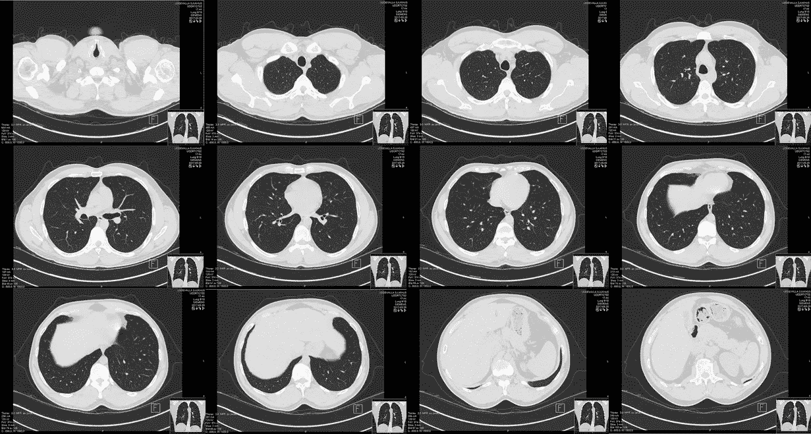

[胸部 CT 来自维基百科](https://commons.wikimedia.org/wiki/Scrollable_high-resolution_computed_tomography_images_of_a_normal_thorax)(公共领域)

如果你有兴趣为机器学习项目创建自己的医学图像数据集，这篇文章就是为你准备的。如果您使用公开的医学成像数据集，并且希望进一步了解这些数据集是如何创建的，您可能也会对这篇文章感兴趣。

在这篇文章中，你将学到:

*   DICOM 的基础知识，医疗图像在卫生系统中存储的文件格式；
*   如何使用 Python 从卫生系统存储中批量下载数万张医学图像作为 DICOMs
*   如何使用我在准备 RAD-ChestCT 数据集时开发的端到端 Python 管道清理 DICOMs 并将其转换为 NumPy 数组，该数据集包含 36，316 个胸部计算机断层扫描体，是世界上最大的体积医学成像数据集之一。

这篇文章部分基于我最近的一篇论文的附录，“基于机器学习的大规模胸部计算机断层扫描体积的多种异常预测”(发表在杂志[医学图像分析](https://www.sciencedirect.com/science/article/abs/pii/S1361841520302218)上，也可在 [arXiv](https://arxiv.org/ftp/arxiv/papers/2002/2002.04752.pdf) 上获得)。如果你觉得这篇文章对你自己的研究有帮助，请考虑[引用我们的论文](https://www.sciencedirect.com/science/article/abs/pii/S1361841520302218)。这篇帖子的代码在 GitHub 上公开了:[rachellea/CT-volume-preprocessing](https://github.com/rachellea/ct-volume-preprocessing)。

有许多不同种类的医学图像，包括投影 x 射线、计算机断层扫描(CT)、磁共振成像(MRI)和超声波。在这篇文章中，我将使用 CT 扫描作为一个运行的例子，尽管这篇文章中讨论的许多概念也适用于其他类型的医学图像。

# **选择要下载的扫描**

构建医学图像数据集的第一步是选择要下载的扫描。选择扫描的一种方法是利用放射学报告的数据库。

每次获取医学图像时，放射科医师都会撰写一份报告，描述医学图像中存在或不存在的异常，以帮助不是医学成像专家的其他医生了解该图像的哪些方面对患者护理最重要。这些书面报告储存在卫生系统数据库中。放射学报告表通常包括报告文本本身，以及三个重要的标识字段:患者的病历号(MRN)、登记号和协议描述。

病历号(MRN)在卫生系统中唯一标识患者。MRN 对于定义[训练/验证/测试分割](https://glassboxmedicine.com/2019/09/15/best-use-of-train-val-test-splits-with-tips-for-medical-data/)至关重要，在该分割中，没有患者出现在一个以上的集合中。来自同一患者的图像必须全部归入同一组，因为即使扫描相隔多年，它们也是相关的，因为它们描绘的是同一个人。

登录号唯一地标识医学成像事件。它是一个字母数字标识符，例如“AA12345”(不同于 MRN)，指定了特定患者成像的特定事件。医学成像事件的登录号用于与该事件相关联的书面报告和图像文件，这使得能够将书面报告与其对应的图像相匹配。

最后，协议描述是一个字符串，它描述了执行了哪种医学成像。协议可以被认为是获得某种医学图像的“处方”。“方案描述”是配方的标题。协议描述通常指定模态(例如，CT 对 MRI 对超声)、被成像的身体部分以及关于如何获取成像的其他细节(例如，是否使用对比)。

以下是 CT 扫描的一些协议描述示例:

*   CT 腹部骨盆对比
*   CT 胸部 wo 对比 w 3D MIPS 协议
*   CT 胸部腹部骨盆增强扫描
*   CT 腹部骨盆 W CONT
*   CT 腹部骨盆无对比
*   无对比 CT 脑
*   CT 胸部 PE 协议，包括 CT 血管造影胸部双对比
*   胸部 CT 增强扫描
*   CT 胸部
*   CT MIPS

# **按协议过滤扫描**

协议描述的一个关键部分是身体的哪一部分被成像的说明。用于成像的不同解剖位置包括仅胸部、仅腹部、仅骨盆、胸部/腹部/骨盆一起、头部、脊柱、手臂、手等等。

不同解剖区域的 CT 示例如下:

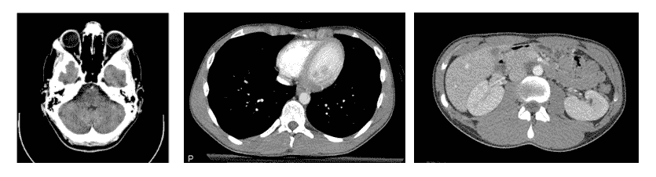

不同解剖区域的 CT 扫描示例。从左到右，图像显示了头部、胸部和腹部。图片来自维基百科(创意通用许可):[头部 CT](https://commons.wikimedia.org/wiki/File:Computed_tomography_of_human_brain_-_large.png) ，[胸部/腹部 CT](https://commons.wikimedia.org/wiki/Scrollable_computed_tomography_images_of_a_normal_abdomen_and_pelvis) 。

当构建医学成像数据集时，重要的是要考虑是否有必要组合来自不同身体区域的图像，或者仅关注一个身体区域是否最有意义。[深度病变](https://pubmed.ncbi.nlm.nih.gov/30035154/)数据集包括许多不同的身体区域，因为目标是建立模型来识别“病变”，病变被广泛定义为任何局部异常。相比之下，[模拟 CXR](https://physionet.org/content/mimic-cxr/2.0.0/) 数据集只包括胸部的图像，因为重点是明确的[胸部异常](https://glassboxmedicine.com/2019/05/11/automated-chest-x-ray-interpretation/)。一般来说，您应该有一个很好的理由将来自不同身体部位的图像组合在同一个数据集中，因为不同身体部位的未经过滤的图像将显示相互排斥的病理-例如，头部 CT 扫描永远不会显示肺炎，因为肺炎只针对肺部，而胸部 CT 扫描永远不会显示中风，因为中风只针对大脑。

胸部是医学成像数据集的一个受欢迎的身体区域，因为它包括多个主要器官(最主要的是心脏和肺)，并且可以显示各种各样的病理发现，包括肺结节、间质性肺病、胸腔积液、肺癌、感染、炎症和水肿( [Purysko 2016](https://pubmed.ncbi.nlm.nih.gov/27281255/) )。关注胸部的医学成像数据集包括[模拟 CXR](https://physionet.org/content/mimic-cxr/2.0.0/) 、 [CheXpert](https://stanfordmlgroup.github.io/competitions/chexpert/) 和 [RAD-ChestCT](https://arxiv.org/ftp/arxiv/papers/2002/2002.04752.pdf) 。

协议的第二个重要组成部分是对是否使用造影剂以及如何使用造影剂的描述。造影剂是一种不透射线的液体、糊状物或片剂，由[钡、碘或钆](https://www.radiologyinfo.org/en/pdf/safety-contrast.pdf)制成，通过吞咽、动脉注射、静脉注射或灌肠输送，以突出特定的解剖结构( [Lusic 2013](https://www.ncbi.nlm.nih.gov/pmc/articles/PMC3878741/) )。不同种类的对比看起来会不一样。在 CT 扫描中，对比度显示为亮白色。造影剂的类型、给药方法以及相对于扫描采集的时间都可以在协议描述中指定。

CT 肺部血管造影照片是一种胸部 CT，其中注射造影剂以填充肺部血管；它通常用于诊断肺栓塞，即肺部血管中的凝块。凝块看起来比周围的白色造影剂更灰，因此放射科医师更容易识别([威特拉姆 2004](https://pubmed.ncbi.nlm.nih.gov/15371604/) )。

可以通过腹部和骨盆的对比 CT 来评估阑尾炎、憩室炎和胰腺炎( [Rawson 2013](https://pubmed.ncbi.nlm.nih.gov/24010394/) )。

在其他情况下，造影是不必要的，甚至是禁忌的——例如，如果患者患有肾脏疾病，怀孕，或者之前对造影剂有过敏反应。

RAD-ChestCT 数据集仅包括在没有静脉造影的情况下获得的胸部 CT 扫描。为了选择 RAD-Chestct 数据集的访问号，我过滤了放射学报告表，只选择符合“CT 胸部 wo 对比 3d mips 协议”(第二常见协议)或“CT 胸部无对比 3d mips 协议”的小写协议描述的扫描这产生了 36，861 份 CT 报告，我可以用这些报告的登录号来下载与每份报告相关的实际 CT 图像。

# **生物医学成像数据交换标准(DICOM)**

在开始下载和处理图像的细节之前，有必要介绍一下 DICOM。

生物医学成像数据交换标准(DICOM)是医疗系统中存储医学图像的标准格式。DICOM 格式的图像被保存为带有相关元数据的像素阵列。元数据包括关于患者的信息，包括患者的姓名和生日。元数据还包括关于图像本身的信息，例如用于获取图像的设备名称和某些成像参数。虽然元数据中的几个 DICOM 属性应该总是可用的(例如，患者的姓名)，但是其他 DICOM 属性对于特定的扫描仪或机器是唯一的，或者对于特定种类的成像是唯一的，因此可能并不适用于所有的 DICOM 文件。这意味着特定 DICOM 文件中可用的确切属性集不能保证与另一个 DICOM 文件中的属性集相同。

为了创建 RAD-ChestCT 数据集，几个 DICOM 属性特别重要。下表总结了这些属性，其中包括来自 Innolitics 的 [DICOM 标准浏览器的摘录:](https://dicom.innolitics.com/ciods/cr-image/general-image/00080008)

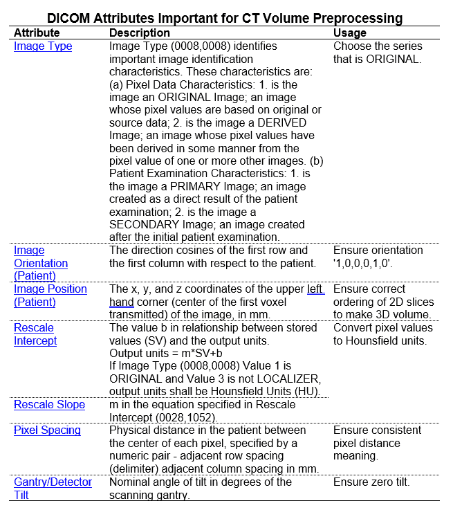

DICOM 属性有助于清理 CT 体积。图片作者。来源:Innolitics DICOM 浏览器:[图像类型](https://dicom.innolitics.com/ciods/cr-image/general-image/00080008)、[图像方向(患者)](https://dicom.innolitics.com/ciods/ct-image/image-plane/00200037)、[图像位置(患者)](https://dicom.innolitics.com/ciods/ct-image/image-plane/00200032)、[重新缩放截距](https://dicom.innolitics.com/ciods/ct-image/ct-image/00281052)、[重新缩放斜率](https://dicom.innolitics.com/ciods/ct-image/ct-image/00281053)、[像素间距](https://dicom.innolitics.com/ciods/ct-image/image-plane/00280030)、[机架/探测器倾斜](https://dicom.innolitics.com/ciods/ct-image/ct-image/00181120)。

# **下载医学图像**

可以使用卫生系统中可用的许多软件程序逐个下载医学图像。然而，单独下载对于创建大型医学成像数据集是不实际的。为了收集大量图像，需要自动化机制。

在医疗系统中，医学图像通常保存在供应商中立的档案库或 VNA 中。引用 [Wikipedia](https://en.wikipedia.org/wiki/Vendor_Neutral_Archive) “供应商中立归档(VNA)是一种医学成像技术，其中图像和文档[…]以标准格式和标准接口存储(归档)，以便其他系统可以以供应商中立的方式访问它们。”因此，VNA 基本上是医疗系统中的一个地方，其中存储了一整串 DICOM 格式的医学图像，以便整个医院系统中的各种设备可以轻松访问它们。

为了创建 RAD-ChestCT，我使用为杜克大学供应商神经档案库开发的应用程序接口(API)查询了所有 36，861 个选择的胸部 CT 扫描登录号。代码可在[这里](https://github.com/rachellea/ct-volume-preprocessing/blob/master/download_volumes.py)；请注意，出于安全原因，所需的密钥已全部取出。

因为我下载了很多 CT 扫描，下载过程需要 49 天。总体而言，下载成功率为 99%,在最初指定的 36，861 卷中获得了 36，316 卷。

基于登录号批量下载 CT 扫描的一个重要考虑因素是如何选择系列。

# **选择系列**

单个 CT 扫描事件由一个唯一的登录号指示，但是该登录号可能对应于一个以上的 CT 体积。例如，如果第一次扫描质量不足，则可以获得第二次扫描。此外，一旦扫描完成，解释扫描的放射科医师可以创建“重新格式化”，这是以不同方式显示患者身体的扫描数据的替代表示。

在 CT 扫描事件期间获得的每个单独的 CT 扫描和之后创建的每个单独的重新格式化被称为单独的“系列”

当下载数以万计的扫描时，每个扫描都有多个系列，假设可以为每个扫描手动选择“最佳和最具代表性的系列”是不切实际的。相反，需要一个自动化的过程来选择系列。

对于 RAD-ChestCT，我定义了以下自动选择系列的过程:

首先，我利用了 *ImageType* DICOM 属性，只考虑标记为原始的扫描。我排除了标记为衍生、二次或重新格式化的扫描。

接下来，对于包含多个原始系列的登录号，我选择了切片数量最多的系列。

CT 扫描是体积扫描，表示为一叠 2D 图像(“切片”)。原始 CT 系列将由未裁剪的轴向切片组成，例如:

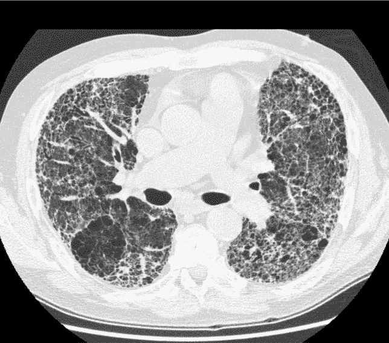

原始 CT 系列预期布局中的 CT 扫描切片。CT 切片显示广泛的肺纤维化。它来自维基百科，在知识共享许可下发布。

以下是非原装 CT 系列的几个例子:

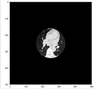

非原创的 CT 系列。在这个非原创的系列中，大部分其他解剖结构都被裁剪出来，集中在心脏上。图片作者。

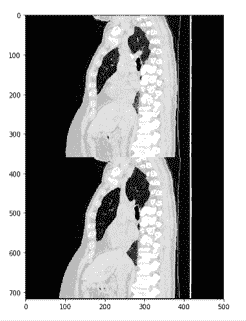

非原创的 CT 系列。在这个非原创的系列中，病人的两个矢状面视图相互叠加。图片作者。

# **代号**

批量下载原始 CT 卷、选择原始系列以及记录下载进度信息的代码在 GitHub 上公开提供，如下:[rachellea/CT-volume-preprocessing/download _ volumes . py](https://github.com/rachellea/ct-volume-preprocessing/blob/master/download_volumes.py)。

# **CT 体积预处理:DICOM 到 NumPy**

不幸的是，原始 DICOMs 不能用作任何主要机器学习框架的输入。在对 DICOMs 进行计算分析之前，必须首先对其进行处理。我开发了一个端到端的 Python 管道，可以将对应于一次 CT 扫描的不同切片的独立 DICOM 文件处理成与 PyTorch、Tensorflow 或 Keras 兼容的单个 3D NumPy 数组。

下面是所需处理步骤的快速总结，后续部分将提供更多详细信息:

*   按照正确的顺序叠放 CT 切片；
*   再次检查 CT 扫描是否处于所需的方向；
*   使用 DICOM 属性 *RescaleSlope* 和 *RescaleIntercept* 将像素值转换为 Hounsfield 单位(HU );
*   将像素值裁剪为[-1000 HU，+1000 HU]，HU 标度的实际下限和上限，分别对应于空气和骨骼的放射密度；
*   使用 SimpleITK 将每个体积重新采样为 0.8 x 0.8 x 0.8 mm，以实现所有患者之间一个像素的一致物理距离含义；
*   将像素值转换为 16 位整数，并使用无损 zip 压缩保存，以降低存储要求。

# **排序切片**

为 CT 体积的每个轴向切片保存单独的 DICOM 文件。相对于站立的人，“轴向切片”代表穿过身体的水平面(由围绕腰部的带子形成的同一平面):

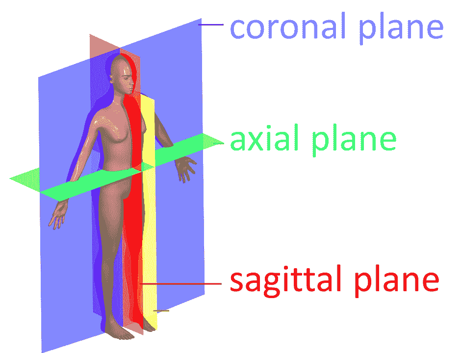

解剖平面。轴向平面显示为绿色。CT 扫描通常保存为轴向平面上的一组 2D 图像，每个 2D 图像有一个单独的 DICOM 文件。这张图片是由 David Richfield 和 Mikael Haggstrom 根据维基百科图片修改而来的，可以在知识共享许可下使用。

单独的轴向切片必须以正确的顺序堆叠，以便重建 3D 体积-这是一个令人惊讶的不简单的过程，但对于获得可用的数据来说是至关重要的。如果切片以错误的顺序放在一起，体积表示就会被破坏。

用于切片排序的最直观的 DICOM 属性称为*实例编号*。这个属性应该使用整数来指定切片的顺序。不幸的是，该属性并不可靠，并且被一些 CT 扫描仪错误地填充，因此*实例编号*不应该用于切片排序。

对切片进行排序的最可靠方法是利用 *ImageOrientationPatient* 和 *ImagePositionPatient* 属性。

在 CT 体积内有 12 种可能的患者方位:

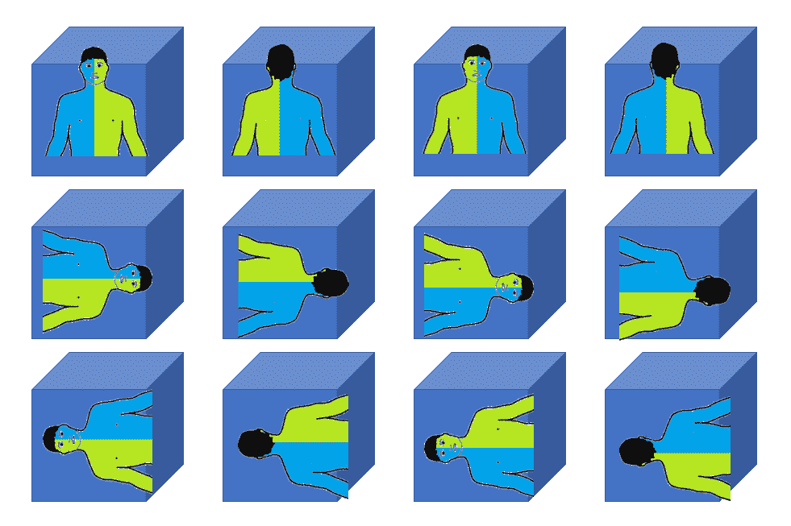

一个人在一个空间中的 12 种可能的方位。方向很重要，因为人类的内部是不对称的(例如，心脏在左边，胃在左边，肝脏在右边)。图片作者。人体轮廓修改自[维基百科人体方案](https://commons.wikimedia.org/wiki/File:Human_body_schemes.png)(知识共享许可)。

在 DICOM 文件中，属性*ImageOrientationPatient*指定了患者的方位，并且需要确定哪个方向是“z 方向”(轴向切片堆叠所沿的头尾方向)。通常情况下，患者在胸部 CT 中呈现“1，0，0，0，1，0”方向，但该方向仍然很重要，因为它有时会发生变化。

给定患者方位，可以确定存储在*图像位置患者*属性中的哪个值是 z 位置。z 位置反映了切片在空间中头尾(从头到脚)位置的物理距离测量。通过根据切片的 z 位置对切片进行排序，可以获得正确的切片排序并重建完整的 3D 体积。

以下是一次 CT 扫描切片的排序 z 位置的摘录(排序 z 位置的完整列表要长得多，因为有 512 个切片):

```
[-16.0, -16.6, -17.2, -17.8, -18.4, -19.0, -19.6, -20.2, -20.8, -21.4, -22.0, -22.6, -23.2, -23.8, -24.4, -25.0, -25.6, -26.2, -26.8, -27.4, -28.0, -28.6, -29.2, -29.8, -30.4, -31.0, -31.6, -32.2, -32.8, -33.4, -34.0, -34.6, -35.2, -35.8, -36.4, -37.0, -37.6, -38.2, -38.8, -39.4, -40.0, -40.6, -41.2, -41.8, ..., -318.4, -319.0, -319.6, -320.2, -320.8, -321.4, -322.0, -322.6, -323.2, -323.8, -324.4, -325.0, -325.6, -326.2]
```

在我的[管道](https://github.com/rachellea/ct-volume-preprocessing)中，我利用来自 [Innolitics](https://github.com/innolitics/dicom-numpy) 的 [combine_slices.py](https://github.com/rachellea/ct-volume-preprocessing/blob/master/dicom_numpy/combine_slices.py) 来执行基于 DICOM 属性 *ImageOrientationPatient* 和 *ImagePositionPatient 的切片排序步骤。*

# **将像素值重新调整为 Hounsfield 单位**

CT 扫描仪的测量值用 Hounsfield 单位表示。

Hounsfield 单位表示材料的放射密度，范围从大约-1000 HU(空气)到+1000 HU(骨)，水在中间，为 0 HU。在某些情况下，对于非常致密的骨骼(如耳朵中的耳蜗)，HU 可以达到大约[+2000](https://radiopaedia.org/articles/hounsfield-unit?lang=us)，但大多数组织都在-600 到+100 HU 的范围内( [Lamba 2014](https://pubmed.ncbi.nlm.nih.gov/25341139/) )。

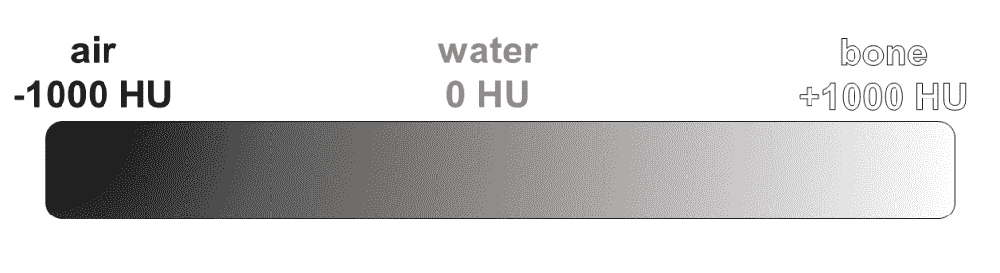

汉斯菲尔德量表。图片作者。

DICOMs 中的原始像素值经过了 Hounsfield 单位的线性转换，以实现高效的磁盘存储。这个转换必须反向进行，以再次获得 Hounsfield 单位(HU)的像素值。DICOM 标准包括属性 *RescaleSlope* 和 *RescaleIntercept* ，它们是公式 y = mx + b 中的 *m* 和 *b* ，需要将存储在 DICOM 像素阵列中的原始像素值 x 线性转换为 Hounsfield 单位 y。来自 DICOM 的所有原始像素值必须使用 *RescaleSlope* 和*rescale intercept*重新调整为 HU 这确保了像素的特定数值在所有扫描中指示相同的放射密度。注意 *RescaleSlope* 通常等于 1，而 *RescaleIntercept* 通常等于-1024，但仔细检查总是一个好主意。**

转换为 HU 后，像素值可被裁剪为[-1000 HU，+1000 HU]，这代表 HU 标度的实际下限和上限，分别对应于空气和骨骼的放射密度。

# **重采样**

除了通过转换为 Hounsfield 单位来确保像素值在整个数据集内具有一致的放射密度含义之外，确保每个像素在整个数据集内代表一致的体积也是很重要的。DICOM 标题包括属性*像素间距*，该属性包括以毫米为单位的 x 测量值和 y 测量值(x 间距和 y 间距)。z-间距(颅尾间距)可以通过减去*图像位置患者*中报告的相邻切片的 z-位置值来推断。综上所述，(x，y，z)间距表示单个体素所代表的以立方毫米为单位的物理体积(一个体素是一个 3D 像素)。

不幸的是，这些物理距离根据扫描参数而变化，使得每个体素的物理尺寸对于不同的患者是不同的。此外，对于单次扫描,( x，y)间距通常不同于 z 间距:

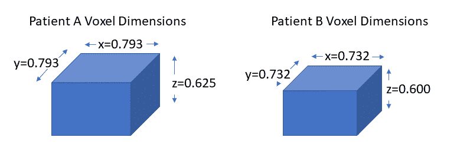

CT 扫描中(x，y，z)间距变化的一个例子。图片作者。

为了实现数据集中所有像素的一致物理距离含义，RAD-ChestCT 数据集中的所有 CT 都使用 Python 包简单 ITK 重新采样为 0.8 x 0.8 x 0.8 mm。该重采样步骤还具有适度减小每个卷的大小的优点，这降低了对该数据集训练的机器学习模型的磁盘存储需求和内存需求。

# **使用不规则 Z 间距进行重采样**

对于单次 CT 扫描，计算每对相邻轴向切片之间的 z 间距值。因此，对于具有数百个切片的典型 CT 扫描，存在数百个 z 间距不规则的机会。为创建 RAD-ChestCT 数据集而下载的全部扫描中，大约有 4%的扫描在其任何切片之间至少有一个不规则 z 间距的实例。由于缺少切片或扫描采集过程中的其他异常情况，可能会出现不规则的 z 间距。

在执行简单的 ITK 重采样步骤时，小心处理这些扫描非常重要。必须为 SimpleITK 提供输入的(x，y，z)间距和输出的所需(x，y，z)间距。如果有多个 z 间距值可用，则整个扫描的 z 间距模式是 z 间距参数重采样函数的正确输入。使用 z-spacing 模式可防止扭曲，如果改为提供最大或最小 z-spacing 值，则会发生扭曲:

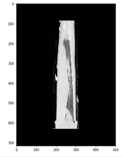

使用 SimpleITK 配置重采样时，选择最大 z 间距值而不是模式导致的扭曲示例。


使用 SimpleITK 配置重采样时，选择最小 z 间距值而不是模式导致的扭曲示例。

# **健全性检查**

对于任何涉及多个步骤的数据准备管道，执行健全性检查总是好的。在 RAD-ChestCT 数据集的创建中执行的一个健全性检查是在轴向、冠状和矢状视图上对多个完整的 CT 体积进行手动检查，以确保所有切片都处于正确的顺序，没有引入重采样伪影，并且灰度像素值对于不同器官来说似乎是合理的。

# **CT 体积的有效存储**

简单的 ITK 重采样步骤将像素值转换为 32 位浮点数。在 RAD-ChestCT 的最终数组中，像素值存储为 16 位整数。DICOMs 中的 Hounsfield 单位都是整数，可以用 12 位表示，但 numpy 中没有 12 位表示，所以选择了 16 位。最终的 3D numpy 数组以无损 zip 压缩保存，以进一步节省存储空间。(我还发现，在训练机器学习模型时，从磁盘上读取压缩文件并解压缩，比从磁盘上读取大得多的未压缩文件更快。)对于 RAD-ChestCT，原始未处理的 DICOMs 需要 9.2 太字节的存储空间。最终压缩清理后的数组需要 2.8。

# **代号**

在 GitHub 的[Rachel lea/CT-volume-preprocessing/preprocessing _ volumes . py](https://github.com/rachellea/ct-volume-preprocessing/blob/master/preprocess_volumes.py)上可以公开获得用于批量处理 CT 体积的所有前述步骤的 Python 管道。

# **总结**

*   根据登记号，可以批量下载数以千计的医学图像。
*   医学图像需要许多仔细的预处理步骤才能从 DICOM 转换成适合下游机器学习任务的格式。

*原载于 2021 年 2 月 16 日 http://glassboxmedicine.com**的* [*。*](https://glassboxmedicine.com/2021/02/16/downloading-and-preprocessing-medical-images-in-bulk-dicom-to-numpy-with-python/)