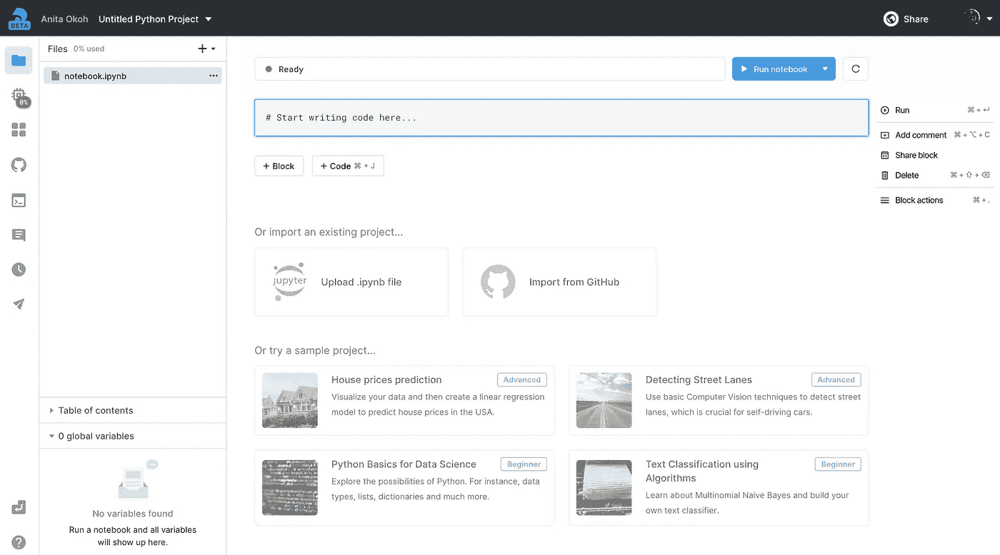
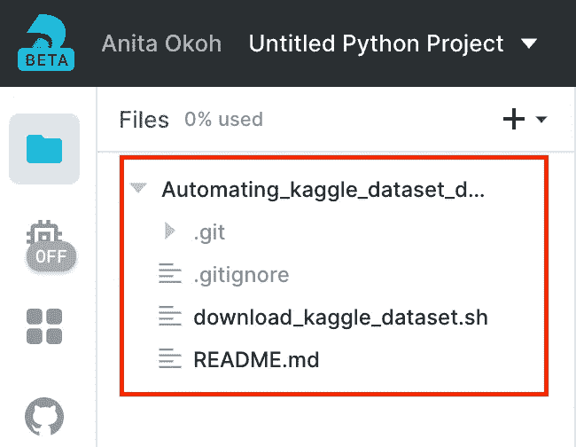
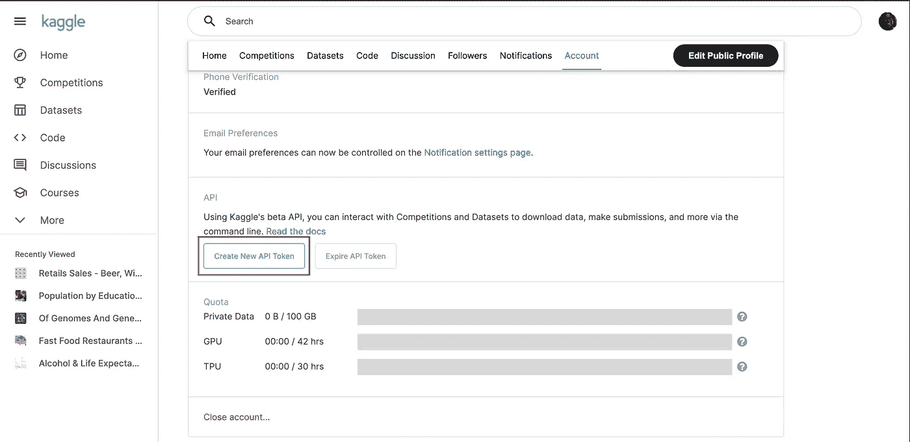
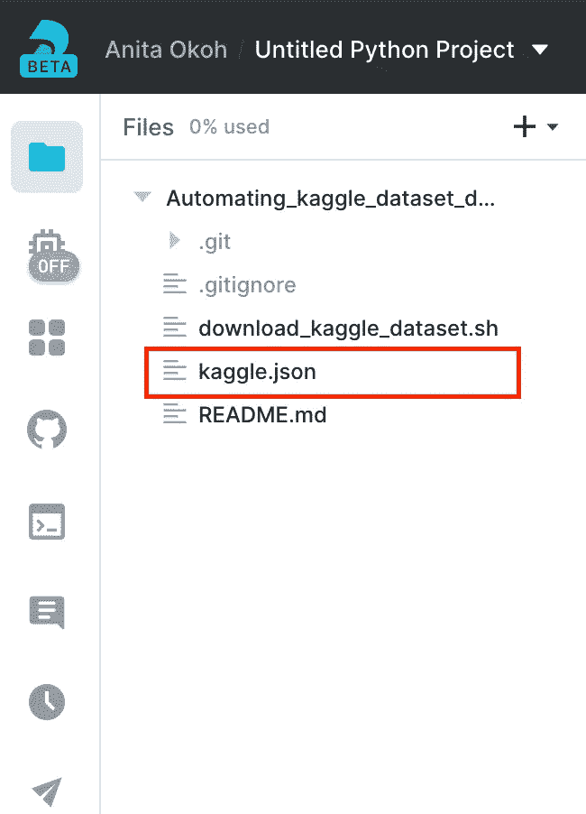

# 将 Kaggle 数据集下载到 Deepnote

> 原文：<https://towardsdatascience.com/downloading-kaggle-dataset-to-deepnote-edc938df1b0?source=collection_archive---------33----------------------->

## 我如何使用自己创建的 bash 脚本来实现自动化


来自 [Unsplash](https://unsplash.com/@zanardi)

如果你像我一样，你通过创建宠物项目来学习。[Kaggle.com](https://www.kaggle.com/)是一个优秀的 pet 项目数据来源(以及其他)。

我还使用 deep not e 作为工作空间来构建我喜欢的项目。同样，这是因为它拥有我在一个环境中想要的一切，比如文件目录，轻松访问 GitHub，一个终端，无缝删除和创建 python 环境的能力。另外，所有的魔法和实验都发生在我的本地系统之外。

如果你想抱怨一些在 Deepnote 上不工作的事情，他们在每个新的项目环境中都有聊天支持。

Gif 来自 Giphy.com

因为我经常创建宠物项目和使用 Kaggle 数据集，我需要自动化至少 80%的下载过程，以减少摩擦和节省时间。

我创建了一个 bash 脚本来完成这个任务。这是它看起来的样子

来自作者的代码

## 它是做什么的？

*   第一段代码从当前工作目录切换到直接父目录，在 Deepnote: `work`目录中切换到`root`目录
*   设置 Kaggle CLI 包括`pip`安装 Kaggle 库，创建一个名为`.kaggle` *(命名是固定的，应该位于根目录下)*的目录，将你的 Kaggle `API Token`移动到创建的目录下。
*   您将需要 Kaggle 数据集的 **API 来下载首选数据集。第**行第 14** 行提示请求该 API。**第 15 -16 行**读取 API 输入并运行。**
*   扩展名为`.zip`的 Kaggle 数据集 API 返回文件。**第 20 行**解压该文件，并将输出移动到`work`目录。
*   剩下的代码集中在清理环境上，即卸载`kaggle`库，将`kaggle.json`文件移回原来的存储库文件夹等等。

*注意，这个脚本是专门为 Deepnote 项目环境构建的。因此，您应该熟悉 Deepnote 项目环境中的目录，如* `*work*` *目录。*

## 如何运行脚本

在运行脚本之前，请确保以下事项。

*   您已经将这个存储库克隆或者分支[到您的远程存储库。**要利用和运行 bash 脚本，脚本文件应该在您的远程 Github repo 中。**](https://github.com/anitaokoh/Automating_kaggle_dataset_download)
*   您拥有一个 Deepnote 帐户，并创建了一个新的项目工作环境。一个新的项目环境看起来像这样。



来自作者的截图

如果你还没有一个 Deepnote 帐户，你可以在这里注册。

*   您已经将 bash 脚本存储库链接到您的 Deepnote 项目环境。**这里是**[](https://docs.deepnote.com/integrations/github)****文档，用于将存储库链接到您的项目。**一旦它被链接，您会注意到存储库文件夹如下所示。**

****

**作者截图**

*   **您有一个 Kaggle API 令牌。**你可以在你的 Kaggle 个人资料中找到并下载这个文件，如下图**。**

****

**来自作者的截图**

*   **API 令牌将被下载到一个名为`kaggle.json`的文件中。**上传文件并将其移动到 Deepnote 项目环境中的存储库文件夹中。** [这里的](https://docs.deepnote.com/importing-and-exporing/importing-data-to-deepnote)是如何在你的项目环境中上传一个文件。这是它应该看起来像什么的一个例子**

****

**来自作者的截图**

***只有在将存储库链接到您的项目环境之后，才上传 ka ggle . JSON***

*   **您已经复制了想要下载的数据集的 API 命令。当您运行脚本时，您将需要它。**您可以在选择**的 Kaggle 数据集页面的右侧找到该命令。**

****

**来自作者的截图**

**现在你已经设置好了，…**

*   **前往终端图标，并创建一个新的终端。[这里的](https://docs.deepnote.com/features/terminal)是一个关于如何的文档。**
*   **在终端的当前工作目录下，运行下面的命令。**

```
sh Automating_kaggle_dataset_download/download_kaggle_dataset.sh
```

****就这些，真的。说真的。****

**这是这个过程的视频演示**

**作者录音**

**如果返回到文件图标，您会看到数据集文件和存储库文件夹。**

**您可以通过运行以下命令删除存储库文件夹**

```
rm -r Automating_kaggle_dataset_download/
```

***请注意，Deepnote GitHub 集成一次只链接一个 repo，因此如果您想要将另一个重新定位链接到您的项目工作区，您需要通过删除粘贴的链接来取消前一个重新定位的链接。***

> ****使用 Deepnote 时，这种方法将节省我下载 Kaggle 数据集的时间。虽然它不是 100%自动化的，因为每次您想要使用脚本时都需要在运行它之前上传 kaggle.json，但它仍然胜过每次您在 Deepnote 或本地新的虚拟环境中创建新的项目环境时都必须手动执行** `**pip install kaggle**` **和其他设置程序。****

**这也是一个简单的脚本创建和简单的任何人都可以适应/改善如果需要。**

## **参考**

*   **[在 Windows 上使用 Jupyter 笔记本访问 Kaggle.com API](https://medium.com/@jeff.daniel77/accessing-the-kaggle-com-api-with-jupyter-notebook-on-windows-d6f330bc6953)**