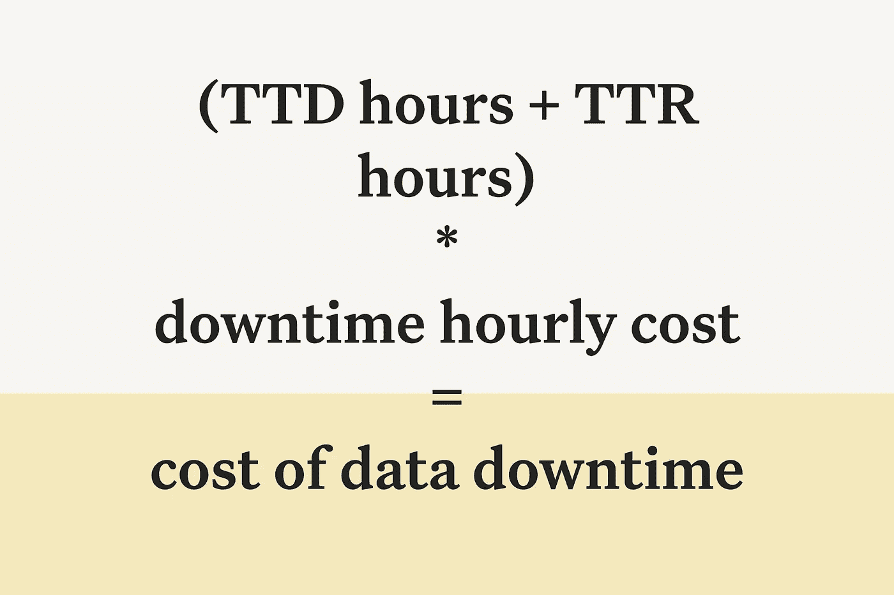

# 衡量数据质量投资回报率的正确方法

> 原文：<https://towardsdatascience.com/downtime-is-money-calculating-the-roi-on-data-quality-ef9def465ed5?source=collection_archive---------16----------------------->

## 引入一个更好的指标来计算贵公司坏数据的成本

图片由巴尔·摩西提供。

*引用一位朋友的话，“构建您的数据堆栈而不考虑* [*数据质量*](https://www.montecarlodata.com/the-new-rules-of-data-quality/) *，就像买了一辆法拉利却放在车库里。”*

*在这篇文章中，特邀专栏作家* [*弗朗西斯科·阿尔贝里尼*](https://www.linkedin.com/in/falberini/) *、产品经理* [*蒙特卡洛*](http://www.montecarlodata.com) *，介绍了一种更好的衡量公司不良数据成本的方法。*

上周，我与 Lina 进行了一次电话会谈，她是我们一家大客户的数据产品经理，负责监管他们的数据质量项目。

她的团队负责维护 1000 条数据管道，这些管道填充了公司许多最关键的业务表。可靠和值得信赖的数据是产品成功的基础，但 Lina 一直在努力寻找一种清晰的方法来量化她所拥有的管道的重要性和范围。

> “我们都知道可靠的数据对业务很重要，”她说。“但我没有一个很好的方法来衡量它的投资回报率，并据此证明对我的团队的投资是合理的。”

她没有获得保持公司管道运行所需的支持(如果管道无法运行)，而是发现自己一天 24 小时都在亲自维护管道。

一次又一次，预算和资源将被分配到更华丽、更专注于功能的数据工程工作，当季度规划到来时，她的精干团队陷入困境。

Lina 的经历非常恰当地传达了许多数据团队面临的一场斗争:证明和衡量数据质量计划的 ROI。

与 Lina 和其他许多完全类似的人的对话，引导我们寻找可以帮助团队更好地传达数据可靠性对他们公司的价值的测量框架。

我们发现以下指标(借用自 DevOps world 的)提供了一个良好的开端:**检测时间**和**解决时间**。

# 检测时间(TTD)

检测时间是指您的数据工程团队识别数据质量问题所需的时间，无论是新鲜度异常、模型运行失败，还是导致整个管道陷入混乱的模式更改。

对于许多数据团队来说，TTD 通常以几天到几周，有时甚至几个月来衡量，因为主要的检测手段是等待下游数据消费者传达数据“看起来不合适”

这几周至几个月的数据停机时间对企业来说代价极其高昂，原因有二:

1.  经过的时间越长，通过重新处理或回填可能不再可用的源数据来恢复数据就越困难。
2.  所有的商业决策、营销活动、产品决策等。使用不正确的数据做出的决策需要重新验证，甚至更糟，需要重新传达给利益相关者。

当然，我们都同意将 TTD 减少到几分钟听起来很棒，但是要达到这一点可能需要大量的工程工作，这抵消了努力的投资回报。

在开始解决问题之前，计算你的基线 TTD 是很重要的。要做到这一点，您可以查看您的团队最近处理的 3-4 起数据事件，并粗略计算检测它们所需的时间。在此基础上，你可以设定一个目标，并以此向领导层传达你需要更多资源的原因。

降低 TTD 的工具包:

*   **机器学习驱动的** [**异常检测**](/anomaly-detection-for-dummies-15f148e559c1) **:** 在投入生产之前测试您的数据是 P0，但是对于跟踪那些未知的未知，实现自动化异常检测和自定义规则是有帮助的
*   **相关事件源和通知**。在您的数据平台和 PagerDuty、Slack 或您使用的任何其他事件管理解决方案之间集成一个通信层(可能是一个 API)对于[进行根本原因分析](https://www.montecarlodata.com/the-data-engineers-guide-to-root-cause-analysis/)、[设置 SLA/SLIs](https://www.montecarlodata.com/how-to-make-your-data-pipelines-more-reliable-with-slas/)以及在数据停机发生时对其进行分类至关重要。

# 解决时间(TTR)

接下来，数据工程团队应该测量解决时间(TTR)，该指标旨在回答以下问题:一旦收到警报，您解决数据事件的速度有多快？

TTR 指标也以小时、分钟或天为单位，可让您了解数据问题的严重性，并跟踪解决问题所需的时间。当转换成美元时(即，由于 TTR 而花费/节省了多少钱)，向您的利益相关者传达这些数据的影响会变得容易得多。

降低 TTR 的工具包:

*   [**统计根本原因分析**](https://www.montecarlodata.com/the-data-engineers-guide-to-root-cause-analysis/) :正如我们在上一篇文章中所讨论的，根本原因分析是站点可靠性工程团队在确定应用程序为什么以及如何在生产中中断时的一种常见做法。同样，数据团队可以利用统计根本原因分析和其他关于数据的智能见解来了解这些问题最初为什么会出现。
*   **端到端沿袭:**在数据生命周期的每个阶段，健壮的沿袭使团队能够跟踪从 A(摄取)到 Z(分析)的数据流，将转换、建模和其他步骤合并到流程中，这对于用统计 RCA 方法补充通常目光狭隘的见解(没有双关语)是至关重要的。用于元数据和谱系收集的 OpenLineage 标准是一个很好的起点。
*   [**数据发现**](https://www.montecarlodata.com/data-discovery-the-future-of-data-catalogs-for-data-lakes/) **了解数据访问模式:**虽然许多数据目录都有一个以 UI 为中心的工作流，但数据工程师需要通过数据发现灵活地以编程方式与目录进行交互。这种解决方案也可以用来理解数据、谁使用数据以及如何使用数据之间的关系。

# 把所有的放在一起

您可以通过了解数据不可用时的成本来衡量数据的财务影响。

等式可能是这样的:

图片由巴尔·摩西提供。

停机时间每小时成本是一个通用指标，代表每停机时间花费的**工程时间**和**数据停机时间对数据消费者和业务决策的影响**。

**花费的工程时间**可以作为停工时间的一个因素来计算。例如，我们可以估计 1 名数据工程师花费 1/4 的停机时间来监控和调查问题，这相当于每个停机时间 25 美元(平均 100 美元/小时的工资+数据工程师的福利)。

**数据停机的影响**根据停机时间对您业务的潜在影响，成本会有很大差异。例如，如果您依靠数据向华尔街报告收益，导致误报数据的停机时间是灾难性的，可能会造成每小时 1000 美元的停机成本。此外，您还可以增加分析团队的停机成本。例如，如果您有 10 名分析师，他们在停机事件期间闲置的成本是巨大的(平均 75 美元/小时工资* 10 = 750 美元/小时)。假设不是所有的分析师都会受到停机时间的影响，我们可以保守地将其降低 75%至 175 美元/小时。

在这种情况下，我们可以估计一小时的停机时间会给我们的业务造成 500 美元/小时的损失。

假设您每月有 **~100 小时的停机时间**，那么您的业务成本很容易超过 **$600，000/年**(100 小时/月* $ 500/小时* 12 个月)。

同样重要的是要记住，这个等式甚至没有考虑机会成本。查看我们的文章和 Poshmark 的首席数据官 Barkha Saxena 了解更多可能的情况。

当您考虑数据中断的频率时，这可不是一笔小数目。

> 通过计算基线 TTD 和 TTR，就可以更容易地准确传达您期望对业务产生的影响。如果没有这个基线，就很难从权力那里获得运营上的支持，从而壮大您的团队，提升您的技术堆栈，并扩展您梦想中的数据质量计划。

想象一下能够与您的首席技术官分享这一点:

“增加一名数据工程师并投资一个 [**数据观察平台**](https://www.montecarlodata.com/data-observability-the-next-frontier-of-data-engineering/) 可以帮助我们将平均每月停机时间从 350 小时减少到 14 小时，这相当于 3.4 倍的投资回报，即每年 150 万美元。”

正如他们所说:(下)时间真的是金钱。

***有没有更好的方法来衡量不良数据的成本？我们很想了解更多！伸出手去*** [***藩***](https://www.linkedin.com/in/falberini/) ***和*** [***其余的蒙特卡洛团队***](https://marketing417822.typeform.com/to/ANOjO2R0) ***。我们洗耳恭听。***

***请务必在 4 月 28 日星期三报名参加我们的*** [***数据可观测性演示***](https://bit.ly/montecarlodemo) ***！***