# 机器医生:它能诊断新冠肺炎吗？

> 原文：<https://towardsdatascience.com/dr-machine-can-it-diagnose-covid-19-8ecbbe8ed2cb?source=collection_archive---------31----------------------->

## 使用深度学习方法根据肺部扫描进行诊断

这篇文章是为 MIS 285N:认知计算而写的。我们的团队由 Ella Akl、Saranya Nagarajan、Amulya Saridey、、Han 和 Deepti Rao 组成，他们一起撰写了这篇文章！


由[马克斯·本德](https://unsplash.com/@maxwbender?utm_source=unsplash&utm_medium=referral&utm_content=creditCopyText)在 [Unsplash](/?utm_source=unsplash&utm_medium=referral&utm_content=creditCopyText) 上拍摄的照片

***来自《走向数据科学》编辑的提示:*** *虽然我们允许独立作者根据我们的* [*规则和指南*](/questions-96667b06af5) *发表文章，但我们并不认可每个作者的贡献。你不应该在没有寻求专业建议的情况下依赖一个作者的作品。详见我们的* [*读者术语*](/readers-terms-b5d780a700a4) *。*

# **简介**

在过去的一年里，新冠肺炎肆虐全球，改变了人们的生活方式。几乎每晚都可以在新闻中看到当局告诉人们戴上口罩，保持社交距离，以避免感染病毒，这可能导致人们最终在医院使用呼吸机。这给全球带来了恐惧，这是理所当然的。但是如果一个人被诊断出感染了这种病毒，他的身体会怎么样呢？

新冠肺炎是一种通过空气传播的呼吸道传染病。最常见和最受影响的器官是肺。健康肺部的正常功能是从空气中吸收氧气，并从细胞中释放二氧化碳，而新冠肺炎等感染会中断这一过程，使呼吸困难。

# **数据集背景**

作为数据科学领域的学生，我们认为我们正在学习的技能的一个良好用途是探索目前对我们周围世界最重要的影响之一，并看看机器学习模型是否可以根据肺部扫描识别新冠肺炎。我们在 Kaggle 上找到了一个图像数据集，它由健康肺和肺炎(包括 covid 感染的)肺的数千次肺部扫描组成，我们认为它非常适合这个主题。

这一由 5933 张图像组成的集合包括显示感染了新冠肺炎、ARDS、链球菌和 SARS 的肺部的胸部 x 光片，以及大量用于比较的健康肺部扫描。虽然我们从 kaggle.com 获得了这个数据集，但它最初是来自蒙特利尔大学的研究人员。

这些数据包括肺部扫描和一个附加的 csv，该 CSV 包含扫描的元数据，这些元数据将图像标记为正常或感染，如果感染是已知的，还会标记感染是什么。该数据还包括一个“未知”栏，用于标记未知的扫描。这被合并到测试集中，以查看是否可以基于训练的模型在这些扫描上做出诊断。

很高兴你问了这个问题:新冠肺炎在人体中做什么？

# **数据集导入&设置**

[Kaggle 新冠肺炎数据集](https://www.kaggle.com/praveengovi/coronahack-chest-xraydataset?select=Chest_xray_Corona_Metadata.csv)包括来自健康和患病个体的超过 5300 张训练图像和 600 张肺部扫描测试图像。

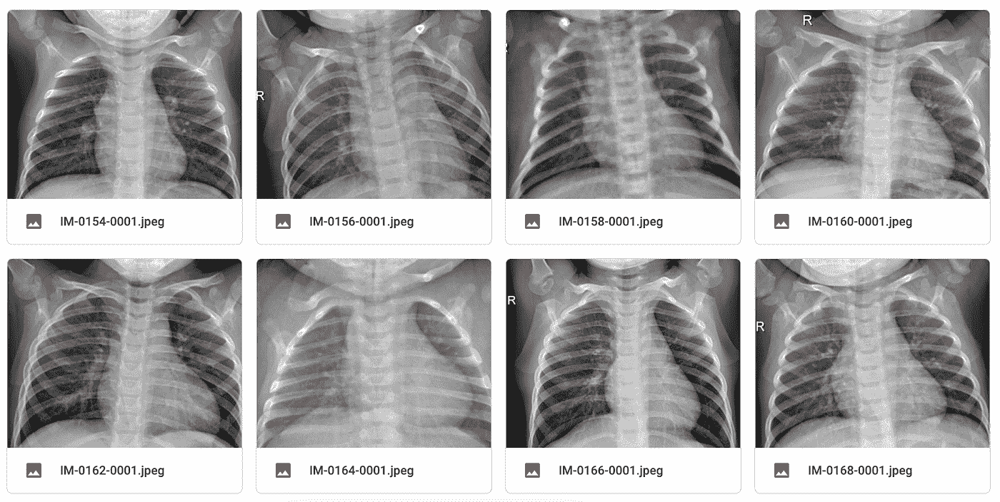

作者图片

该数据集还包含两个 CSV 文件，其中包含有关图像的元数据，如标签(正常或肺炎)、病毒类型等。

元数据. csv:

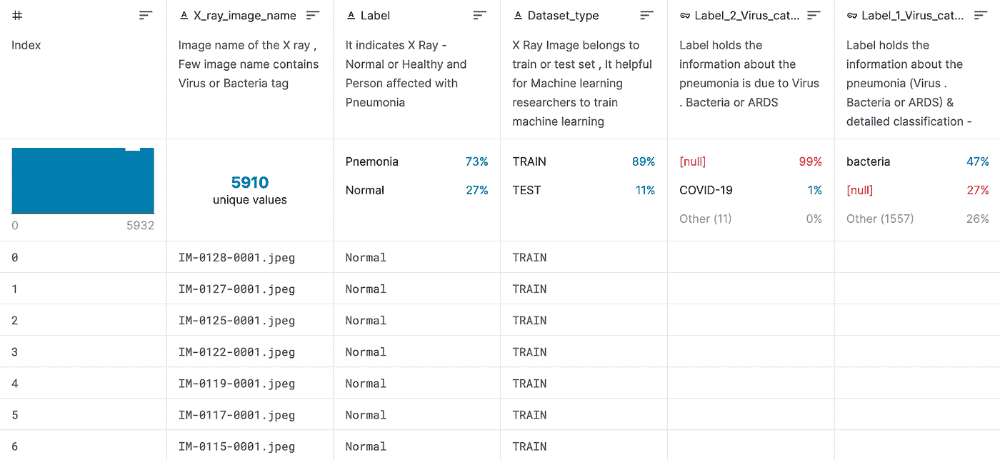

Kaggle 数据集的摘要图像

摘要. csv:

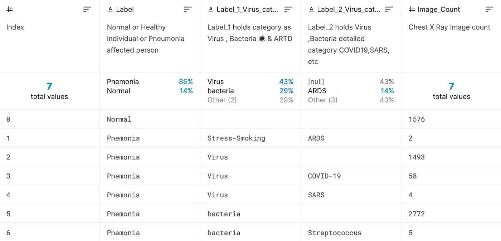

Kaggle 数据集的摘要图像

要开始使用数据集，我们必须首先将文件导入笔记本。我们的团队使用 Google Colab 编写代码，在这种情况下，通过 Google Drive 访问我们的数据集文件非常容易和方便。我们只需将图像和 CSV 文件上传到 Google Drive，然后使用以下几行代码将我们的驱动器安装到 Colab:

```
from google.colab import drivedrive.mount(‘/content/gdrive’)drive.mount(“/content/gdrive”, force_remount=True)
```

接下来，我们可以创建指定数据位置的路径。

```
path_metadata = ‘/content/gdrive/My Drive/Dataset/metadata.csv’path_summary = ‘/content/gdrive/My Drive/Dataset/summary.csv’path_data_train = ‘/content/gdrive/My Drive/Dataset/train’path_data_test = ‘/content/gdrive/My Drive/Dataset/test’
```

首先，我们使用文件路径将两个 CSV 文件(metadata.csv 和 summary.csv)导入到 Pandas DataFrames 中。

```
import pandas as pddf_metadata = pd.read_csv(path_metadata)df_summary = pd.read_csv(path_summary)
```

如果我们看一下我们刚刚创建的 df_metadata 数据帧，我们可以看到图像名称与一个标签相关联，该标签描述图像是正常的肺还是患有肺炎的肺。此外，还有另外两列:dataset_type，表示映像是训练集还是测试集的一部分；以及 virus_type，包括新冠肺炎、SARS 等。

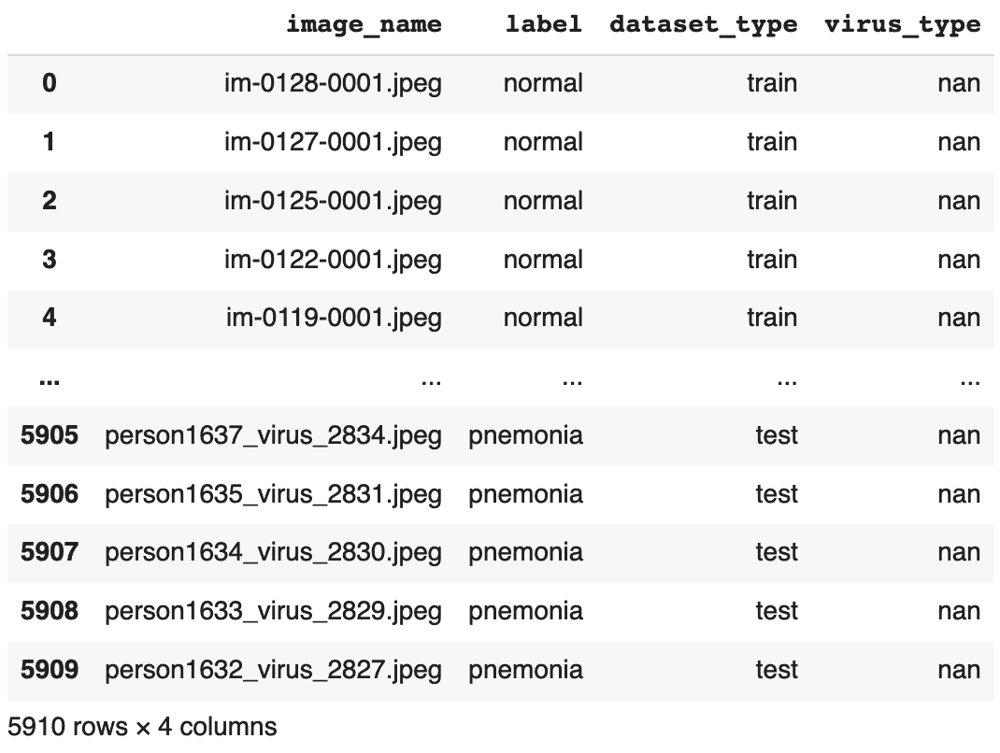

作者图片

在开始导入图像之前，让我们根据 dataset_type 列快速将数据帧分为训练和测试:

```
train_data = df[df[‘dataset_type’]==’train’]test_data = df[df[‘dataset_type’]==’test’]
```

由于我们的重点是检测肺部扫描中的新冠肺炎，我们还想使用 virus_type 列过滤掉任何非新冠肺炎图像。

```
final_train_data = train_data[(train_data[‘label’] == ‘normal’) |((train_data[‘label’] == ‘pneumonia’) &(train_data[‘virus_type’] == ‘covid-19’))]
```

厉害！现在我们可以开始阅读我们的图像。让我们从定义一个将图像转换成像素值数组的函数开始。

```
def read_img(filename, size, path):img = image.load_img(os.path.join(path, filename), target_size=size)#convert image to arrayimg = image.img_to_array(img) / 255return img
```

我们可以在一个循环中调用这个函数来导入我们所有的图像，就这样，我们拥有了开始数据清理和探索所需的所有数据！

# **探索性数据分析&可视化**

现在我们已经有了所有的数据，让我们以可视化的形式进行一些数据探索吧！使用 seaborn，我们可以使用元数据 CSV 文件中的数据创建病毒类型和病毒标签的数值计数图。

首先，进口 seaborn。

```
import seaborn as sns
```

接下来，为病毒类型和标签类型创建计数图。这里有两个可视化显示，我们的数据集中有什么类型的病毒。第一个可视化显示了病毒类型，第二个可视化显示了除了 NaN 之外还存在哪些感染。

```
sns.countplot(x=’virus_type’, data=metadata)
```

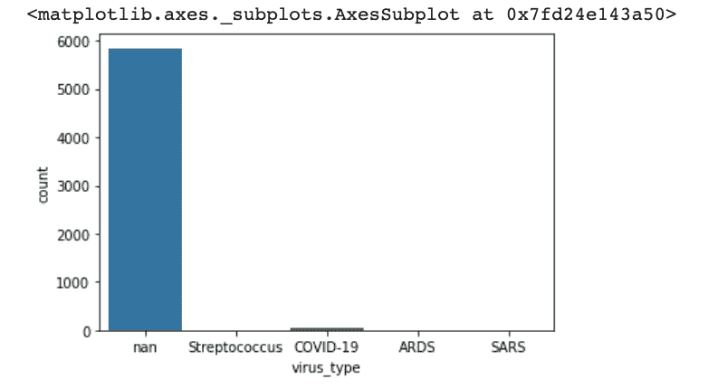

作者图片

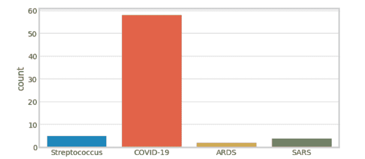

作者图片

正如我们从上面的可视化中看到的，与其他疾病相比，我们的数据集具有更多正常肺或肺炎肺的图像，因为我们的数据集中的 NaN 值代表的图像不是链球菌、新冠肺炎、ARDS 或 SARS。这是进一步巩固我们的下一个可视化标签。

```
sns.countplot(x=’label’, data=metadata)
```

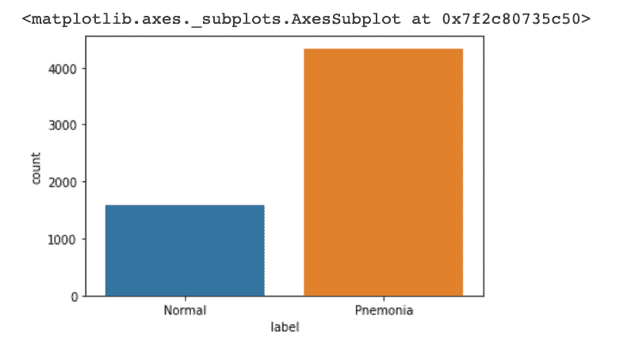

作者图片

我们可以看到数据集主要是肺炎肺，还有一些标记为正常的。这也指向我们有一个不平衡的数据集。

接下来，让我们处理图像！首先，我们需要从 tensorflow.keras、cv2、imageio 导入 os、matplotlib、image，并从 PIL 导入 Image。

```
import osimport matplotlib.pyplot as pltfrom tensorflow.keras.preprocessing import imageimport imageioimport cv2from PIL import Image
```

在这之后，我们需要从我们的数据集中调用图像到 Google Colab 文件中。正如前面所做的，我们将把它们分为两个列表，正常肺部图像的 train_imgs_normal 和肺炎图像的 train_imgs_pneumonia。

```
train_imgs_normal = train_data[train_data.label == ‘Normal’].image_name.values.tolist()train_imgs_pneumonia = train_data[train_data.label == ‘Pneumonia’].image_name.values.tolist()
```

现在，让我们显示原始图像并进行比较。为了绘制它，我们定义了一个函数，当调用它时，打印出正常和肺炎的图像。这方面的代码是:

```
def print_images(images, title):plt.figure(figsize=(10,10))for i in range(9):plt.subplot(3,3,i+1)plt.xticks([])plt.yticks([])plt.grid(False)plt.imshow(images[i], cmap=plt.cm.binary)plt.suptitle(title,fontsize=25)plt.show()plt.tight_layout()
```

现在，让我们为正常的肺部图像调用这个函数。

```
print_images(normal_images, ‘Normal Images’)
```

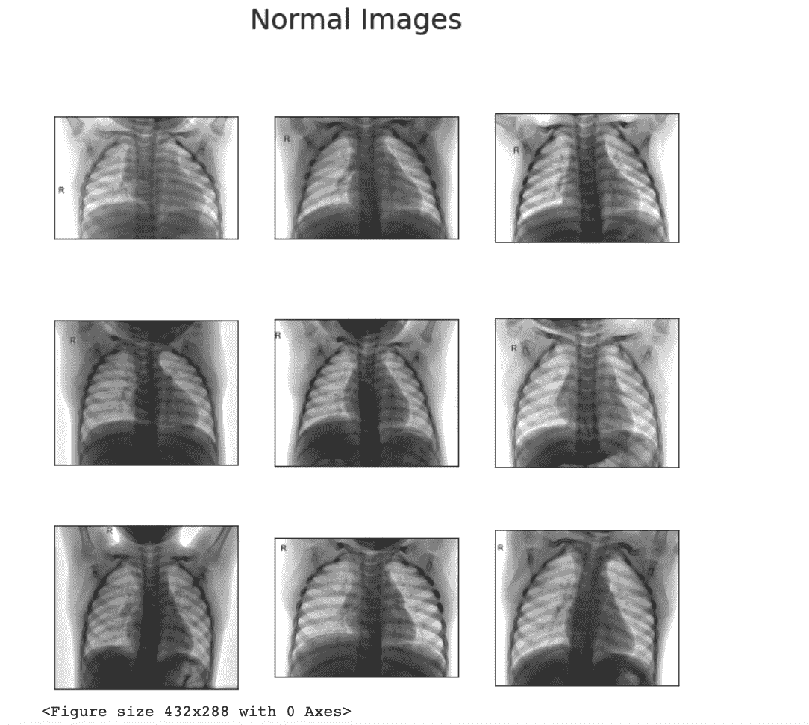

作者图片

正如你在上面看到的，正常的肺部图像相对清晰，没有阻塞。这通常是正常和健康的肺的情况，因为它们的主要功能是相对容易地吸收氧气。现在让我们看看肺炎的肺。

```
print_images(pneumonia_images, ‘Pneumonia Images’)
```

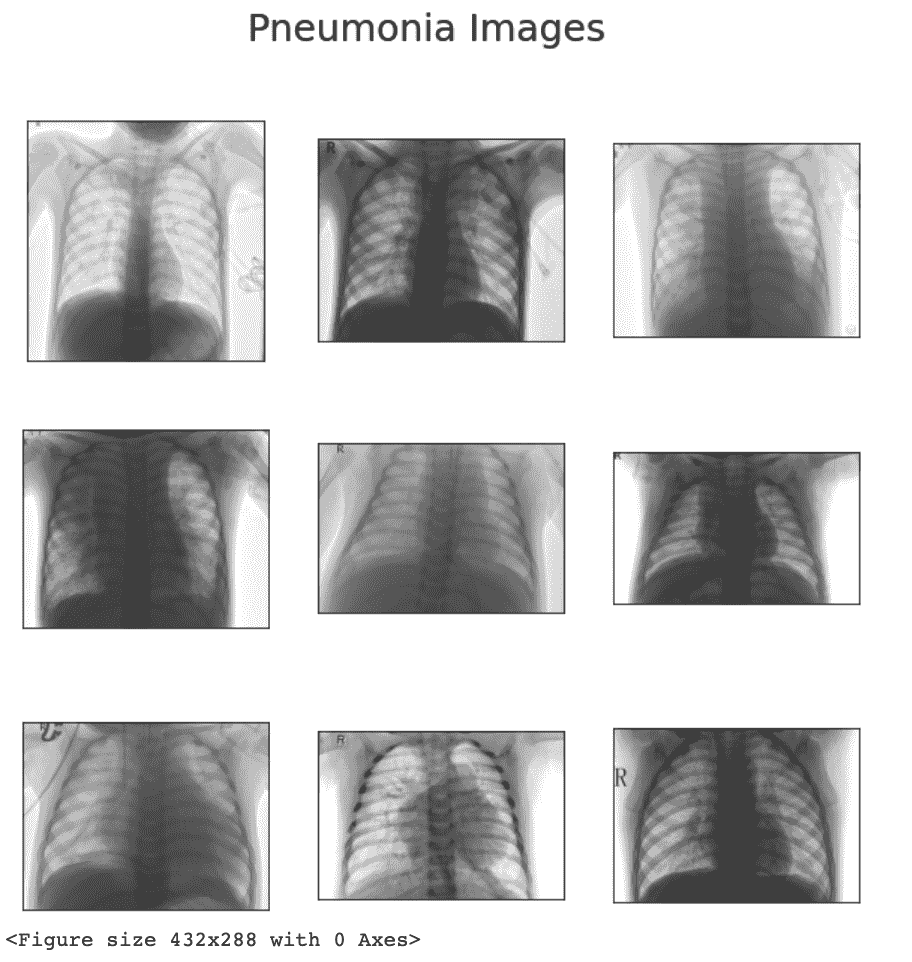

作者图片

我们可以看到肺炎的肺比正常的肺更混浊，当我们试图观察它们时，它们相对来说是阻塞的。这些图像很容易显示感染可能造成的损害。现在让我们试着仔细看看！

当我们试图将肺炎感染的肺与正常健康的肺进行分类时，我们需要注意显示一些结构或生理的 x 射线图像的定性方面，而不是测量感染程度的定量方面。因此，在我们的情况下，图像的像素值本身没有意义，因此，我们可以对图像进行归一化，以清楚地观察健康肺和受感染肺之间的生理差异。

下面是一个计算每张图片平均值的函数。

```
def find_mean_img(sample_img, title, size = (64, 64)):# calculate the averagemean_img = np.mean(sample_img, axis = 0)# reshape it back to a matrixmean_img = mean_img.reshape(size)plt.imshow(mean_img, vmin=0, vmax=255, cmap=’Greys_r’)plt.title(f’Average {title}’)plt.axis(‘off’)plt.show()return mean_imgnormal_mean = find_mean_img(sample_normal_img, ‘Normal’)pnemonia_mean = find_mean_img(sample_pnemonia_img, ‘Pnemonia’)
```

从正常肺和肺炎肺的样本平均图像中，我们可以观察到，与健康肺相比，肺炎感染肺在胸部区域周围具有更高的阻塞。

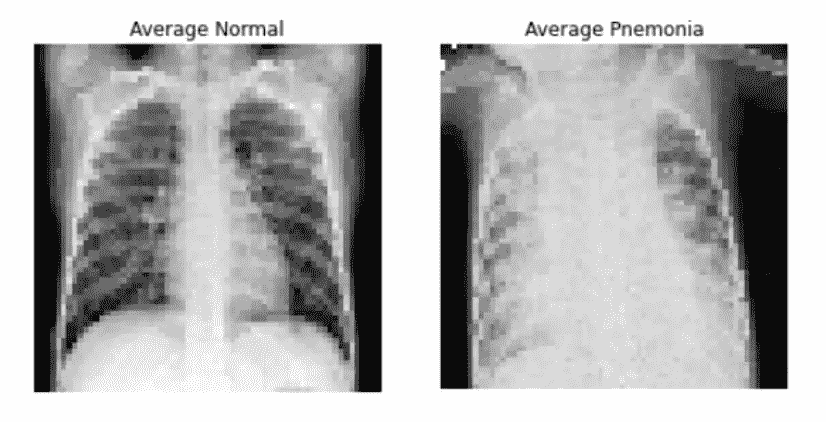

作者图片

我们可以计算平均图像之间的差异，以查看正常肺和肺炎肺之间的任何明显差异

```
contrast_mean = pnemonia_mean — normal_meanplt.imshow(contrast_mean, cmap=’bwr’)plt.title(f’Difference Between Normal & Pneumonia Average’)plt.axis(‘off’)plt.show()
```

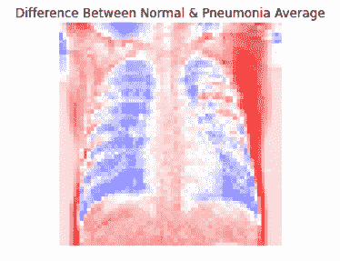

作者图片

在上面的图中，紫色区域显示了正常肺和感染肺之间的结构差异。

正如您所看到的差异，正常肺(左)有更多的紫色区域，表明阻塞较少，而感染肺(右)的紫色区域较少，表明疾病如何破坏肺结构的完整性。现在让我们在这个数据集上运行一些模型！

# **型号**

**具有 3 个卷积层的 CNN:**

卷积神经网络是一类深度神经网络。它是图像识别和图像分类最常用的模型之一。它获取输入图像并将其分类到特定类别下。

我们的 CNN 模型从卷积层开始，从输入图像中提取特征。卷积将通过在特定的过滤器尺寸中学习来保持像素之间的关系。这将输出包含所有卷积要素的要素图。同时，我们在模型中引入了 ReLU 作为激活，这是为了保证我们的模型具有非线性。

在我们的卷积层之后，添加了一个 MaxPooling 层来减少参数的数量。我们将从卷积图层生成的输出要素地图中提取最大的元素。

在运行卷积层三次后，我们将添加一个展平层，将数据转换为一维数组，以输入到下一层，即密集层。

密集层基本上是一个完全连接的层，它描述了神经元如何连接到下一层。在每个密集层之后，我们还将添加一个丢弃层来丢弃输出的随机部分。这用于避免相邻层的部分之间的高度依赖性。

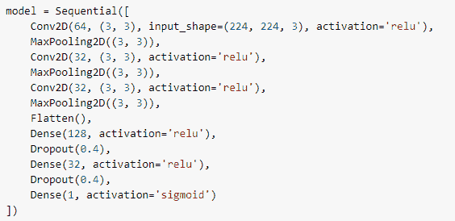

作者图片

由于数据的不平衡性质，用于衡量模型的最佳指标是 AUC 分数。

在用 20 个时期训练该 CNN 模型之后，我们得到 0.9214 的最高 auc 分数。

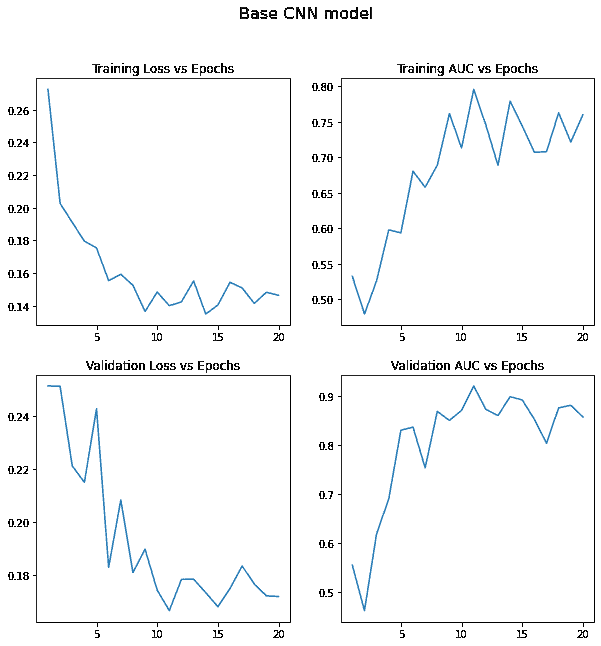

作者图片

**CNN 用平衡数据:**

现在我们决定试着让数据平衡，并测试这个 CNN 模型。我们基本上把里面有未知列的数据都拿出来了，大概是 96%的数据。

CNN 模型返回了高达 0.6567 的 AUC 分数。

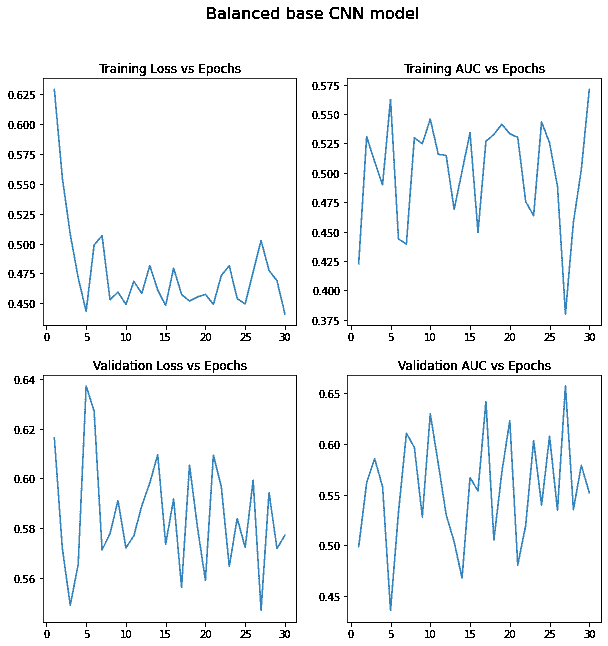

作者图片

平衡 CNN 的结果比不平衡 CNN 差得多，我们可以想到的一个原因是深度学习网络需要大量数据才能表现良好，通过取出 96%的数据，它极大地影响了 CNN 的性能。

**RESNET 50:**

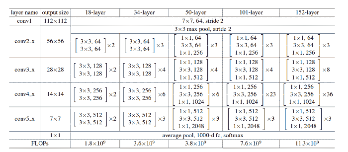

“深度残差学习在图像识别中的应用”，何，张，任，孙

RESNET 50 是来自 Tensorflow Keras 库的预训练模型，有 50 层。它通常用于计算机视觉中的图像分类。因此，我们决定首先使用 RESNET 50 来拍摄性能快照。

首先，我们需要找到一种平衡数据的方法，因为 96%的数据都是非 Covid 数据。通过以下增强，我们能够读入一幅图像并从中生成 9 幅图像。

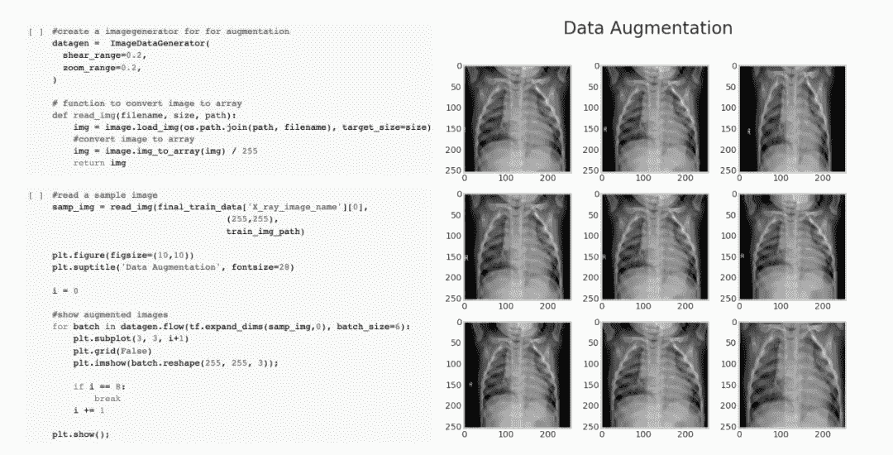

作者图片

在我们将增强应用于数据之后，我们需要定义我们的输入形状，并从 Tensorflow Keras 库中获得预训练的模型。

```
INPUT_SHAPE = (255,255,3)base_model = tf.keras.applications.ResNet50(input_shape= INPUT_SHAPE,include_top=False,weights=’imagenet’)
```

通过 ResNet50 的一些基本设置，我们能够获得高达 0.9949 的 AUC 分数。

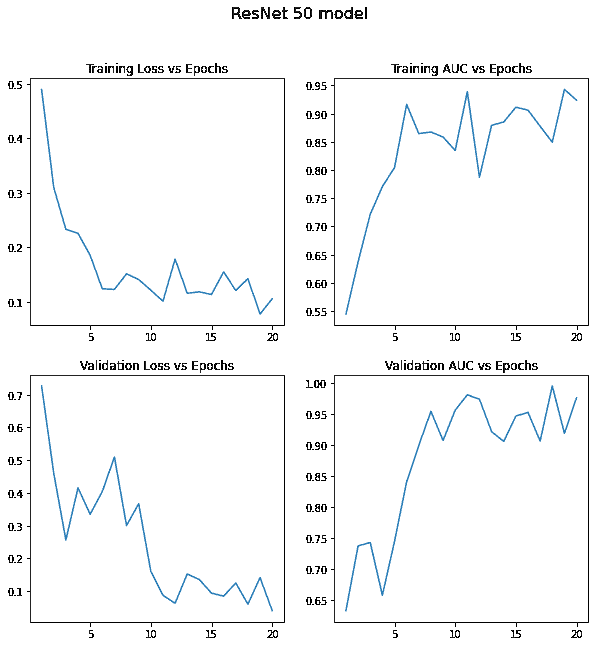

作者图片

# **最终模型对比**

总之，我们首先尝试了一个具有三个卷积层的 CNN 模型，用原始和欠采样数据集进行训练。为了提高性能，我们引入了预训练的 ResNet 50 模型，并适合过采样数据集。在所有三种方法中，具有过采样数据集的 ResNet 50 给我们最高的 AUC 分数，而欠采样 CNN 给我们最低的 AUC。如下图所示，具有过采样数据的 ResNet 50 在所有四个测量中领先。

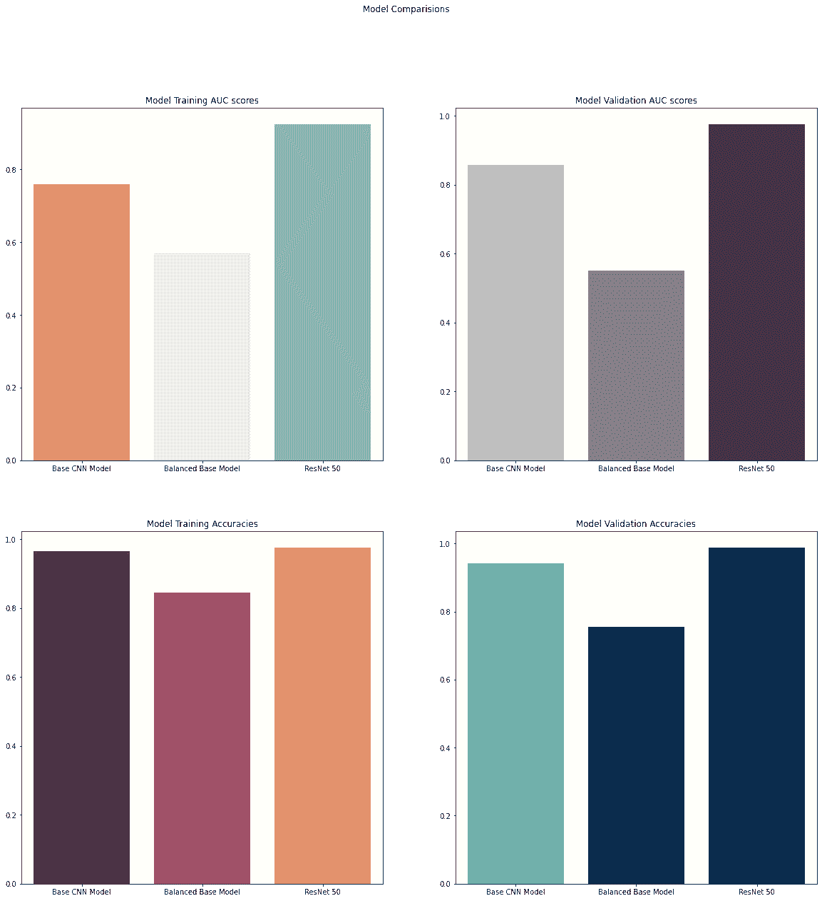

作者图片

# **结论**

总的来说，这是一个非常有趣的项目，我们可以作为一个团队一起工作，同时学习深度学习中真正不可或缺的概念！我们能够学习和训练不同的模型来诊断新冠肺炎。除此之外，我们还深入了解了如何使用机器学习来帮助医疗工作者更快地诊断这些疾病！这可以节省他们的时间和宝贵的资源，在未来，当像新冠肺炎这样的流行病变得更加规范。总而言之，这个项目向我们展示了机器学习在医疗保健中的有效性，同时给了我们一个真正独特的项目来展示我们的工作！