# 显著改善您的探索性数据分析(EDA)

> 原文：<https://towardsdatascience.com/dramatically-improve-your-exploratory-data-analysis-eda-a2fc8c851124?source=collection_archive---------24----------------------->

## PYTHON。数据可视化。分析。数据科学

## Python 探索性数据分析速成班


威廉·艾文在 [Unsplash](https://unsplash.com?utm_source=medium&utm_medium=referral) 上的照片

探索性数据分析(EDA)是探索数据并研究其结构以发现模式并从所述模式中发现异常的过程。

然后，EDA 将涉及使用统计和可视化方法来总结数据，以发现非数字模式。

理想情况下，EDA 应该从无法通过正式建模和假设测试获得的数据中获得洞察力和实现。

如果处理得当，EDA 可以极大地简化或推进您的数据科学问题，甚至可能解决它！

# EDA 过程的目标

一个合适的 EDA 希望实现几个目标:

1.  质疑数据并确定数据集中是否存在固有问题；
2.  确定手头的数据是否足以回答特定的研究问题，或者是否需要额外的特征工程；
3.  建立一个回答研究问题的框架；
4.  并根据你对数据的了解提炼问题和/或研究问题。

可以看出，EDA 本身就是一个迭代过程。

与大多数人认为的不同，EDA 不是一个“正式过程”。事实上，显而易见，任何带有“探索性”一词的东西都不受严格规则的约束，因此是非正规的。

相反，EDA 是自由形式的。正是在这个阶段，你开始追逐你可能有的想法，并看看哪些会有所进展。其中一些想法可能不一定行得通，因此你可以开始追求或从其他可行的想法中分支。

因此，EDA 让你批判性地思考你的问题有多“可回答”,以及它是否符合你的期望。

# EDA 备忘单

探索性数据分析一般分为两种方式:图形化或非图形化和单变量或多变量。

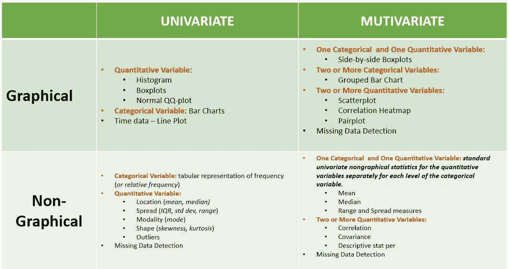

一些参考文献认为，在使用图形方法之前，应该先使用非图形方法。论点是，使用非图形方法可以确保您熟悉数据集，这使得可视化更容易，例如哪些变量是定量和定性的。

# EDA 之前

虽然有些资料来源认为这是 EDA 过程的一部分，但有些资料来源认为这是数据预处理，是有效 EDA 的一个要求。我们用后者吧。

在实施这四(4)个类别之前，数据科学家应该完成以下工作:

*   **确定数据集维度** —相对于特征(列)的数量，有多少个观测值。当特征的数量超过观察的数量时，一些算法不能产生期望的输出，如在优化问题中。
*   **识别数据类型** —特别是对于 Python，EDA 方法，尤其是图形方法，最适合某些数据类型。虽然数据的形式可能看起来相似，例如，对于数字列，如果数据类型被分类为“object”与“float”或“int ”,一些方法将不起作用。
*   **识别目标或输出变量**——在一些图形方法中，识别目标或输出变量以针对单个变量进行可视化是很重要的。

实现这一点的一个好方法是使用*。info()* 熊猫的方法:

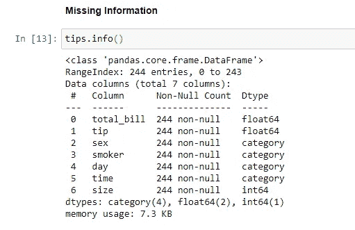

它同样为您提供“非空”信息，这是*单变量非图形方法*的一部分。

## 单变量非图解法

对于单变量非图形化 EDA，我们想知道*的取值范围*和每个值的*频率*。

对于定量变量，我们要关注位置(*均值，中位数*)，扩散( *IQR，标准差。偏差、范围*、模态(*模式*)、形状(*偏斜度、峰度*)和异常值。

```
import numpy as np
import pandas as pd
import matplotlib.pyplot as plt
import seaborn as sns#Aesthetics
sns.set_style("darkgrid")%matplotlib inline# Loading built-in Datasets:
tips = sns.load_dataset('tips')#Quantitative
tips.total_bill.describe()
```

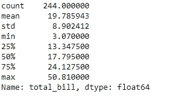

*Pandas* 有一系列方法来提供我们想要知道的其他信息，如*模式、*和*峰度*。

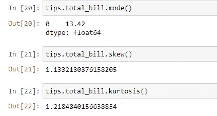

对于 IQR，我们需要做一些计算:

```
#IQR
#calculate interquartile range 
q3, q1 = np.percentile(tips.total_bill, [75 ,25])
iqr = q3 - q1#display interquartile range 
iqr
```

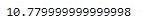

pandas 的 *describe* 方法最常用于数字列，但是通过添加参数“include=['O']”，我们可以将它用于分类值。

```
tips.sex.describe(include=['O'])
```

## 单变量图解法

我最喜欢使用的图表之一是直方图，因为它为我们提供了数据分布的概念。

在这方面，数据分布的近似值要求它具有定量的性质。

```
sns.histplot(data=iris, x="sepal_length")
```

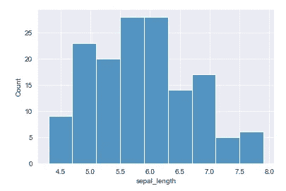

密度图是直方图的平滑版本:

```
sns.kdeplot(data=iris, x="sepal_length")
```

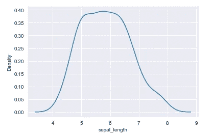

对于分类变量，条形图非常有用:

```
sns.barplot(x="day", y='tip', data=tips)
```

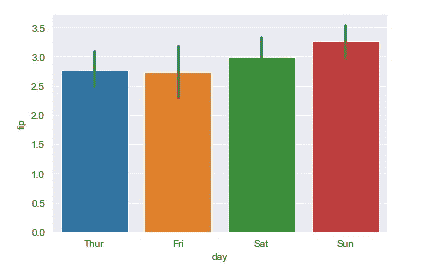

请注意，对于条形图，惯例是在 y 轴上表示目标/输出/因变量。

对于 seaborn，y 轴代表“平均”值。一些来源建议我们表示“计数”或观察值的数量，但这与单独的直方图没有任何不同，在直方图中，您用想要计数的分类变量标记 x 轴:

```
sns.histplot(data=tips, x="day")
```

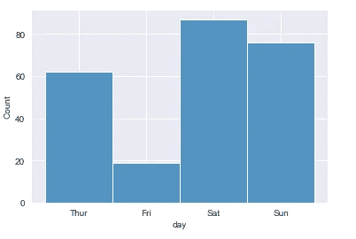

显示分类变量“日”计数的直方图代码。从技术上讲，这是“日”类别的单变量条形图。

对于数字数据来说，最有用的可视化方法之一是箱线图。

```
sns.boxplot(y=tips["total_bill"])
```

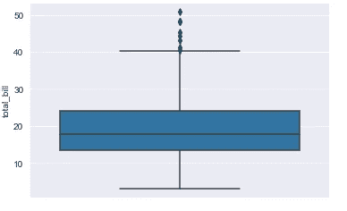

可以通过填充“x”参数而不是“y”参数来水平表示箱线图。

箱形图(又名*箱形图和须状图*)在表示关于中心趋势、对称性、偏斜和异常值的信息方面非常出色。他们唯一可能缺少的是关于*多功能*的信息。

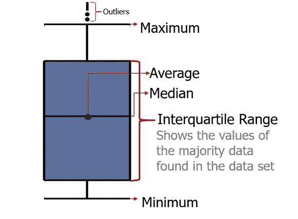

垂直箱线图的详细信息

下须和上须被拉出到最极端的数据点，这些数据点超出相应铰链不到 1.5 IQRs。所以胡须代表数据 ***的**最大值**和**最小值**，不包括异常值*。**胡须后的圆点代表这些异常值。

对称性可以通过中线的位置来评估。如果它以晶须长度相等的方式切割盒子，那么数据分布是对称的。在倾斜数据集的情况下，中值被推向较短的须。更长的须意味着高(或极端)值出现在这个方向。较长的上须意味着数据集正偏(*右偏*)，而较长的下须意味着数据集负偏(*左偏*)。

对于峰度，许多异常值的存在可能表明一两件事情:

1.  出现*厚尾(或正峰度*)或
2.  数据输入错误。

如果数据集很大，短须的存在可能表明*负峰度*。

最后，但同样重要的是，正态分位数图可用于检测左右偏斜、正负峰度和双峰。

为此， *statmodels* 软件包可以帮助我们:

```
import statsmodels.api as smsm.qqplot(iris.sepal_length)
```

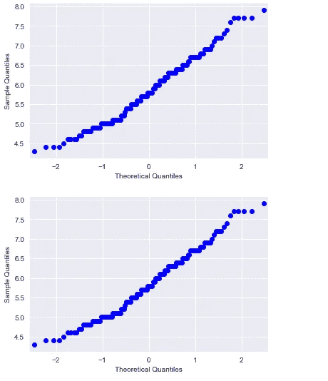

正态分位数图绘制两种分布的概率，特别是它们的分位数。如果两个分布相似，这些点将在 y=x 线上返回一条完美的直线。在上面的例子中，虹膜的概率分布与正态分布进行了比较。

对于其他可视化，我们可以将它们视为“多变量”情况的扩展。

## 多元非图形

对于一个分类变量和一个定量变量，理想情况下，我们希望针对分类变量“ ”的每个级别，分别呈现定量变量的“ ***标准单变量非图形统计。下面是一个例子:***

```
#Separate the categories into a list and the quantitative variables in another list:
category = ['sex', 'smoker', 'day', 'time']
quantitative = ['total_bill', 'tip', 'size']for i in category:
    for j in quantitative:
        print(f'--------------{i} vs {j} ---------------')
        display(tips.groupby(i)[j].describe().reset_index())
```

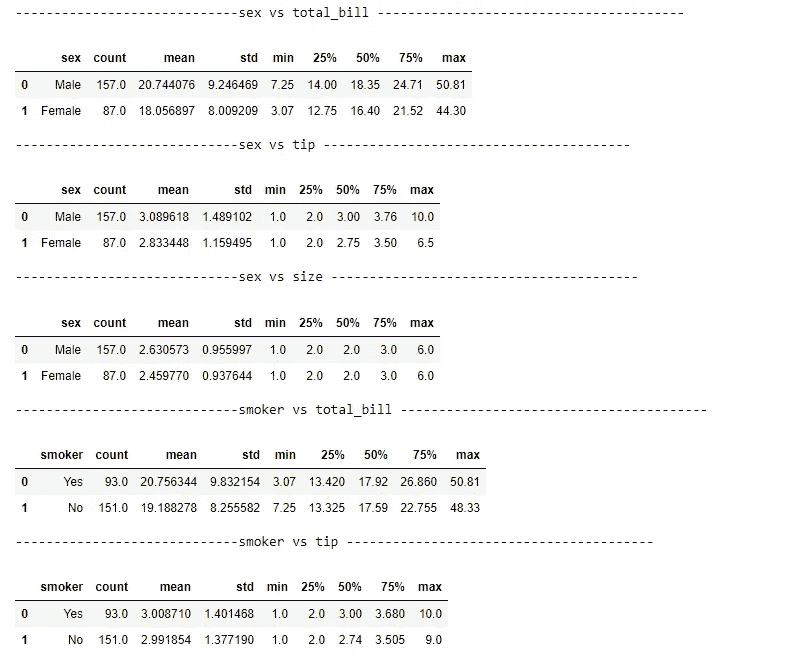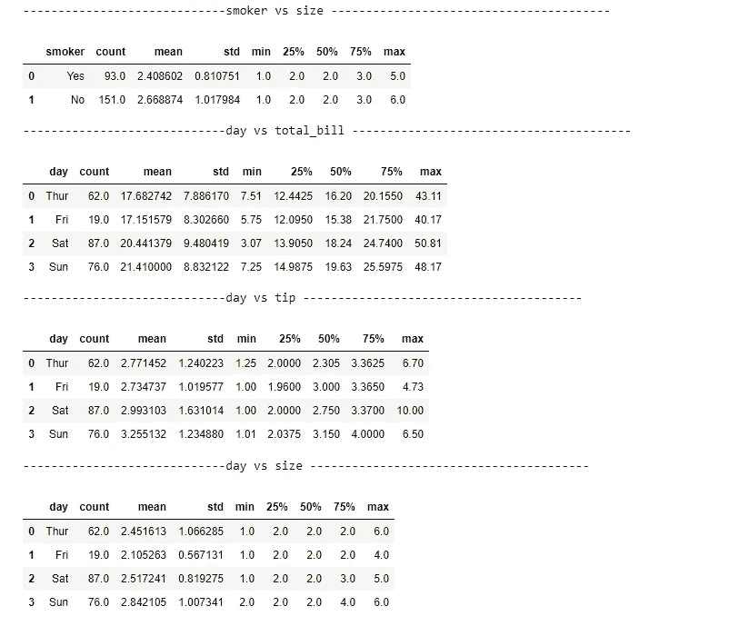

对于定量变量，以下方法可用于生成相关性、协方差和描述性统计数据:

```
tips.cov()
```

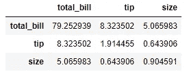

```
tips.corr()
```

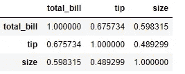

```
tips.describe()
```


对于缺失数据检测，我们可以使用*。info()* 方法如前所述。

## 多元图形

对于两个分类变量，最常用的 EDA 图是分组条形图。与常规条形图一样，目标/输出/独立变量必须用 y 轴表示:

```
sns.catplot(
    data=tips, kind="bar",
    x="day", y="tip", hue="sex",
    ci="sd", palette="dark", alpha=.6, height=6
)
```

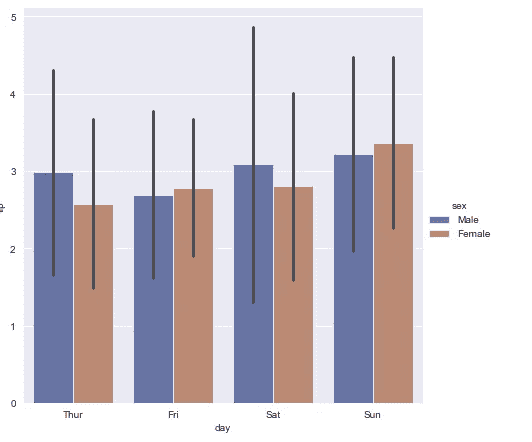

如果箱线图是单变量分析中最有用的 EDA 图之一，那么它的多变量对应物也是如此。并排箱线图用于分析一个定量和分类变量:

```
sns.boxplot(x="day", y="total_bill", data=tips)
```

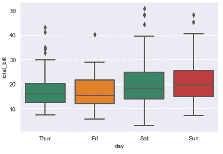

对于两个定量变量，散点图将是理想的。在某些情况下，它可以很容易地揭示一些模式，如图中两个定量变量之间是否存在线性、多项式(*偶数指数)*或其他关系。

```
sns.scatterplot(data=tips, x="total_bill", y="tip")
```

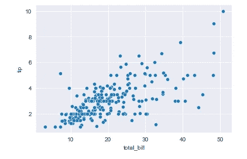

seaborn 的 *pairplot* 方法提供了任意两个定量变量排列之间散点图的可能组合。作为奖励，它在单个*定量变量*的主对角线上添加了直方图:

```
sns.pairplot(tips)
```

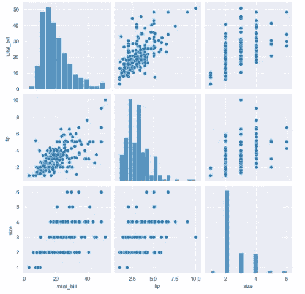

您可能想更进一步，在 pairplot 中添加类别:

```
sns.pairplot(tips, hue='sex')
```

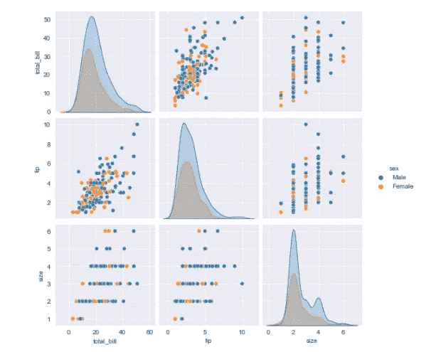

对于缺失数据，可能很难完全掌握多个变量的缺失信息。幸运的是，Python 中的一个包可以帮助我们轻松地将这一点可视化。

```
pip install missingnoimport missingno as msno #A simple library to view completeness of data
```

试用我从菲律宾家庭收入和支出调查中获得的数据集:

```
msno.matrix(df, labels=True) #labels=True is important if the number of columns exceed 50
```

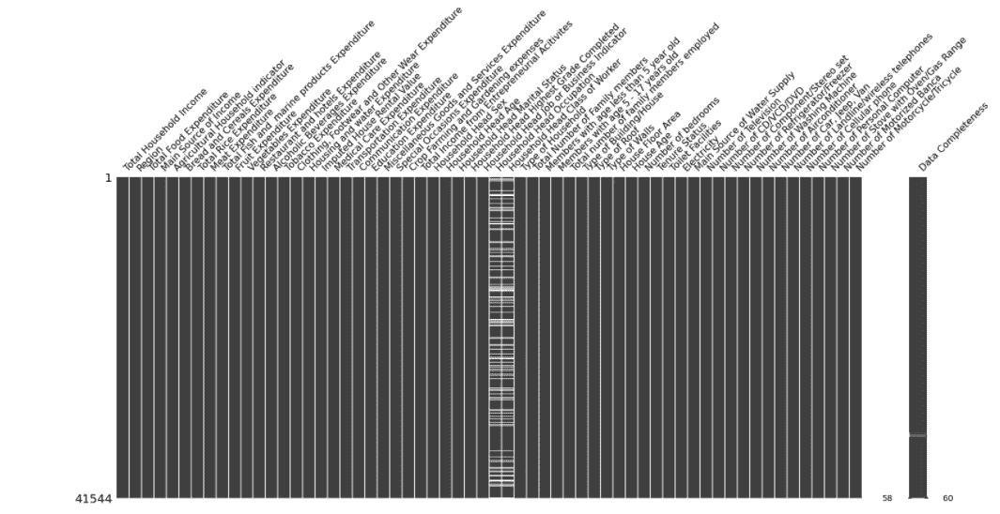

使用 missingno，您可以很容易地看到每个功能有多完整，并且如果该功能对您的研究设计至关重要，您可以评估如何进行。

相关性虽然主要用于非图形方法，但同样可以被可视化。当我们有许多难以注意到多重相关性的特征时，这很有帮助。

对于这些情况，我们可以利用热图可视化:

```
fig = plt.figure(figsize=(18,14))corr  = tips.corr() #.corr gets the pairwise correlation
c = plt.pcolor(corr)fig.colorbar(c) #displays the range used in the colorbar
```

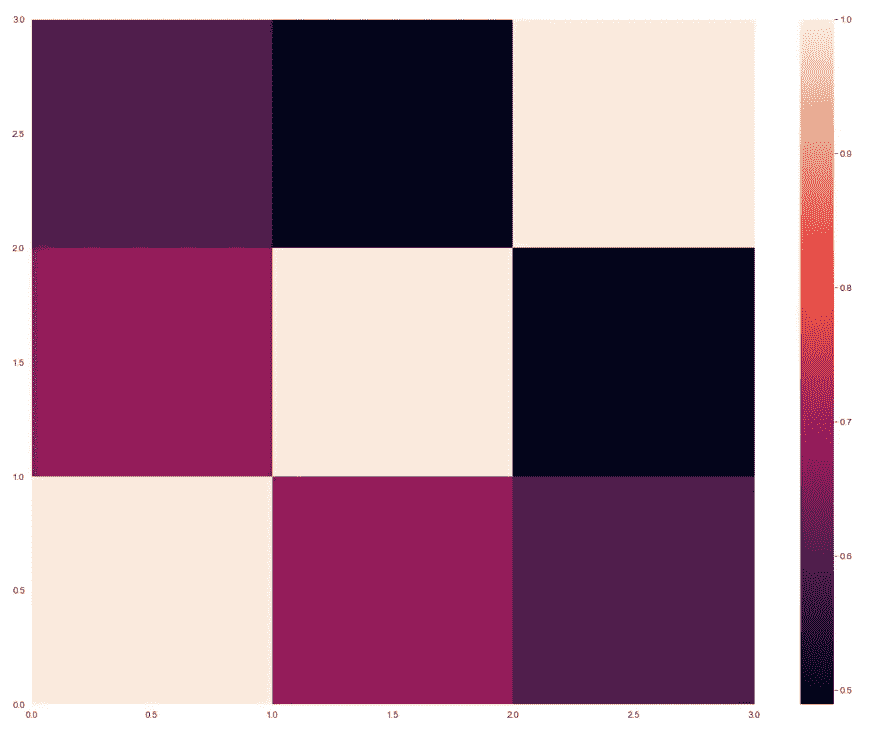

# 结束语

虽然我们试图制作我们的工具和方法，但我们拥有的列表并不完整。

例如，地理空间和时间特征需要不同的 EDA 原理和过程，并且应该在必要时进行探索。

新的 EDA 技术正在有规律地发展。应该鼓励数据科学家学习它们，并了解从这些新技术中获得的见解是否无法被我们已经介绍过的一系列技术所涵盖。

无论如何，数据科学家不应该害怕添加和探索更多内容，因为 EDA 的目的是熟悉您的数据并推进手头的研究问题。

代码可以在我的 [GitHub](https://github.com/francisadrianviernes/Visualization/blob/master/Dramatically%20Improve%20Your%20Exploratory%20Data%20Analysis%C2%A0(EDA).ipynb) 页面找到。

# 参考

[https://r4ds.had.co.nz/exploratory-data-analysis.html](https://r4ds.had.co.nz/exploratory-data-analysis.html)

[https://www.stat.cmu.edu/~hseltman/309/Book/chapter4.pdf](https://www.stat.cmu.edu/~hseltman/309/Book/chapter4.pdf)

Ozdemir，s .，2016，《数据科学原理》，伯明翰:Packt 出版社。