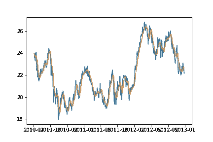
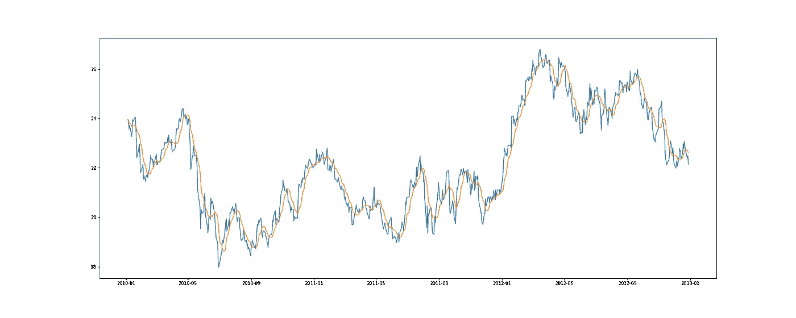
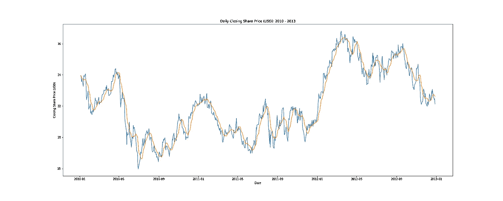
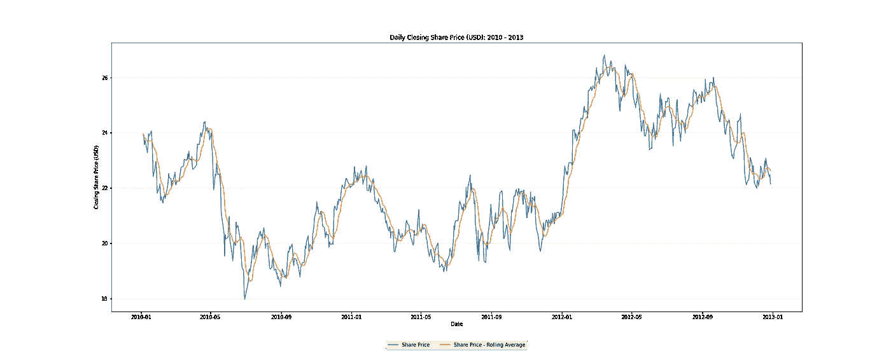
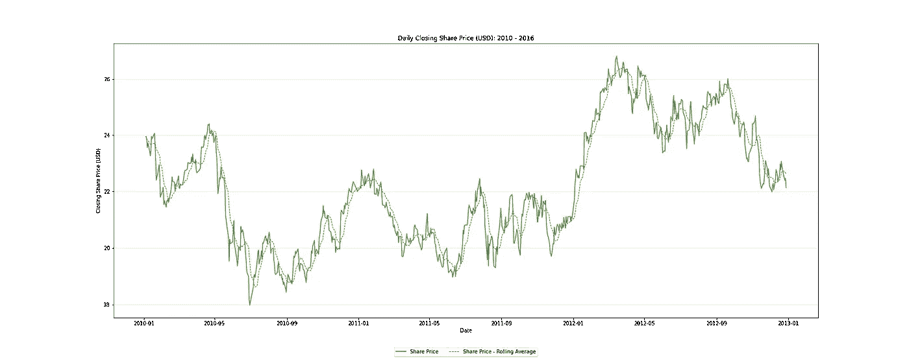
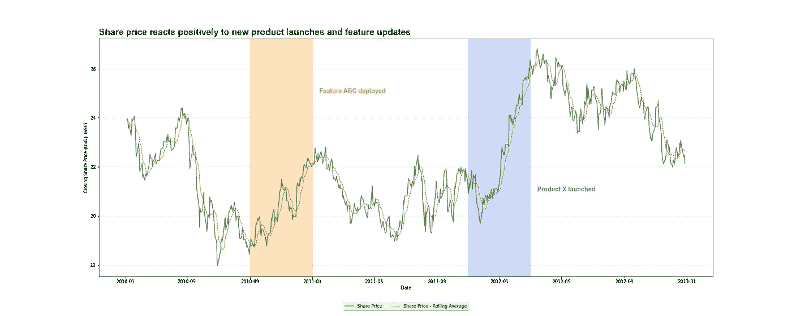

# 给我画一幅画——卑微的线条图

> 原文：<https://towardsdatascience.com/draw-me-a-picture-the-humble-line-plot-294361c4c35d?source=collection_archive---------31----------------------->

## 快速介绍如何构建信息丰富且(相对)美观的线图。

照片由[艾萨克·史密斯](https://unsplash.com/@isaacmsmith?utm_source=medium&utm_medium=referral)在 [Unsplash](https://unsplash.com?utm_source=medium&utm_medium=referral) 拍摄

## 背景

线图是你在实践中遇到的最简单的图表之一，但这并不意味着它不是可视化信息的强大工具！

我在过去遇到过一些资源(包括一个关于专业沟通的精算考试，听起来很有趣)，它们试图展示线形图的最佳实践。不幸的是，就像许多理论和现实的交叉点一样，这些指导方针并不总是适用的。

现在，我喜欢线条图，我甚至可以说这是我最喜欢创造的一种图。书呆子，我知道。

我已经学会了一些技巧，我将在下面分享。

# 什么时候用？

线形图最适用于以下情况:

*   当绘制的数量(即显示在 *y 轴*上的数量)为数字时。
*   当图表的目标是传达某个特征(如时间)的变化或趋势时。
*   当用于区分目标量的特征(即显示在 *x 轴*上的内容)不太粒度化，或者可以转换为不太粒度化时。
*   当用于区分目标数量的特征具有某种排序或进展时(理想而非强制！).

# 让我们开始吧！

这是足够的理论，现在是采取行动的时候了。

我们将从一个真实的情节示例开始，讨论我们不喜欢它的地方，并构建我们的代码，直到我们有一个很好的可视化。

*免责声明:所有剧情均在* `matplotlib` *Python 库中创建。是的，同样的图可以使用* `seaborn` *的简单界面创建。不，这并不意味着你不需要了解* `matplotlib` *的基础知识。*

免责声明(2):我是精算师，不是平面设计师……当你看到我的颜色选择时，请记住这一点！

免责声明(3):虽然我会分享我的代码，但我不会涉及太多的技术细节。如果你对 `matplotlib`、*中所有可用的图表潜力感到好奇，看看官方文档:*[Matplotlib . py plot . plot—Matplotlib 3 . 4 . 3 文档](https://matplotlib.org/stable/api/_as_gen/matplotlib.pyplot.plot.html)

# 基地地块

让我们绘制一个简单的股价线图和一个平滑版本的股价图。

这是一段简单的代码:

它产生了一个简单的线图:

作者图片

这相当简单——两行代码为您提供了一个基本的情节。如果你不介意显示对象的内存地址，你甚至可以在一行中完成！

好吧，但是这张图表看起来不太顺眼，也没有真正地讲述一个故事。

1.  它很小——我们应该让它容易看到。
2.  很难说这是在测量什么——我们应该让它容易理解。
3.  很难从图表中读出数值，也很难理解它所代表的东西——我们应该把它弄清楚。
4.  我不喜欢这些颜色——我们应该把它弄得好看些。
5.  它不一定传达我们想要传达的确切信息——我们应该让它讲述一个故事。

让我们解决这个问题，一步一步来！

# 使其易于查看:更改图表大小

有许多方法可以做到这一点。

我更喜欢像许多其他 Python 用户一样使用`fig, ax = plt.subplots()`方法。这给了我们很多灵活性，尤其是当我们使用`seaborn`的时候。

`plt.subplots()`接受一个`figsize`参数，它允许我们设置图表的大小。我喜欢我的图表是长方形的，宽于高，发现这样更容易在屏幕上看到。

第一条建议:试试这个，看看有没有让你喜欢的尺码范围。

结果是:

作者图片

好多了！

# 使其易于理解:添加标签和标题

我总是惊讶地看到，当一个图表有适当的轴标签和标题时，它能传达多少更多的信息。

使用`set_xlabel()`、`set_ylabel()`、`set_title()`方法很容易做到这些。

让我们来看看:

作者图片

相对较小的变化，但我们现在可以很容易地看到:

*   我们试图传达的内容(即“每日收盘股价(美元):2010–2013”)。
*   我们在 *y 轴*上测量的单位(即“收盘股价(美元)”)。
*   我们在 *x 轴*上区分的内容(即“日期”)。

我们的图表开始看起来相当不错，但是仍然很难从图表中读出数值，更不用说很难理解这些线条的确切含义了！让我们解决这个问题。

# 明确说明:添加网格线和图例

对我来说，在图表上不包括网格线是一种罪过。强烈的言辞，但是它让我不必在我的电脑屏幕上使用物理标尺(是的，我实际上已经这样做了)。

同样地，任何有一个以上数量被可视化的图表绝对需要一个图例。了解绘制的是什么以及每个量是如何表示的是至关重要的。

使用`grid()`和`legend()`方法添加网格线和图例非常容易——让我们看看它们的实际应用。

提示 2:网格线不应该分散观察者对实际绘制内容的注意力。使用 `alpha` *参数淡化网格线。*

*提示 3:图例可以放在图表内部和外部的不同位置。查看* `loc` *和* `bbox_to_anchor` *参数。*

作者图片

现在我们有进展了！让我们做一些美学上的改变——我不是基础主题的粉丝。

# 让它看起来更好:应用一些样式

虽然我们的图表开始看起来相当不错，但它可以说是相当平淡无奇，并没有真正将自己与周围浮动的许多其他图表区分开来。

在你的图表上打上你个人或者公司的印记是个好主意。我们现在就开始吧。

许多公司都有一个风格指南，规定了字体风格和图形调色板。利用这一点来创造更突出的视觉效果。

让我们想象一下，我工作的公司使用深绿色主题。我们怎样才能把这一点融入情节中呢？

*   我将用深绿色标出公司的股价——这是一个很好的链接。
*   平滑后的股价目前用橙色标出。我不是深绿色和橙色组合的粉丝，所以我会把这个改成在绿色的映衬下显得很突出的；红色通常会起作用。
*   我不喜欢用实线显示推断值或预测值。我觉得这传达了这些是具体的事实，但在大多数情况下并不是真的如此。为此，我将使用虚线绘制平滑后的股价。

作者图片

不算太寒酸！需要注意一些事情:

1.  我使用了`linewidth`参数来控制每条线的粗细。这是一个很好的主意，这取决于你到底想强调什么。
2.  `linestyle`参数控制绘制的线条类型。有多个选项可供选择——查看文档了解更多信息。

到目前为止，一切顺利。但是我们仍然有一个问题，这张图表没有真正传达我们想要传达的信息。让我们纠正这一点。

# 让它讲述一个故事:使用图表标题、附加图形和图表文本

我们会做到这一点——准备好一大段代码:

这给了我们:

作者图片

我们做了什么？

1.  我们使用图表标题来明确传达我们想要传达的信息。
2.  彩色方框将观众的注意力吸引到关注的特定区域(用`axvspan()`来做)。
3.  适当颜色(和位置)的文本信息为阴影区域提供了更好的背景(用`text()`做这件事)。

# 包扎

…还有点漫无边际。

折线图是显示数字趋势或跨一些显著特征的关系的一个很好的工具。在`matplotlib`制作它们很简单，有大量的定制选项。

我们已经看到了一个坏图表以及如何纠正错误的好例子。特别是，我们改变了:

*   图表大小
*   标签和标题
*   传说
*   颜色和主题。

我们简单地谈到了如何明确地向观众传达信息。我们通过有效地使用图表标题以及向图表添加额外的图形和文本信息来做到这一点。我强烈推荐这一点，特别是如果你的观众不熟悉手边的主题，或者如果趋势或关系没有立即显现出来。

正如我提到的，我喜欢好的折线图。创建好的线图需要练习，我鼓励你尝试一些不同的东西，并一直问*“这张图表传达了信息吗？”*在内心深处。