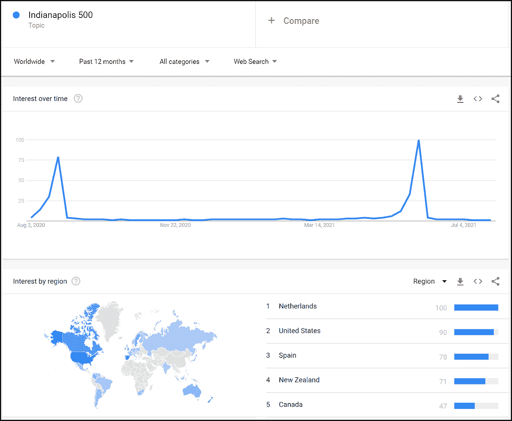
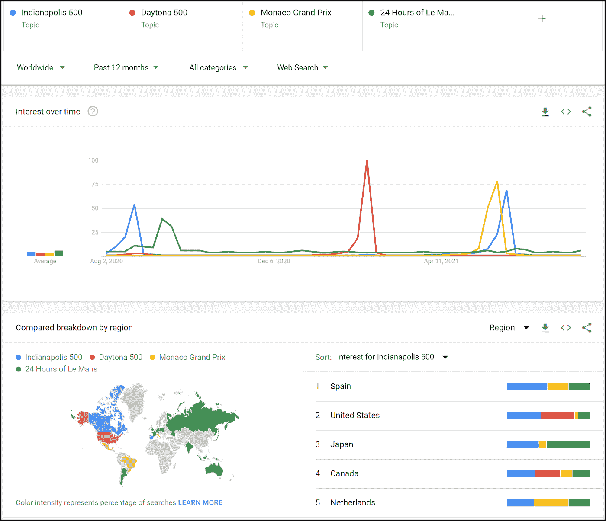
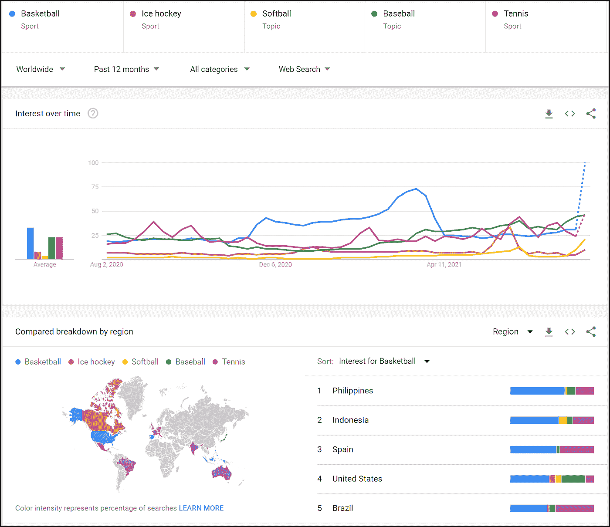
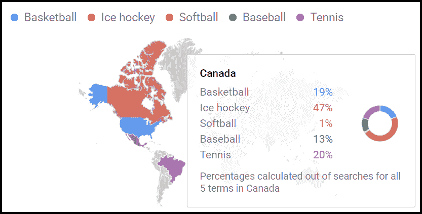

# 如何利用谷歌趋势来洞察人们的兴趣

> 原文：<https://towardsdatascience.com/drawing-insights-from-interest-data-in-google-trends-6ba79454e47a?source=collection_archive---------24----------------------->

## 数据、数据分析、兴趣和谷歌

## 通过 Google Trends，Google 开发了一个数据分析包来了解全球和本地人们的兴趣。这个故事使用了赛车和流行运动的例子。

赛车。蒂姆·凯里在 [Unsplash](https://unsplash.com/s/photos/car-racing?utm_source=unsplash&utm_medium=referral&utm_content=creditCopyText) 上的照片

> “信息是 21 世纪的石油，分析是内燃机。”彼得·桑德加德

G oogle 为数十亿网页编制索引。反过来，广受欢迎的谷歌搜索允许人们根据关键词和操作符找到许多这样的页面。此外，谷歌存储搜索数据，并通过其[谷歌趋势](https://trends.google.com/)网站提供汇总数据。这些数据可以被视为可视化。用户还可以下载数据，以便在 Tableau、Microsoft Power BI 或其他工具中进一步使用和分析。

这个故事描述了几个使用谷歌趋势数据的例子。也许你会为谷歌趋势找到一个商业或个人目的。

# Google Trends 的使用示例

## 印第安纳波利斯 500 汽车赛

**数据审核**

印第安纳波利斯 500 是一场 500 英里的汽车比赛，自 1911 年以来一直在印第安纳波利斯的印第安纳波利斯赛道举行。早些年，比赛在装饰日举行，这个节日现在美国人称为阵亡将士纪念日。现在仍定在每年 5 月下旬的阵亡将士纪念日周末。因此，我对在谷歌趋势中搜索这场比赛可能会把我引向何方很感兴趣。在全球范围内搜索“印第安纳波利斯 500 强”主题，会发现一些不足为奇的数据点:

*   搜索兴趣在 2021 年 5 月 30 日至 6 月 5 日达到峰值。实际上，比赛在 2021 年 5 月 30 日举行。
*   在美国，搜索兴趣很高，比赛在印第安纳州的印第安纳波利斯举行。
*   美国的朋友和邻居加拿大对搜索的兴趣也很高。

印第安纳波利斯 500 全球兴趣。作者在谷歌趋势中的截屏。

其他数据点也很突出:

*   荷兰、西班牙和新西兰的搜索兴趣很高。
*   2020 年 8 月 23 日至 8 月 29 日搜索兴趣高。

这些数据点意味着什么？我并不关注赛车或 Indy 500，但我猜荷兰、西班牙和新西兰的人对这场比赛感兴趣。也许比赛中的车手来自那些国家。以下是我在 Indy Motor Speedway 网站上找到的关于这些国家车手的信息:

*   **荷兰** —埃德·卡彭特赛车队的里努斯·韦凯
*   **西班牙**——奇普·加纳西赛车队的亚历克斯·帕劳
*   **纽西兰**——奇普·加纳西赛车队的斯科特·狄克逊
*   新西兰 —潘世奇队的斯科特·麦克劳克林

但是现场还包括两位来自加拿大的车手:

*   AJ Foyt 赛车队的道尔顿·凯利特
*   安德雷蒂汽车运动公司的詹姆斯·欣奇克利夫

其他国家的车手也参加了比赛。然而，“印第安纳波利斯 500”并没有在他们的搜索中占据很高的位置。

但是是什么引发了 2020 年 8 月 23 日到 8 月 29 日的搜索高峰呢？我不知道，但我猜想在那段时间的某个时候，在印第安纳波利斯赛车场会举行另一场比赛。一项小小的研究表明，2020 年的印第安纳波利斯 500 因为新冠肺炎疫情而从 5 月的阵亡将士纪念日周末推迟到 8 月 23 日。

我没有解决一个商业问题或支持决策来搜索 Indy 500 汽车比赛。但是我学到了一些关于比赛和赛车的新事实或琐事。车手从世界各地被吸引来参加比赛，这已经成为一个国际事件。

**潜在商业用途**

以下是如何在商业中使用 Indy 500 搜索数据的想法:

*   从其他国家招募车队和车手，以扩大赛事对更多车迷的影响。
*   计划设计、生产、分配和销售与种族相关的商品，如 t 恤衫和纪念品。
*   促进和准备车迷从地区到比赛地点的旅行，可能包括机票、酒店、汽车租赁、豪华轿车服务等。

> "我从不猜测，这是一个令人震惊的习惯——对逻辑能力有破坏性."[人名]夏洛克·福尔摩斯(英国侦探小说家亚瑟·柯南·道尔所塑造的小说人物)

## 比较印第安纳波利斯 500 和世界范围内以及美国的其他比赛

**数据审核**

让我们在谷歌趋势搜索中添加另外三个著名的汽车比赛:代托纳 500、摩纳哥大奖赛和勒芒 24 小时耐力赛。我们可以立即看到，在比赛周期间，人们对每项赛事的兴趣都有所增加:

*   **印第安纳波利斯 500**—2020 年 8 月 23 日至 29 日，比赛将于 8 月 23 日举行
*   **代托纳 500**—2021 年 2 月 14 日至 20 日，比赛于 2 月 15 日举行
*   **摩纳哥大奖赛**—2021 年 5 月 23 日至 29 日，比赛于 5 月 23 日举行
*   **勒芒 24 小时耐力赛**—2020 年 9 月 13 日至 19 日，比赛将在 9 月 19 日和 20 日举行

从按地区(或者，在本例中，按国家)显示兴趣水平的图表中，我们看到美国和加拿大对 Daytona 500 和 Indianapolis 500 表现出较高的兴趣水平。相比之下，大多数人对比赛的兴趣很低。事实上，在美国，这两个美国种族共有 41%的兴趣水平。同样，美国和加拿大以外的人对 Daytona 500 的兴趣也在增加，而对 Indy 500 的兴趣仍然很高。摩纳哥大奖赛和勒芒 24 小时耐力赛在许多领域表现出更高的兴趣。这种兴趣水平可能是由比赛的地点(例如，勒芒在法国)和车手的祖国等因素造成的。但这里就不赘述了。

世界著名的汽车比赛。作者在谷歌趋势中的截屏。

**潜在的商业用途**

企业可以以类似于上面印第安纳波利斯 500 强中描述的方式使用数据。以下是其他想法:

*   开发一项服务，为高收入车迷提供赛车旅行套餐(全包交通、住宿、餐饮、门票等)。
*   为汽车性能产品做广告，在比赛前可能会有以赛车手为主角的广告。

## 季节性运动装备广告

**数据回顾**

人们感兴趣的运动在世界各地各不相同。在本练习中，我们来回顾一下这些运动的搜索趋势:

*   棒球
*   篮球
*   冰球
*   垒球
*   网球

足球一词被排除在外，因为它在不同的国家意味着不同的运动。

全世界流行的体育兴趣。作者在谷歌趋势中的截屏。

从过去一年的全球数据中可以得出什么结论？以下是一些例子:

*   篮球在全球范围内引起了更高的兴趣。紧随其后的是棒球和网球，两者几乎不相上下。
*   如以下加拿大的细分数据所示，冰球是人们感兴趣的主要运动。
*   对网球的兴趣在南半球和西欧占主导地位，除了篮球占主导地位的西班牙。在葡萄牙，人们对篮球和网球的兴趣相当。
*   线形图显示了一些季节性，尤其是篮球。但是南北半球的季节性可能不同。

加拿大的大众体育兴趣。作者在谷歌趋势中的截屏。

**潜在商业用途**

组织和公司可以将体育兴趣数据用于各种目的。以下是一些例子:

*   通过向选定的世界地区进行营销，试图增加这些地区对体育参与或特定体育赛事的兴趣(例如，特定体育项目的温布尔登网球锦标赛或世界锦标赛)。
*   执行更详细的搜索和分析，以确定生产、分销和销售与特定运动相关的商品的最佳时间和地点。

# 摘要

谷歌趋势是一个强大的免费工具，你可以用它来了解和洞察世界各地人们的兴趣。谷歌趋势易于使用，并可能为您的组织或个人生活提供有用的信息。

请关注即将发布的关于从 Google Trends 下载数据以扩展 Tableau 功能的报道。

</use-and-enhance-this-python-class-to-download-excel-workbooks-and-prepare-them-for-analytics-4750ae00d8c2>  </use-python-and-bulk-insert-to-quickly-load-data-from-csv-files-into-sql-server-tables-ba381670d376>  </uery-information-about-43-nih-biomedical-databases-with-this-python-4e534a12c3fb> 