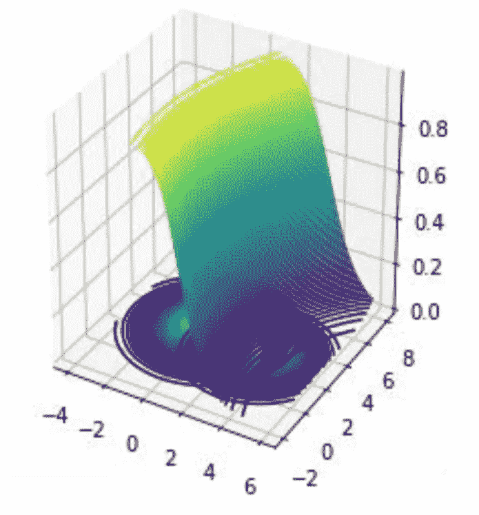
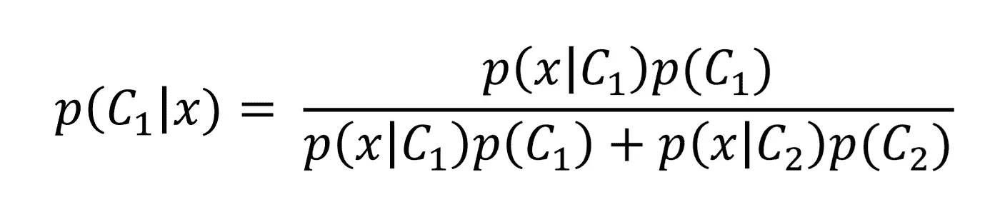
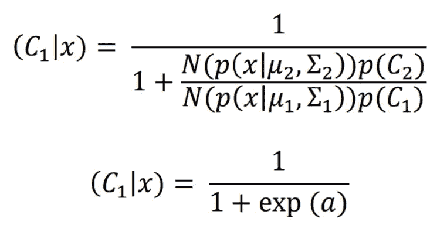
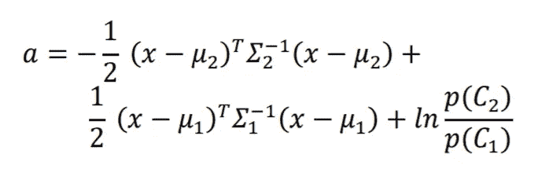
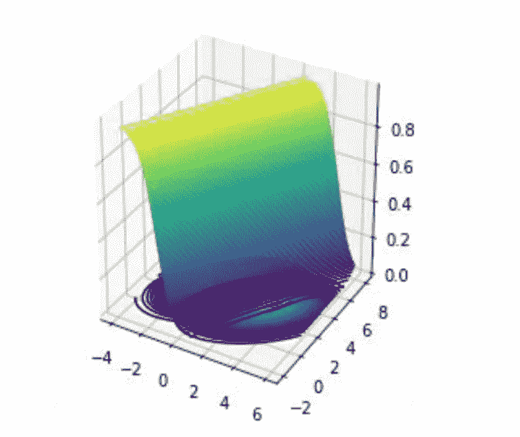
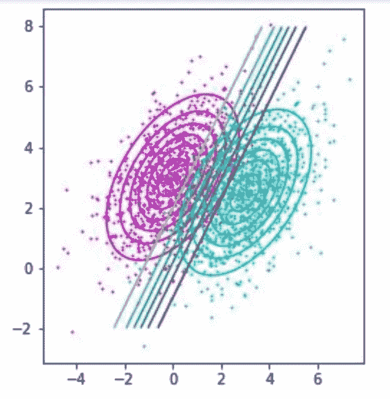
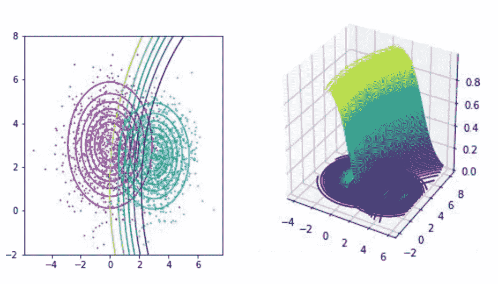
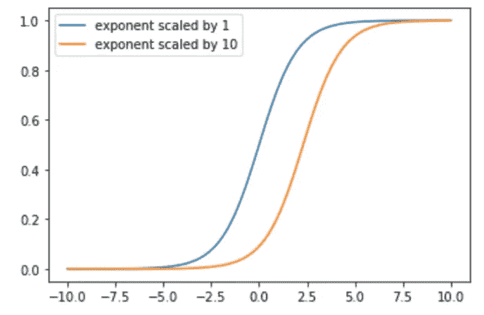

# 绘制高斯分类器的后验概率面

> 原文：<https://towardsdatascience.com/drawing-out-the-posterior-probability-surface-of-a-gaussian-classifier-a1f6044ab5ae?source=collection_archive---------24----------------------->

## 机器学习中的必备知识

## 高斯分类器，探索协方差和先验对后验概率面的影响

作者图片

# **简介**

正态分布的数据在自然界中随处可见。例如，在人类中，我们的身高、智商和出生体重形成了美丽的钟形曲线。**如果已知精确的分布参数，高斯分类器可以完美地估计类成员的概率**。这使得高斯分类器成为一个非常强大的工具。

在这篇文章中，我会多次提到后验概率。它指示分类问题的解决方案，并且是包含空间中的数据点将属于一个类别的概率的表面。更多信息可以在我的贝叶斯定理文章中找到。

# 高斯分布数据

多元高斯分布由两个参数参数化。在一维高斯分布中，这些是标准偏差和平均值。在多元高斯模型中，这些是协方差矩阵(𝛴)和先验矩阵(μ)。在本文中，我分析了当改变这些参数时，后验概率会发生什么变化。

# **来自贝叶斯定理**

后验概率由贝叶斯定理给出，是似然概率和先验概率的函数。如果这些是正态分布，我们除以分子，我们发现后验概率面实际上是 s 形的。

许多人会从神经网络中使用的激活函数中识别出 sigmoid 函数。这里它仅仅代表后表面的形状。

我们可以使用双变量高斯公式扩展上述等式中的“a”项。

所得方程是 x 上的二次方程，但是，我们注意到，当协方差矩阵相同时(𝛴1 和𝛴2)，高阶项相互抵消。结果是 x 上的线性方程。

# 相同协方差

从上面，我们可以得出结论**如果协方差矩阵相同，后验概率轮廓是线性的。这是一个极其重要的结果，因为它意味着这个问题的最优解是一个线性分类器(我在另一篇文章中证明了这等同于正则化最小二乘分类器)。**

让我们想象一下这是什么意思。

作者图片

上面是后验概率曲线。正如你所看到的，从侧面看，它有一个 S 形的形状(就像一个 S 形)。底部是两个二元高斯分布的数据聚类。每个数据点属于每个类别的概率由后验曲面给出。

作者图片

如果我们从顶部看，画出后表面的轮廓，我们可以看到这些是线性的。

# **不同协方差**

如果协方差矩阵不同，sigmoid 函数中的高阶项不会抵消，因此后验概率轮廓将不是线性的。

作者图片

# **先验对后验的影响**

我们已经看到了协方差对后验概率的影响。让我们看看当先验改变时会发生什么。

当查看后验的 sigmoid 中的指数项时，我们可以看到两个分布的先验充当指数项的标量。当缩放 sigmoid 函数中的指数时，表面仅向最高的前一类移动。

作者图片

# **结论**

当处理多元高斯分类问题时，协方差和先验可以改变。如果分布具有相同的协方差，后验概率轮廓是线性的，因此最优决策边界将是线性的。当先验改变时，后验的形状不变，只是在空间上向具有更高先验的类移动。

## 支持我👏

希望这对你有所帮助，如果你喜欢它，你可以[跟随我！](https://medium.com/@diegounzuetaruedas)

您也可以成为 [**中级会员**](https://diegounzuetaruedas.medium.com/membership) 使用我的推荐链接，访问我的所有文章以及更多:[https://diegounzuetaruedas.medium.com/membership](https://diegounzuetaruedas.medium.com/membership)

## 你可能喜欢的其他文章

[可微发电机网络:简介](/differentiable-generator-networks-an-introduction-5a9650a24823)

[傅立叶变换:直观的可视化](/fourier-transforms-an-intuitive-visualisation-ba186c7380ee)