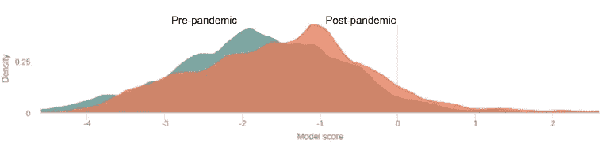
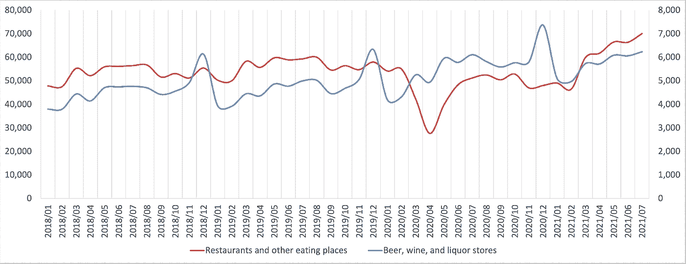
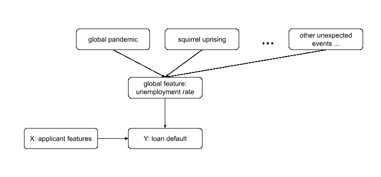
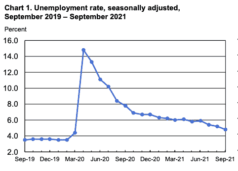

# 机器学习中的漂移

> 原文：<https://towardsdatascience.com/drift-in-machine-learning-e49df46803a?source=collection_archive---------7----------------------->

## 为什么很难，该怎么做

合著者 [Shayak Sen](https://medium.com/u/11f696611617?source=post_page-----e49df46803a--------------------------------)

照片由[格雷格·波尔](https://unsplash.com/@kelloggkid?utm_source=medium&utm_medium=referral)、[米恰斯·维奇日斯基](https://unsplash.com/@wichrzynski?utm_source=medium&utm_medium=referral)在 [Unsplash](https://unsplash.com?utm_source=medium&utm_medium=referral) 拍摄

新冠肺炎疫情引发了人们对机器学习中数据漂移的浓厚兴趣。漂移是一个关键问题，因为机器学习通常依赖于一个关键假设:过去==未来。在现实世界中，这种情况很少发生。因此，无论是在部署模型之前还是在部署期间，了解数据的变化将如何影响模型的行为都是至关重要的。例如，在新冠肺炎疫情期间，由于数据和环境的巨大变化，许多行业的模型都在未知领域运行。

作者图片

在疫情期间，数据科学家看到了如上图所示的模式:模型输出在特定方向上发生了重大转折。并试图回答一些问题:

*   数据中是什么导致了这种转变？
*   这对我的模型质量有什么影响？
*   我需要以任何方式改变我的模型吗？

在地面真实数据不是即时可用的情况下，这个问题变得更加严重，使得在为时已晚之前很难测量模型的准确性。在欺诈、信用风险、营销等情况下尤其如此，在这些情况下，预测的结果只能以一定的滞后量来衡量。

虽然再培训被视为灵丹妙药，但在实践中，如果对根本原因和后果没有足够的了解，再培训可能会导致业绩不佳。在本文中，我们将探讨漂移影响的评估和再培训的细微差别，以帮助数据科学家做好准备，在充满挑战的环境中解决漂移问题。我们首先概述标准漂移术语和方法，以及检测漂移及其后果的困难。然后，我们讨论了理解漂移的本质和根本原因如何在实践中导致有效的缓解。

# 漂移概述

保罗·梅尔基在 [Unsplash](https://unsplash.com?utm_source=medium&utm_medium=referral) 上拍摄的照片

## 漂移为什么会发生？

模型应用的世界和环境可能会不断变化。应用和训练模型的数据可能存在显著差异的一些方式示例如下:

*   外部世界已经发生了变化:这些可能是外部事件，如疫情和利率变动，也可能是更多的内部事件，如导致数据质量问题的模型管道故障
*   该模型被应用于新的上下文:例如，在维基百科数据上训练的语言模型然后被应用于新闻文章。
*   训练数据首先来自不同的集合:这可能是由于样本选择偏差。有时这些偏见是不可避免的。例如，对于贷款申请，ground truth 仅适用于获得贷款的个人。

## 漂移有哪些不同的种类？

当谈到漂移时，可能会出现许多不同的密切相关的术语:协变量漂移、概念漂移、数据漂移、模型漂移、模型衰减、数据集漂移、分布漂移。这些术语指的是关于变化的不同假设。

*   **协变量移位**:输入特征的分布发生变化。
*   **概念漂移**:目标变量和输入特征之间的关系发生变化。
*   **模型衰减**:漂移导致模型性能下降。
*   **数据漂移**:任何分布变化。这有时被用来具体指代**协变量移位**。
*   其他术语(**分布偏移**、**数据集偏移**)通常可以指上述任何概念或它们的组合。

# 识别漂移

照片由[史蒂夫·史密斯](https://unsplash.com/@varrak?utm_source=medium&utm_medium=referral)在 [Unsplash](https://unsplash.com?utm_source=medium&utm_medium=referral) 上拍摄

确定偏差的标准方法是测量模型性能(准确性或其他方面)或检查或测量以下培训和部署分布的差异:

1.  预测产量，
2.  地面真相，
3.  单个输入特征，或
4.  联合输入特征。

这些方法都提供了有价值的漂移信号，应该尽可能使用。然而，在实践中，它们面临着严峻的挑战，使得测量漂移成为一个难题。

**维数灾难—** 随着数据中维数特征数量的增加，区分来自两种分布的样本变得越来越困难。这使得测量多个特征之间的联合漂移特别困难，并且可能影响具有多个输出的多类预测或模型中的漂移测量。诅咒也是为什么直接检查概念漂移(所有输入和输出特征的联合分布的属性)可能不切实际。然而，由于下一个挑战，这可能没有实际意义。

**缺乏地面实况—** 部署中的模型性能测试可能足以确定漂移是否足够大，以保证干预。不幸的是，部署中的实际情况可能不会立即可用。例如，在信贷决策中，一笔贷款是否会导致违约，可能要到贷款期过去几个月或几年后才能知道。在这种情况下，概念漂移不能与其他形式的数据漂移分开独立确定。

**无关紧要的漂移** —通常很难识别模型中漂移问题的影响。通常，特征的较大变化可能无关紧要，因为它以不影响模型行为的方式改变。再加上总会有某种程度的漂移这一事实，很难判断漂移问题是否值得解决。

这些挑战意味着，无论在实践中采用何种检测漂移的手段，它都可能是实际漂移和实际后果的不精确指标。因此，重要的是要注意解决漂移问题的方法的成本。

# 对于漂移我们能做些什么？

照片由 [Unsplash](https://unsplash.com?utm_source=medium&utm_medium=referral) 上的[zdenk Macháek](https://unsplash.com/@zmachacek?utm_source=medium&utm_medium=referral)拍摄

在测量了特征、预测和/或基本事实之间的各种形式的漂移后，我们可以考虑对此做些什么。人们必须问的第一个问题是漂移的后果或根本原因是什么。也就是说，发现漂移的后果是否足以证明潜在的代价高昂的行动？如果是这样，推动漂移的关键因素是什么。当退化可以直接测量时，这当然更简单，但正如我们所指出的，在具有挑战性的情况下，漂移对性能的影响无法确定或只能估计。

**预测漂移—** 发现共同重要的特征也是一个维数灾难问题，并且在几个重要特征之间共同测量漂移也是如此。然而，关注预测输出分布中的漂移似乎是合理的，假设这是一个显著降低维度的概念。重要输入之间的漂移，无论是联合的还是独立的，都应该反映在输出的漂移中。

**根本原因分析**——一旦检测到漂移，这种模型得分偏移，或者准确度下降。重要的是要理解根本原因是什么:哪种特性导致了漂移。测量特征重要性的技术在测量根本原因时是非常宝贵的；重要特性的漂移比不太重要的特性的漂移更有可能导致性能下降。然而，标准特征重要性度量需要针对漂移进行调整，而不仅仅是预测重要性。导致漂移的特征可能与最重要的模型特征不同。

**估计准确性—** 测量漂移的一个圣杯功能是能够将数据中的变化与模型性能联系起来。这是 TruEra 平台基于我们 ML 团队的独特研究提供的一项功能。关键的想法是汇总相应特征的变化，以了解它可能如何影响模型性能。

## 缓解措施

米切尔·奥尔在 [Unsplash](https://unsplash.com?utm_source=medium&utm_medium=referral) 上拍摄的照片

使用额外标签数据进行再训练通常被吹捧为解决数据漂移的标准答案，但根据成本或我们对漂移负面后果的确定性，这可能并不合适。根本原因驱动的理解漂移的方法可以导致更精确的缓解策略。修复数据质量问题

漂移的根本原因通常是部分数据管道被破坏。进行根本原因分析的能力可以快速查明有问题的特性。这些问题可能从意外的丢失值到数据类型不匹配，在大型堆栈中很难找到这些问题。

**移除特征，保留模型—** 处理作为漂移根本原因的特征的一个选项是简单地将它们从模型的考虑中移除，即，用训练均值或模式替换它们。这不需要收集额外的标记数据或重新训练，但可能会导致一些性能损失。然而，如果这种损失低于因漂移而导致的预期退化，则移除可能是最具成本效益的选择。

**移除特征，重新训练—** 在某些情况下，可能会移除漂移特征，并希望重新训练使用替代特征来实现类似的预测能力。但是，请注意，如果备选特征是因果相关的，这将无济于事，备选特征也可能漂移。

**向新数据添加通用功能，重新训练—**

随着时间的推移，美国零售支出在两个方面呈现出周期性和独特的趋势。(百万美元；左轴为红色，右轴为蓝色)。数据来源:census.gov。图片作者。

漂移可能是可预测的，也可能是周期性的(例如上图中的酒类零售支出)。将您的训练数据收集周期跨越更长的周期和出现周期性循环的周期，并且包括指示时间或周期(即，季节、星期几等)的特征，可以产生能够对时间本身的变化做出响应的模型。然而，由于过度延伸的维数灾难，这是有代价的:假设额外的周期特征是必然的，那么模型学习其目标概念与原始特征的关系以及额外的周期特征所需的数据量就会增加。此外，需要更加注意确保数据代表相关的时间段。

**添加罕见事件的缓解者，重新训练—**

隐藏的背景:疫情和突发事件通过失业率对目标贷款违约产生影响。虽然在训练数据中列举所有罕见且有影响的事件是不切实际的，但它们的影响可以通过更广泛可用的变量来减轻。作者图片

虽然一些漂移指标可能很清楚，并不难纳入培训管道，但“未知的未知”必然会不时出现。例如，全局疫情的指示符可能看起来像是许多建模任务的相关特征，包含这样的指示符很可能是一个失败的原因。大撞击事件是独特且不可预测的。这里，特征工程可以受益于基本任务的因果分析，因为可以获得更广泛可用的漂移指标。例如，虽然全球疫情的存在可能是某些类型的贷款偿还减少的根本原因，但中间原因如(失业)就业率也可能起到同样的作用，并且可以作为中介覆盖其他难以计划的意外事件。因此，在训练样本时纳入本地或全球经济指标，可以帮助信贷决策模型对其获得的概念漂移做出响应。

失业率作为疫情和贷款决策之间的缓和因素。图片由美国劳工统计局提供。

**向现有数据添加特征，重新训练—** 另一个成本较低的选择是将额外的特征纳入训练数据集中。如果可以对现有的训练数据集做到这一点，就不必支付标签成本。如上所述，添加指示漂移的特征将要求现有数据跨越足够的时间段。

不管是否需要新的标记数据，漂移指示特征的使用有效地将概念漂移的问题转化为协变量移位的问题。

**重新加权数据，重新训练—** 理论上，输入和标签之间的分布可能代表一个概念，该概念不会因训练时间和部署时间而变化。在实践中，这并不意味着在特定环境或月相下的特定训练算法将从其可用的数据样本中学习它。这种差异的一个原因是训练数据在某些区域没有足够的代表性，因此训练不能提供足够的模型容量。如果部署数据在该区域变得密集(即漂移)，性能可能会受到影响。假设在该区域中至少有一些训练样本，增加它们的权重可以用于帮助随后的再训练在重要的区域中投入更多的模型容量。

# 总结

照片由[米丝蒂·拉德](https://unsplash.com/@arkansas007?utm_source=medium&utm_medium=referral)在 [Unsplash](https://unsplash.com?utm_source=medium&utm_medium=referral) 上拍摄

漂移是数据科学家在部署模型时面临的一个挑战性问题。在这篇博客中，我们概述了使理解和调试漂移具有挑战性的核心原因，以及采取有指导的观点来减轻漂移的方法。

*   地面事实的缺乏使得识别撞击漂移的问题变得更加复杂。
*   识别漂移的各种方法在不同程度上不确定漂移及其对模型性能的影响。
*   漂移根本原因分析工具可以引导数据科学家找到解决漂移的正确解决方案。解决方案可能涉及也可能不涉及标注更多数据或重新训练，可能涉及修复数据管道或调整模型中使用的功能。