# 漂移指标:如何选择正确的指标来分析漂移

> 原文：<https://towardsdatascience.com/drift-metrics-how-to-select-the-right-metric-to-analyze-drift-24da63e497e?source=collection_archive---------8----------------------->

在我们的上一篇文章中，我们总结了机器学习部署中的漂移问题([“机器学习中的漂移:为什么很难以及该怎么办”](/drift-in-machine-learning-e49df46803a)《走向数据科学》)。这篇文章的一个要点是:处理漂移的方法必须确定漂移是否以及如何对模型性能产生*后果*。在这方面，数据科学家必须做出的一个关键选择是*，即*漂移指标以用于他们的特定情况。在本文中，我们进一步研究如何选择使用哪些漂移指标。

# 问题是

形式上，假设我们有两个经验分布(即数据集):模型输入 X₁与相应的标签 y₁；还有 X₂，还没有标签。我们可以生成模型输出ŷ₁和ŷ₂.我们现在必须决定，*₁与*₂的差异是否足以让我们担心数据漂移，我们在 y₁x₁训练的模型是否很适合在 X₂.表现良好

数据肯定已经发生了变化，对于至少有一些数字或连续特性的分布，很可能在训练和部署输入之间没有一个共同的实例。我们试图通过一次查看单个特征或一小组特征来避免维数灾难。

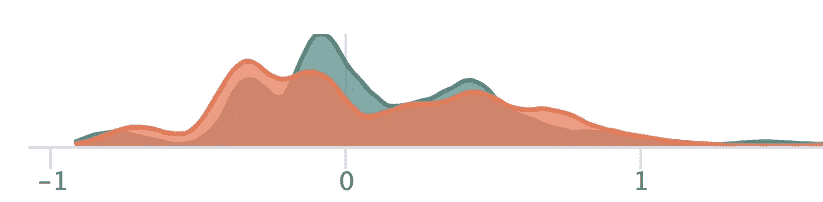

疫情前后要素的密度可视化。改变了多少？图片作者。

漂移度量从两个数据集获取特征值，并为我们提供一个差异度量，一个实数通常表示值越大差异越大。在决定正确的指标时，我们需要问的问题包括:

*   它适用于数据类型吗？
*   它是否带有有意义的单位或者有其他方便的解释？
*   它是否对数据分布做了任何假设？
*   它是否捕捉到小概率事件/值的差异？
*   有没有现成的实现可以用在我的项目中？

在本文的剩余部分，我们将考虑这些问题和几个相关的度量标准:它们适用于什么类型的特征:分类的还是数字的，大多数度量标准的解释或基础理论来自信息论或统计学，罕见事件的处理，假设和可调参数。虽然我们详细阐述了这些方面，但重要的是要认识到，任何指标，作为将数据集之间的复杂差异汇总到单个数字中的方法，只能提供可能的数据转移类型的狭隘观点。

# 功能类型的度量

## 数字特征

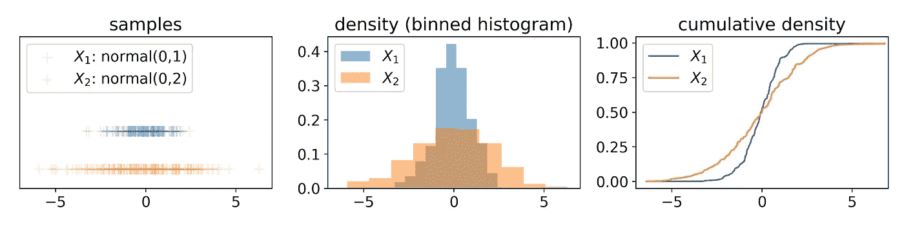

正态分布的 200 个样本的样本、直方图和累积密度图，是测量数字特征之间漂移的基础。图片作者。

测量数字特征之间差异的漂移度量(通常)将数据集视为样本集、分箱密度或累积密度。其中最简单的只是比较常见的聚合统计数据，如数据集间的平均值:

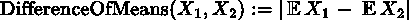

当基础数据以这种集合很好地概括的方式分布时，这种度量可能是有用的(即，如果 X₁和 X₂是正态分布的，均值和标准差之间的差异提供了它们之间差异的完整说明)，但数据很少很好地分布，这些度量可能会遗漏重要的差异。

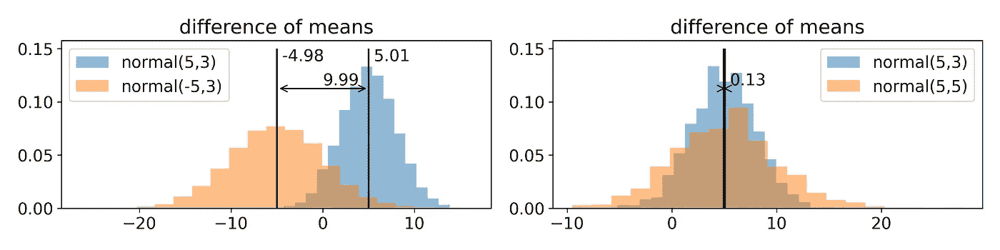

均值差异有意义(左)和无用(右)的情况。比较 2000 个正态分布样本的直方图。图片作者。

在数学意义上，总体统计数据中的差异(如平均值中的差异)不是度量标准。每当 X₁ = X₂时，度量标准通常要求 M(X₁，X₂) = 0，这也是测量漂移的理想特征，并且是均值差不考虑的特征。一个度量标准是[推土机距离](https://en.wikipedia.org/wiki/Earth_mover%27s_distance)或瓦瑟斯坦距离。这个定义不是很有见地，但“推土机”的同义词是:该度量标准测量需要移动多少土(概率密度)以及将一种分布转换成另一种分布需要多远(以 X₁'s 域为单位)。在 scipy([wasser stein _ distance](https://docs.scipy.org/doc/scipy/reference/generated/scipy.stats.wasserstein_distance.html))中有一个实现。

## 分类特征

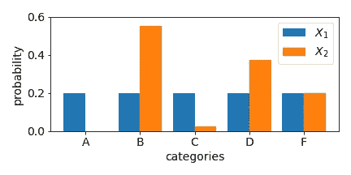

分类特征的两种分布，是测量分类特征漂移的基础。图片作者。

适用于分类特征的漂移度量(通常)将经验数据视为离散分布。这些是根据与分布中感兴趣的给定特征的每个分类值相关联的概率来定义的。从规范中导出的度量就是这种度量的例子:

基数 p 通常是 1、2 或无穷大。我们将在下面的可解释性部分进一步讨论这些距离。规范在包括 numpy ( [linalg.norm](https://numpy.org/doc/stable/reference/generated/numpy.linalg.norm.html) )的数值库中实现。

适用于分类特征的另一组度量是信息理论度量的离散版本，我们将在下一节中讨论。

# 度量起源和可解释性

一些距离测量比其他的更容易解释。度量的起源与我们可以应用的解释或直觉密切相关。我们在这里讨论共同的起源和相关的解释。

上述*差异是指*或任何可解释的总体统计数据的差异，其优点是可根据各自的总体(即平均值、偏差等)进行解释。).

*运土机*距离有一个解释，正如本文前面提到的，可以给出可解释的单位。如果特征 X 以单位 u(美元、英里等)来测量，那么推土机距离也以 u 来测量(技术上它包括一个无单位概率的因素),并捕获分布必须移动多远(以 u 为单位)以相互匹配的预期值。这有一些好处，也有一些弊端。解释“5000 美元”的推土机距离可能需要对潜在特征有一些了解，因为这可能是一个小的变化，也可能是一个大的变化，取决于该特征代表什么。如果分析师确实有一些关于该特征的线索，并且能够将这样的数量与他们的经验联系起来，这也是一种优势(例如，如果该特征是“年薪”，那么“5000 美元”的距离应该能够被典型的数据科学家直观地解释)。

## 统计数字

“这些分布是相同的吗”这个问题经常在统计领域被发现和回答。一些所谓的“测试”因此找到了测量漂移的方法。例子包括 [Kolmogorov-Smirnov 检验](https://en.wikipedia.org/wiki/Kolmogorov%E2%80%93Smirnov_test)和相关统计，以及[卡方检验](https://en.wikipedia.org/wiki/Chi-squared_test)。基于统计的方法的一个好处是它们可以用置信度或 p 值来解释；不仅表明分布有多大差异，而且表明对观察结果的信心。这两种测试都可以在 scipy 中获得( [kstest](https://docs.scipy.org/doc/scipy/reference/generated/scipy.stats.kstest.html) 、 [chisquare](https://docs.scipy.org/doc/scipy/reference/generated/scipy.stats.chisquare.html) )。

## 信息论

另一类度量来自信息论。最合适的是[詹森-香农距离](https://en.wikipedia.org/wiki/Jensen%E2%80%93Shannon_divergence)。虽然该领域的特点是众多的分布差异的措施，他们的范围往往是无限的，或者他们是不对称的。JS 距离是相对熵(或 [Kullback-Leibler 散度](https://en.wikipedia.org/wiki/Kullback%E2%80%93Leibler_divergence))的对称有界变量，范围为 0-1。这些度量的另一个重要方面是，由特性获得的值并不重要，重要的是它们的概率。例如，对于分类特征， *Jensen-Shannon* distance 不会在意您是否改变了特征值，只要概率集保持固定。

从信息论中导出的度量可能与“比特”或“尼特”的单位相关联(取决于所使用的对数基数，分别是 2 或 e)，但是我们在此注意到的相对度量不如熵本身那样容易解释，熵本身与编码长度相关联，因此可以说定义了单位“比特”。

scipy ( [熵](https://docs.scipy.org/doc/scipy/reference/generated/scipy.stats.entropy.html)， [jensenshannon](https://docs.scipy.org/doc/scipy/reference/generated/scipy.spatial.distance.jensenshannon.html) )中提供了这些度量的实现。它们应用于分布(即概率列表)，因此只对分类特征进行操作。在**假设或参数** 部分，我们将讨论它们在数字特征中的应用。

## 其他解释来源

从技术上讲，有些度量可以用无单位概率来解释。这可能不像运土机中的特征单位那样直观，但它可能提供一些洞察力。将经验分布解释为实际概率分布的几个度量对分类特征进行操作，产生可解释为概率的值。这包括上面提到的 1 范数和无穷范数距离以及[总变差距离](https://en.wikipedia.org/wiki/Total_variation_distance_of_probability_measures)(等于 L₁范数距离的一半)。例如，L₁告诉我们所有类别概率的总差异。另一方面，L∞，告诉我们最不同类别的概率差异。

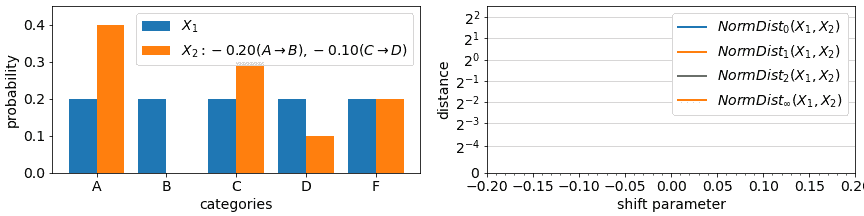

演示了各种基础的标准距离。均匀分布特征的质量在值 A/B 和值 C/D 之间以一半的速率移动，而值 F 的质量不变。图片作者。

p-范数距离具有空间解释，但它们适用于概率值。如果分布是坐标(每个概率是一个维度)，那么 1 范数距离对应于[曼哈顿距离](https://en.wikipedia.org/wiki/Taxicab_geometry)，而 2 范数距离是[欧几里德距离](https://en.wikipedia.org/wiki/Euclidean_distance)。虽然空间解释可能不太直观，但这种规范的这一特性更有用:

*   在较大的基数中，p-范数距离强调最不同维度/概率的差异。在极限∞-范数下，距离变成:

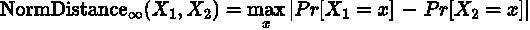

*   在较小的基底中，p-范数距离强调差异中涉及的维数。在 0 范数的极端情况下，距离变成了概率变化的计数，而不管变化了多少。不过，我们警告说，0 范数对于测量漂移是没有用的，因为它对微小的变化都很敏感。

除了单位或概率，一些指标被限制在一个固定的范围内。本文中提到的所有指标的最小值为 0，表示最小可能差异(或相同分布)，除了*差异指标*和推土机，以上所有指标的界限为 1、sqrt(2)或其他一些最大值，表示最大可能差异。

# 假设或参数

使用上述*差异法*中的聚合统计来区分分布带有假设。具体地说，平均值足以描述两种分布中分布和差异。即使正态分布也需要额外的变量来完全描述，这在一般情况下限制了这种度量的信息量。然而，简单的总体差异仍然是有用的，因为它们易于解释(下面讨论)。当描述一个数字数据集时，统计平均值可能是我们首先想到的，而且我们经常不需要考虑更多。

另一类假设来自使用离散化为连续分布定义的度量的近似值。相对熵和 Jensen-Shannon 距离等信息论度量对于分类特征来说计算起来很简单，但对于连续特征来说是用积分来正式定义的。此处的一个快速解决方案是将连续值要素离散化到条柱中，并对结果应用离散分布版本的度量。然而，这现在引入了可以影响结果的参数(例如，箱的数量)。虽然各种经验法则建议宁滨策略(见[箱和宽度](https://en.wikipedia.org/wiki/Histogram#Number_of_bins_and_width))，但它们往往会导致高估漂移。

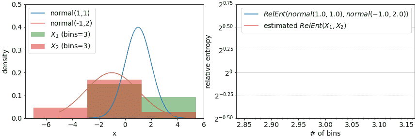

宁滨经验 1000 样本对两个正态分布之间相对熵的估计，作为箱数的函数。突出显示了几个箱子数量的“经验法则”。还显示了解析导出的相对熵的真实值。图片作者。

当容器数量设置过高时，指标会失效。产生的漂移结果倾向于仅仅是箱数的函数，而不是所涉及的实际经验分布。

另一种不易受宁滨影响的方法是通过(核)密度估计:用函数拟合观察到的密度，并评估这些估计密度之间的距离，而不是面元频率。虽然计算估计值之间的距离也需要宁滨，但是该设置变得不太重要，并且在某些情况下可以设置为任意高(至少对于正常距离)。

使用密度估计也依赖于参数:使用什么样的函数来估计密度？一种常见的方法是通过带宽参数化的高斯混合。下图展示了这种方法的一个示例，左边是样本的真实密度和估计密度，右边是结果距离。设置带宽的经验法则也是可用的(参见[内核密度估计带宽的重要性](https://aakinshin.net/posts/kde-bw/))。

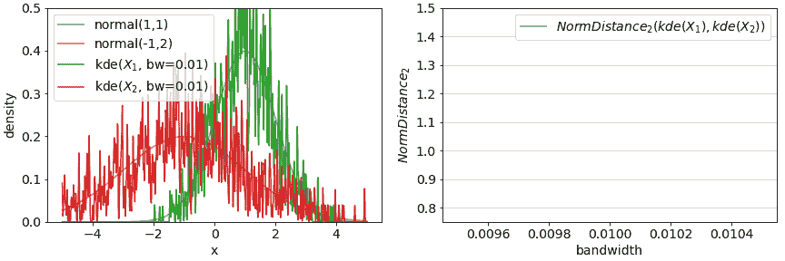

1000 个大小的法线样本的混合高斯估计和作为带宽函数在估计之间计算的 NormDistance₂。使用 100 个箱来完成距离计算。图片作者。

numpy 和 sklearn 通过[直方图](https://numpy.org/doc/stable/reference/generated/numpy.histogram.html)和[内核密度](https://scikit-learn.org/stable/modules/generated/sklearn.neighbors.KernelDensity.html)以及本文前面提到的统计或信息理论方法提供了实现简单宁滨方法和内核密度估计方法所需的大多数底层工具。

# 稀有值

我们在本文中讨论的漂移指标的最后一个方面是罕见事件(罕见值)变化的影响。在大多数指标中，分类值的任何变化(很少开始)的影响是最小的，与其在被比较的数据集中的概率成比例。如下面的示例动画所示，在训练过程中，只有 10%的实例值为“rareA”的分类特征通常对漂移测量只有 10%的影响，即使在部署数据中，该值的实例数减少到 0%。另一方面，在一些度量中，概率变化被认为是相对于彼此的(倍增的),并且从 10%到 0%的变化是显著的。

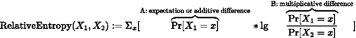

相对熵定义中的加法和乘法差项。

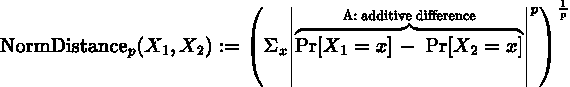

NormDistances 只有加法差项。

在示例度量定义的引擎盖下，*相对性和正态距离*，我们看到两个元素:对训练分割值的期望(A 部分)或训练/测试概率之间的加性差异(如在*正态距离*中)，以及在某些情况下，比较训练值与测试值的概率的相对分量(B 部分)。第一项负责限制稀有值的影响，而后者可以在稀有值的相对概率显著变化时突出稀有值的差异。大多数分类指标都以 A 部分为特征，但并不是所有的都以 b 部分的相关部分为特征。

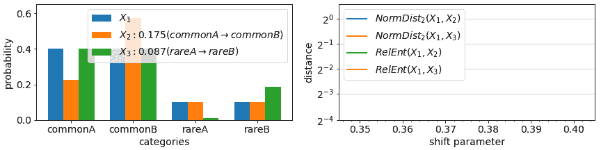

L₂范数距离(无乘性差项)和相对熵(有乘性差项)对偏离 X₁的 X₂和 X₃两个分布的漂移测度的比较：X₂在普通值之间转移权重，而 X₃在稀有值之间转移权重。稀有值的偏移相对较大。注意*x₁→x₂的 NormDistance* 较大，而 X₁ → X₃.的相对 neutropy 较大图片作者。

以 B 为特征的度量包括相对熵、Jensen Shannon 散度和种群稳定性指数。对于一些指标，在数据集之间事件从> 0%到 0%表示的情况下测量的漂移在技术上可能是不受限制的(由于在定义中除以 0)。人们可以通过在所有概率中加入小的附加常数或者至少在分母位置加入一个常数来避免这些。

# 总结

*   各种漂移指标可以帮助您检测和量化数据漂移，这些指标具有不同的应用、解释、来源和其他可能对您的应用非常重要的方面。
*   对指标的解释各不相同，对指标来源领域的一些了解可能有助于理解这些指标。
*   度量标准通常是近似值，尤其是数字或连续特征的度量标准，并且可能做出一些便于计算的假设，并且可能需要设置参数。
*   虽然一些指标没有捕捉到罕见类别中相对较大的漂移，但其他漂移指标能够突出此类变化。

以下列表总结了本文中提到的漂移指标和我们讨论过的显著特征，供您参考:

## 正常距离

*   原点:几何体
*   特征类型:分类，*带假设的数字
*   释义:距离；p=0(不推荐)；p=1(曼哈顿距离)；p=2(欧氏距离)；p=∞(最大概率移位)
*   相对:没有
*   工具:numpy [linalg.norm](https://numpy.org/doc/stable/reference/generated/numpy.linalg.norm.html)

## 相对熵/库尔贝克-利布勒散度

*   起源:信息论
*   特征类型:分类，*带假设的数字
*   解释:比特/单位，排列不变
*   亲戚:是
*   工具:科学熵

## 詹森-香农距离

*   起源:信息论
*   特征类型:分类，*带假设的数字
*   解释:比特/单位，排列不变
*   相对:是*(技术上是但实际上不是:JS 距离使用一个输入分布和两个输入分布中点之间的相对熵；结果是，即使一个消失的值也将具有有限的影响，因为它的相对项被 1 所限制
*   工具:scipy [jensenshannon](https://docs.scipy.org/doc/scipy/reference/generated/scipy.spatial.distance.jensenshannon.html)

## 总变化距离

*   起源:概率论
*   特征类型:分类，*带假设的数字
*   解释:与基数为 1 的正常距离相同
*   相对:没有
*   工具:numpy [linalg.norm](https://numpy.org/doc/stable/reference/generated/numpy.linalg.norm.html)

## 差异含义

*   来源:统计
*   特征类型:数字
*   解释:与特征值相同的单位
*   相对:没有
*   工具:numpy [的意思是](https://numpy.org/doc/stable/reference/generated/numpy.mean.html)

## 推土机距离/瓦瑟斯坦距离

*   特征类型:数字
*   解释:与特征值相同的单位
*   相对:没有
*   工具:scipy[wasser stein _ distance](https://docs.scipy.org/doc/scipy/reference/generated/scipy.stats.wasserstein_distance.html)

## 科尔莫戈罗夫-斯米尔诺夫试验

*   来源:统计
*   特征类型:数字
*   解释:可用的统计置信度
*   相对:没有
*   工具:scipy [kstest](https://docs.scipy.org/doc/scipy/reference/generated/scipy.stats.kstest.html)

## 卡方检验

*   来源:统计
*   特征类型:数字
*   解释:可用的统计置信度
*   相对:没有
*   工具:剪刀[卡尺](https://docs.scipy.org/doc/scipy/reference/generated/scipy.stats.chisquare.html)

## *数字特征的分类度量

*   工具:numpy [直方图](https://numpy.org/doc/stable/reference/generated/numpy.histogram.html)，sklearn [内核密度](https://scikit-learn.org/stable/modules/generated/sklearn.neighbors.KernelDensity.html)