# 在你“先放下”之前，读读这个

> 原文：<https://towardsdatascience.com/drop-first-can-hurt-your-ols-regression-models-interpretability-4ca529cfb707?source=collection_archive---------9----------------------->

## 如果您关心模型的可解释性，请考虑从一个热编码的列中删除哪个类别

[粘土银行](https://unsplash.com/@claybanks?utm_source=unsplash&utm_medium=referral&utm_content=creditCopyText)在 [Unsplash](https://unsplash.com/s/photos/select?utm_source=unsplash&utm_medium=referral&utm_content=creditCopyText) 拍摄的照片

# 概观

作为一名数据科学的学生，我最近学习了如何使用普通最小二乘(OLS)线性回归对变量交互进行建模。让我感到奇怪的是，在分析分类变量时，避免[虚拟变量陷阱](https://www.learndatasci.com/glossary/dummy-variable-trap/)的常见建议是简单地删除基于字母数字类别标签的第*列。*

我的直觉是，我们选择删除哪一列在一定程度上很重要。如果真的有关系，因为标签排在第一位而删除一列似乎非常武断，也不是特别科学。

我发现，虽然有大量的 web 资源描述了为什么在这个场景中我们要删除一个列，但是很少有人试图解决选择哪个列的问题。因此，为了满足我的好奇心并加强我对 OLS 线性回归的理解，我创建了一些实验数据并测试了删除不同列的结果。我的目标是确定:

*   我们放弃哪个是否重要(我的假设是肯定的)；和
*   如果有关系，数据科学家在选择合适的色谱柱时应该考虑哪些因素。

对于那些想直奔主题的人，我的分析揭示了:

> 虽然删除的列似乎不会影响 OLS 线性回归模型的性能，但它会对模型系数的可解释性产生重大影响。

准备普通最小二乘多元线性回归模型的数据科学家应仔细考虑从每个类别中删除哪些列*，如果他们的分析目标包括*:

*   对标准化系数进行排序，以推断预测因素对目标变量影响的相对大小或重要性(例如，“平方英尺或卧室数量是否会增加房屋销售价格？”)
*   准确理解预测变量的单位变化如何影响目标(即“每增加一平方英尺居住空间，房屋销售价格的平均涨幅是多少？”)
*   向非技术风险承担者解释上述结果。

任意删除第一列而不考虑它所代表的内容，不仅会使解释模型系数变得困难，而且还会使非技术涉众难以理解。

数据科学家不应依赖于删除第一列的惯例，**应考虑删除代表逻辑基线参考点的列，模型将假设所有包含的预测变量偏离这些参考点**。在某些情况下，最小值可能是合适的，在其他情况下，平均值可能是合适的，而在其他情况下，合适的参考类别可能完全取决于分析的目标。

下面，我首先提供一些背景，然后概述我得出这些结论的步骤。我的方法和分析的全部细节可以在[我的 github repo](https://github.com/thetriggestcove/testing-ohe-var) 中找到。

# 背景

## 什么是一键编码？

为线性回归模型准备数据时，有必要将分类变量虚拟化或一键编码(OHE)到单独的列中，以将非数值表示为数字。

例如，表示性别的分类变量将从一个单独的列转换为多个一键编码的列，这样命名是因为值 1 表示该类别中的成员资格，其余的类别列用零填充。

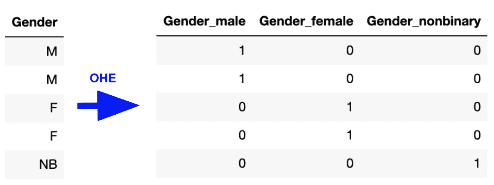

示例一-热编码(OHE)转换

## 为什么要删除任何列呢？

当学习线性回归时，数据科学的学生被教导从每个分类变量组中删除一列作为参考类别，并避免“虚拟变量陷阱”:预测值之间的完美多重共线性。

在我们的示例中，我们可以删除女性、男性或非二进制，并在模型中保留其他两列。

正如[这篇文章说明的](https://inmachineswetrust.com/posts/drop-first-columns/)如果我们不删除一列，用线性代数根本不可能解决 OLS 问题，因为我们会有一个奇异矩阵。尽管 scikit-learn 和 statsmodels 库使用不同的算法来求解 OLS，所以从技术上来说，如果我们不从每个类别中删除一列的话,*可以生成模型，但这样做仍然被认为是最佳实践。在我的实验中，我包括了没有删除列的模型来说明奇怪的结果。*

如果数据集包含多个分类变量，则应从每组生成的 OHE 列中删除一列。在本文中，我将讨论删除“一列”，这应该理解为每个分类变量组中的一列。

请注意，从 OLS 线性回归模型中删除一列是必要的，但对于其他模型类型可能没有必要(甚至是不明智的)。这里得出的结论适用于 OLS 线性回归模型。

## 任意丢弃“第一”

Pandas 和 sckikit-learn 等 Python 库在它们的 one-hot-encoding 方法中内置了参数，允许我们从每个分类组中删除一列。一种常见的方法是先删除，即删除集合中字母数字顺序第一个出现的代表类别值名称的列。在我们的性别示例中，第一列是女性，因为 F 在 M 和 n 之前。

事实上，先放弃似乎是一个如此普遍的约定，以至于[熊猫](https://pandas.pydata.org/docs/reference/api/pandas.get_dummies.html)和 [scikit-learn](https://scikit-learn.org/stable/modules/generated/sklearn.preprocessing.OneHotEncoder.html) 都有方便的常数可以用来这样做，所以你不必弄清楚第一个类别是什么。

但这真的是在所有情况下选择一个变量丢弃的最佳方式吗？在接下来的小节中，我将介绍如何创建数据来测试这一点，并得出结论，删除第一列并不总是最佳选择。

# 创建测试数据集

我根据房屋特征和销售情况创建了一个 n=20，000 的测试数据集，其中我的 OLS 线性回归模型将尝试预测房屋的最终销售价格。

首先，我生成了独立(预测)变量:

*   **居住面积平方英尺**:服从正态分布的随机生成的连续变量，平均值约为 2800。为了生成价格，我应用了每平方英尺 100 美元的固定系数。

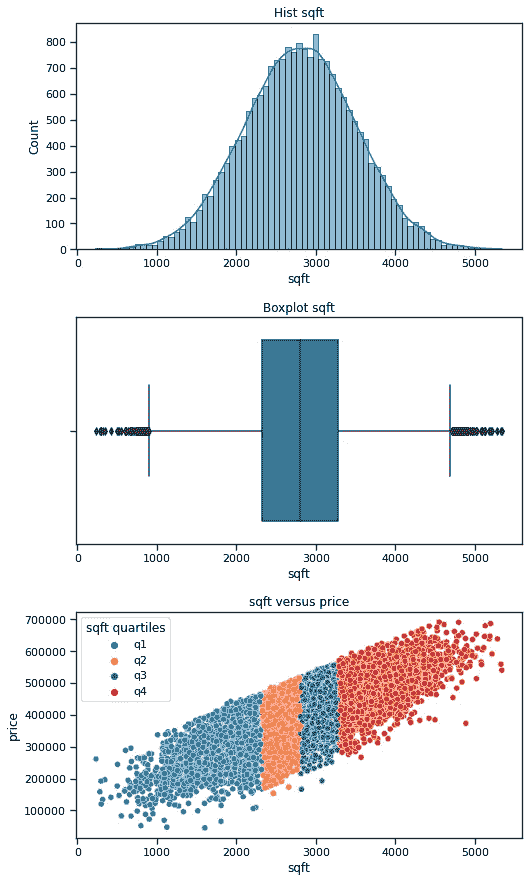

平方英尺与价格的直方图、箱线图和散点图

*   **邮政编码**:具有大量类别的分类变量(70)。我用正态分布的随机数创建了乘数来控制每个邮编对价格的影响程度，并随机将它们分配给相当均匀的几组房屋。“第一个”邮政编码类别 30000 被设置为从平均价格中扣除最多，因此它代表最小贡献或最大扣除，这取决于您的观点。平均邮政编码类别(30066)对价格的贡献很小，最高的增加最多。

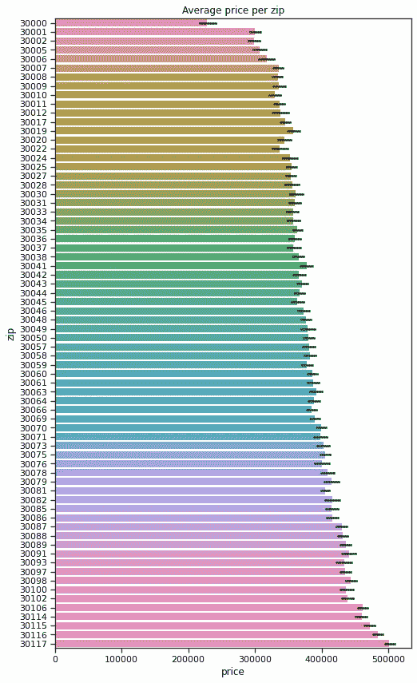

每个邮政编码类别的平均价格，从低到高排列

*   **条件**:变量个数较少的分类变量(5):差、低于平均、一般、高于平均、优秀。我设计了乘数，这样平均条件不会给价格增加任何东西；贫穷和低于平均水平减损；高于平均水平和优秀增加。不是将房子分成 5 个相当均匀的组并分配条件(就像我用邮政编码做的那样)，而是 70%的房子被分配到平均条件类别，10%的房子被分配到平均水平以下和以上，5%的房子被分配到差和优秀。

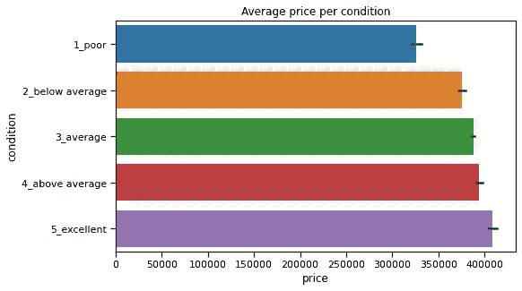

每种条件的平均价格

*   **一周中的某一天(DOTW)** :一个变化无常的变量，它对价格的贡献没有任何特定的模式(我只是为每一天编了系数)。我测试了从我的模型中排除这一点，以减少模型应该能够解释的目标的可变性，使其更加现实。

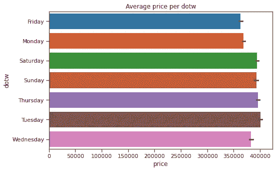

每 DOTW 平均价格

随着我的平方英尺值的随机生成，房屋被分配到上述类别，我应用乘数来生成价格。我使用 100，000 美元的起始基线(这成为预期的 y 截距)，并将分类乘数应用于 50，000 美元的常数。

我现在有了一个目标变量 Price，它是基于每个预测变量的已知系数生成的。

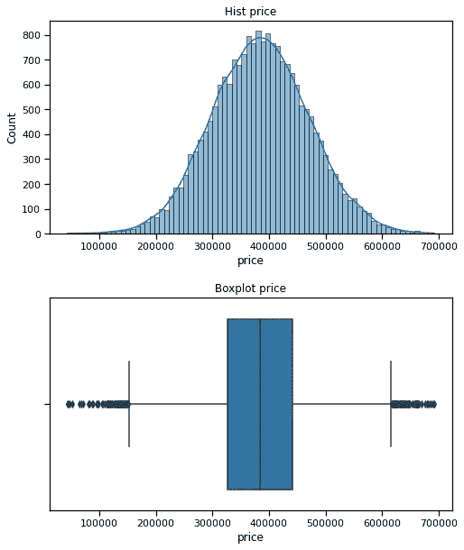

目标可变价格的直方图和箱线图，由预测系数生成

我记录了每个预测值类别的原始单位的预期系数，以及连续变量平方英尺的标准化单位(标准差)的系数。这使我能够将每个模型的结果与预期的系数进行比较。

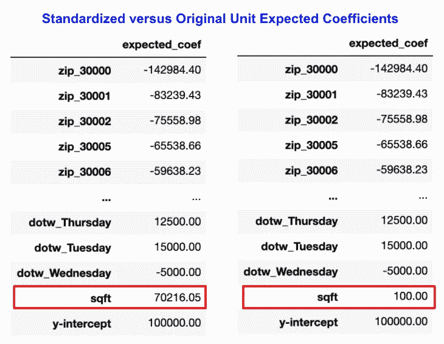

左边是标准化的预期系数，右边是原始单位。它们对于分类变量是相同的，只有平方英尺不同，因为分类变量不需要进一步标准化。

# 建模

我的主要问题是从模型中删除类别列(即用作模型的参考点)是否会影响模型的结果。我想测试删除第一列，因为这是常见的约定，作为替代，我想删除代表平均类别的一列:平均房价最接近人口平均值的类别。

我对三种不同类型的结果感兴趣:

1.  性能—训练和测试的 R 平方和 RMSE
2.  可解释性——标准化系数的准确排名
3.  可解释性——准确直观的原始单位系数

所以我至少需要:

*   两种不同的模型来比较删除第一列与平均值
*   比较标准化系数和原始单位系数的另外两个模型

我决定也运行不删除分类列的模型，看看会发生什么。最后，我改变了是否在模型中包含 DOTW 变量，其中包含它应该允许模型预测 100%的目标可变性，而排除它会引入一些误差，应该稍微更现实一些。

最终，我用这些不同的参数遍历了 12 个模型，然后查看了结果。

# 模型解释和结论

为了评估性能，我使用了训练-测试分割，并生成了训练和测试的 R 平方、残差平方和(RSS)和均方根误差(RMSE)。

为了评估可解释性，我将测试模型系数与预期进行了比较，回顾了测试模型之间的差异，并考虑了我的自然结论的准确性。

## 表演

能够在给定独立变量的情况下预测目标是线性回归模型成功的关键衡量标准之一。

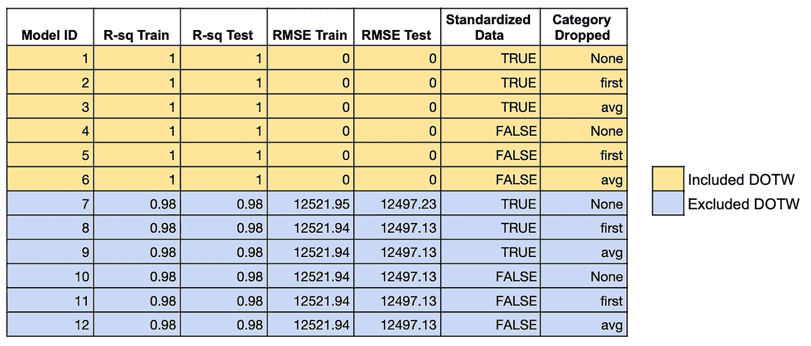

每个模型的性能统计 R 平方和 RMSE。我们可以看到，当混杂变量 DOTW 被包括在内时，所有版本的模型都是完美的。当我们不包括 DOTW 时，我们会看到一些如我们所料的误差，但改变类别或数据是否标准化并不影响结果。

在前 6 个模型中，我包括了“星期几”变量，在后 6 个模型中，我没有包括它，所以它将作为一个混杂变量。

尽管数据处理方式的其他方面各不相同，如数据是否标准化以及删除了哪个类别，但这些因素对 R 平方、均方根误差或残差平方和没有明显影响(为简洁起见，上面未显示)。换句话说，前 6 款看起来一样，后 6 款看起来也一样。

在没有“星期几”变量的情况下运行的模型并不完美，这具有直观的意义。但是在我排除 DOTW 的情况下，这些模型之间似乎没有任何区别。它们有相同的 R 平方和 RMSE。

我的结论是，改变从模型中删除的类别列不会影响模型的性能。

## 可解释性——准确排列标准化系数

我们可能希望能够使用我们的模型的另一种方式是对标准化系数进行排序，以比较它们对目标的影响大小，或者它们的重要性。目标是确定哪些变量在更大程度上增加或减少目标。对连续变量进行标准化很重要，这样它们的系数就可以用标准偏差单位进行比较。

这些见解与领域知识相结合，可能有助于业务利益相关者决定适当的行动计划。如果他们的目标是调整预测因子来影响目标，知道哪些预测因子具有最大的影响是关键。

为了衡量我们模型的分级系数的准确性，请考虑下面的热图。虽然每个模型的热图都使用自己的颜色渐变比例，但是我们希望测试模型的渐变顺序与预期模型的渐变顺序相匹配。

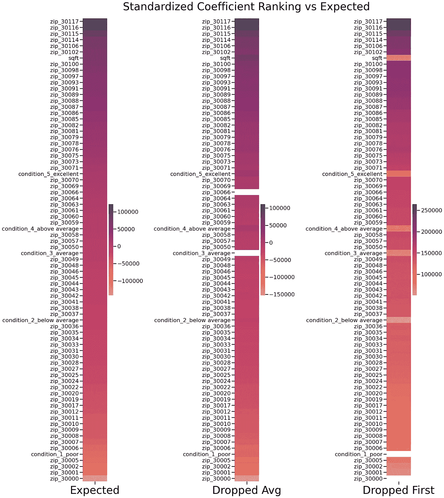

将测试模型的标准化系数与预期系数进行比较。不包括 y 轴截距。

在这两个模型中，邮政编码看起来很好地遵循了预期的顺序。但是在 Dropped First 模式下，条件类别和平方英尺看起来不太对；它们的颜色从渐变中突出，因为它们的标准化系数比我们预期的要低得多。

在平均下降模型中，所有的预测变量看起来都非常接近。

请注意，两个测试模型的 y 截距与预期有很大不同。事实上，下降平均模型的 y 截距非常不同。但是我们不太可能关心 y 轴截距的准确排序；我们可能最关心的是实际预测变量系数的排名。

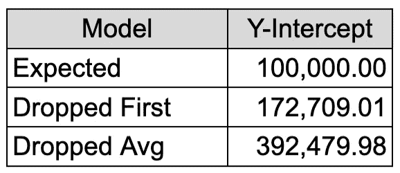

让我们去掉邮政编码类别，放大其他类别。

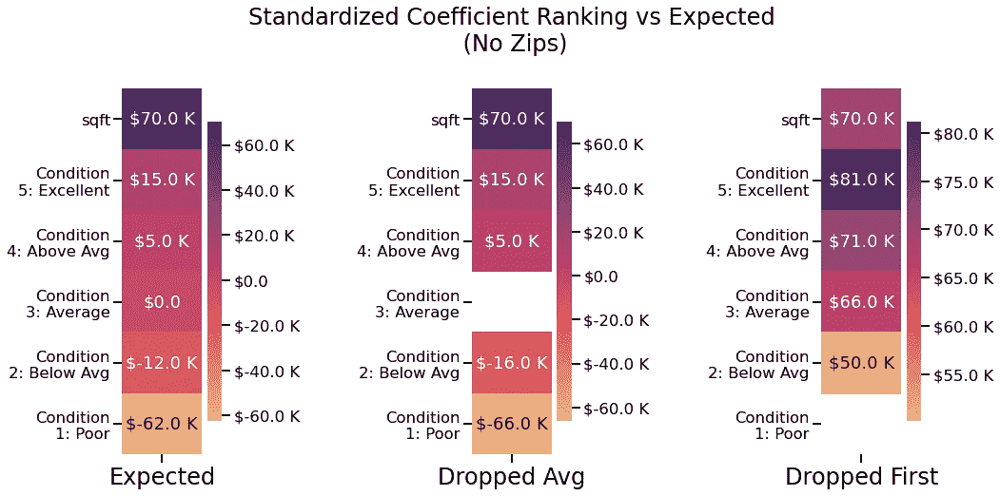

如果我们把它们从邮政编码的上下文中取出来，它看起来确实像两个模型预期的条件类别匹配的顺序。换句话说，优秀的条件比平均水平高，等等。

然而，平方英尺应该比良好的条件多增加大约 55000 美元的价格。我们看到这种差异在下降平均模型中相当准确，但在下降第一个模型中，优秀条件的排名高于平方英尺。

如果我使用标准化下降平均模型来估计哪些变量对价格上涨更重要，我会相当准确。

但是，如果我使用标准化的 Dropped First 模型来估计这一点，我会假设邮政编码大体上是最重要的，其次是条件良好，然后是平方英尺。这不会很准确。

## 准确直观地解释原始单位系数

我们也可能对使用原始单位的系数感兴趣，这些系数来自我们没有标准化数据的模型，以了解每个预测变量的每个单位的目标变量如何变化。

例如，我们希望能够使用与平方英尺相关的系数来表示“每增加一平方英尺，价格就会上涨大约 100 美元。”

我创建了类似的热图来检查原始单位系数的准确性。请注意，在这个可视化中，两个测试模型的色阶都被强制匹配预期的模型，因此我们可以通过直接比较阴影来比较这些值。这里，我们关心的是系数的准确性，而不是标准化系数，标准化系数更关心排名顺序。

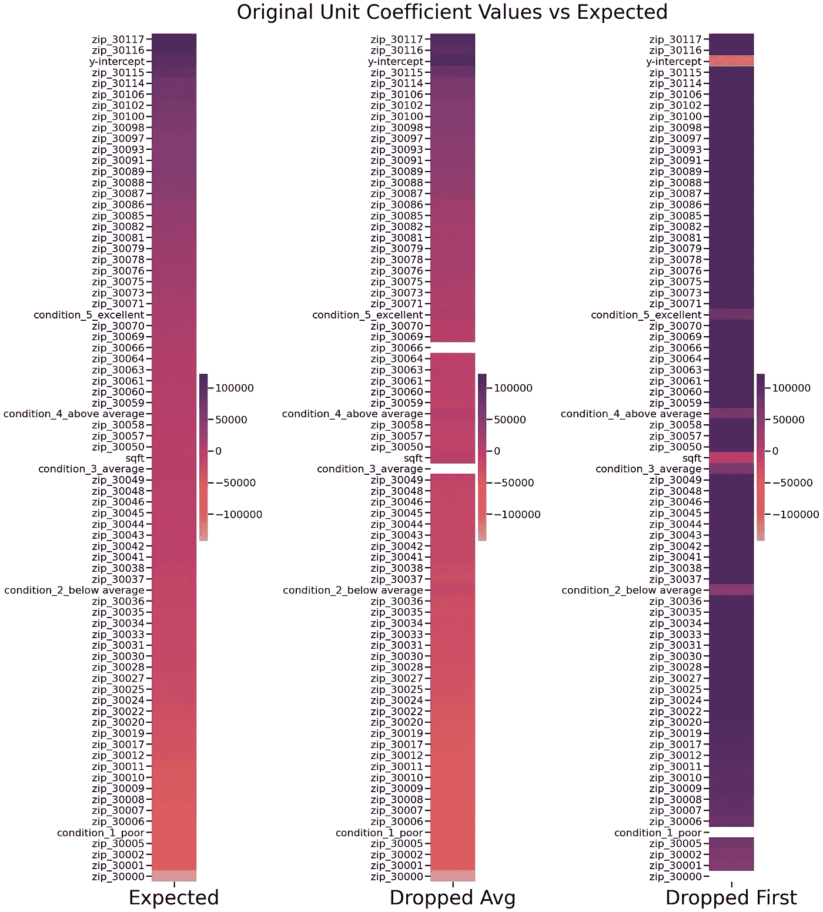

要比较系数值，请直接比较颜色深浅

我们可以看到，下降平均模型的系数非常接近预期值。它的颜色和预期的非常相似，而且顺序正确。

然而，在丢弃的第一个模型中，y 截距非常低，这导致大多数其他系数过高，无法弥补。

我们可以看到平方英尺系数非常接近，但邮政编码值相当高，很难确定条件属于哪里。让我们去掉邮政编码来放大其他变量。

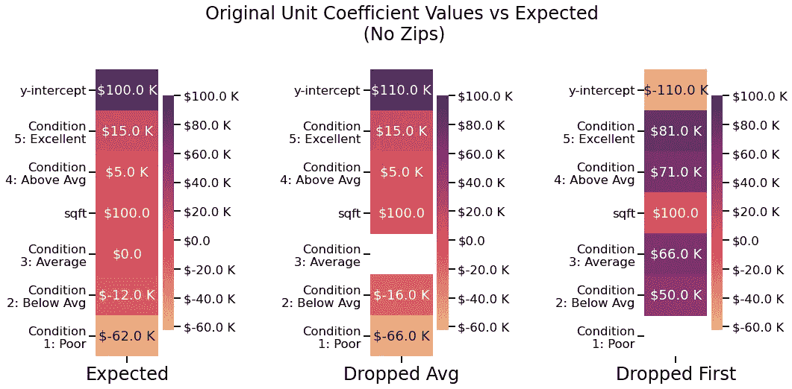

我们将花一些时间来解释我们在这里看到的差异，因为第一个模型的单位系数与预期不完全匹配的事实并不一定意味着它们本质上是错误的或无用的。

首先，我们注意到两个测试模型都有非常精确的平方英尺单位系数，这是我们唯一的连续变量。

我们可以清楚地看到，丢弃的平均模型的条件变量的单位系数非常接近预期，而丢弃的第一个模型的系数则不是。实际上，这意味着什么？

将这些单位系数放在每个模型的基线或参考点的上下文中是很重要的。系数必须相对于该基线进行解释。

对于我们的连续变量，平方英尺，参考点是 0，这将是我们包括的任何连续变量的情况。

但是对于我们的分类变量，基线中的参考点成为我们从模型中删除的任何分类列。所以我们可以说:

> 两个测试模型之间单位系数的差异是由于模型的分类值具有不同的参考点。

现在，为什么两个模型的平方英尺系数相同，但分类系数不同就更有意义了:平方英尺在两个模型中都假定基线为 0。

下一个合乎逻辑的问题是:一个基线天生就比另一个好吗？因为我们看到模型性能没有改变，所以现在还不清楚。为了回答这个问题，让我们考虑一下，假设我们不知道预期的是什么，我们将如何解释丢弃的第一个模型的条件单元系数。

在删除的第一个模型中，我们删除了“条件差”列。所以我们的基线假设了一个参考点，即可能的最坏情况。我们将这些系数解释为:

*   低于平均水平的条件会使房屋的基准价格增加 5 万美元
*   处于平均水平的情况下**会在房屋的基准价格上增加**66000 美元
*   条件高于平均水平的**会在房屋的基准价格上增加**71，000 美元
*   拥有良好的条件会使房屋的基准价格增加 81，000 美元

在删除的第一个模型中，我们将每个条件级别解释为添加到基线，甚至低于平均水平。而在平均下降模型中，基线假设条件为平均，因此我们将系数解释为:

*   一套房子的基准价格中减去了 66000 美元
*   低于平均水平的条件会从房屋的基准价格中减去 16000 美元
*   拥有高于平均水平的条件会使房子的基准价格增加 5000 美元
*   拥有良好的条件会在房子的基准价格上增加 15000 美元

在两个模型中，系数值之间的步长是相同的，但是正/负方面是不同的。

客观上，一个并不比另一个好，但是:

> 如果分析的目标是向非技术风险承担者提供实际的系数值，那么去掉条件的平均类别会产生最直观的系数，这些系数更有可能对风险承担者有意义。

想象一下，虽然我们对低于平均条件的影响有一个正数，但这是在实际上有负价格的基线房子的背景下解释的困难…这真的没有多大意义。这本身并没有错，但如果没有正确的框架，人们可能会得出误导性的结论。

# 摘要

虽然您选择删除的类别不会影响模型的性能，但它会对模型的可解释性产生重大影响。

如果您计划使用模型中的系数对以下内容进行精确推断:

*   每个预测单位对目标的影响，
*   或者每个预测器相对于其他预测器的影响程度，

然后，您应该仔细考虑要从模型中删除哪些分类值。

线性回归模型的系数是在基线模型的上下文中解释的。对于连续变量，基线使用参考点 0。但是**对于分类变量，无论删除哪一列，都会成为参考点，这对于如何解释系数有重大影响**。

对于数据科学家来说，重要的是考虑哪些列代表每个类别的最直观的参考点，并删除这些列。简单地删除第一列是任意的:第一列不一定代表最小值，最小值也不一定总是一个好的参考点。

深思熟虑地选择删除哪一列将产生更容易准确解释的系数。

# 您应该如何选择要删除的列？

不要假设第一个或最小类别值是最合适的，而是考虑哪个类别代表了利益相关者最直观的参考点，或者有助于回答分析的根本问题。

例如，如果您正在对工资的预测值进行建模，那么您可能有一个教育水平的分类预测值，其值如下:

*   不到高中
*   高中或 GED
*   副学士学位
*   学士学位
*   硕士学位
*   博士学位

如果你依赖于字母数字的第一列，那么*的副学士学位*将是你的参考点。如果你的利益相关者对大专以下学历的人与大专以上学历的人相比收入多少感兴趣，这可能是有意义的。

但是，如果你觉得 T4 高中或 GED T5 能更准确地代表人们的平均教育程度，那么把它们作为参照点也是合理的。你甚至可以计算出这些类别中哪个类别的平均或中值工资最接近人口的平均或中值，从而有统计学上的理由选择特定类别作为参考点。

在这个实验中，我放弃了代表平均值的类别。这是有意义的，因为我的类别代表了什么。要为给定场景选择合适的列，数据科学家需要考虑哪一列代表其利益相关者的直观参考点，在这种情况下，正系数和负系数将具有相关的意义。

当然，如果你的主要目标是预测，你就不必担心你会降低哪个类别的值！

我希望其他人会发现这是有用的和有益的。由于我仍然是数据科学的学生，我欢迎任何关于我的测试方法或我的结论的适用性的想法。