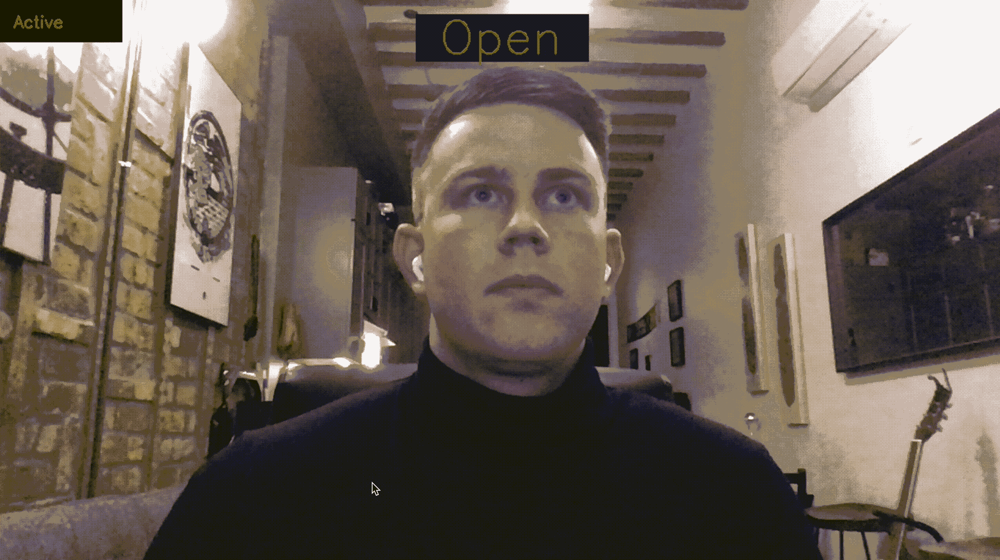
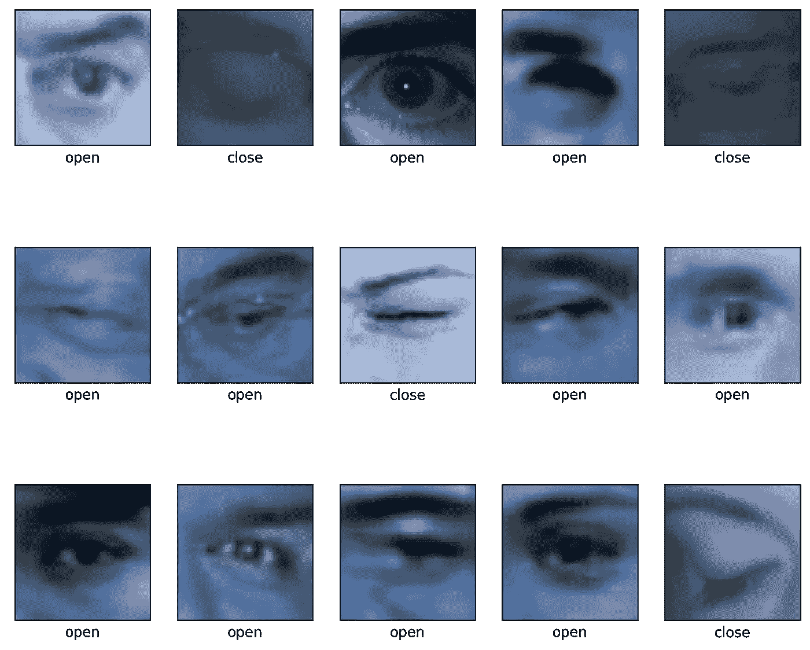
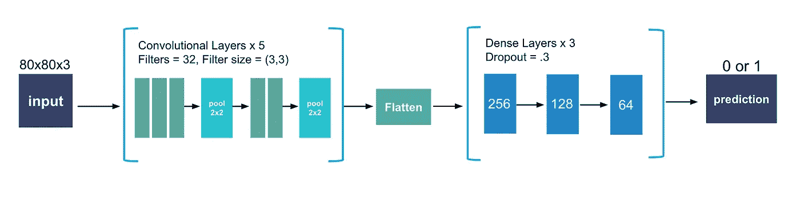
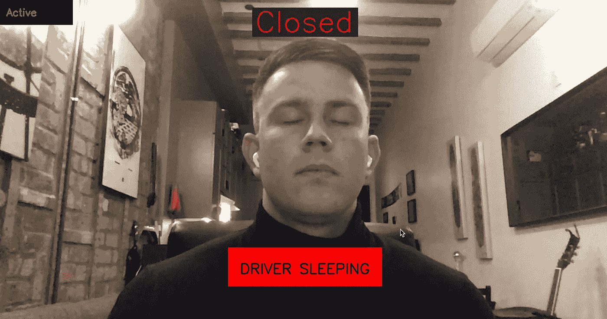

# 利用卷积神经网络预防疲劳驾驶事故

> 原文：<https://towardsdatascience.com/drowsiness-detection-using-convolutional-neural-networks-face-recognition-and-tensorflow-56cdfc8315ad?source=collection_archive---------7----------------------->

## 使用 Keras、人脸识别、OpenCV 和 PIL 进行全面演练



作者图片

# 疲劳驾驶:一个严重的问题

国家公路交通安全管理局估计，每年有 91，000 起涉及昏昏欲睡的司机的撞车事故，导致估计 **50，000 人受伤，近 800 人死亡**。此外，每 24 名成年司机中就有 1 人报告在过去的 30 天里开车时睡着了。研究甚至发现，超过 20 小时不睡觉相当于**的血液酒精浓度为 0.08%——美国法定上限**。

由于这个严重的问题，我和一群其他数据科学家着手**开发一个可以检测眼睛是否闭合的神经网络**，当与计算机视觉结合使用时，**检测一个活生生的人是否闭眼超过一秒钟**。这种技术对任何对提高驾驶安全性感兴趣的人都很有用，包括商业司机、汽车公司和汽车保险公司。

**目录:**

[构建卷积神经网络](https://medium.com/p/56cdfc8315ad/#2249)

[网络摄像头应用](https://medium.com/p/56cdfc8315ad/#30af)

# **数据收集**

我们使用了许多来源的完整面部数据，即来自[马萨诸塞大学](http://vis-www.cs.umass.edu/lfw/)的睁眼面部数据和来自[南大](http://parnec.nuaa.edu.cn/_upload/tpl/02/db/731/template731/pages/xtan/ClosedEyeDatabases.html)的闭眼面部数据。

然后，我们使用一个简单的 python 函数从这个数据集中裁剪出眼睛，给我们留下了 30，000 多张裁剪后的眼睛图像。我们给每个图像添加了一个缓冲区，这样不仅可以得到眼睛，还可以得到眼睛周围的区域。这个裁剪功能将在稍后的网络摄像头部分重新使用。

**一个警告:**手动擦洗这个数据集，除非你想要人们眨眼或者 200 张比尔·克林顿的照片来训练你的模型。以下是我们用来训练模型的数据示例:



作者图片

# **创建卷积神经网络**

**决定一个指标**

因为对我们来说，预测正面类别(一个睡着的司机)比预测负面类别(一个醒着的司机)更重要，所以我们最重要的衡量标准将是回忆(灵敏度)。召回率越高，模型错误预测的睡着的司机醒着的数量就越少(假阴性)。

这里唯一的问题是，我们的积极阶层在数量上远远超过了我们的消极阶层。正因为如此，最好使用 **F1 得分或精确回忆 AUC 得分**，因为它们也考虑了我们猜测司机睡着但实际上醒着的次数(精确)。否则，我们的模型将总是预测我们睡着了，无法使用。另一个我们没有用来处理不平衡图像数据的方法是使用[图像增强](https://machinelearningmastery.com/image-augmentation-deep-learning-keras/)。我在这里没有利用这一点，但是 Jason Brownlee 做了很好的工作来解释你如何能在这里。

**准备图像数据**

下一步是导入图像并为模型进行预处理。

此部分所需的导入:

```
**import cv2
import** **tensorflow** **as** **tf**
**from** **tensorflow** **import** keras
**from** **sklearn.model_selection** **import** train_test_split
**from** **tensorflow.keras.wrappers.scikit_learn** **import** KerasClassifier
**from** **keras.models** **import** Sequential
**from** **keras.layers** **import** Dense,Flatten,Conv2D,MaxPooling2D,Dropout
```

导入我们之前创建的图像，调整图像大小，使它们完全匹配。对于这个项目，我们调整到 80x80 像素。这是一个使用操作系统库的简单导入函数:

设置变量，自变量 X 为图像，因变量 y 为相应的标签(1 表示闭眼，0 表示睁眼):

```
X = [] 
y = [] 
**for** features, label **in** eyes: 
     X.append(features)
     y.append(label)
```

将图像转换为数组，以便它可以进入模型。此外，通过除以 255 来缩放数据。

```
X = np.array(X).reshape(-1, 80, 80, 3)
y = np.array(y)
X = X/255.0
```

使用 scikit learn 的`train_test_split`将数据分为训练集和验证集。**重要:**使确定对 y 进行分层，因为我们有不平衡的类。

```
X_train, X_test, y_train, y_test = train_test_split(X, y, stratify = y)
```

# 创建模型架构



作者图片

**卷积层:**

这一层创建像素的子集而不是完整的图像，并允许更快的模型。根据您设置的过滤器数量，这可能比原始图像更密集或更不密集，但它们将使模型能够使用更少的资源来学习更复杂的关系。我用了 32 个滤镜。至少使用一个卷积层，通常需要两个或更多。对我来说，最佳设置是**两个 *3x3 的*放在一起，然后是三个 *3x3 的*放在一起**。CNN 的总体趋势是使用更小的过滤器。事实上，**双 *3x3* 层与 *5x5* 层**本质上是一样的，但是**更快并且常常会得到更好的分数，正如 Arnault Chazareix 在这篇精彩的[文章中所解释的那样。之后汇集并不总是必要的或更好的。如果可能的话，试试你的模型。](https://www.sicara.ai/blog/en/2019-10-31-convolutional-layer-convolution-kernel)**

**展平**

确保展平图像阵列，以便它可以进入密集层。

**密集层**

层数越多，模型的训练时间就越长。随着这些层中神经元数量的增加，网络所学习的关系的**复杂性将增加**。一般来说，卷积层的想法是**避免不得不制定过深的密集层方案**。在我们的模型中，我们使用了三层神经元(256，128，64)以递减的速率激活。我们还在每一层之后使用了 30% **的压差**。

**输出层**

最后，因为这是一个二进制分类问题，请确保为外层使用 sigmoid 激活。

**编译模型**

在`model.compile()`中，您将需要将指标设置为 PR AUC(tensor flow 中的`tf.keras.metrics.AUC (curve = 'PR')`)或 recall(tensor flow 中的`tf.keras.metrics.recall`)。设置损失等于`binary_crossentropy`，因为这是一个二元分类模型，一个好的优化器通常是`adam`。

**拟合模型**

将您的**批量**设置得尽可能高，但不要在此过程中炸掉您的机器！我在 Google Colab 的 32 GB TPU 上运行了一个 gridsearch，它轻松地运行了 1000 多个批次。当有疑问时，尝试 32 批，如果不超负荷你的记忆，增加。就**时代**而言，20 个时代后收益递减，所以我不会比 CNN 的收益高太多。

以下是 Tensorflow Keras 的完整设置:

**最终精确-召回曲线下面积分数:**

0.981033

让我知道你是否能做得更好！

# **创建网络摄像头应用**

一旦你有了满意的模型，使用`model.save('yourmodelname.h5')`保存它。确保在保存时运行没有验证数据的生产模型**。这将导致在导入时出现问题。**

**安装和进口:**

这些都是 Mac 优化的，虽然也可以在 Windows 上使用相同的脚本。查看此链接[此处](https://stackoverflow.com/questions/41912372/dlib-installation-on-windows-10)用于诊断 windows dlib。

```
# installations needed for webcam application
# pip install opencv-python # 
# if you want to play a sound for the alert:
# pip install -U PyObjC
# pip install playsound# imports for webcam application
import cv2
from playsound import playsound
# import model saved above
eye_model = keras.models.load_model(‘best_model.h5’)
```

**使用 OpenCV 访问网络摄像头**

使用`cv2.VideoCapture(0)`开始网络摄像头捕捉。如果你想基于相对帧尺寸而不是绝对坐标来确定文本位置，请确保使用`cap.get(cv2.CAP_PROP_FRAME_WIDTH)`保存网络摄像头的宽度和高度。您还可以查看每秒帧数。OpenCV 捕获属性的完整列表可以在[这里](https://docs.opencv.org/3.4/d4/d15/group__videoio__flags__base.html#gaeb8dd9c89c10a5c63c139bf7c4f5704d)找到。

```
cap = cv2.VideoCapture(0)
w = cap.get(cv2.CAP_PROP_FRAME_WIDTH)
h = cap.get(cv2.CAP_PROP_FRAME_HEIGHT)
print(cap.get(cv2.CAP_PROP_FPS))if not cap.isOpened():
 raise IOError(‘Cannot open webcam’)
```

**用 OpenCV 捕捉帧并裁剪它们**

如果你打算按帧计算闭上的眼睛，一定要设置一个计数器。一个`while True:`循环会让摄像机一直开着，直到你完成剧本。在 while 循环中，使用`ret, frame = cap.read()`格式捕获网络摄像机视频帧。最后，调用框架上的函数。它应该从帧中返回一个裁剪过的眼睛，如果它在帧中找不到眼睛，该函数将返回不能被 255 整除的`None`，并将跳到下一帧。

```
counter = 0# create a while loop that runs while webcam is in use
while True: # capture frames being outputted by webcam ret, frame = cap.read() # function called on the frame
  image_for_prediction = eye_cropper(frame)
  try:
     image_for_prediction = image_for_prediction/255.0
  except:
     continue
```

**通过模型运行框架**

然后我们可以通过模型运行图像，并得到一个预测。如果预测更接近 0，那么我们在屏幕上显示“打开”。否则(即更接近 1)，我们显示“关闭”。注意，如果模型检测到睁开的眼睛，计数器重置为 0，如果眼睛闭上，计数器增加 1。我们可以使用`cv2.putText()`显示一些基本文本来指示眼睛是闭着还是睁着。

```
prediction = eye_model.predict(image_for_prediction)if prediction < 0.5:
  counter = 0
  status = ‘Open’ cv2.putText(frame, status, (round(w/2)-80,70),
cv2.FONT_HERSHEY_SIMPLEX, 2, (0,255,0), 2, cv2.LINE_4) else:
  counter = counter + 1
  status = ‘Closed’ cv2.putText(frame, status, (round(w/2)-104,70), cv2.FONT_HERSHEY_SIMPLEX, 2, (0,0,255), 2, cv2.LINE_4)
```

我们还希望**显示一个警告，如果连续有 6 帧闭着眼睛**(“睡觉”)。这可以使用一个简单的 if 语句来完成:

```
if counter > 5:
  cv2.putText(frame, ‘DRIVER SLEEPING’, (round(w/2)-136,round(h) — 146), cv2.FONT_HERSHEY_SIMPLEX, 1, (0,0,255), 2, cv2.LINE_4)
  counter = 5
```



作者图片

最后，我们需要显示框架，并为 while 循环提供一个退出键。`cv2.waitKey(1)`决定画面将显示多长时间。括号中的数字是该帧将显示的毫秒数，除非按下“k”键，在本例中为 27，或者按下 escape 键:

```
cv2.imshow(‘Drowsiness Detection’, frame)
k = cv2.waitKey(1)
if k == 27:
  break
```

在循环之外，释放网络摄像头并关闭应用程序:

```
cap.release()
cv2.destroyAllWindows()
```

# **最终产品**

加上一些风格上的补充，这就是最终产品。你也可以包括声音，我已经在下面的完整脚本中包括了。我用的是 a Down 的《杂碎》(如果你知道，你就知道)的 System 中的《醒来》歌词。


作者图片

如您所见，该模型非常有效，尽管训练时间很长，但在几毫秒内就能返回预测结果。随着一些进一步的改进和输出到外部机器，这个程序可以很容易地应用于实际情况，也许可以挽救生命。

感谢阅读。如果您有任何问题或改进，请随时通过 [LinkedIn](https://www.linkedin.com/in/stewart-dustin/) 联系我。