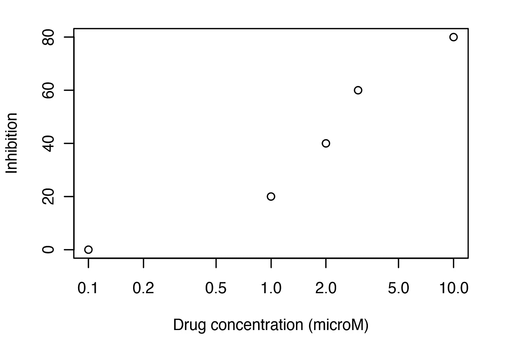
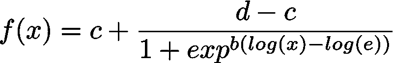
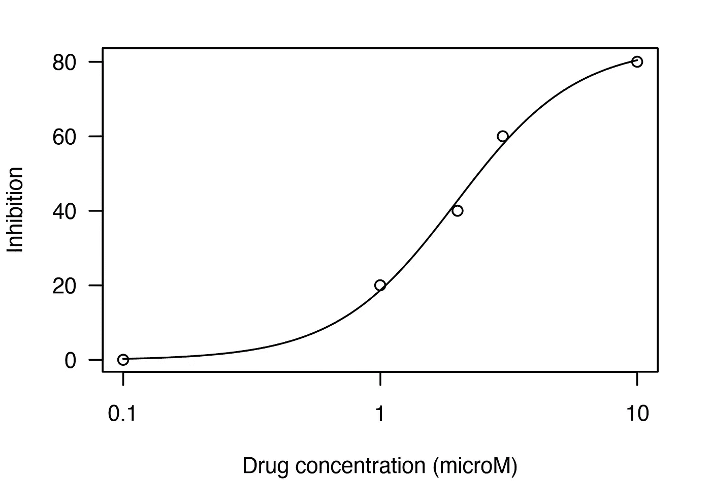
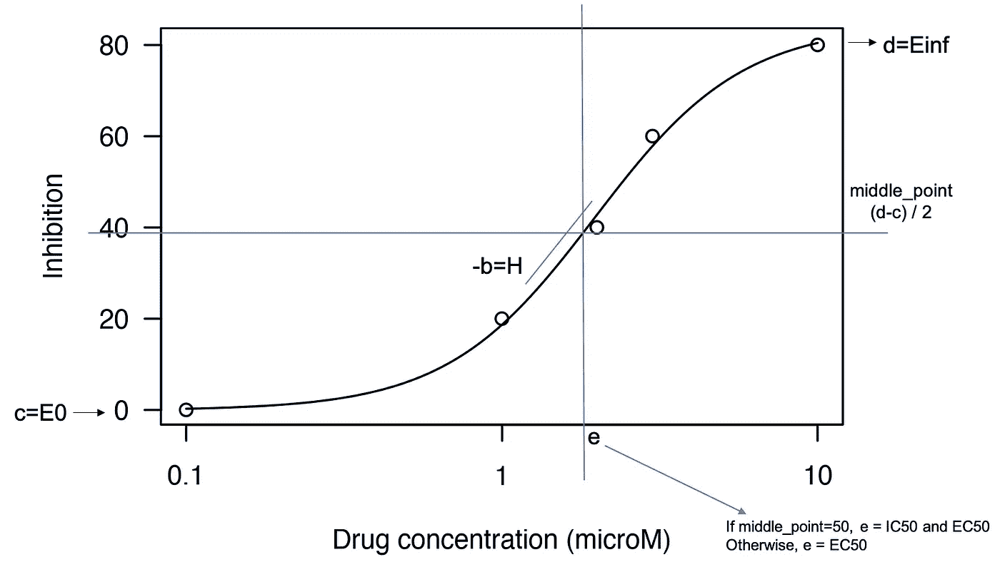
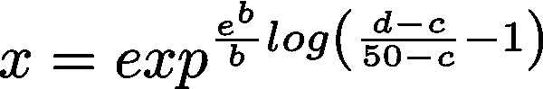
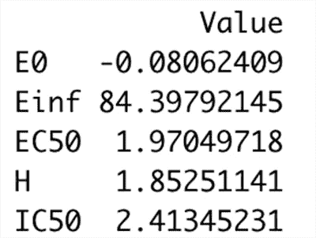

# 药物剂量反应数据分析

> 原文：<https://towardsdatascience.com/drug-dose-response-data-analysis-5d7d336ad8e9?source=collection_archive---------17----------------------->

关于如何在 R 中分析药物剂量反应数据并导出药物疗效关键指标的教程:IC50，EC50，Einf，E0。额外收获是，真正理解著名的“曲线拟合”表达式的含义

药物剂量反应研究是在细胞系中测试药物功效的实验。它们被广泛用于癌症研究，以确定在患者身上进行测试的药物的优先顺序。在癌症药物剂量反应研究中，给定癌症的细胞培养物用增加浓度的特定药物处理，并测量细胞生长的抑制百分比。对细胞生长的抑制越强，测试药物对特定癌细胞系的效果越好。

这些研究的原始数据输出如下，其中 *x 轴*代表药物浓度(微摩尔)，而 *y 轴*代表细胞生长抑制(%)。

通常从这些数据中提取几个指标来衡量药物疗效:

*   **E0** :无药物时观察到的反应
*   **Einf** :药物引起的最大反应
*   **EC50** :诱导 50%最大反应的药物浓度。EC50 通常以摩尔浓度来测量，并用作激动剂药物效力的量度——EC50 值越低，引发 50%最大反应所需的药物浓度越低，药物效力越大。
*   **IC50** :抑制 50%细胞生长所需的药物浓度。它通常以摩尔浓度来测量，并被用作拮抗剂药物效力的量度 IC50 值越低，药物效力越强。

有了实验的原始数据，我们对药物反应只有一个离散的看法。然而，我们需要药物-反应关系的连续表示，因此我们可以获得药物在任何给定浓度下引起的反应的完整视图。为了获得这种连续视图，我们需要使用“曲线拟合”算法。曲线拟合算法优化了曲线或函数的参数，使其尽可能“调整”或“拟合”我们的数据。有了调整后的曲线，我们将能够内插和外推响应值，因此我们将知道任何给定药物浓度下的响应。

一种广泛使用的方法是拟合 4 参数逻辑曲线，由以下等式定义:

曲线拟合算法试图调整参数 *b* 、 *c* 、 *d* 和 *e* ，以使方程定义的曲线符合剂量反应数据。将曲线拟合到数据后，曲线看起来会像这样:

现在，让我们看看曲线中的参数 *b* 、 *c* 、 *d* 和 *e* 是什么意思:

分析曲线方程，我们看到:

*   *c* 是曲线的最低点——对应于在没有药物的情况下观察到的反应( **E0**
*   *d* 是曲线的最高点(曲线收敛的值)——对应于药物的最大反应( **Einf** )
*   *b* 决定曲线的斜率。 *-b* 被称为“希尔项”( **H** )，测量药物浓度增加时反应如何变化。高 H 值表明当增加药物浓度时响应显著增加，反之亦然
*   如果我们在 *y 轴* ( *(d-c) / 2* )的中点画一条水平线，则该线与曲线的交点所对应的药物浓度就是 *e* 参数，即诱导 50%最大反应的药物浓度( **EC50**
*   如果中点( *(d-c) / 2* )等于 50%，那么 *e* 也对应药物的 **IC50** 。否则，可以用 *f(x)* 代替 *50* 并在曲线方程中找到 *x* 来计算 IC50:

现在我们知道了拟合曲线的含义以及如何获得药物疗效的指标，让我们一步一步地进行 R 中的数据分析

## 逐步数据分析

首先，我们加载将要使用的库，并创建合成药物剂量反应数据:

我们绘制原始剂量反应数据:

然后我们使用 *drc* 包中的 *drm* 函数拟合曲线，并绘制拟合曲线:

现在，我们已经准备好获取药物疗效指标:

我们的分析完成了！

简而言之，药物剂量反应研究用于测量药物对给定细胞培养物的功效。需要分析这些研究中产生的原始数据，并需要“拟合”曲线，以获得药物剂量-反应关系的连续表示。一旦完成，就有可能获得药物疗效指标，如 E0、Einf、EC50 和 IC50。