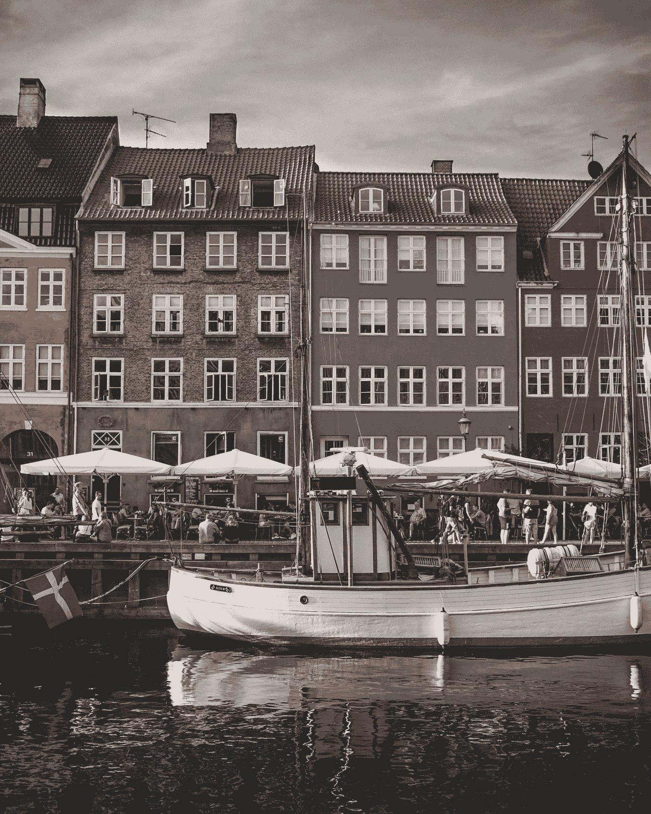
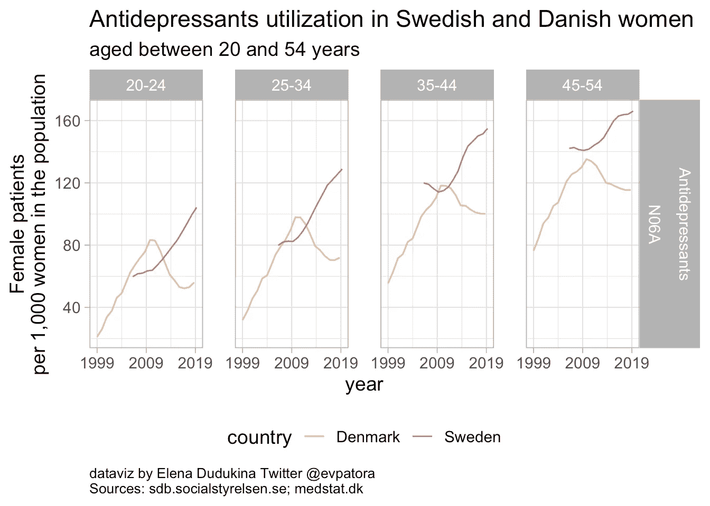
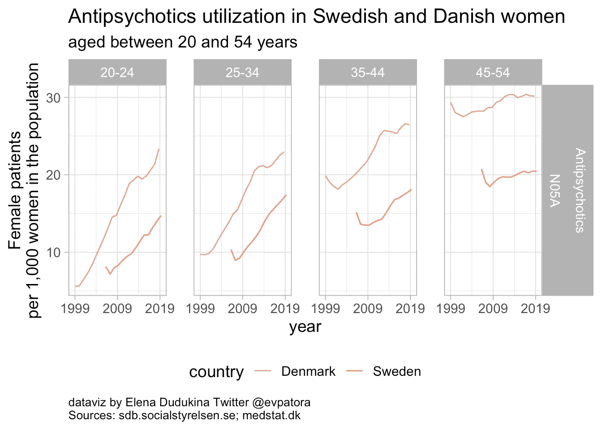
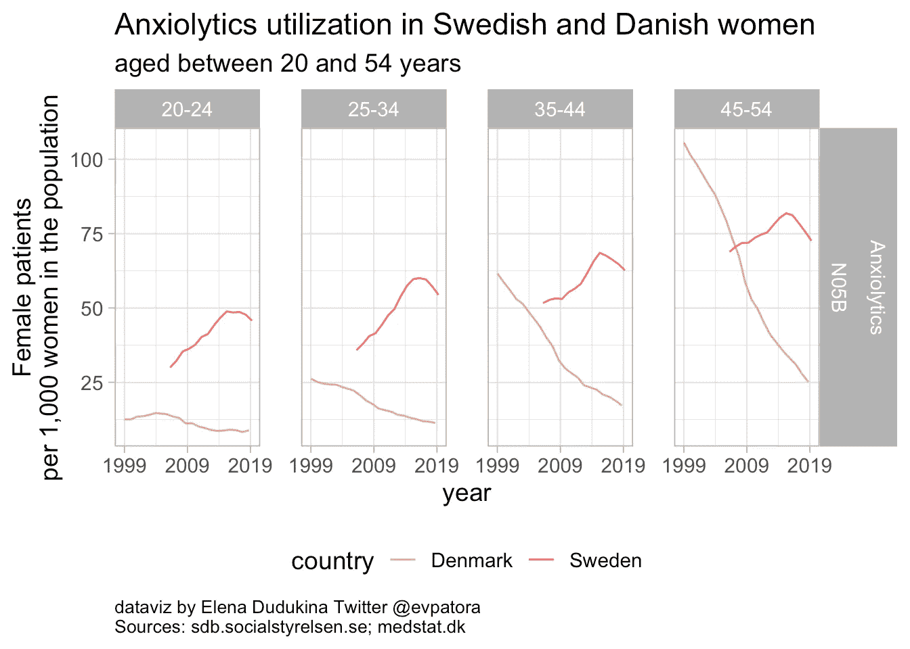
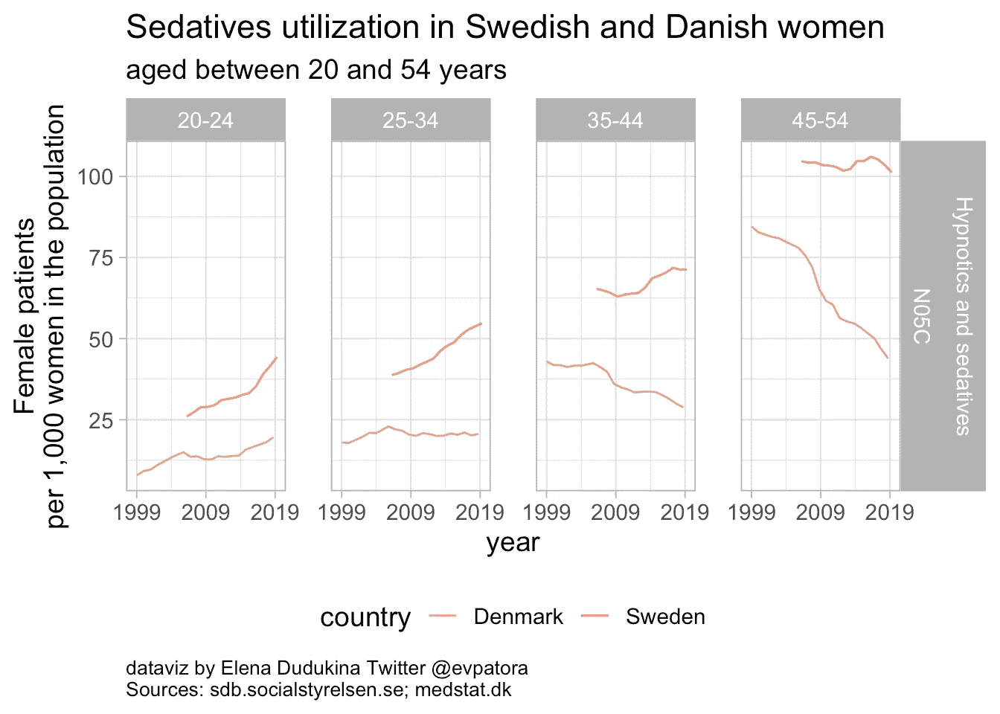

# 妇女健康数据分析

> 原文：<https://towardsdatascience.com/drug-utilization-in-sweden-and-denmark-ii-ef4320f479ba?source=collection_archive---------40----------------------->

## 探索瑞典和丹麦妇女使用镇静剂、抗抑郁药、抗精神病药和抗焦虑药的国家趋势

凯文·安吉尔斯在 [Unsplash](https://unsplash.com?utm_source=medium&utm_medium=referral) 上拍摄的照片

在这一部分，我将调查丹麦妇女使用镇静剂、抗抑郁药、抗精神病药和抗焦虑药的国家趋势。然后我会将丹麦的国家趋势与我在[第一部分](https://evpatora.medium.com/drug-utilization-in-sweden-and-denmark-9e0c51cd8227)中发现的瑞典国家趋势进行比较。

我在这篇文章中使用的所有代码都可以在这里找到。这段代码为我节省了最多的时间，它是一个简洁的“ggplot2”包装器，用于绘制药物利用情况。

在 20 至 54 岁的丹麦女性中，**抗抑郁药的使用率**稳步下降，而瑞典女性的使用率却在上升。在丹麦，每 1000 名女性中有 56 名 20-24 岁的女性和 72 名 35-45 岁的女性接受抗抑郁药处方。

答 **在丹麦和瑞典，抗精神病药物的使用**逐年增加。与同年龄组的瑞典妇女相比，丹麦妇女使用抗精神病药物的比率更高。

瑞典女性使用避孕药的比率更高。在丹麦，从 1999 年到 2019 年，20 至 54 岁所有年龄组的妇女使用抗焦虑药的情况都在减少。

与同年龄组的丹麦妇女相比，瑞典妇女使用镇静剂的比率更高。在所有被调查的年龄组中，丹麦妇女使用镇静剂的比例低于每 1000 名同年龄组妇女中 50 名妇女。在瑞典妇女中，只有 20 至 24 岁的妇女使用镇静剂的比例低于每 1000 名妇女 50 人。

# 带回家的信息

*   在许多方面相似的国家可能呈现不同的数据模式
*   丹麦和瑞典女性使用抗抑郁药、抗精神病药、抗焦虑药和镇静剂的情况并不完全相同

**感谢收听**🤓