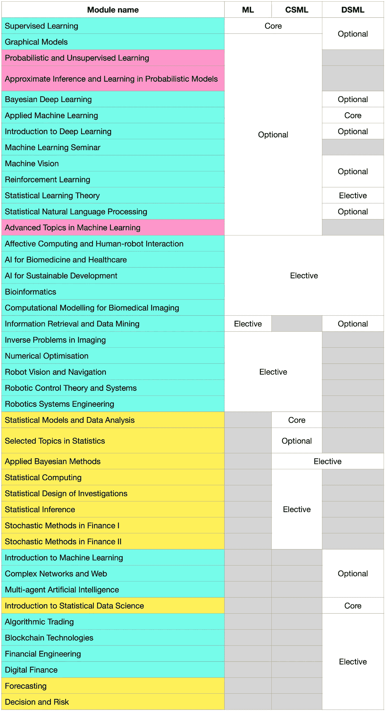

# CSML DSML……UCL 大学机器学习理科硕士课程的比较

> 原文：<https://towardsdatascience.com/dsml-csml-ml-a-comparison-of-machine-learning-msc-courses-at-ucl-c1f27fe5bd69?source=collection_archive---------20----------------------->

## 找出最适合你的课程

尼克·莫里森在 [Unsplash](https://unsplash.com/photos/FHnnjk1Yj7Y) 的照片

> **TDLR**

*   如果你有兴趣攻读博士学位，理学硕士是最好的选择
*   MSc CSML 是最好的，如果你想要最多样的选择
*   如果你有兴趣进入金融领域或者从其他背景转到数据科学领域，DSML 理学硕士是最好的选择

UCL 大学是一所世界知名的大学，一直在全球排名前 10 位。具体来说，来自 UCL[Gatsby](https://www.ucl.ac.uk/gatsby/)计算神经科学部门的 [DeepMind](https://en.wikipedia.org/wiki/DeepMind#History) 的成立使 UCL 成为了顶级的机器学习目的地。

本文将研究 UCL 大学最受欢迎的三门机器学习课程，并对它们进行比较，以让您更好地了解哪门课程适合您。当然，UCL 不是英国唯一一所在机器学习方面表现出色的大学:爱丁堡在自然语言处理方面表现出色，剑桥大学的哲学硕士非常适合研究，帝国理工大学的计算硕士课程让你接触机器人和逻辑学习的利基领域。

UCL 机器学习最出名的是它的行业链接(与许多行业理学硕士项目)，计算金融，神经科学和医疗保健人工智能，当然还有 DeepMind。

# 概观

## 机器学习理学硕士( [ML](https://www.ucl.ac.uk/prospective-students/graduate/taught-degrees/machine-learning-msc) )

这是 UCL 大学的基本机器学习课程。是必修模块最少的一个(唯一一个是*监督学习*)。

唯一的其他限制是，学生必须要么参加*图形模型*要么参加*概率和无监督学习*(由 Gatsby 单位教授的博士水平课程)。

这个项目的学生喜欢选择涵盖人工智能医疗保健(如*生物信息学*、*生物医学成像计算建模*等)和机器人学(如*机器人视觉和导航*)的选修模块。

然而，由于课程主要关注计算机科学，学生无法选修统计科学系的课程，或计算金融课程(如*区块链技术*或*算法交易*)。

> ***模块选择规则***

学生有 1 个核心模块(*监督学习*)。学生必须选择 7 个模块，其中 2 个必须是**可选**模块，必须包括*图形模型*或*概率和无监督学习*。

## 计算统计学和机器学习理学硕士(CSML)

在三门 ML 课程中，CSML 为学生提供的模块数量最多。这包括 ML 的所有模块，也包括统计科学系教授的模块。

不过这门课的学生有两个必修模块，*统计模型与数据分析*(统计科学系教授)和*监督学习*。

一些值得注意的统计学模块提供给 CSML 的学生，但不提供给 ML 的学生，它们是*统计计算*、*金融中的随机方法*和*调查的统计设计*。

*区块链技术*和*算法交易*也是 CSML 学生学不到的。

> ***模块选择规则***

学生有 2 个核心模块(*监督学习*和*统计模型和数据分析*)。学生必须选择 6 个模块，其中 3 个必须是**可选**模块，这些模块必须包括*图形模型*或*概率和无监督学习*。

## 数据科学和机器学习理学硕士( [DSML](https://www.ucl.ac.uk/prospective-students/graduate/taught-degrees/data-science-machine-learning-msc) )

这门课程不同于其他两门 ML 课程。它只允许学生访问 ML 模块的一个子集和统计科学模块的一个子集，但是允许学生访问 DSML 特有的模块。一些著名的例子包括*区块链技术、算法交易*和*复杂网络和 Web。*

本课程有两个必修模块:即*应用机器学习*和*统计数据科学导论*。

本课程的优势在于它提供的选修模块，允许学生选修一些独特的金融课程(如*金融工程*和*数字金融*)以及独特的统计学课程(*预测*)。

这门课的学生无法使用的主要 ML 模块是机器人模块和盖茨比模块。

> ***模块选择规则***

学生有两个核心模块(*应用机器学习*和*统计数据科学导论*)。学生必须选择 6 个模块，其中一个必须是*监督学习*或*机器学习导论。*

# 关于模块选择的一个注记

本节将简要介绍在应用这些课程时需要记住的一些模块的要点。

## 盖茨比模块

盖茨比模块是*概率和无监督学习*、*概率模型中的近似推理*和*机器学习中的高级课题*。这些只提供给麻省理工学院和 CSML 大学的学生。

这些模块虽然被列为计算机科学系教授，但实际上是盖茨比单元教授的。它们是对数学要求很高的课程，一般建议学生不要选修。

*机器学习高级课题*是一门涵盖机器学习研究当前研究趋势的课程。

*概率和无监督学习*和*概率模型中的近似推理*是盖茨比单位博士生的必修课。就内容而言，它们涵盖了与*图形模型*相同的范围(这就是为什么你不能同时采用*图形模型*和*概率和无监督学习*)，但它们更深入。

它们实际上是模块，每个模块运行半个学期。所以这个想法是，前半学期你做*概率和无监督学习*，后半学期你做*概率模型中的近似推理。*但是，有可能只拿其中一个。

## 财务模块

如前所述，ML 上没有面向学生的金融模块。CSML 只有两个金融模块，它们是金融中的*随机方法*第一和第二部分(由统计科学系教授)。

DSML 大学提供了一系列由计算机科学系教授的金融模块。分别是*区块链技术*、*算法交易*、*金融工程*和*数字金融*。然而，由于某种原因,*金融中的随机方法*模块在 DSML 上不可用。

## 其他独特的 DSML 模块

DSML 大学提供三门独特的计算机科学课程，这些课程在麻省理工学院和 CSML 大学都没有。这些是*多智能体人工智能*、*信息检索和数据挖掘*和*复杂网络和 Web* 。

这些课程都是 100%的课程，实用性很强。令人惊讶的是，它们在其他 ML 课程中是不可用的。

## 模块的完整列表

2021/2022 年可用的所有模块的完整列表如下:

一张显示在 ML，CSML 和 DSML 所有可用课程的表。粉色代表盖茨比单元教授的模块，蓝色代表计算机科学教授的模块，黄色代表统计科学教授的模块(图片由作者提供)

# 结论

我认为课程的选择取决于你追求什么。我总结了以下我认为最适合的课程:

> ***ML***

*   如果你有兴趣攻读博士学位。
*   没有限制意味着你可以集中你的主题选择和专业。
*   如果你对什么都想学一点，但不介意错过 CSML 和 DSML 学生可以学习的模块。

> **T5【CSML】T6**

*   如果您不确定想要学习的模块，但希望有最多的选项。
*   在本课程中，您可以使用盖茨比模块、机器人模块和一些统计科学模块。

> ***DSML***

*   如果你对金融感兴趣，或者正在寻找最“行业”的课程。
*   如果你想对每件事都有所了解，但又不想学习盖茨比模块，并且对机器人技术不感兴趣。

我希望这有助于那些你正在寻找做任何这些课程！祝你申请好运，记住不要紧张！