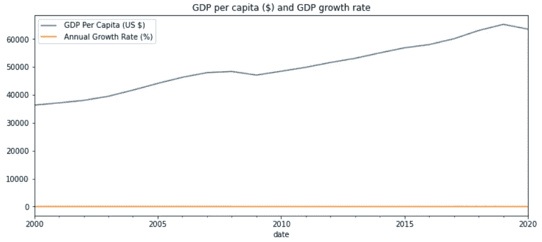
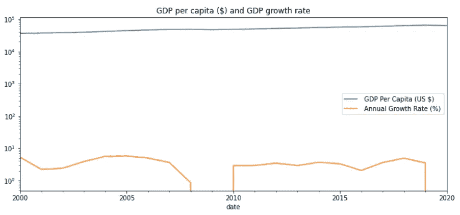
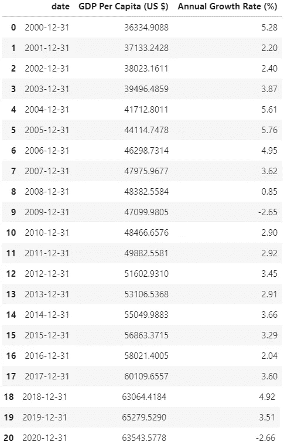
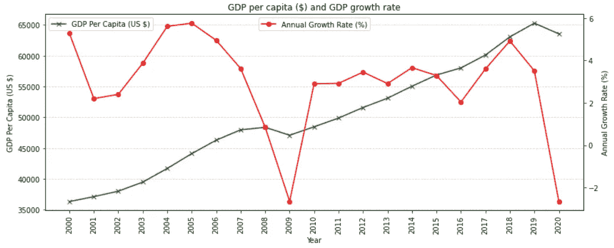
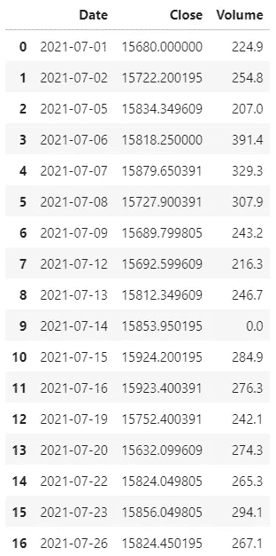
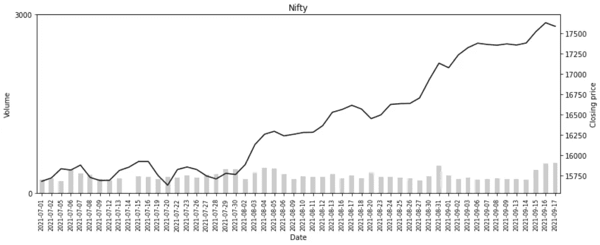

# Python 中的双轴绘图

> 原文：<https://towardsdatascience.com/dual-axis-plots-in-python-95e5ef24a4e0?source=collection_archive---------6----------------------->

## 本文讨论了如何向 Python 绘图添加辅助轴

克里斯·利维拉尼在 [Unsplash](https://unsplash.com/s/photos/graphs?utm_source=unsplash&utm_medium=referral&utm_content=creditCopyText) 上的照片

有时，我们可能需要将两个不同比例的变量添加到绘图轴上。例如，我们希望在 y 轴上显示人均 GDP(单位为美元)和年 GDP 增长率%,在 x 轴上显示年份。换句话说，我们需要可视化多年来人均 GDP($)和 GDP 增长率的趋势。20 世纪 80 年代以来，人均国内生产总值(美元)和国内生产总值增长率有不同的比例.使用相同的 y 轴绘制它们会破坏另一个。

作者图片

在上图中，我们可以看到，年增长率的趋势完全被人均国内生产总值(美元)所破坏。在下图中，我们看到在 y 轴上使用对数刻度也没有帮助。

对数 y 轴(图片由作者提供)

这使得年增长率(%)必须有一个辅助 y 轴。为了说明新增的副轴，我们将使用下面显示的数据框(名为“gdp”)，其中包含 2000 年至 2020 年的人均 GDP($)和年增长率(%)数据。

gdp 数据框(图片由作者提供)

在上面的代码中，我们使用 twinx()函数创建了一个名为“ax2”的辅助轴。twinx()创建一个共享 x 轴的辅助轴。还有一个名为 twiny()的函数用于创建一个共享 y 轴的次轴。在下图中，我们可以清楚地看到人均 GDP)和年增长率(%)的趋势。

带副轴的绘图(作者提供的图片)

在下一个例子中，我们将绘制 Nifty(印度的一个股票指数)的趋势和成交量。在本例中，我们将对指数值使用折线图，对成交量使用条形图。下面是我们将在本例中使用的数据框(名为“nifty_2021”)的前几条记录。

nifty_2021 数据框(图片由作者提供)

上面的代码类似于我们之前看到的代码。然而，有一些不同之处需要注意。

1.  在上面的代码中，我们使用了 pandas plot()来绘制音量条图。这是因为 Matplotlib 的 plt.bar()函数可能无法正常处理不同类型的绘图。因此，我更喜欢 Matplotlib 只用于线图。
2.  我们使用了 **ax2.plot(ax.get_xticks()** 而不是**ax2 . plot(nifty _ 2021[' Date ']**。这是因为使用 **nifty_2021['Date']** 是将图向右移动或者根本不显示线图。

作者图片

本文到此结束。我们已经讨论了不同比例的变量在一起绘图时可能会产生的问题，并看到了添加一个副轴是如何解决问题的。我们还看到了如何使用次轴绘制折线图和条形图。