# 二元性:通过一个例子解释优化的无名英雄

> 原文：<https://towardsdatascience.com/duality-the-unsung-hero-of-optimization-explained-through-an-example-f53f3fb191d9?source=collection_archive---------18----------------------->

## 对二元性在运筹学领域的目标的深刻理解

安托万·道特里在 [Unsplash](https://unsplash.com?utm_source=medium&utm_medium=referral) 上拍摄的照片

随着机器学习和人工智能领域的进步，与优化相关的概念变得比以往任何时候都更加相关。优化中使用的概念对于设计旨在从大量数据中进行推理的算法至关重要。对于在运筹学领域工作的人来说，一个很难理解的话题是**对偶原理。**我们在这篇文章中的目标是理解这个话题以及二元性的目标是什么。

让我们从一个简单的线性规划问题开始，如下所示

问题 P1:

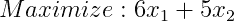

服从于:

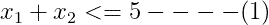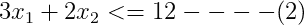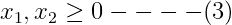

(1)、(2)和(3)表示问题的约束。如果没有与变量相关的约束，问题 P1 的最优解将是无穷大(因为这是在那些情况下目标函数的最大可能值)。

但是既然存在约束，让我们开始使用一些策略来机智地猜测最优解应该是什么。

# 策略 1

将等式(2)两边都乘以 3 得到:

但是因为我们知道两个变量都是正的(≥0)，所以它自动地遵循

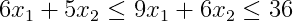

因此，我们现在有了我们想要最大化的目标函数的新上限(36)。现在，36 代表目标函数最大值的新上限(以前上限是无穷大)。

# 策略 2

让我们试试另一个练习。将等式(1)乘以 6 得到:

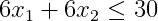

但是，因为我们知道两个变量都是正的(≥0)，它自动地再次遵循

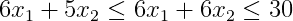

同样，我们对目标函数有一个更好的上限(30)。30 代表现在目标函数最大值的新上限(以前是 36，我们从策略 1 中得到)。

请注意，我们是如何通过仔细处理约束来慢慢降低目标函数的上限的。每一次这样的约束(策略)操作都给出了问题 P1 的目标函数可以采用的相应上限。**我们的工作是找出目标函数的*最低可能上限*，它将最终代表它可以取的最大值。这是二元性原理试图内在实现的。**

# 策略的概括

显然，到目前为止，我们一直在每个策略中用一些随机选择的常数乘以约束。让我们概括一下到目前为止我们一直在做的事情。

将等式(1)乘以 a1，将等式(2)乘以 a2，得到(a1 和 a2 是正值变量)

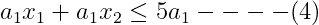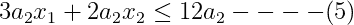

**注意，(a1，a2)的值分别在策略 1 &策略 2 中已经是(0，3) & (6，0)。**

将等式(4)和(5)相加，我们得到:

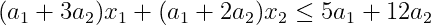

因此，P1 的目标函数的上限表示为:

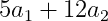

只要满足以下约束，我们希望通过尝试不同的(a1，a2)值来使**最小化**:

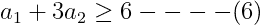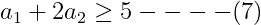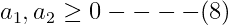

其中等式(6)和(7)的右手侧代表问题 P1 的目标函数的系数。**这个以最小化为目标的新问题被称为对偶问题，P1 和 P1 本身被称为原始问题。**

对偶问题(P2)因此变成:

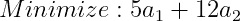

服从于:

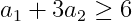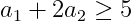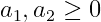

我们可以用下面的性质直接写出原问题的对偶:

1.  如果原始问题是一个最大化问题，对偶问题就变成了一个最小化问题(就像我们在 P1 和 P2 的例子)，反之亦然。
2.  对偶问题中变量的数量将等于原始问题中约束的数量(每个约束一个变量)。因为原始有 2 个约束(等式(1)和(2))，对偶有 2 个变量(a1 和 a2)。
3.  对偶问题中约束的数量将等于原始问题中变量的数量(每个变量一个约束)。因为原始模型有 2 个变量(x1 和 x2)，对偶模型有 2 个约束(等式(6)和(7))。
4.  原始约束的右侧值成为对偶目标函数的系数(5 & 12 是原始约束的右侧值，因此也成为对偶目标函数的系数)，反之亦然。

# 结论

每一个线性规划问题都可以看作是一个原始问题，可以转化为相应的对偶问题。这意味着解决 P1 问题(原始)等价于解决 P2 问题(P1 的对偶)。

这是因为 P1 的最优解(即目标函数在 P1 的最大值)与 P2 的最优解(即目标函数在 P2 的最小值)相同。

因此，在运筹学领域，对偶的概念被大量用于解决优化问题，其中原始问题可能相对难以解决，或者甚至在使用列生成技术的情况下，基于对偶的可行性状态来评估我们是否已经在原始问题中达到最优解。

这篇文章的目的是让人们直观地理解二元性的基本概念以及它实际上打算做什么，而不仅仅是从数学的角度探索这个概念。