# Dwight Schrute 教授我们离散概率分布

> 原文：<https://towardsdatascience.com/dwight-schrute-teaches-us-about-discrete-probability-distributions-c4102d9f0b83?source=collection_archive---------59----------------------->

## 一篇不是关于正态分布的文章

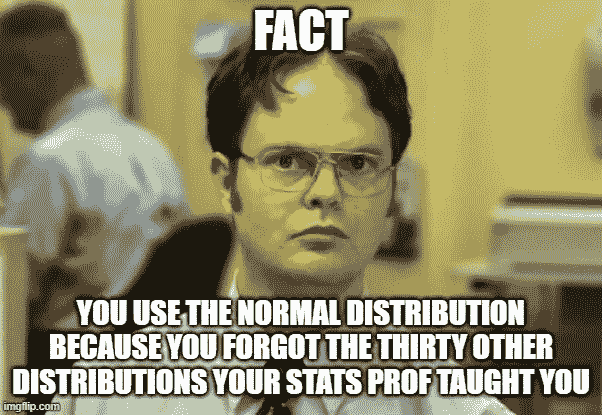

作者使用[imgflip.com/memegenerator/Dwight-Schrute](https://imgflip.com/memegenerator/Dwight-Schrute)制作的模因

# 介绍

关于正态分布的所有宣传，数据科学的新手可能会错误地认为数据科学家只关心正态分布的*。*

虽然正态分布可以说是最重要的(也是最被滥用的)概率分布，但它并不总是解决商业问题的最佳工具，也不是最佳假设。

假设你在邓德米夫林纸业公司工作。区域经理助理 Dwight K. Schrute 给你 100 个客户的档案。Schrute 先生想知道以下情况:

1.  假设完成销售的概率为 10%，在 100 名客户中，有 5 名客户接受 Dunder Mifflin 的销售的概率是多少？
2.  在销售部做出第一笔销售之前，我们能指望有多少客户会忽视邓德米夫林？
3.  我们想给从 Dunder Mifflin 购买的 5 个客户一个 Scrantonicity 专辑。第十个客户端拿到最后一张专辑的概率是多少？

多亏了中心极限定理，我们可以用正态分布来回答上述所有问题。然而，我们可能需要比德怀特给我们的更多的信息来回答其中至少一个问题。

一个更好、更简单的解决方案是对离散随机变量使用概率分布。

在下文中，我解释了离散随机变量的三种概率分布:二项式分布、几何分布和负二项式分布。

# 离散随机变量的概率分布

离散随机变量是取整数值的随机变量。这与连续随机变量相反，其值包括所有实数(某些条件可能适用)。

让我们来看看我们的第一个概率分布。

## 二项分布

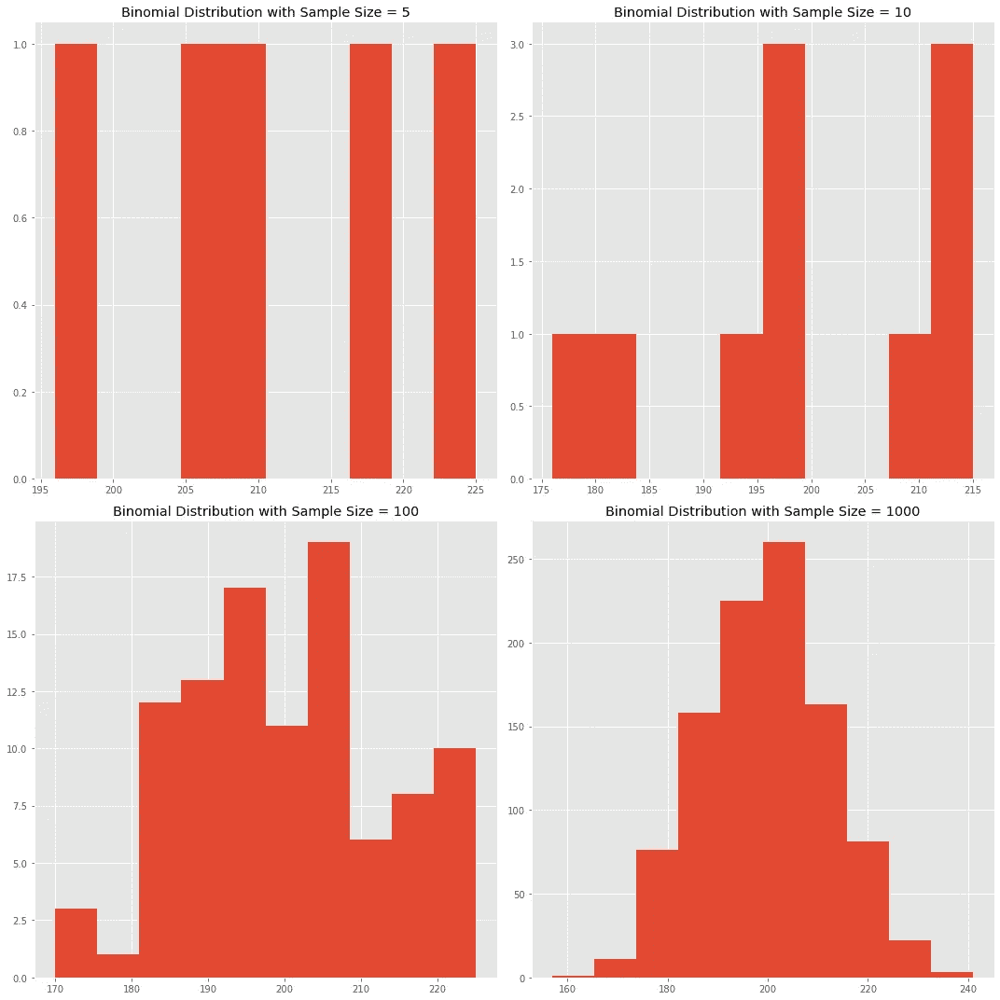

随着样本量的增加，二项分布越来越接近正态分布。

考虑 n 个独立事件的集合

*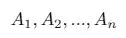*

*每个事件(或试验)的成功概率 *p* 是相同的。*

*设 *Y* 为 *n* 个独立事件的总成功数。然后，我们说 *Y* 是一个遵循**二项式分布**的随机变量。*

*在 *n* 试验中 *y* 成功的概率是*

*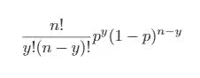*

**Y* 的期望值为*

*E[Y] = *np**

*方差是*

*Var[Y] = *np(1-p)**

## *例子*

*我们可以用二项分布来回答德怀特的第一个问题。*

> *假设完成销售的概率为 10%，那么在 100 名客户中，有 5 名客户接受 Dunder Mifflin 的销售的概率是多少？*

*我们有*

1.  **p =* 0.10*
2.  **n* = 100*
3.  **y* = 5*

*因此，我们的概率质量函数变成了*

*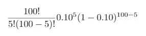*

*我们的概率大约是 3.39%。*

*现在，如果我们想知道*至少有* 5 个客户与 Dunder Mifflin 达成交易的概率会怎样？*

*如果 *n* 保持不变，则*

*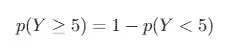*

*相当于，*

*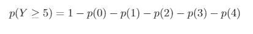*

*上述计算揭示了五个以上的客户结束与 Dunder Mifflin 的通话的概率是 97.63%。*

## *几何分布*

*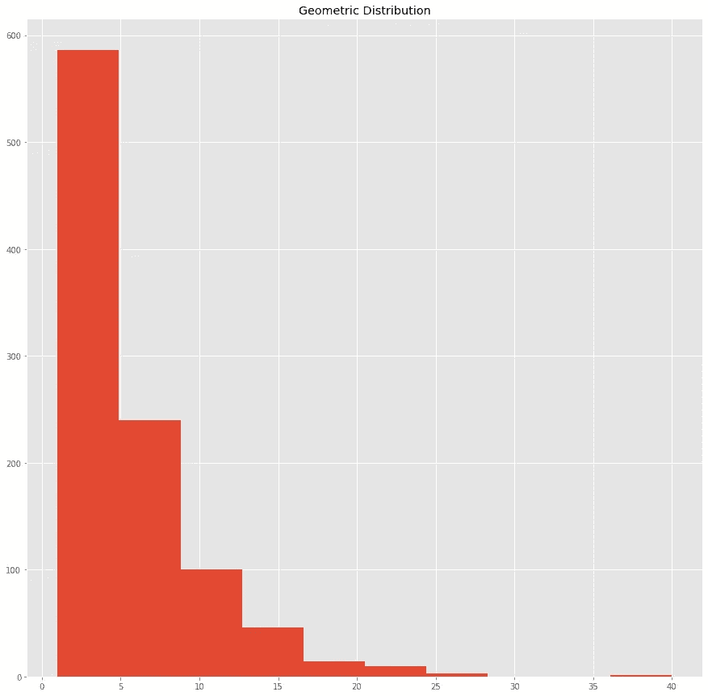*

*再次假设，我们有一组 *n* 个独立的事件，它们共享相同的成功概率。*

*设 *Z* 为第一次成功之前的失败次数 *k* 。*

*然后，Z 具有带有概率质量函数的**几何分布***

*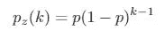*

*这给了我们在第一次成功之前进行 k 次 T21 试验的可能性。*

*期望值和方差是*

*E[Z] = 1/p，并且*

*Var[z] = (1 — p)/p，*

*分别是。*

## *例子*

*我们可以用几何分布来回答德怀特的第二个问题。*

> *在销售部做出第一笔销售之前，我们能指望有多少客户会忽视邓德米夫林？*

*因为 *p* = 0.10，*

*E[Z] = 1/0.10*

*E[Z] = 10*

*因此，我们可以预计，在销售部门完成第一笔销售之前，会有 10 个客户忽略 Dunder Mifflin。*

## *负二项分布*

*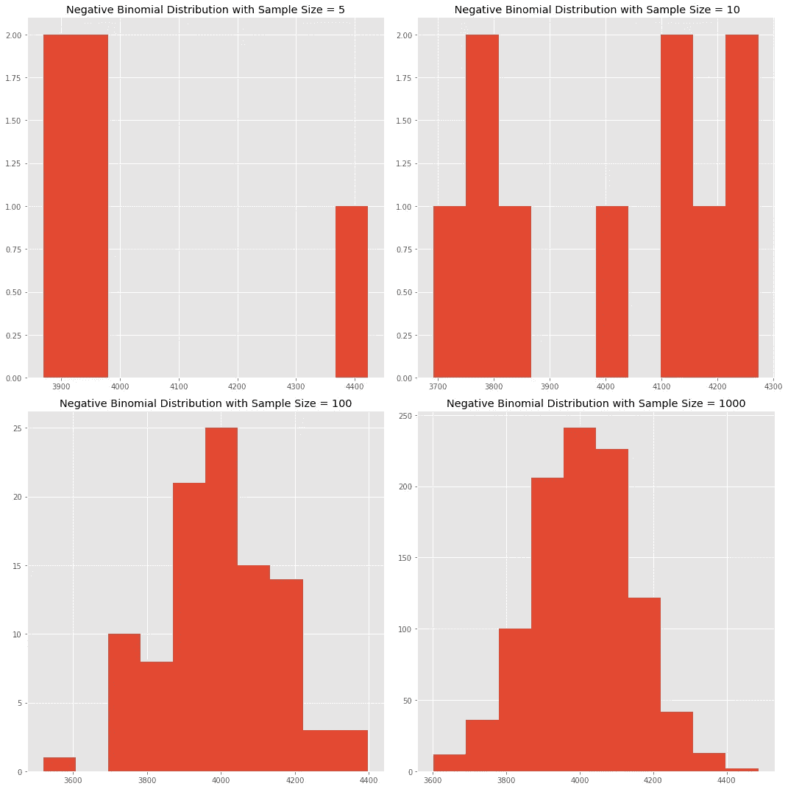*

*设 *r* 为成功次数。*

***负二项分布**给出了在 *k* 次失败后 *r* 次成功的概率。*

*更具体地说，我们想要找到这样的概率，第一，在*k*+*r*-1 试验中有*r*-1 次成功，第二，在 *k + r.* 试验中有一次成功*

*比如说 *r* = 3，k = 10。然后，我们想找出十二次试验中两次成功的概率，然后在第十三次试验中第三次成功的概率*。【注意:我们*不是*估计三次成功十次失败的概率。我们*正在*估计第十三次试验第三次成功的概率。**

*设 *W* 为第 *r* 次成功前的试验次数。负二项分布的概率质量函数为*

*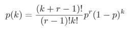*

*其中 *k* 为失败次数 *r—* 1 为成功次数。因此， *k+ r—* 1 为试验次数。*

*期望值和方差是*

*E[W] = r(1 — p)/p，并且*

*Var[W] = r(1 — p)/p，*

*分别是。*

## *例子*

*我们可以用负二项分布来回答德怀特的第三个问题:*

> *我们想给从 Dunder Mifflin 购买的 5 个客户一个 Scrantonicity 专辑。第十个客户端拿到最后一张专辑的概率是多少？*

*我们还知道 r = 5，k = 5。*

*因此，*

*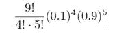*

*这给了我们 0.00744，或 0.744%*

# *笔记*

*负二项分布有不同的定义。在本文中，我将负二项分布定义为*

> *在 *k* 次失败后，第 *r* 次成功的概率。*

*然而，我们也可以将负二项分布定义为*

1.  *在 *k* 次失败后，第*次成功的概率**
2.  *在 *r* 成功之后第 *k* 次失败的概率。*

*这些定义产生了均值的替代方程。*

*如果我们使用第一个定义，那么我们的平均值就变成了*

*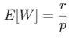*

*如果我们使用第二个定义，那么我们的平均值就变成了*

*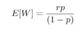*

*在计算期望值之前，一定要知道你的主管想要什么信息！*

# *结论*

*在本文中，我研究了三种离散概率分布:*

1.  *二项式分布*
2.  *几何分布*
3.  *负二项分布*

*显然，还有更多——泊松、超几何、多项式等等。*

*您不需要了解每个发行版——我当然不需要！—但是你知道的越多，你解决商业问题的工具就越多。*