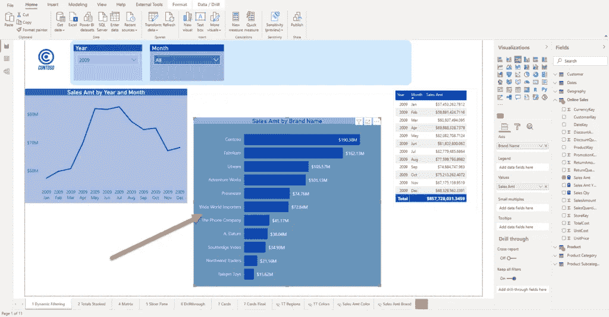
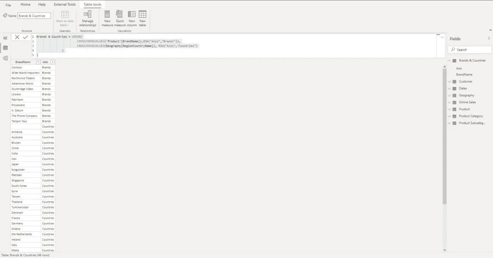
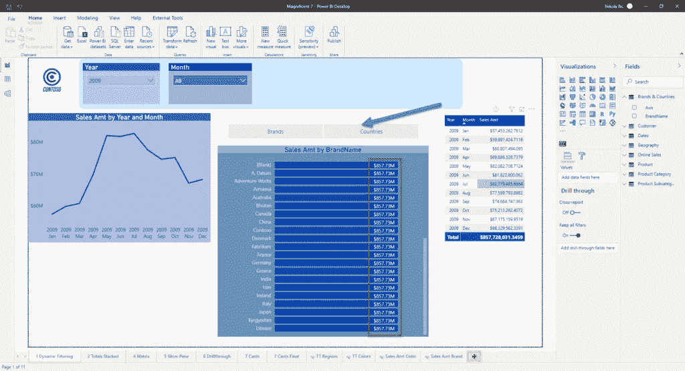
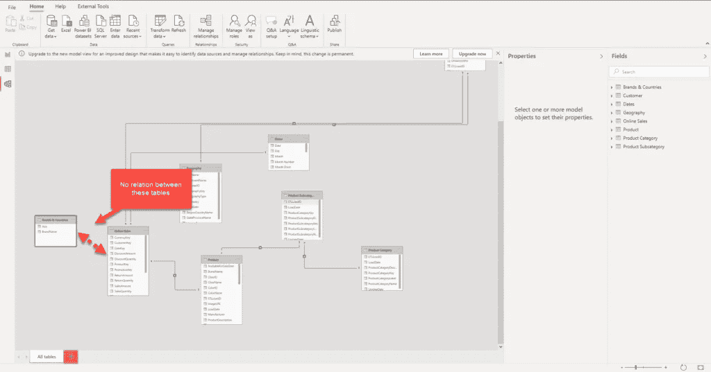
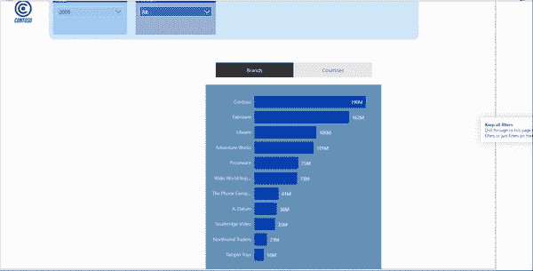

# 动力双大轴中的动力轴

> 原文：<https://towardsdatascience.com/dynamic-axis-in-power-bi-daxis-72ecb22c119f?source=collection_archive---------13----------------------->

## 你曾经尝试过动态地改变你的视觉轴线吗？这比看起来容易，有了 DAX 的小魔法


[https://www . pexels . com/photo/eight-electrical-metric-meters-942316/](https://www.pexels.com/photo/eight-electrical-metric-meters-942316/)

几个月前，我写了一篇关于 Power BI 中的动态过滤的[博文——以及如何根据用户的选择在一个视图中显示不同的度量——而不使用书签！](/dynamic-filtering-in-power-bi-5a3e2d2c1856)

上周，我的客户向我提出了类似的要求。事实上，这一次的请求正好相反——他们希望看到相同的指标(度量),但是从不同的角度——例如，每个国家和品牌的总销售额，这取决于用户的选择。

同样，这也可以通过使用书签和在不同页面状态之间切换来实现。然而，我希望找到一种不同的、灵活的、更具可扩展性的解决方案，以防将来他们想要扩展可能的“视角”列表，例如，通过在该列表中添加客户性别或地区。

我喜欢称这个解决方案为:DAXis —因为我们用 DAX 实现了一个动态轴:)

## 搭建舞台

在寻找可能的解决方案时，我看到了 Kasper de Jonge 写的这篇很棒的[博客文章](https://www.kasperonbi.com/dynamically-switching-axis-on-visuals-with-power-bi/)，它基本上给了我一个如何处理这个请求的想法。

像往常一样，我将使用 Contoso 示例数据库进行演示。



作者图片

在此图中，您可以看到我的图像显示了每个品牌的总销售额。这个想法是“以某种方式”使用户能够将轴切换到国家，在视觉上保持现有的措施。不允许书签:)

第一步是生成一个新表，它实质上是我们数据模型中品牌和国家列的所有不同值的一个[笛卡尔乘积](https://en.wikipedia.org/wiki/Cartesian_product)。这个表将在以后用于构建我们的视觉轴。

```
Brands & Countries = UNION(
                        CROSSJOIN(VALUES('Product'[BrandName]),ROW("Axis","Brands")),
                        CROSSJOIN(VALUES(Geography[RegionCountryName]), ROW("Axis","Countries")
               )
)
```

我刚刚将 BrandName 列重命名为“Value”，因为它不仅包括品牌，还包括国家。



作者图片

回到我们的报告，让我们将该表中的轴放入切片器，并将 BrandName 作为我们的视图中的轴:



作者图片

正如您所看到的，我们得到了每个轴类别的总计。这是因为我们的主要度量(销售额)是对来自在线销售表的值求和，而该表与我们新创建的品牌和国家表之间没有关系。



作者图片

因此，我们的主要衡量标准(销售额)需要重写，以显示正确的结果。我们将利用*tretas*DAX 函数的用法。以最简单的方式， *TREATAS* 将表表达式的结果作为过滤器应用于不相关的表中的列。这个函数带有[的一些限制](https://docs.microsoft.com/en-us/dax/treatas-function)，但是它应该在我们的特定场景下工作:

```
Sales Amt TREATAS = 
   IF(
       HASONEVALUE('Brands & Countries'[Axis]),
          SWITCH(VALUES('Brands & Countries'[Axis])
                 ,"Countries", CALCULATE(SUM('Online Sales'[SalesAmount])
                                      ,TREATAS(VALUES('Brands & Countries'[Value])
                                      ,Geography[RegionCountryName]))
                 ,"Brands",    CALCULATE(SUM('Online Sales'[SalesAmount])
                                      ,TREATAS(VALUES('Brands & Countries'[Value])
                                      ,'Product'[BrandName]))
)
)
```

在这种情况下， *TREATAS* 将把过滤器从我们新创建的表推到一个“真正的”维度表中！而且，一旦我将这个新的度量拖到一个可视对象上，我就能够根据用户在切片器中的选择动态地更改 y 轴:



作者图片

多酷啊！感谢 Kasper 的绝妙想法:)

## 结论

正如您可能看到的，我们为一个常见的业务请求找到了一个非常酷和优雅的解决方案。

对于几乎任何问题，不仅仅是与 BI 相关的电源，都有多种有效且合理的解决方案。我们可以使用按钮和书签来处理这个请求，但是从长远来看，我相信这个具有动态轴和独立表的解决方案提供了更多的可伸缩性，并且更易于维护。

感谢阅读！

[成为会员，阅读 Medium 上的每一个故事！](https://datamozart.medium.com/membership)