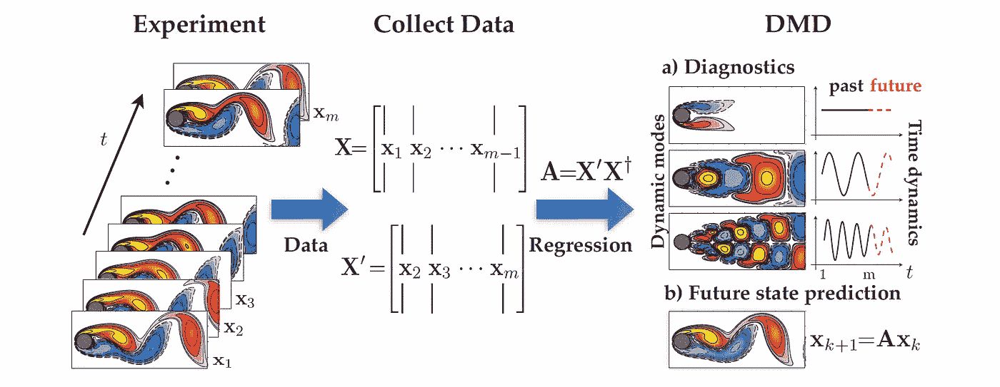
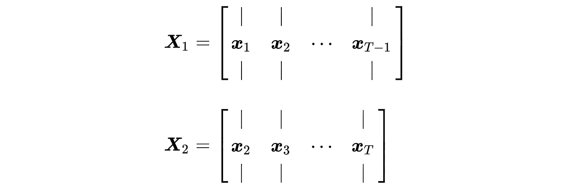
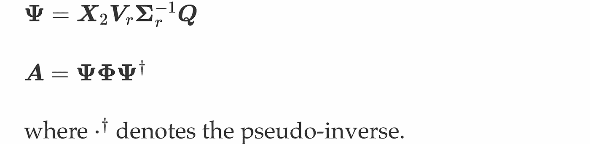
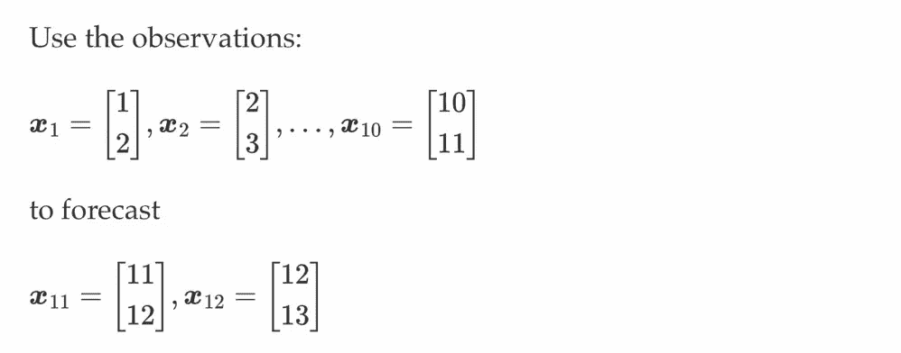

# 多元时间序列预测的动态模式分解

> 原文：<https://towardsdatascience.com/dynamic-mode-decomposition-for-multivariate-time-series-forecasting-415d30086b4b?source=collection_archive---------10----------------------->

## 使用 Numpy 的 DMD 预测的 Python 实现

动态模式分解(DMD)是由 *Peter Schmid* 于 2008 年开发的一种数据驱动的降维算法(论文发表于 2010 年，见[1，2])，类似于矩阵分解和主成分分析(PCA)算法。给定一个多元时间序列数据集，DMD 计算一组动态模式，其中每个模式都与一个固定的振荡频率和衰减/增长率相关联。由于每种动态模式下固有的时间行为，DMD 确实不同于通常使用的降维算法，如 PCA。DMD 允许人们用物理上有意义的模式来解释数据的时间行为。一个重要的特征是 DMD 能够执行多元时间序列预测。在现有的工作中，DMD 模型在时空流体流动分析中有广泛的应用(例如见图 1)。



图一。流体流动数据集上 DMD 的示意图。DMD 书[3]中的一个例子。

在本帖中，我们将介绍 DMD 算法的预备知识，并讨论如何用 Numpy 在 Python 中再现 DMD。然后，为了更好地理解 DMD，我们设计了一个玩具示例实验来执行多变量时间序列预测。下面的内容玩得开心！:)

> 如果你对图 1 所示的流体动力学分析感兴趣，在 https://medium.com/p/d84065fead4d 的[也有一篇博文。这篇文章介绍了如何用 Python 中的张量分解算法重建流体动力学。另一篇关于用 DMD 模型从流体流动数据中发现空间模式的博文在](https://medium.com/p/d84065fead4d)[https://medium . com/@ Xinyu . Chen/reproducing-dynamic-mode-decomposition-on-fluid-flow-data-in-python-94 b 8d 7 E1 f 203](https://medium.com/@xinyu.chen/reproducing-dynamic-mode-decomposition-on-fluid-flow-data-in-python-94b8d7e1f203)。

# DMD 的模型描述

DMD 与向量自回归(VAR)模型有很强的联系。VAR 是一个经典的统计模型，用于捕捉多元时间序列数据的协同进化模式，在经济学和金融学中有着广泛的应用。给定时间序列数据 ***X*** 的大小 *N* -by- *T* 其中 *N* 是变量的数量， *T* 是时间步长的数量，则在任何时间步长 *t* 中，一阶 VAR 或 VAR(1)的形式为


其中 ***x*** *t* 表示时间 *t* 中的快照向量，大小为*N*-1。 ***A*** 是系数矩阵，大小为 *N* -by- *N* 。

在 VAR(1)模型中，建模目标是找到一个表现良好的系数矩阵，并使用它来表示时间相关性。在标准的 DMD 模型中，我们也采用 VAR(1)的形式。为了计算系数，第一个脉冲是将上面的等式重写如下，


其中我们在等式中定义了以下矩阵:



与 VAR(1)不同，DMD 不显式计算系数矩阵。在 DMD 中，有一个低秩结构来逼近 VAR(1)中的系数矩阵，它就是 Koopman 矩阵。

# DMD 算法

在 DMD 中，获得 Koopman 矩阵并实现预测任务并不困难。DMD 中最重要的工具是奇异值分解和特征值分解。为了**计算库普曼矩阵**，只有两个步骤应该遵循:

*   对数据矩阵 ***X*** 1 进行奇异值分解:


其中 ***U*** 由左奇异向量组成， ***V*** 由右奇异向量组成，**σ**由其对角线上的奇异值组成。

*   使用某个预定义的秩 *r* 实现截断奇异值分解，并通过下式计算库普曼矩阵


如上所述，DMD 可以通过动态模式探索可解释的时间行为。如果想要**计算动态模式**，请遵循以下步骤:

*   对库普曼矩阵进行特征值分解:


其中 ***Q*** 由特征向量组成，**φ**由特征值组成。

DMD 模式也称为动态模式，是特征向量。特征值总是以复共轭对的形式出现，可以解释为 DMD 谱。

在上面，我们得到了库普曼矩阵，动态模式，DMD 谱。一个问题是如何进行多元时间序列预测。我们可以采用以下两个等式来回答这个问题:



现在，我们有了 VAR(1)中提到的系数矩阵 ***A*** 。因此，可以实现时间序列预测任务。下面是 DMD 算法的 Python 代码。我们通过使用 Numpy 来重现它，这样就很容易理解了。

```
import numpy as npdef DMD(data, r):
    """Dynamic Mode Decomposition (DMD) algorithm."""

    ## Build data matrices
    X1 = data[:, : -1]
    X2 = data[:, 1 :]
    ## Perform singular value decomposition on X1
    u, s, v = np.linalg.svd(X1, full_matrices = False)
    ## Compute the Koopman matrix
    A_tilde = u[:, : r].conj().T @ X2 @ v[: r, :].conj().T * np.reciprocal(s[: r])
    ## Perform eigenvalue decomposition on A_tilde
    Phi, Q = np.linalg.eig(A_tilde)
    ## Compute the coefficient matrix
    Psi = X2 @ v[: r, :].conj().T @ np.diag(np.reciprocal(s[: r])) @ Q
    A = Psi @ np.diag(Phi) @ np.linalg.pinv(Psi)

    return A_tilde, Phi, A
```

输出包括库普曼矩阵、特征值和系数矩阵。

# DMD 预测的一个玩具示例

让我们考虑下面的玩具例子。



```
import numpy as npdef DMD4cast(data, r, pred_step):
    N, T = data.shape
    _, _, A = DMD(data, r)
    mat = np.append(data, np.zeros((N, pred_step)), axis = 1)
    for s in range(pred_step):
        mat[:, T + s] = (A @ mat[:, T + s - 1]).real
    return mat[:, - pred_step :]
```

在此处编写代码:

```
X = np.zeros((2, 10))
X[0, :] = np.arange(1, 11)
X[1, :] = np.arange(2, 12)
pred_step = 2
r = 2
mat_hat = DMD4cast(X, r, pred_step)
print(mat_hat)
```

运行它，输出是

```
[[11\. 12.]
 [12\. 13.]]
```

可以看出，DMD 预测与地面实况数据完全相同。

# 简短的总结

这是一篇简单的文章，介绍 DMD 算法及其在多变量时间序列预测任务中的应用。从公式上看，DMD 确实是一个降秩的 VAR 模型，可以解决高维时间序列数据中的过参数化问题。DMD 相对于 VAR 还有其他一些优势。例如，DMD 由于其解释而在时空数据分析中受到广泛关注。或者，我们也可以使用时间矩阵分解模型(组件包括矩阵分解和 VAR)来解决过度参数化问题。有一篇博文(见[https://medium.com/p/b1c59faf05ea](https://medium.com/p/b1c59faf05ea))讨论了用时间矩阵分解进行流体动力学预测。

感谢你阅读这篇文章！如果你有任何问题，请告诉我！

# 参考

[1]彼得·施密德(2010 年)。数值和实验数据的动态模式分解流体力学杂志，656:5–28。

[2]维基百科上的动态模式分解:【https://en.wikipedia.org/wiki/Dynamic_mode_decomposition 

[3] J .内森·库茨，史蒂文·l·布伦顿，宾尼·w·布伦顿，约书亚·l·普罗克特(2016)。复杂系统的数据驱动建模。暹罗。