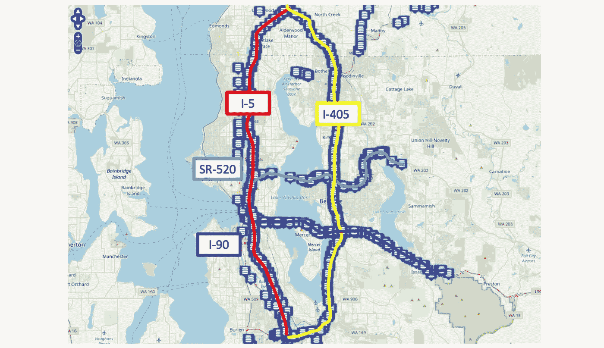
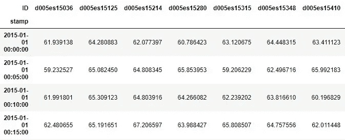
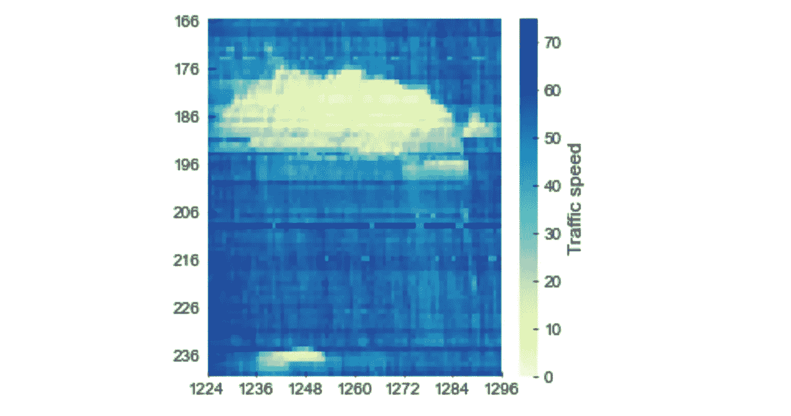
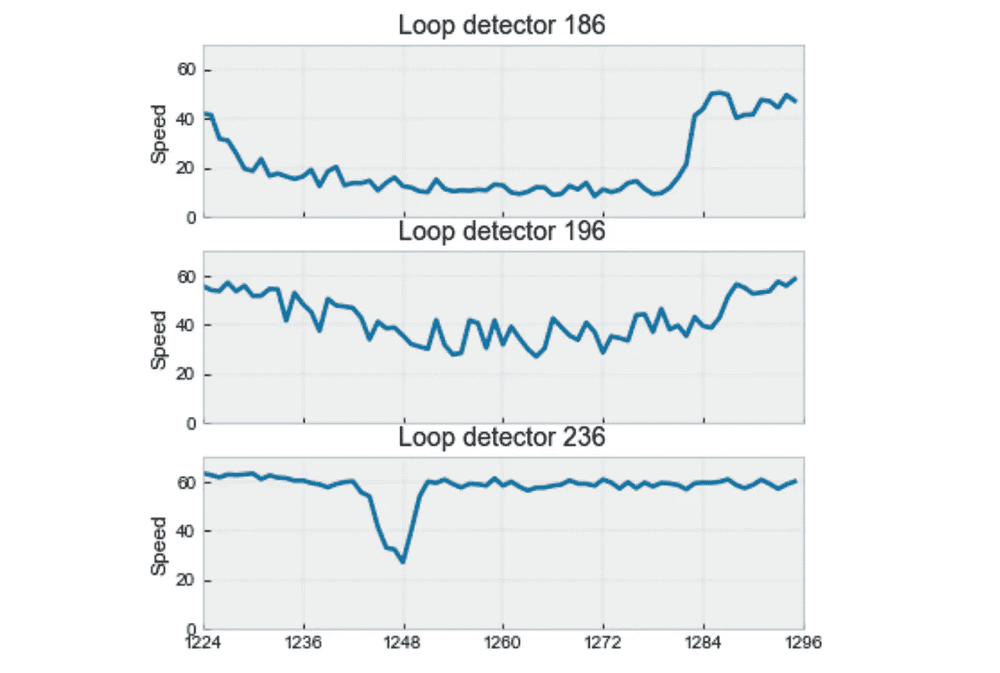
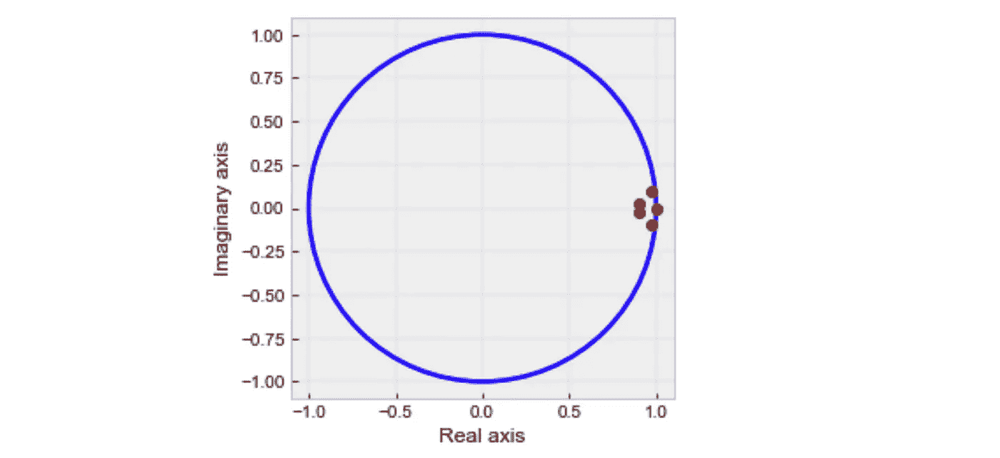
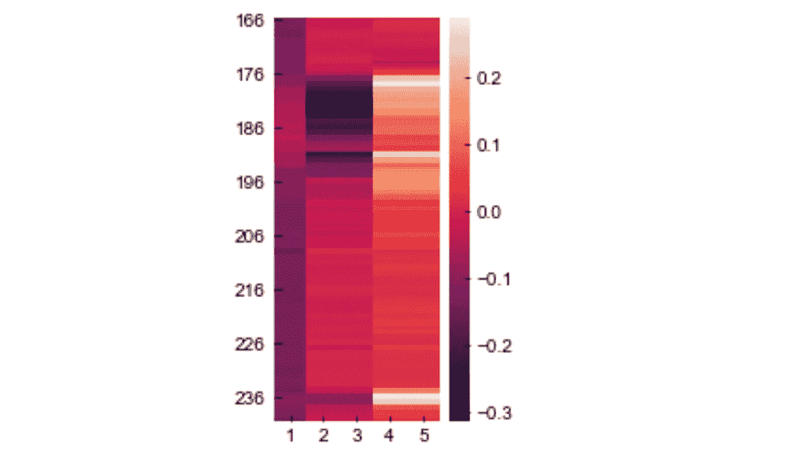
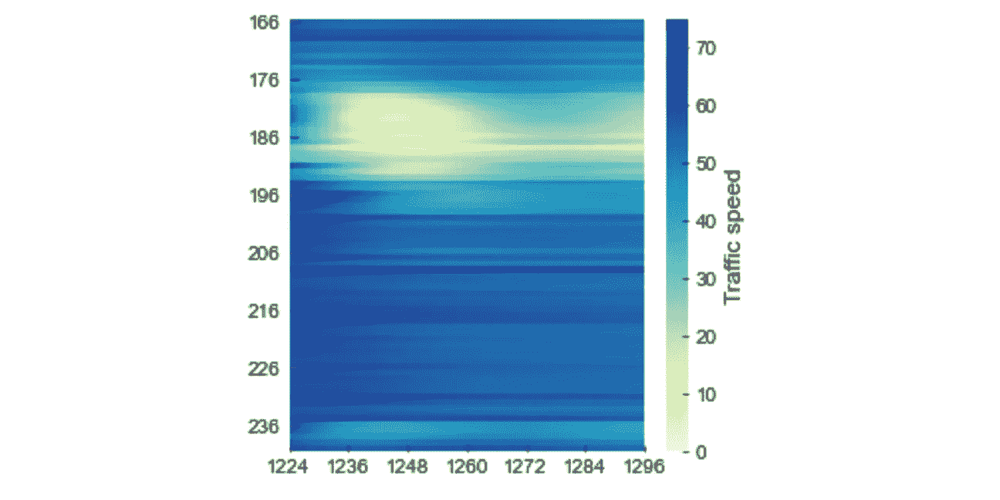
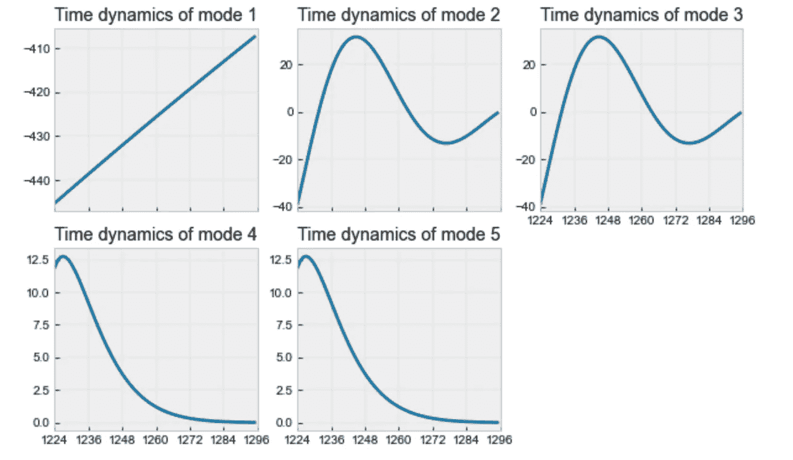

# 西雅图高速公路时空交通速度时间序列的动态模式分解

> 原文：<https://towardsdatascience.com/dynamic-mode-decomposition-for-spatiotemporal-traffic-speed-time-series-in-seattle-freeway-b0ba97e81c2c?source=collection_archive---------11----------------------->

时空交通数据分析是智能交通系统中的一个新兴领域。在过去的几年中，数据驱动的机器学习模型为理解真实世界的数据、构建数据计算范式和支持真实世界的应用提供了新的维度。

在这篇博文中，我们计划:

*   介绍美国西雅图的一个公开可用的交通流量数据，
*   设计一个易于使用的数据集(作为一个玩具例子)用于交通流量分析，
*   对玩具实例进行动态模式分解，并讨论结果的解释。

# 西雅图高速公路交通速度数据集

这是由部署在美国西雅图高速公路上的感应线圈探测器收集的交通速度数据集。该数据集在 GitHub 上公开发布(见[https://github.com/zhiyongc/Seattle-Loop-Data](https://github.com/zhiyongc/Seattle-Loop-Data))。如图 1 所示，高速公路包括 I-5，I-405，I-90 和 SR-520。里程标处的速度信息是主车道上同方向的多个环形检测器的平均值。在数据集中，有 323 个环路检测器。速度信息的时间分辨率为 5 分钟，这意味着我们每天有 288 个时间间隔，或者说每个环路检测器每天有 288 个数据点。



**图一**。西雅图地区高速公路地图及其感应线圈检测器位置。每个蓝色图标表示里程碑处的环路检测器。来源于 GitHub。

我们可以看看如图 2 所示的数据文件。速度数据是矩阵的形式。该行对应于每个特定的时间间隔，时间间隔由时间戳给出，如 2015–01–01 00:00:00 和 2015–01–01 00:05:00。该列指的是每个环路检测器 ID。



**图二**。数据集中的一些交通速度数据点。来源于 GitHub。

在这篇博文中，我们从这个数据集中设计了一个玩具示例数据，并创建了一个子集作为`toy_data.npy`。该子集可从我们的 GitHub 资源库获得:

> [https://github . com/xinychen/transdim/blob/master/datasets/Seattle-data-set/toy _ data . npy](https://github.com/xinychen/transdim/blob/master/datasets/Seattle-data-set/toy_data.npy)



**图 3** 。西雅图 I-5 高速公路的交通速度数据热图。时间段为 2015 年 1 月 5 日上午 6:00—下午 12:00(即 72 个时间间隔)。该子集中有 75 个环路检测器，从 ID 166 到 ID 240。

图 3 显示了交通速度数据(子集)的速度热图，其大小为 75×72(即 75 个环路检测器和 72 个时间间隔)。该子集涵盖了 I-5 高速公路在早高峰时段的交通状态。可以看出，从(粗略地)环路检测器 176 到(粗略地)环路检测器 196，它示出了涉及交通拥塞的明显的低交通速度。在其他环形检测器中，交通速度相对较高。

> 要在准备好子集的情况下绘制该图，可以尝试以下 Python 代码:

```
import numpy as np
import seaborn as sns
import matplotlib.pyplot as pltmat = np.load('toy_data.npy')plt.style.use('bmh')
plt.rcParams['font.family'] = 'Arial'fig = plt.figure(figsize = (4, 4))
sns.heatmap(mat, cmap = 'YlGnBu', cbar_kws={'label': 'Traffic speed'}, vmin = 0, vmax = 75)
plt.xticks(np.arange(0, 72 + 1, 12), np.arange(4 * 288 + 72, 4 * 288 + 144 + 1, 12), rotation = 0)
plt.yticks(np.arange(0.5, 75.5, 10), np.arange(166, 241, 10), rotation = 0)
plt.show()
```

# 分析交通速度时间序列

在图 3 中，我们考虑了 75×72 的交通速度子集。我们也可以画一些交通速度的时间序列曲线。图 4 分别示出了环路检测器 186、196 和 236 的三个交通速度时间序列。我们可以看到，具有相对较低交通速度的环路检测器 186 和 196 都遭受交通拥塞。



**图 4** 。环路检测器 186、196 和 236 的交通速度时间序列。

要绘制此图，请尝试以下 Python 代码:

```
import matplotlib.pyplot as pltfig = plt.figure(figsize = (6, 6))
i = 1
for loc in [185, 195, 235]:
    ax = fig.add_subplot(3, 1, i)
    plt.plot(mat[loc - 166, :], color = "#006ea3", linewidth = 2.5)
    plt.xticks(np.arange(0, 72 + 1, 12), 
               np.arange(4 * 288 + 72, 4 * 288 + 144 + 1, 12))
    if i != 3:
        plt.setp(ax.get_xticklabels(), visible = False)
    plt.grid(axis = 'both', linestyle = "--", linewidth = 0.1, color = 'gray')
    plt.ylabel('Speed')
    plt.title('Loop detector {}'.format(loc + 1))
    ax.tick_params(direction = "in")
    ax.set_xlim([0, 72])
    ax.set_ylim([0, 70])
    i += 1
plt.show()
```

# 在子集上再现动态模式分解(DMD)

DMD 是一种数据驱动的时间序列数据降维方法。对于任何多变量时间序列数据，DMD 可以计算一组动态模式，其中每个模式都与时间行为相关联。特别是，DMD 允许人们用物理上有意义的模式来解释数据的时间行为[1]。有关 DMD 的深入讨论，请查看[1]。我们使用[1]中的 Python 代码进行以下分析。

```
import numpy as npdef DMD(data, r):
    """Dynamic Mode Decomposition (DMD) algorithm."""

    ## Build data matrices
    X1 = data[:, : -1]
    X2 = data[:, 1 :]
    ## Perform singular value decomposition on X1
    u, s, v = np.linalg.svd(X1, full_matrices = False)
    ## Compute the Koopman matrix
    A_tilde = u[:, : r].conj().T @ X2 @ v[: r, :].conj().T * np.reciprocal(s[: r])
    ## Perform eigenvalue decomposition on A_tilde
    eigval, eigvec = np.linalg.eig(A_tilde)
    ## Compute the coefficient matrix
    Psi = X2 @ v[: r, :].conj().T @ np.diag(np.reciprocal(s[: r])) @ eigvec

    return eigval, eigvec, Psi
```

在这种情况下，`r`是 DMD 的预定义低秩。`eigval`和`eigvec`对应 DMD 中库普曼矩阵的特征值和特征向量。特别是，`eigval`可以解释为 DMD 谱，以复共轭对的形式出现。`Psi`指动态模式。

# DMD 对结果的解释

## 特征值和 DMD 谱

这里，我们使用上面提到的 DMD 函数，并评估秩为 5 的 DMD 模型。Python 代码由下式给出

```
r = 5
eigval, eigvec, Psi = DMD(mat, r)
```

然后，我们使用以下 Python 代码来绘制 DMD 谱:

```
import matplotlib.pyplot as pltfig = plt.figure(figsize = (4, 4))
ax = fig.add_subplot(1, 1, 1)
ax.set_aspect('equal', adjustable = 'box')
plt.plot(eigval.real, eigval.imag, 'o', color = 'red', markersize = 6)
circle = plt.Circle((0, 0), 1, color = 'blue', linewidth = 2.5, fill = False)
ax.add_patch(circle)
plt.grid(axis = 'both', linestyle = "--", linewidth = 0.1, color = 'gray')
ax.tick_params(direction = "in")
plt.xlabel('Real axis')
plt.ylabel('Imaginary axis')
plt.show()
```

图 5 显示了数据的 DMD 频谱。每个特征值解释了其相应动态模式的动态行为。我们可以将特征值解释如下[2]，

*   如果特征值具有非零虚部，则在相应的动态模式中存在振荡。
*   如果特征值在单位圆内，那么动态模式是衰减的。
*   如果特征值在单位圆之外，那么动力模态是增长的。

在图 5 中，点靠近单位圆或在单位圆上。有四个特征值在单位圆内，而一个特征值在虚部为 0 的单位圆上。我们还可以看到，两个特征值对在虚轴上是对称的。最动态的模式是振荡和衰减。这一结果与早高峰时间低交通速度的时空模式相一致。



**图五**。秩为 5 的 75×72 数据的 DMD 特征值。有 5 个红点显示了 5 个特征值的实轴和虚轴。蓝圈是单位圆。

## 动态模式和时间动态

在 DMD 模型中，`Psi`是指动态模式。我们可以将其形象化，如图 6 所示。可以看出，动态模式显示了示例数据的空间模式，并且在一些环路检测器中有显著的变化，例如从 176 到 196。这也与这些环路检测器监测到的交通拥堵(交通速度低)相一致。



**图 6** 。DMD 中数据动态模式的热图。

绘制该图的 Python 代码如下所示

```
fig = plt.figure(figsize = (2, 4))
sns.heatmap(Psi.real)
plt.xticks(np.arange(0.5, 5.5), np.arange(1, 6), rotation = 0)
plt.yticks(np.arange(0.5, 75.5, 10), np.arange(166, 241, 10), rotation = 0)
plt.show()
```

为了理解示例数据的时间演变，我们可以使用动态模式来重建数据，如图 7 所示。这里我们将 DMD 重建定义如下，

```
def reconstruct_DMD_system(data, r):
    T = data.shape[1]
    ## Build data matrices
    X1 = data[:, : -1]
    X2 = data[:, 1 :]
    ## Perform singular value decomposition on X1
    u, s, v = np.linalg.svd(X1, full_matrices = False)
    ## Compute the Koopman matrix
    A_tilde = u[:, : r].conj().T @ X2 @ v[: r, :].conj().T * np.reciprocal(s[: r])
    ## Perform eigenvalue decomposition on A_tilde
    eigval, eigvec = np.linalg.eig(A_tilde)
    ## Compute the coefficient matrix
    Psi = X2 @ v[: r, :].conj().T @ np.diag(np.reciprocal(s[: r])) @ eigvec
    time_dynamics = np.zeros((r, T), dtype = 'complex')
    b = np.linalg.pinv(Psi) @ data[:, 0]
    for t in range(T):
        time_dynamics[:, t] = np.power(eigval, t + 1) * b
    return (Psi @ time_dynamics).real, time_dynamics.real
```



**图 7** 。利用动态模式重构交通速度数据。

要绘制图 7，请使用以下 Python 代码:

```
r = 5
rec_system, time_dynamics = reconstruct_DMD_system(mat, r)

fig = plt.figure(figsize = (4, 4))
sns.heatmap(rec_system, cmap = 'YlGnBu', cbar_kws={'label': 'Traffic speed'}, vmin = 0, vmax = 75)
plt.xticks(np.arange(0, 72 + 1, 12), np.arange(4 * 288 + 72, 4 * 288 + 144 + 1, 12), rotation = 0)
plt.yticks(np.arange(0.5, 75.5, 10), np.arange(166, 241, 10), rotation = 0)
plt.show()
```

这里，对应于每个动态模式的时间动态由图 8 给出。



**图 8** 。DMD 重建中五种动态模式的时间动力学。

要绘制图 8，请使用以下 Python 代码:

```
fig = plt.figure(figsize = (10, 6))
for loc in range(1, 6):
    ax = fig.add_subplot(2, 3, loc)
    plt.plot(time_dynamics[loc - 1, :], color = "#006ea3", linewidth = 2.5)
    plt.xticks(np.arange(0, 72 + 1, 12), 
               np.arange(4 * 288 + 72, 4 * 288 + 144 + 1, 12))
    if loc == 1 or loc == 2:
        plt.setp(ax.get_xticklabels(), visible = False)
    plt.grid(axis = 'both', linestyle = "--", linewidth = 0.1, color = 'gray')
    plt.title('Time dynamics of mode {}'.format(loc))
    ax.tick_params(direction = "in")
    ax.set_xlim([0, 72])
plt.show()
```

# 结论

在这篇博文中，我们将介绍一个 DMD 模型的玩具示例，用于时空交通数据分析。由于其有意义的解释，DMD 在时空数据分析中应该有许多有趣的应用。如果你有任何建议，请告诉我！感谢你阅读这篇文章！

> 这篇博文的完整 Python 实现可从以下网址获得:

[https://github . com/xinychen/transdim/blob/master/datasets/Seattle-data-set/toy-examples . ipynb](https://github.com/xinychen/transdim/blob/master/datasets/Seattle-data-set/toy-examples.ipynb)

# 参考

[1]陈新宇(2021)。多元时间序列预测的动态模式分解。媒体上的博客帖子。[https://towards data science . com/dynamic-mode-decomposition-for-multi variable-time-series-forecasting-415d 30086 b4b](/dynamic-mode-decomposition-for-multivariate-time-series-forecasting-415d30086b4b)

[2]Python 中的动态模式分解。2016.博客帖子。[http://www.pyrunner.com/weblog/2016/07/25/dmd-python/](http://www.pyrunner.com/weblog/2016/07/25/dmd-python/)