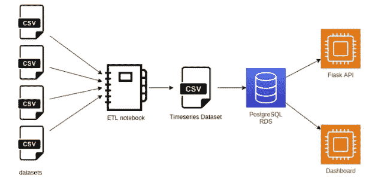
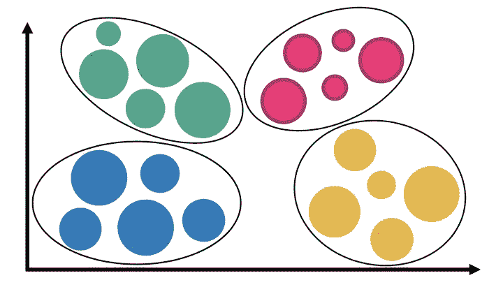
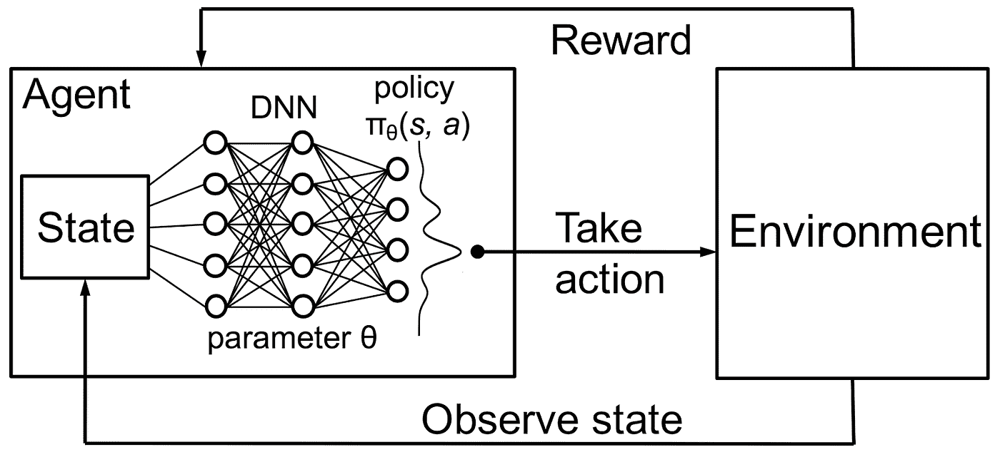
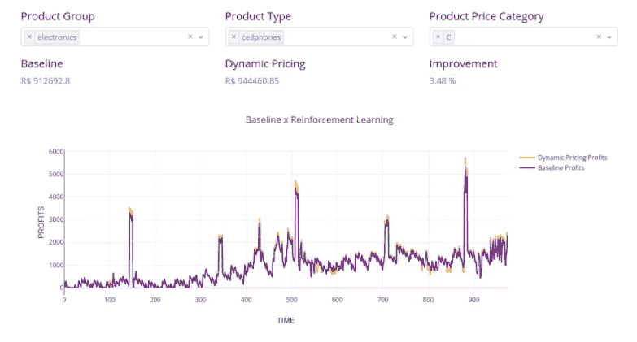

# 基于强化学习和神经网络的动态定价

> 原文：<https://towardsdatascience.com/dynamic-pricing-using-reinforcement-learning-and-neural-networks-cc3abe374bf5?source=collection_archive---------4----------------------->

## 一个可以增加电子商务销售和利润的智能系统，被 Correlation One 和软银评为其数据科学计划的三大项目之一。

动态定价。图片由[来源](https://www.prexus.co/uploads/1/3/0/6/13063909/pricing_orig.png)。经允许重新发布。

该项目的主要目标是开发一个动态定价系统，通过适应供需水平来增加电子商务利润。

> 定价系统应该能够以稳健和及时的方式操纵产品的最终价格，以可伸缩的方式对供求波动做出反应。

首先，创建了一个模拟器环境，根据几个变量模拟订单水平的波动。然后，这个模拟环境被用来训练一个**深度强化学习**代理来选择最佳定价策略，以实现利润最大化。

# **数据准备和系统架构**

动态定价系统架构由三个基本部分组成。托管在亚马逊 RDS 上的 *PostgreSQL 数据库*，托管在亚马逊 EC2 上的 *Flask API* 和 *Dash* dashboard。

Flask API 是一个处理 HTTP 请求的 Python *RESTful* 框架。它有两个主要用途，应用强化学习算法和提供数据访问。它使用经过训练的 PyTorch 模型处理数据，并将结果保存在数据库中。它还提供了对 JSON 格式数据的 HTTP 访问。

系统架构。*图片作者。*

在利用电子商务数据进行分析和建模之前，进行了广泛的**清理过程**。主要目的是将数据集合并成时间序列格式。对于我们收集的任何给定产品:

*   *竞争对手的价格(如有)*
*   *平均价格*
*   *平均运输价值*
*   *订单数量*
*   *产品类型*
*   *产品的组别*

在 ETL 过程中，必须进行一些调整以确保**数据质量**。例如，在分析竞争对手的价格时，我们注意到数据集包含一些在短时间内售价为 0.00 雷亚尔的产品。因为产品不太可能是免费提供的，所以从数据集中删除了这些记录。

从剩下的值中，去除了由人工错误导致的异常值(例如:一个售价为 199.99 雷亚尔的产品被宣传为 19.99 雷亚尔)。这是通过排除那些超出产品平均价格正负三倍于其价格标准偏差的值来实现的。

# **对产品进行聚类**

为每个产品单独建模有许多障碍。当一个产品第一次被创建时，没有足够的历史数据来将其建模为时间序列。另一个缺点发生在产品供应中断的时候。

另一方面，为所有的投资组合创建一个单一的模型会产生糟糕的模型，因为这种方法混合了具有非常不同行为的产品。

我们通过使用混合方法解决了一种型号适用于所有型号和一种型号对应不同产品的权衡问题。我们根据类型、组和价格的组合对产品进行了分类。

聚类表示。图片由[来源](https://www.tomasbeuzen.com/post/clustering-mixed-data/featured_hu579c3a9d4976a700b1efa2735a8c353b_430932_720x0_resize_lanczos_2.png)。经允许重新发布。

对于每个产品组+类型组合，根据四分位数范围，创建了 4 个可能价格范围的分类(A、B、C 或 D)。

通过采用这种方法，减少了数据的**稀疏性**，并且具有短时间序列的新产品可以基于类似的项目进行定价。

# **使用强化学习**

*使用真实场景培训强化学习解决方案通常需要大量时间*，而且，由于代理在流程开始时没有任何经验，因此可能会做出错误决策，最终导致不必要的损失。

为了避免这些问题，我们使用各种模型创建了一个**环境模拟器**:线性回归、决策树、随机森林、支持向量机、极端梯度推进和[脸书的先知](https://facebook.github.io/prophet/)。

我们最终选择了**线性回归**环境模拟器，因为它有更高的可解释性。然后，我们应用了一种叫做**深度 Q 学习**的**强化学习**方法。

强化学习循环。图片来自[来源](https://dl.acm.org/doi/10.1145/3005745.3005750)。

> 简而言之，软件*代理*会根据*环境*的当前*状态*采取*动作*。在采取一个*动作*后，会给*代理*一个*奖励*，对所选择的*动作*的好坏进行打分。通过不断试验行动和评估回报，代理人被训练做出最恰当的决定。

在电子商务动态定价问题中，我们可以将这些概念映射到:

*   环境: 市场(例如亚马逊)
*   **S*tate:*市场最低价，库存水平，当前日期特征(星期几，当前年月日，节假日等。)、将价值运送到关键位置等等。**
*   **A*gent*T7*:*动态定价算法**
*   ***动作:****提高或降低价格，或提供免运费*
*   ****奖励:*** 总利润由*代理商*决定*

*使用全连接的**神经网络**，其具有 4 个隐藏层，每层 30 个节点。输入层接收状态信息(电子商务的价格、日期参数、库存、运输值、竞争对手的价格)，而输出层由 10 个可能的操作组成:通过将项目的成本乘以 2.5 个百分点的增量来设置零售价格。*

*这样，代理商永远不会亏本销售产品，留给代理商的任务是选择需求价格之间的最优平衡以优化利润。*

# *结果*

*为了比较结果，在模拟器环境中使用了原始电子商务定价策略和经过训练的代理定价策略。*

*分析财务结果，**强化学习代理比基准定价政策高出 3.48%** 。这种利润增长可以提高商家对电子商务平台的满意度，从而提高参与度。*

*还可以改进商家的定价工作流程，因为手动操作价格变化非常耗时。*

**

*动态定价结果。*图片作者。**

*这种方法可以进一步用于许多其他行业，如旅游业、运输业和农业。*

*希望你喜欢，如果你有任何疑问，请联系我们。*

**感谢阅读！**

*合著者:[弗朗西斯科·马吉利](https://medium.com/u/7636216c08cb?source=post_page-----cc3abe374bf5--------------------------------)，[恩里克·纳西门托](https://medium.com/u/8c538c401b9c?source=post_page-----cc3abe374bf5--------------------------------)，[莱昂纳多·戈麦斯·卡多佐](https://medium.com/u/7310eba9d71d?source=post_page-----cc3abe374bf5--------------------------------) e [雷纳托·坎迪多](https://medium.com/u/783883e609f9?source=post_page-----cc3abe374bf5--------------------------------)。*