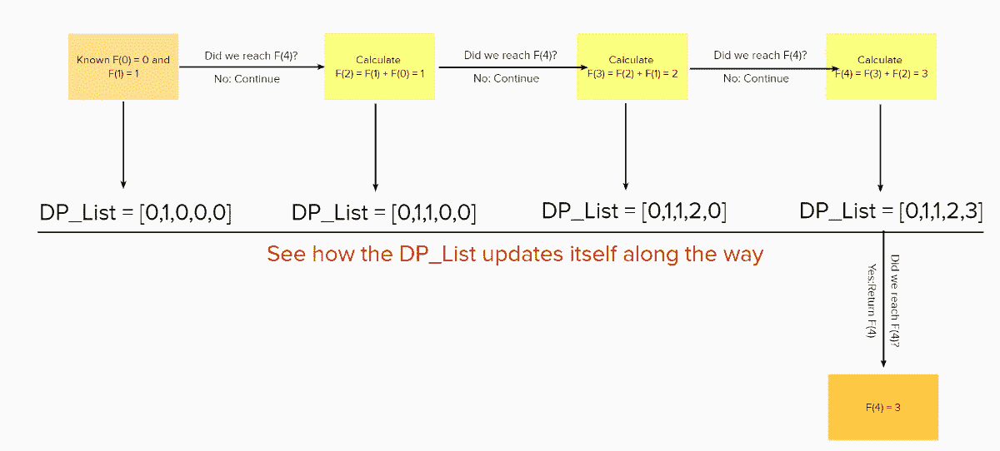
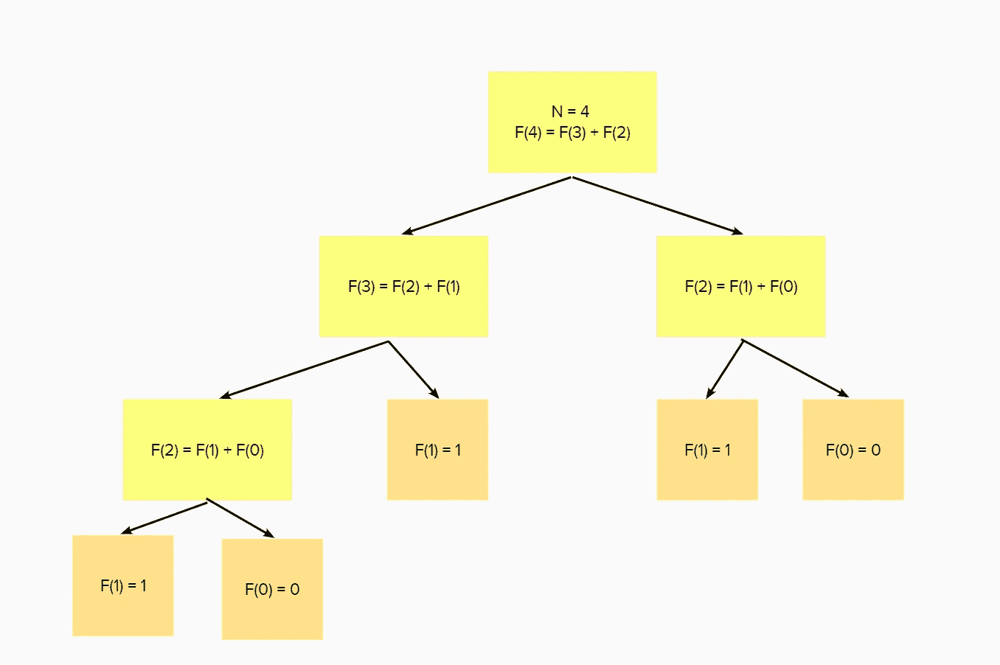
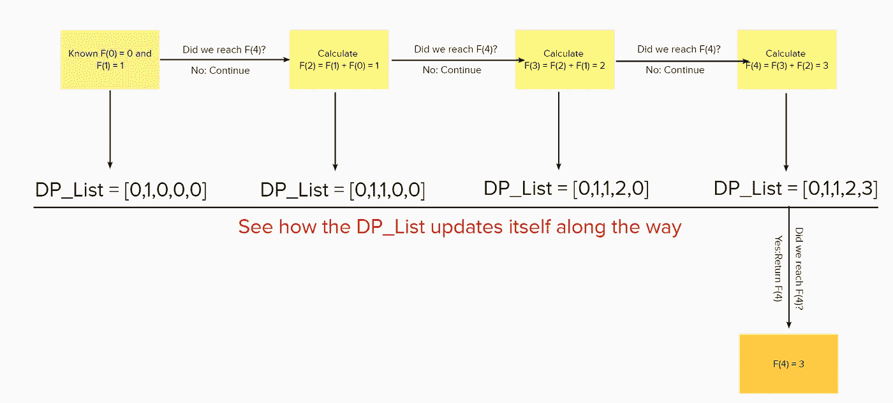
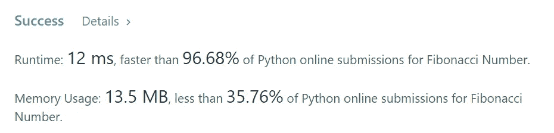
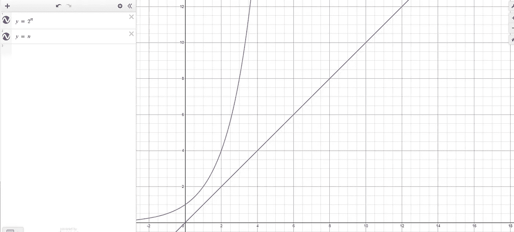
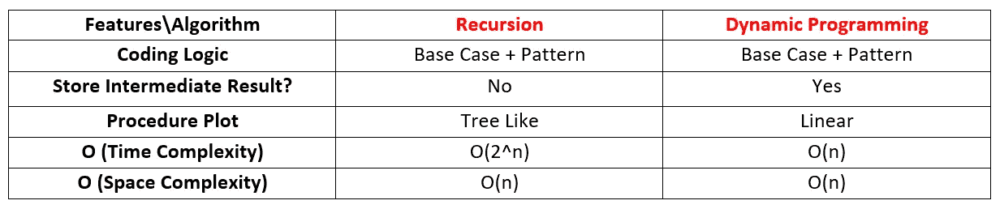

# 递归与动态规划—斐波那契(李特代码 509)

> 原文：<https://towardsdatascience.com/dynamic-programming-i-python-8b20387870f5?source=collection_archive---------2----------------------->

动态编程程序情节，图片由作者提供

在这篇博客中，我将使用 Leetcode 509。以斐波那契数为例，用 Python 说明递归与动态编程的编码逻辑和复杂性。

该项目由**马树恒**建造。要查看使用的完整代码，请找到 [GitHub](https://github.com/hzmsh/DynamicProgramming) 。

# 第 1 节:递归和动态编程简介

## **1.1 背景**

*让我们从什么是递归开始*

**递归**是一个函数调用自身直到到达基本用例的过程。而且在这个过程中，复杂的情况会被递归追踪，变得越来越简单。整个过程的结构是树状的。递归**不存储任何值**，直到到达最后一级(基本情况)。

而**动态编程**相比简单递归主要是一种优化。主要思想是将原始问题分解成可重复的模式，然后**将结果存储为许多子答案**。因此，我们**不必在以后需要时重新计算**前一步的答案。在大 O 方面，这种优化方法一般将时间复杂度从指数级降低到多项式级。

## 1.2 如何编写递归/动态编程脚本

*动态编程和递归非常相似*

1.  递归和动态编程都是从我们初始化开始的基本情况开始的。

2.在我们写完基础案例之后，我们将试图找到问题逻辑流程所遵循的任何模式。一旦找到了，基本就完事了。

3.主要区别在于，对于递归，我们**不存储任何中间值**，而动态编程却利用了这一点。

让我们更深入地了解一下斐波那契数列。

# 第 2 部分:示例:Leetcode 509。斐波那契数

## 2.1 问题提示

> 通常表示为`F(n)`的斐波那契数列形成了一个序列，称为斐波那契数列，从`0`和`1`开始，每个数字都是前面两个数字的和。也就是说，
> 
> F[0] = 0 作为第一个数字
> 
> F[1] = 1 作为我们的第二个数字
> 
> 之后的数字很容易计算:
> 
> F[n] = F[n-1] + F[n-2]
> 
> 给定 n，我们如何找到 F[n]?

## 2.2 示例

如果这是第一次听说斐波那契数，不要担心，这里有一些简单的例子来理解这个问题:

> 给定 n = 2，F[2] = F[1] + F[0] = 0 + 1 = 1
> 
> 给定 n = 3，F[3] = F[2] + F[1] = 1+ 2= 3

# 第 3 节:两种方法

## 3.3 递归方法

让我们从递归方法开始。

## 递归代码

递归代码，作者图片

从上面的代码中，我们可以看到，我们做的第一件事总是寻找**基本案例。**

在这种情况下，基本情况将是 F[0] = 0 和 F[1] = 1，为了实现这种效果，我们将这两个条件显式地写在 if 下。

在基本情况之后，下一步是考虑 F[n]如何产生的一般模式。幸运的是，问题提示已经给出了模式:

> F[n] = F[n-1] + F[n-2]

因此，我们可以简单地返回结果 F(n) = F(n-1) + F(n-2)。

## 3.3.2 递归程序图

如果 n =4，该脚本将执行类似下面的操作:

递归程序情节，图片由作者提供

我们从最上面开始，这里 F[4] = F[3] + F[2]。然后我们会试着求 F[3]和 F[2]的值。最终，当我们到达 F[0] = 0，F[1] = 1 的基本情况时，我们可以简单地从下往上求和，得到 F[4] = 3。

## 3.4 动态规划方法

## 动态编程代码

动态编程代码，图片作者

从上面的代码中，我们可以看到，我们做的第一件事是再次寻找**的基本情况。**

在这种情况下，基本情况将是 F[0] = 0 和 F[1] = 1，为了实现这种效果，我们将这两个条件显式地写在 if 下。

在我们完成基础案例之后，我们将**创建一个空的动态编程数组**来存储所有的中间和临时结果，以便更快地进行计算。由于 n 从 0 开始，我们将创建一个长度为 n+1 的列表。

下一步是考虑 F[n]如何产生的一般模式。幸运的是，问题提示已经给出了模式:

> F[n] = F[n-1] + F[n-2]

因此，我们可以简单地返回结果 F(n) = F(n-1) + F(n-2)。更具体地说:

> **dp[i] = dp[i-2] + dp[i-1]**

这实际上是动态编程和递归的主要区别。在递归中，我们不存储任何中间结果，而在动态编程中，我们存储所有中间步骤。

为了计算 F[4]，我们会先计算 F[2]，F[3]和**将它们的值存储到我们事先创建的 DP 列表**中。

## 3.4.2 动态编程程序图

动态编程程序情节，图片由作者提供

我们从最左边开始，这里 F[0] =0，F[1] = 1。然后我们将试图找到 F[4]的值，我们将首先找到 F[3]和 F[2]的值，并将它们的值存储到 dp_list 中。最终，当我们到达 F[4] = 3 的右边时，我们可以返回最终结果。

# 第四节:时间和空间复杂性

## 4.1 递归的大 O

对于递归，时间复杂度将是 O(2^n，因为每个节点将分成两个子分支。

并且空间复杂度将是 O(N ),因为树的深度将与 N 的大小成比例

以下是两者的 Leetcode 运行时结果:

Leetcode 递归结果，图片由作者提供

## 4.2 动态编程的大 O

对于动态编程，时间复杂度是 O(n ),因为我们只循环一次。正如你在动态编程程序图中看到的，它是线性的。

并且空间复杂度将是 O(N ),因为我们需要将所有中间值存储到 dp_list 中。所以我们需要的空间和给定的 n 一样。

以下是两者的 Leetcode 运行时结果:

Leetcode 动态编程结果，图片作者

## 4.2 时间复杂性的可视化

时间复杂度速度比较，图片作者

红线代表递归的时间复杂度，蓝线代表动态编程。x 轴表示 n 的大小，y 轴表示算法计算结果所需的时间。

# 第五部分:总结与结论

简单回顾一下，下面总结了一些要点:

两种算法的对照表，图片由作者提供

从上面，我们可以观察到，尽管递归和动态编程都可以处理计算斐波那契数的任务，但它们在处理中间结果和**时间消耗**方面有很大的不同。动态编程使用同样多的空间，但是它比 T4 快得多。

尽管这两种算法都需要几乎相同难度的努力来理解逻辑(我希望我的博客能对你有所帮助)，但在你掌握了算法的核心之后，这是值得的，因为大量的数组问题可以通过动态编程优雅而高效地解决。

如果你觉得你完全理解了上面的例子，并且想要更多的挑战，我计划在不久的将来使用动态编程来解决一系列博客中更困难和现实生活中的问题。感谢您的阅读！