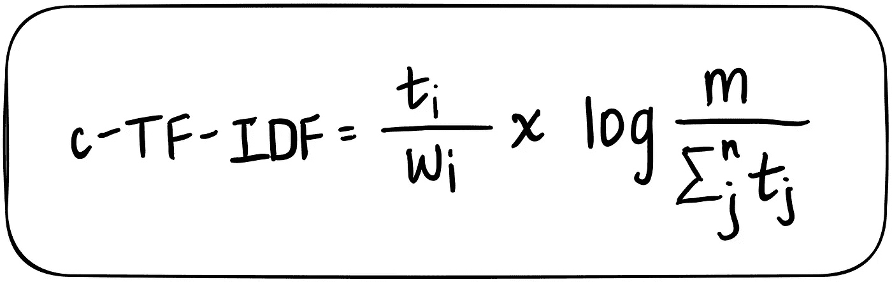
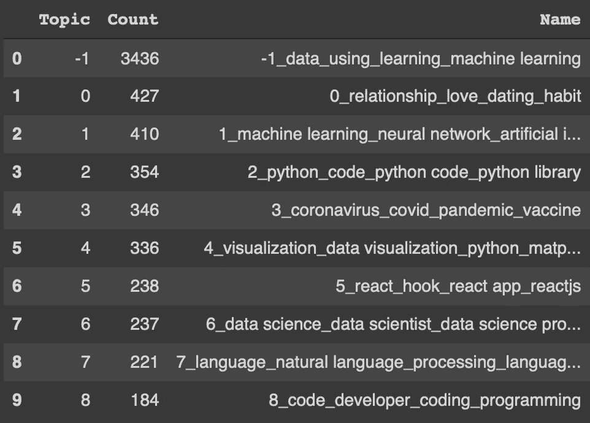
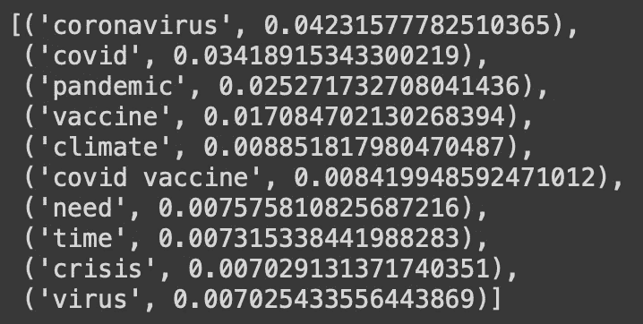
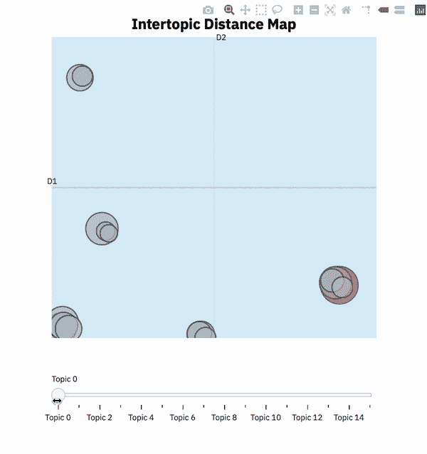
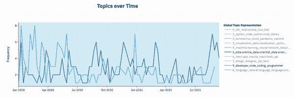
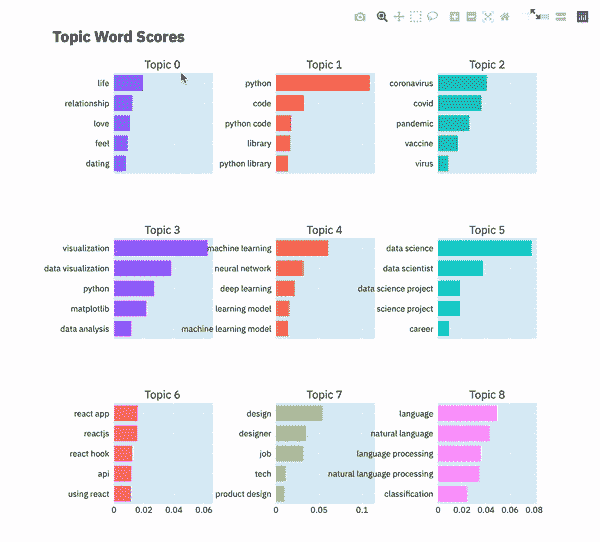

# 基于 BERTopic 的动态主题建模

> 原文：<https://towardsdatascience.com/dynamic-topic-modeling-with-bertopic-e5857e29f872?source=collection_archive---------0----------------------->

## 消化摘要:用主题建模对我的兴趣进行逆向工程(第 3 部分)

这是一个由三部分组成的调查的最后一篇文章，通过一种叫做主题建模的 NLP 技术来更好地理解我的媒体建议阅读。在本文中，我将介绍我认为是当今该领域中最强大的主题建模算法:`**BERTopic**`。我还将尝试说明时间感知的交互式可视化如何能够包含大量信息，而不需要在粒度级别上手动检查任何文档或主题。


来自 [Pexels](https://www.pexels.com/photo/comfortable-chair-near-round-table-with-newspaper-and-tea-set-3837464/?utm_content=attributionCopyText&utm_medium=referral&utm_source=pexels) 的 [Ekrulila](https://www.pexels.com/@ekrulila?utm_content=attributionCopyText&utm_medium=referral&utm_source=pexels) 的照片

动态主题建模，或监控每个主题的结构如何随时间演变的能力，是理解大型语料库的强大而复杂的方法。我这篇文章的主要目的是强调 BERTopic 的功能，并与之前讨论的 wordclouds 的痛点进行对比。我希望证明主题建模对于非技术人员来说是可以理解的，并且抵制文字云对 NLP 空间的诱惑是值得的。声明:我很抱歉制造了文字云来检查我正在处理的任何语料库，但我希望发现更多信息和数学基础的替代方法。

## 为什么是 BERTopic？

> BERTopic 是一种主题建模技术，它利用 BERT 嵌入和 c-TF-IDF 来创建密集的集群，允许轻松解释主题，同时保留主题描述中的重要单词。

这本书是由马腾·格罗登赫斯特在 2020 年写的，从那以后一直在稳步发展。BERTopic 的两个最大优势可以说是其直接开箱即用的可用性和其新颖的交互式可视化方法。对模型已经学习的主题有一个总体的了解，允许我们对模型的质量和语料库中封装的最值得注意的主题产生一个内部的感知。

## 装置

软件包可以通过 [pypi](https://pypi.org/project/bertopic/) 安装:

```
pip install bertopic
```

如果您预计您的项目将使用 BERTopic 包中包含的可视化选项，请按如下方式安装它:

```
pip install bertopic[visualization]
```

## 三个主要算法组件

*   **嵌入文档**:用`Sentence Transformers`提取文档嵌入。由于我们正在处理的数据是文章标题，我们将需要获得句子嵌入，BERTopic 让我们通过使用其默认的句子转换器模型`paraphrase-MiniLM-L6-v2`方便地做到这一点。
*   **聚类文档**:用`UMAP`(减少嵌入的维度)和`HDBSCAN` (识别和聚类语义相似的文档)创建相似文档的组
*   **创建主题表示**:用`c-TF-IDF` (基于类别的词频，逆文档频率)提取和缩减主题。如果您首先不熟悉 TF-IDF，那么为了大致理解这里发生的事情，您只需要知道一件事:它允许通过计算一个单词在给定文档中的频率来比较文档之间单词的重要性，还允许测量该单词在整个语料库中的流行程度。现在，如果我们将单个簇中的所有文档视为单个文档，然后执行 TF-IDF，结果将是簇中单词的重要性分数。在一个聚类中，越重要的单词越能代表该主题。因此，我们可以为每个主题获取基于关键字的描述！当涉及到从任何无监督聚类技术产生的分组中推断含义时，这是非常强大的。



`Image made by author using excalidraw | c-TF-IDF formula: the` 针对每个类别`i`提取每个单词 t 的频率，并除以单词总数`w`。每个类别的平均单词数`m`除以所有 n 个类别中单词的总频率`t` 。

有关这三个算法步骤的更多信息和理论支持，请查阅[作者综合指南](https://maartengr.github.io/BERTopic/tutorial/algorithm/algorithm.html)进行深入解释。

## 构建基本的 BERT 主题模型

要在 Python 中创建一个`BERTopic`对象并转移到有趣的东西(动态主题建模)上，我们只需要预处理过的文档列表。用`pd.read_csv()`加载数据后，我们可以编写一些 lambda apply 函数来预处理我们的文本数据:

```
df.text = df.apply(lambda row: re.sub(r"http\S+", "", row.text).lower(), 1)df.text = df.apply(lambda row: " ".join(filter(lambda x:x[0]!="@", row.text.split())), 1)df.text = df.apply(lambda row: " ".join(re.sub("[^a-zA-Z]+", " ", row.text).split()), 1)
```

…或者，如果已经清理过了，我们可以准备两个变量。最关键的变量显然是我们的文档列表，我们称之为`titles`。其次，我们需要一个与每个文档相对应的日期列表，这样我们就可以深入了解我们的主题是如何随着时间的推移而变化的。

```
titles = df.text.to_list()
dates = df['date'].apply(lambda x: pd.Timestamp(x)).to_list()
```

接下来，让我们创建我们的主题模型！

```
from bertopic import BERTopictopic_model = BERTopic(min_topic_size=70, n_gram_range=(1,3), verbose=True)topics, _ = topic_model.fit_transform(titles)
```

我们可以根据分配给每个主题的主题数量提取最大的十个主题，还可以预览我们主题的基于关键字的“名称”，如前所述:

```
freq = topic_model.get_topic_info()
freq.head(10)
```



作者图片

注意，在上述数据帧中，主题-1 表示由异常值文档组成的主题，这些异常值文档通常被忽略，因为术语在整个语料库中具有相对较高的流行度，因此对任何内聚主题或主题的特异性较低。

我们还可以看看构成感兴趣的特定主题的术语:

```
topic_nr = freq.iloc[6]["Topic"] # select a frequent topic
topic_model.get_topic(topic_nr)
```



作者图片

太好了！所有我们*最不*喜欢的单词都属于话题 5。我们可以看到，前三个词是“冠状病毒”、“covid”和“疫情”，但还有一个 n-gram 也进入了这 10 个特定主题的术语:“covid 疫苗”，这是一个具有更多积极内涵的术语，所以看看“疫苗”一词在哪个时间点开始更频繁地出现在文章标题中会很有趣。

## 交互式可视化

这种技术的最大优点是能够可视化我们的主题模型，告诉我们足够多的数据，而不需要研究原始文本本身。

如果您还记得我以前的主题建模文章，标题为“ [NLP 预处理和使用 Gensim](/nlp-preprocessing-and-latent-dirichlet-allocation-lda-topic-modeling-with-gensim-713d516c6c7d?source=user_profile---------0----------------------------) 的潜在 Dirichlet 分配(LDA)主题建模”，有一个名为`pyLDAvis`的 Python 可视化包，它使用户能够生成交互式子图，描述 2D 平面上主题之间的距离以及主题内前 30 个最相关和最显著的术语。BERTopic 有自己的主题间距离图实现，它包括一个悬停工具提示，显示指定给特定主题的文档数量以及该主题中最常用的前 5 个术语。生成以下可视化效果所需的代码行非常简单:

```
topic_model.visualize_topics()
```



上面的主题间距离图描述了 15 个主题中的五个主要主题组。最接近 x 轴的集群属于 Python 的一般主题，基于我的中等兴趣和搜索历史，这具有直观的意义。左下方的集群由机器学习、深度学习、数据科学、技术设计等领域兴趣组成。被吸引到左上角的是关于 NLP、情感分析和 Twitter 数据的文章。尽管事实上这些可以被标记为我的另一个兴趣领域，我假设它们占据了 2D 平面的不同区域，因为我在我的高级顶点项目中对这些主题进行了更深入更细致的研究。我认为，靠近 y 轴的中间底部区域的集群的特点是技术含量较少，主题行遵循模板“作为软件工程师避免精疲力尽的 10 个技巧”或“我从 100 天内写 100 篇中型文章中学到的东西”。在我看来，这些文章处于生产力技巧和自我发展智慧的交汇点。他们并不总是教我新的东西，但当我每天早上阅读《媒介文摘》时，他们无疑会激励我。最后，最右边的主题簇代表了不属于技术领域的主题的大杂烩，但是对于在媒体上消费全面的文章选择来说仍然是重要的。

现在，最吸引人的是关于时间的动态主题建模！在下面的视频中，我们可以观察到从 2020 年初到现在，我的建议媒体文章(标题)语料库中十个最流行的主题的频率。



我们可以观察到，数据科学(`topic 5`)和开发/编码(`topic 9`)是我近两年来的一贯兴趣。有趣的是，React apps ( `topic 6`)是我在 2020 年 10 月和 11 月广泛阅读的东西，但我的这种兴趣很快就消退了。你可能想知道这背后的故事？嗯，我正在为一个前端开发面试临时抱佛脚，对此我感到毫无准备。有趣的事实:灵媒教会了我几乎所有关于反应的知识。我们可以注意到，NLP 主题(`topic 8`)的频率在 2020 年夏天和 2021 年 6 月左右达到峰值，当我反思我在那些时间从事的工作时，这很有意义。新冠肺炎(`topic 2`)在 2020 年 3 月到 5 月的频率达到峰值，我认为这说明了一切…继续前进。百花香主题(`topic 0`)在 2020 年初出现频率最高，但在当年晚些时候逐渐减少。我想当我被困在家里的时候，我读了更多的非技术内容，而我现在主要是为了技术目的查阅中型文章。

在不进行更多个人反思的情况下，我希望您能够理解动态主题建模的强大之处。在任何时间点将鼠标悬停在我们的主题频率线图上会显示不同的主题关键词，从而可以分析主题如何随着时间的推移而演变。



虽然我简要地展示了如何访问属于特定主题的热门关键词及其重要性分数，但是我们也可以将这些术语和分数可视化为条形图。

我们的伯托皮综合之旅到此结束！我希望您已经了解了一两件关于动态主题建模的事情，并且能够明白为什么我认为这个主题建模 Python 包超越了这个领域中的其他包和技术。再次对 BERTopic 的作者 Maarten Grootendorst 大声疾呼，感谢他实现并开源了这个令人敬畏的代码。

## 总结和简化应用程序

如果您想尝试一下动态主题建模，我已经编写了一个小的 Streamlit 应用程序，它允许您导入一个包含日期和文档的 CSV 文件，您可以从中构建主题模型。然后，它创建一个 BERTopic 模型，并在应用程序中嵌入一些交互式可视化。我希望你喜欢并可以尽情地玩这个应用程序。我开发这款应用的动机如下:

1.  让主题建模更具交互性和趣味性，远离令人生畏的技术性 NLP 子域
2.  让不太懂技术的人也能理解这个主题，他们可能也想有机会更好地理解给定文本语料库中的主题

此处可访问该应用:[https://share . streamlit . io/sejaldua/digesting-the-digest/main/ber topic _ app . py](https://share.streamlit.io/sejaldua/digesting-the-digest/main/bertopic_app.py)

和往常一样，我把我的源代码放在一个公共的 GitHub 库中:

[](https://github.com/sejaldua/digesting-the-digest) [## GitHub-sejaldua/digesting-the-digest:使用 Gmail API 对我推荐的媒体进行主题建模…

### 使用 Gmail API 对我推荐的媒体进行主题建模

github.com](https://github.com/sejaldua/digesting-the-digest) 

## 参考

[](https://github.com/MaartenGr/BERTopic) [## GitHub - MaartenGr/BERTopic:利用 BERT 和 c-TF-IDF 创建易于解释的主题。

### BERTopic 是一种主题建模技术，它利用了🤗变压器和 c-TF-IDF 创建密集的集群，允许…

github.com](https://github.com/MaartenGr/BERTopic) [](https://reposhub.com/python/natural-language-processing/MaartenGr-BERTopic.html) [## 利用 BERT 和基于类的 TF-IDF 创建易于解释的主题。-自然语言…

### BERTopic 是一种主题建模技术，它利用 BERT 嵌入和 c-TF-IDF 来创建密集的集群，从而允许…

reposhub.com](https://reposhub.com/python/natural-language-processing/MaartenGr-BERTopic.html) [](/interactive-topic-modeling-with-bertopic-1ea55e7d73d8) [## 用 BERTopic 进行交互式主题建模

### 使用 BERTopic 进行主题建模的深入指南

towardsdatascience.com](/interactive-topic-modeling-with-bertopic-1ea55e7d73d8)