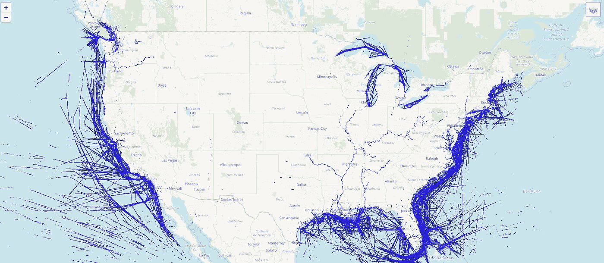
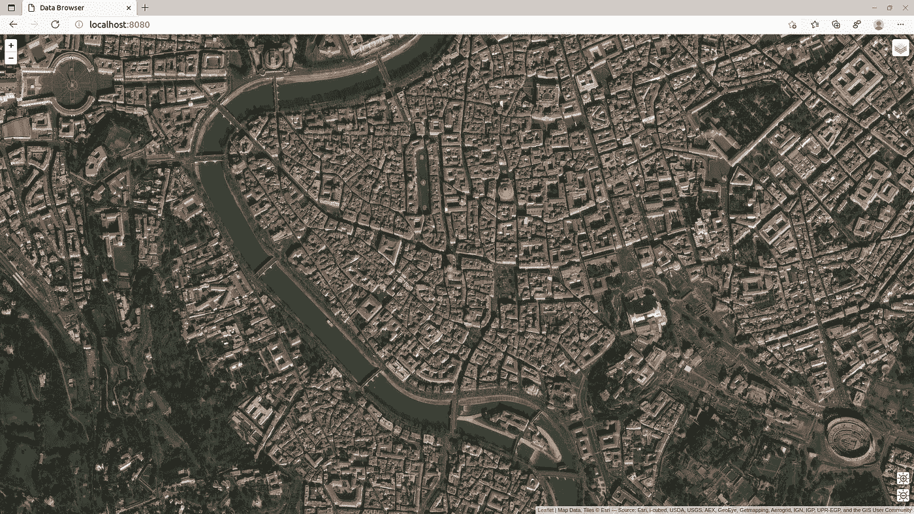
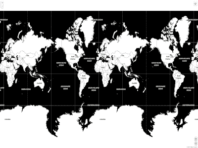
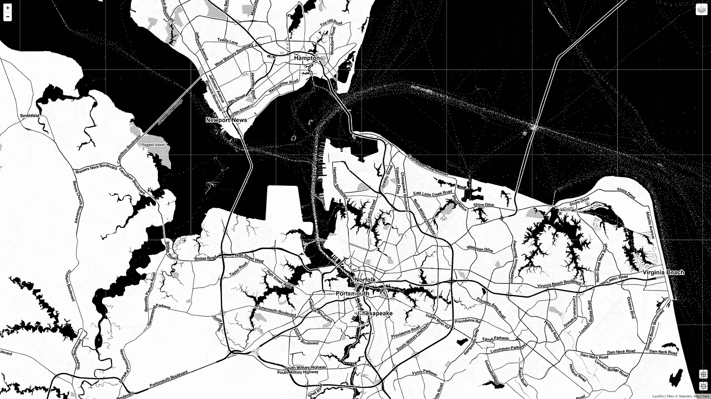

# 使用 Python 在 web 地图上动态显示数百万个点

> 原文：<https://towardsdatascience.com/dynamically-displaying-millions-of-points-on-a-web-map-with-python-ae2b39b2ebf?source=collection_archive---------28----------------------->

## 动态生成切片地图可以节省存储空间和时间

2500 万艘船在美国水域。图片作者。

去年，汤姆·怀特展示了一张从数百万地理编码的野生动物观察中绘制的网络地图。地图的行为与您预期的一样，每个缩放级别都显示了更详细的数据。

怀特的解决方案中的数字魔法是 [Datashader](https://datashader.org/) ，这是一个开源库，可以从数百万个数据点快速创建图像。使用 Datashader，数据可以在不同的缩放级别和位置进行预渲染，并由任何 web 服务器提供。添加适当的客户端软件和浏览器，你就有了一个*平铺网络地图*或*滑动地图*。

光滑的地图将地球分成反映不同层次的瓦片。缩放级别为 0 时，世界显示为一张 256 x 256 像素的图像。在缩放级别 1 下，地球由四个 256 平方像素的图块表示。每一个缩放级别都会调用更多细节的更细粒度的图块。平滑渲染时，效果就像从高空跌落到街道上。

当你缩放到 10 级时，你已经把地球分成了超过一百万个方块。在缩放级别 15 下，您正在平移十亿个图块，在缩放级别 20 下平移万亿个图块。

缩放级别为 16 的罗马，左上角是圣彼得广场，右下角是斗兽场。来自 ArcGIS online 切片成像仪的图像。

创建瓦片来填充光滑的 masp 是一个计算上的挑战。如果在一台机器上写一个 300 字节的文件需要 1 毫秒，那么你在半小时内就创建了 10 亿字节的数据。到缩放级别 20 时，您已经购买了三年的 TB 级驱动器。

但是 Datashader *快吗——我想知道是否有可能按需生成数据？这将减少处理和存储大量图像的需求。它还允许数据经常更新——每半个小时将给出一个相当准确的全球船舶交通的快照。*

为了测试这一点，我使用了来自美国国家海洋和大气管理局(NOAA)运营的海洋地籍网站(T10)的数据，该网站公开了十年来解析的船只位置数据。从这里，我可以获得在美国水域航行的船只的 600 万到 800 万个位置的每日汇总。

# 准备数据

海洋地籍数据中的每个位置记录不仅仅包含船只的当前位置。对于我们的目的，我们只需要船只的纬度和经度，所以第一步是去除不必要的数据，并将数据从其本地投影转换到 web 墨卡托。

海洋地籍中的位置数据

通过*卷曲*和*解压，检索数据很容易。* GDAL 的 *ogr2ogr* 命令行工具将坐标调整为 web 墨卡托。

虽然我真的只想用两列来反映每艘船的纬度和经度，但是 *ogr2ogr* 应用程序不会将输出仅限于位置数据。另一个 *awk* 过滤器只提取可视化所需的列。

shell 脚本的一部分，用于收集和准备位置数据。

结果是一个逗号分隔值(CSV)文件，其中包含所需投影中每个船只位置的纬度和经度。

准备在 web 地图上显示的数据。

# 显示数据

原型的平铺显示部分将前一步中准备的位置数据加载到 pandas 数据帧中。当每个 web 请求到达一个图块时，程序将图块位置转换为坐标的边界框，并使用它来查询数据框。使用 Datashader 将结果渲染到图像中，然后将图像传回 web 客户端，以便在适当的地图客户端上显示。

FastAPI 提供了 URL 到呈现函数的路由。启动时，一个 *indexhtml* 变量被填充了 White 的原始[传单](https://leafletjs.com/)应用程序的修改版本。此页面可用于显示底图上的渲染图块。在快速检查文件是否存在之后，船只数据被加载到一个 [PyArrow](https://arrow.apache.org/docs/python/) 对象中，然后被传递给一个 pandas DataFrame。

两个 HTTP 端点处理 web 界面所需的静态 HTML 和 JavaScript。对 web 结构根的请求接收 indexhtml 变量的内容，而 *app.mount* 确保客户端获得呈现 web 地图所需的页面样式表、图形和 Javascript。

slippy map 的处理程序将基本变量从图块请求中分离出来:*缩放*、 *x* 和 *y* 被转发到图块生成器，结果标记为 PNG 文件。

通过将从请求路径提取的 x 和 y 变量传递给翻译函数，获得每个图块的左上和右下坐标。

从 OpenStreetmap wiki 借用的代码将切片路径转换为经度和纬度。对 Datashader 辅助函数的额外调用将图块坐标转换为 web 墨卡托基于米的格式。

定义图块边界框后，代码将原始父数据帧中的位置数据切割成一个较小的数据集。

画布是 256 像素的正方形，它映射到一个边界框，该边界框由被渲染的图块所覆盖的纬度和经度的最小和最大范围形成。接下来，聚合函数处理查询数据并识别纬度和经度。

最后，从集合中创建一个图像，将其分配给一个*字节数*变量，并传递回调用函数，以传递回浏览器。

# 最终产品

动态渲染正在进行。图片作者。

如果你运行我把[放在 GitHub](https://github.com/ScottSyms/tileshade) 上的代码，然后浏览 [http://localhost:8080，](http://localhost:8080,)你会看到一个风格化的全球地图。单击地图右上角的图标将允许您选择底图并启用/禁用数据图层。

嵌入的动画 gif 显示了应用程序从一个包含 800 万个位置报告的源文件中渲染图块的速度。每个单幅图块在 30 到 40 毫秒内渲染，创建详细的图像需要稍多的时间。在高缩放级别下，稀疏数据可能难以辨认，但由于 Datashader 控制像素大小，因此可以创建一个动态算法，在缩放级别较高且数据计数较低时调整像素大小。

弗吉尼亚州诺福克市外，船只来往穿梭。图片作者。

这种渲染技术开辟了一种将面向数据帧的分析与标准网络地图呈现相结合的方法，Datashader 可以被任何快速图像生成功能所取代。