# E2E 深度学习:无服务器图像分类

> 原文：<https://towardsdatascience.com/e2e-deep-learning-serverless-image-classification-d4351372c83e?source=collection_archive---------30----------------------->

## 使用 TensorFlow、Docker、AWS Lambda 和 API Gateway 构建端到端深度学习模型，对真实世界的图像进行分类


本杰明·拉斯科在 [Unsplash](https://unsplash.com/@dapperprofessional?utm_source=unsplash&utm_medium=referral&utm_content=creditCopyText) 上的照片

# A.介绍

## A.1 .背景和动机

在数据科学生命周期中，**部署**是我们最终**将我们的人工智能模型付诸实践**的阶段。因此，在我们构建和评估模型之后，我们需要将它作为一个解决方案来部署，以帮助企业解决现实世界中的问题。只有这样做，我们才能从用户或利益相关者那里获得反馈，以改进模型并评估其性能和影响。换句话说，管理**端到端数据科学项目**的技能是任何数据科学家都必须具备的。

## A.2 目标

现在，假设我们需要处理大量真实世界的服装图像，而你的职责是为一家电子商务公司创建一个自动图像分类器。因此，挑战不仅在于建立一个强大的深度学习模型，还在于将其部署为一个**无服务器应用**。这种无服务器方法有助于我们只关注业务解决方案，而不是承载应用的繁重基础设施。幸运的是， **AWS Lambda** 和 **API Gateway** 的组合可以用于托管无服务器 API。

在这个项目中，我们将一起学习如何:

*   **建立深度学习模型**使用 TensorFlow 对图像进行分类。
*   **使用 TensorFlow Lite 将模型**转换成尺寸效率更高的格式。
*   使用 Docker 在我们的机器上本地部署模型。
*   **使用 AWS Lambda 和 API Gateway 将模型部署为 REST API** 。

## A.3 .目录

*   **简介** > *背景与动机* > *目标>目录*
*   **模型训练** > *图像数据集>建立模型>训练模型>评估模型*
*   **型号转换** *>转换型号>使用转换后的型号*
*   **模型部署** *> Lambda 功能>本地部署，Docker >在 AWS 上部署*

> 由于这篇教程文章将会非常**广泛**，请随意跳转到适合您需求的特定部分。

> **注意:** 为了跟进这个项目，我们希望你对如何使用 TensorFlow、Docker [1]、AWS 术语建立深度学习模型有一个基本的了解，并拥有一个 AWS 帐户来访问其服务。
> 
> 这个项目在 [**我的 GitHub 库**中有很好的记录。对于那些对完整代码感到好奇的人，请一定要去看看👍。](https://github.com/diardanoraihan/E2E_Deep_Learning)

# B.模特培训

## B.1 .图像数据集

该数据集包含 3781 幅服装图像，具有前 10 个最流行的类别，分为训练集、测试集和验证集。**表 1** 显示了数据集摘要，以便更好地理解。我们可以在这里访问数据[2]。

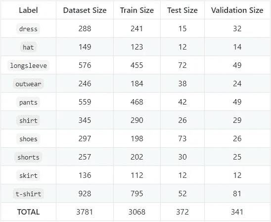

**表 1** 。用于训练深度学习模型的服装图像数据集综述。

要使用 Python 查看图像，我们可以使用`matplotlib.pyplot.gcf()`类来获取当前图形，并将其设置为特定的行数和列数。因此，在每一行和每一列，我们可以把一个图像作为一个支线剧情。

**图一**。10 个类别中每个类别的图像数据集样本。

## B.2 .建立模型

我们将使用**迁移学习**方法和**图像增强**来构建深度学习模型，以实现良好的性能并防止过拟合。我们使用的预训练模型是 **InceptionV3** ，但是也可以随意尝试另一个模型。TensorFlow Keras 为`InceptionV3`内置了一个**模型定义**。我们将使用(150，150，3)作为所需的输入形状图像，不包括顶部的全连通层，并使用我们可以在此下载<https://storage.googleapis.com/mledu-datasets/inception_v3_weights_tf_dim_ordering_tf_kernels_notop.h5>****【3】**的局部权重。导入该类，并通过指定上述配置实例化它，如下所示:**

****图二。**定义预训练的 InceptionV3 模型。**

****图三。**预训练模型的总结。**

**正如我们所看到的，每一层都有自己的名称，其中最后一层的名称是 **mixed10** ，它已经被卷积为 3 乘 3。有趣的是，我们可以决定向上移动最后一层，以使用更多一点的信息。例如，**混合 7** ，输出 7 乘 7。因此，可以根据我们的需要选择最后一层进行实验。**

****图四。**根据我们的需求选择预训练模型的最后一层。**

**我们将定义一个新的模型，该模型考虑了 InceptionV3 的 **pre_trained_model** 来对服装图像进行 10 个不同类别的分类。在这里，我们可以为新模型构建最后几层，如下所示:**

****图五。**使用迁移学习为我们的目标重新构建预训练模型。**

## **B.3 .训练模型**

**现在，我们准备训练模型。请注意，我们通过将图像像素值除以 255 来标准化它们，在 *ImageDataGenerator* 中设置几个参数来增加用于训练的输入图像以防止过度拟合，将 batch_size 设置为 32，并将目标图像大小设置为(150，150)以适应模型输入形状。**

****图 6** 。使用 100 个时期的图像增强来训练模型**

****图 7。**在训练过程中想象模特的表现。**

**恭喜你。我们只是利用迁移学习和图像增强建立了一个强大的深度学习模型。我们实现了 90.59%的测试准确率和 0.273%的测试损失，并设法避免过度拟合。其实我们的测试准确率比训练准确率高~5%，很棒！**

## **B.4 .评估模型**

**让我们通过对看不见的图像进行新的预测来验证这个模型。正如我们所料，该模型在对每张测试图像做出正确预测方面表现得非常好。**

****图 8。**使用训练好的模型预测新图像**

# **C.模型转换**

**在我们使用 TensorFlow 构建模型后，我们很快就会注意到文件大小太大，并且没有针对部署进行优化，尤其是在移动或边缘设备上。这就是 tensor flow Lite(TF Lite)发挥作用的地方。TFLite 将帮助我们将模型转换成更有效的格式。 **tflite。**这将生成一个小的二进制大小的模型，它是轻量级的，低延迟的，对准确性影响很小。**

## **C.1 .转换模型**

**下面是我们需要做的步骤，以便将我们的最佳训练模型转换为 tflite 文件:**

*   **在 h5 文件中加载模型，**
*   **从加载的训练模型中实例化 TFLiteConverter 对象，**
*   **转换并以 tflite 文件格式保存转换后的模型。**

****图九。**使用 TensorFlow Lite 转换模型**

## **C.2 .使用转换的模型**

**一旦我们将模型转换为 tflite 文件格式，我们就可以使用 TFLite 解释器来查看模型在移动或边缘设备上部署之前如何进行预测。**

****图 10。**使用 TFLite 解释器进行预测**

# **D.模型部署**

**在最后一步，我们将使用 Docker、AWS Lambda 和 AWS API Gateway 部署模型。首先，我们需要创建一个`lambda_function.py`来在 AWS Lambda 或 Docker 上部署模型，因为这两个选项都需要这个文件来运行深度学习模型。**

## **D.1 函数**

**`lambda_function.py`存储运行应用程序所需的所有函数，从定义解释器开始，接收输入图像，预处理图像，并使用保存的模型进行预测。**

****图 11。**λ_ function . py**

## **D.2 .使用 Docker 在本地部署**

**我们刚刚创造了`lambda_fucntion.py`。接下来，我们希望使用 AWS Lambda 来获取和部署它。为此，我们将使用 Docker。AWS Lambda 支持 docker，所以我们可以使用容器映像来部署我们的功能。**

**在本节中，您将学习如何在您的机器中使用 Docker 来本地运行模型。**

## ****D.2.1 .文档文件****

**下一步是创建 Dockerfile 文件。 **Dockerfile** 是一种将运行代码所需的所有依赖项放入包含所有内容的单一映像中的方法。**Docker 镜像**是一个专用于你的容器的私有文件系统。它提供了容器需要的所有文件和代码，例如:**

*   **安装 python 包管理系统。**
*   **安装枕头库处理图像文件。**
*   **安装 TensorFlow Lite tflite_runtime 解释器。**
*   **在 tflite 文件中获取我们的模型，并将其复制到 docker 图像中。**
*   **获取 lambda_function.py 并将其复制到 docker 映像中。**

****图 12。** Dockerfile**

**我们现在需要做的是运行并构建这个 docker 映像，并在本地运行它。**

## **D.2.2 .建立 Docker 形象**

**以下是我们在本地运行应用程序的步骤:**

****运行 docker 守护进程**。有两种方法可以做到这一点:**

*   **第一种选择是以**管理员**的身份打开 **cmd** ，然后启动以下命令:`"C:\Program Files\Docker\Docker\DockerCli.exe" -SwitchDaemon`**
*   **第二个选项是从开始菜单运行 **Docker 桌面**并验证 Docker 是否处于**运行**状态。**

**从 Dockerfile 文件构建一个图像。**

*   **下面的命令将从您当前所在的文件夹的内容构建图像，标记名为`tf-lite-lambda`。**

```
$ docker build -t tf-lite-lambda .
```

## **运行容器映像**

****根据您在上一步**中构建的映像启动一个容器。运行容器会使用私有资源启动应用程序，并与机器的其他部分安全隔离。**

```
$ docker run --rm -p 8080:8080 --name clothes-classifier tf-lite-lambda
```

*   **`-p`(代表*发布*)表示我们想要将容器端口 80 映射到主机端口 80。容器在端口 80 上打开一个 web 服务器，我们可以将计算机上的端口映射到容器公开的端口。**
*   **`--rm`(代表*移除*)表示当容器存在时，我们希望自动移除容器。**
*   **`--name`给一个新容器命名，`tf-lite-lambda`是我们用来创建容器的图像名。**

**以下是之前命令的结果截图:**

**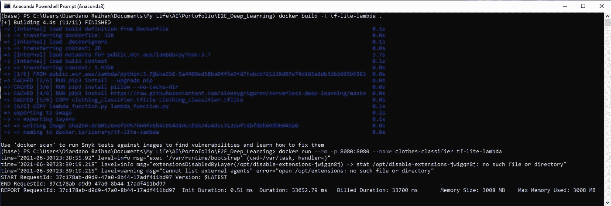**

****图 13。**构建并运行 Docker 容器映像**

## **D.2.3 .测试容器图像**

**在我们运行模型之后，我们想要测试它。我们需要创建一个特殊的文件，我们可以调用它来查看模型预测的结果。**

**该文件包含:**

*   **来自预期输入图像的完整类别。**
*   **从此链接获得的一张裤子(测试)图片:[http://bit.ly/mlbookcamp-pants](http://bit.ly/mlbookcamp-pants)。我们将发送一个请求，其中有一个键`url`和图像的 URL。**
*   **一个 URL 地址，表明我们部署在 docker 内部的本地主机上。**
*   **向目标 URL 地址发送 POST 请求以获得预测结果的过程。**
*   **解析预测结果并显示给用户。**

****图 14。** test.py**

**在您的 CLI 上运行`test.py`，亲自查看结果:**

**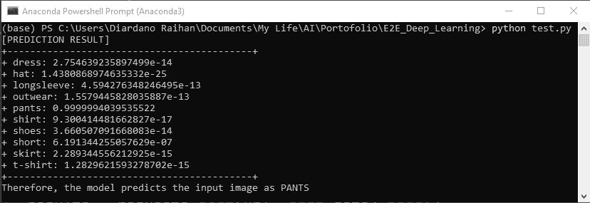**

****图 15。**运行 test.py，通过 Docker 容器进行预测**

## **D.3 .在 AWS 上部署**

**我们刚刚用 Docker 在本地部署了模型。现在，我们可以使用相同的容器并将其部署在 AWS 上。AWS 拥有您在线部署深度学习模型所需的一切。对于这种情况，我们将使用 AWS CLI、AWS ECR、AWS Lambda 和 AWS API Gateway。**

## **D.3.1 .安装 AWS CLI**

**我们用 AWS 做的一切都是 API 调用。因此，我们必须有一个工具，允许我们对这些 API 调用进行编程或编写脚本。其中一个工具是 AWS 命令行界面(CLI)。在我们继续之前，请确保您已经在本地机器上安装了 AWS CLI[4]。**

## **D.3.2 .配置您的 AWS 帐户**

**如果我们想在 AWS 上部署应用程序，显然我们需要在那里设置一个帐户。创建 AWS IAM 用户帐户后，设置访问密钥 ID、秘密访问密钥、默认区域和默认输出格式(通常是 JSON)。一旦我们完成了这些，我们就可以从 AWS CLI 对 AWS 进行编程调用。**

```
$ aws configure
```

**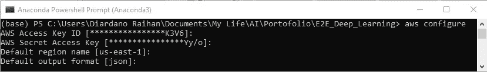**

****图 16。**通过 AWS CLI 配置 AWS 帐户**

## **D.3.3 .在 AWS ECR(弹性容器注册)中创建回购**

**AWS ECR 是我们放 Docker 图片的地方。通过运行以下命令，我们将创建一个私有存储库来存储我们之前构建的 Docker 映像。**

```
**$** aws ecr create-repository --repository-name lambda-images
```

**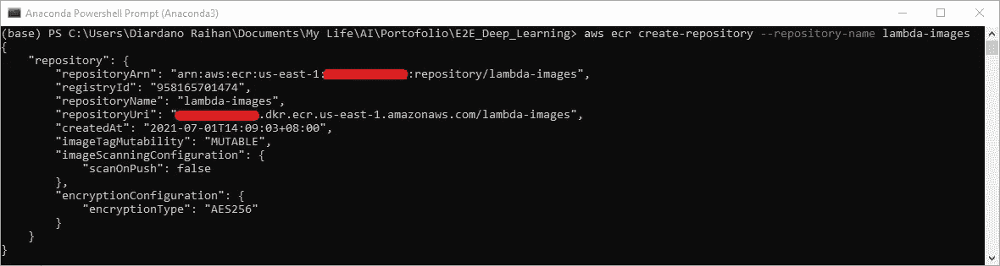**

****图 17。通过 AWS CLI 在 AWS ECR 中创建新的存储库****

## **D.3.4 .向回购发布图像**

**现在，我们想发布我们在本地构建的图像。以下是直接引用自 AWS 的步骤(AWS ECR >存储库> lambda-images >查看推送命令):**

*   **检索一个认证令牌，并向您的注册表认证您的 Docker 客户端。**

```
$ aws ecr get-login-password --region us-east-1 | docker login --username AWS --password-stdin XXXXXXXXX474.dkr.ecr.us-east-1.amazonaws.com
```

*   **使用以下命令构建 Docker 映像。**

```
$ docker build -t lambda-images .
```

*   **标记您的图像，以便您可以将图像推送到此存储库。**

```
$ docker tag tf-lite-lambda XXXXXXXXX474.dkr.ecr.us-east-1.amazonaws.com/lambda-images:tf-lite-lambda
```

*   **运行以下命令，将这个映像推送到您新创建的 AWS 存储库。**

```
$ docker push XXXXXXXXX474.dkr.ecr.us-east-1.amazonaws.com/lambda-images:tf-lite-lambda
```

**检查 AWS ECR 网页上的推送图像。确保复制 URI，因为我们需要它来创建一个 Lambda 函数。**

**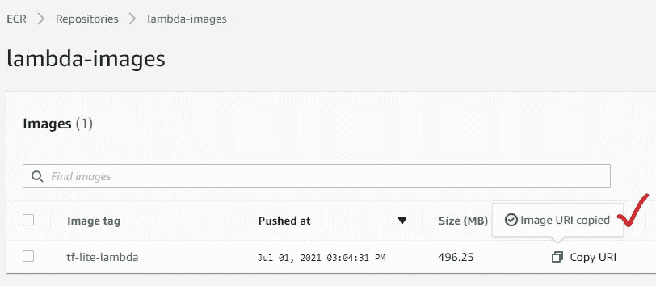**

****图 18。**复制推送图像的 URI，创建 lambda 函数**

## **D.3.5 .创建λ函数**

**现在，我们准备创建一个 Lambda 函数。进入 AWS `Lambda`并点击`Create function`。选择`Container Image`。**

****

****图 19。**通过 AWS Lambda 创建 Lambda 函数**

**为您的函数取一个惟一的名称，并用您之前复制的图像 URL 填充容器图像 URL。通过将一切保留为默认，点击`Create function`**

**您刚刚为预测任务创建了一个 lambda 函数。然而，目前的配置并没有给我们足够的内存和超时。我们有一个大模型，该功能将需要一些时间来运行，并首次将所有内容加载到内存中。因此，我们需要重新配置它。进入`Configuration` > `General Configuration` >点击`Edit`，将 RAM 和超时分别设置为 **512/1024** 和 **30** 秒。省省吧。**

****

****图 20。**重新配置 lambda 功能的内存和超时**

## **D.3.6 .测试λ功能**

**接下来，使用以下 JSON 文件格式创建一个测试:**

```
{
    "url": "https://tinyurl.com/clothes-t-shirt"
}
```

****

****图 21。**测试我们刚刚创建的 Lambda 函数**

**为新事件命名，保存后点击`Test`。然后，您将看到以下结果:**

**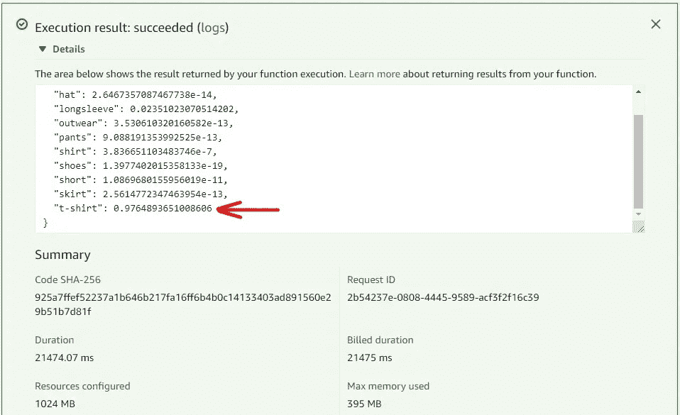**

****图 22。**进行预测时 lambda 函数的执行结果**

**你需要知道的一件事是，使用 AWS Lambda，你将根据请求的数量和持续时间，也就是执行我们的代码所花费的时间来收费。请参考此[链接](https://jovian.ai/outlink?url=https%3A%2F%2Faws.amazon.com%2Flambda%2Fpricing%2F)了解更多定价信息。**

## **D.3.7\. API 网关集成**

**您刚刚测试了该函数，它在进行预测时似乎工作得很好。剩下的就是从外面(网上)用了。为此，我们需要通过 AWS API Gateway 创建一个 API。**

****1。创建新的 API****

*   **访问 AWS API 网关，然后点击`Build`按钮选择 REST API。**
*   **选择协议:`REST`。为**选择新 API，创建新 API** 。然后，填写 API 名称并添加一些描述。**

**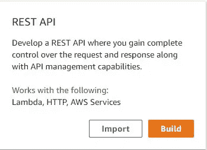******

****图 23。**通过 AWS API 网关为我们的应用程序构建新的 API**

****2。创建资源:预测和方法帖子****

*   **从`Actions`中选择制作资源>填写“预测”。**
*   **从`Actions`中选择制作方法>选择`POST`**

****

****图 24。**为新的 API 创建新的资源和方法**

****3。选择 Lambda 函数，添加一些细节**。**

*   **点击`POST`，然后确保为 **Lambda 函数**写下正确的名称，并保留默认设置。**

**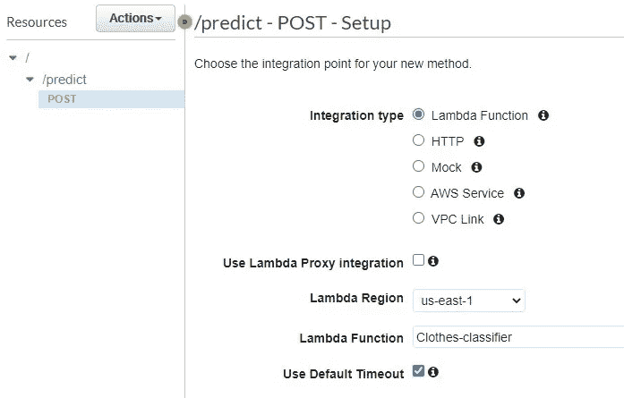**

****图 25。**将 Lambda 函数集成到作为触发器的 API 中**

****4。测试 API** 。**

*   **从流程图执行中，点击`Test`。**

****

****图 26。**客户端请求和 lambda 函数通过 API 的执行流程图**

*   **要测试它，在**请求体中输入代码。**点击**测试。**然后，我们应该在**响应体中看到结果。****

**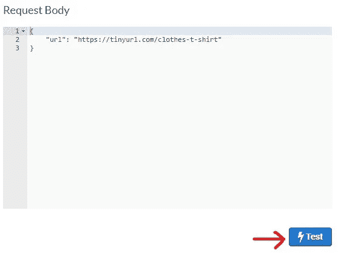******

****图 27。**测试模拟客户端和 lambda 函数之间做出的预测**

****5。部署 API****

*   **最后，我们需要部署 API 以在外部使用它。从`Actions`点击`DEPLOY API`。**

**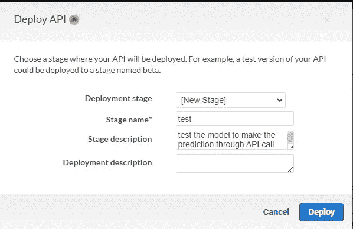**

****图 28。**部署 API**

*   **从“调用 URL”部分获取 URL。在这种情况下，我们有:<https://xw2bv0y8mb.execute-api.us-east-1.amazonaws.com/test>**
*   ****打开**邮差 App** 或者去 [**reqbin**](https://reqbin.com) 测试我们刚刚创建的 REST API。注意，因为我们指定`predict`作为`POST`的方法，我们需要在 URL 的末尾添加`/predict`。因此，进行 API 调用以进行预测的完整 URL 是:[**https://xw 2 bv 0 y8 MB . execute-API . us-east-1 . amazonaws . com/test/predict**](https://xw2bv0y8mb.execute-api.us-east-1.amazonaws.com/test/predict)****
*   ****将链接复制并粘贴到应用程序的 URL 部分。****
*   ****复制 JSON 中的以下对象作为主体来发出这个 POST 请求。点击`Send`。****

```
**{
    "url": "https://tinyurl.com/clothes-t-shirt"
}**
```

*   ****在发出 API call POST 请求后，您可以看到预测结果作为接收到的内容。****

********

******图 29。**通过 **reqbin** 调用 API 进行预测****

*   ****或者，我们可以使用`cURL`(代表客户端 URL)通过终端(即 Git Bash)将 POST 请求中的数据(在本例中是 t 恤图像)发送到我们的服务(在本例中是衣服图像分类器)。****

```
**$ curl -d '{"url": "https://tinyurl.com/clothes-t-shirt"}' -H "Content-Type: application/json" -X POST [https://xw2bv0y8mb.execute-api.us-east-1.amazonaws.com/test/predict](https://xw2bv0y8mb.execute-api.us-east-1.amazonaws.com/test/predict)**
```

*   ****运行上面的命令将生成这个预测结果:****

****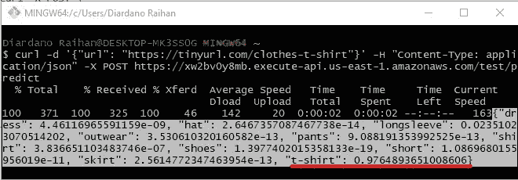****

******图 30。**通过 **Git Bash** 通过 API 调用进行预测****

> ****恭喜你。现在，您的深度学习模型完全在线，并准备好帮助世界变得更美好！****

# ****E.结论****

****由于要遵循许多程序，进行端到端深度学习项目可能具有挑战性。然而，由于 TensorFlow 的丰富特性，我们可以轻松地构建和部署模型。Docker 和 AWS 等服务的存在有助于数据科学家快速离线或在线交付应用程序，以解决业务问题。****

****以无服务器的衣服图像分类器为例，我希望这个项目给你一个基本的想法，如何在未来处理类似的情况。继续激励！****

****谢谢你，****

****diardano Raihan
[LinkedIn 简介](https://www.linkedin.com/in/diardanoraihan/)****

> *******注*** *:你看到的一切都记载在* [***我的 GitHub 资源库*** *里。*](https://github.com/diardanoraihan/E2E_Deep_Learning) *对于对完整代码感到好奇的人，请务必访问👍。*****

# ****参考****

*   ****[1] T. Soam，《在窗口 10 上安装 Docker》， *Medium* ，[https://Medium . com/@ tushar 0618/Installing-Docker-desktop-on-Window-10-501 e 594 fc 5 EB](https://medium.com/@tushar0618/installing-docker-desktop-on-window-10-501e594fc5eb)，2021 年 6 月。****
*   ****[2] A .格里戈里耶夫，《服装数据集(子集)》， *GitHub* ，[https://github.com/alexeygrigorev/clothing-dataset-small](https://github.com/alexeygrigorev/clothing-dataset-small)，2021 年 6 月。****
*   ****[3] *机器学习 Edu* ，[https://storage . Google APIs . com/mledu-datasets/inception _ v3 _ weights _ TF _ dim _ ordering _ TF _ kernels _ notop . H5](https://storage.googleapis.com/mledu-datasets/inception_v3_weights_tf_dim_ordering_tf_kernels_notop.h5)，2021 年 6 月。****
*   ****[4]“在 Windows 上安装、更新和卸载 AWS CLI 版本 2”，*亚马逊 Web 服务(AWS)* ，[https://docs . AWS . Amazon . com/CLI/latest/user guide/install-CLI v2-Windows . html](https://docs.aws.amazon.com/cli/latest/userguide/install-cliv2-windows.html)，2021 年 6 月。****