# 每个卷积核都是一个分类器！你真的了解卷积神经网络是如何工作的吗？

> 原文：<https://towardsdatascience.com/each-convolution-kernel-is-a-classifier-5c2da17ccf6e?source=collection_archive---------17----------------------->

## [提示和技巧](https://towardsdatascience.com/tagged/tips-and-tricks)

## 卷积和池层背后的信息流直观指南。卷积核不是“神奇的石头”，它学习使用基于梯度的优化来提取“某种”特征。卷积神经网络中数值的真正含义是什么？幕后信息如何在卷积层和池层之间流动？

来源:AdobeStock

**《艾是新电》** —吴恩达。可以说深度卷积神经网络(CNN)和计算机视觉也是如此:卷积神经网络是计算机视觉的新电。

CNN 确实是机器学习社区的一颗钻石，尤其是在快速增长的计算机视觉领域。它们是计算机视觉中无数基本任务的支柱，从简单的图像分类(但在 20 多年前被认为是非常具有挑战性或棘手的)到更复杂的任务，包括图像分割、图像超分辨率和图像字幕。这就是为什么在过去的十年里，学术界和工业界对 CNN 越来越感兴趣。**尽管许多工程师和学生每天都在练习和使用 CNN，但大多数人缺乏对卷积和池块这两个任何 CNN 最基本的构建块的全面理论观点**。

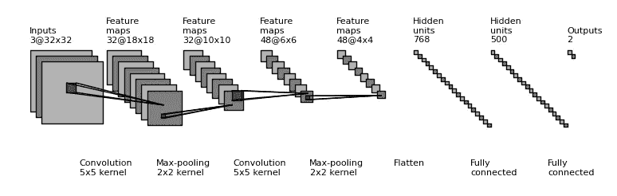

来源:[GitHub—gwding/draw _ conv net](https://github.com/gwding/draw_convnet)

对细胞神经网络有一个坚实的理论观点，特别是从信息论的角度来看，对于提出新的想法来显著提高深度学习模型在特定任务上的能力，甚至以无人能及的效率解决问题来说，尤为重要。在本文的其余部分，我将简要介绍信息论的概念，然后从信息论和统计学的角度详细解释 CNN 各层中数值的含义。我希望本文涵盖的内容能够帮助您以新的方式了解 CNN 的工作方式，并提出自己的 CNN 模型来更好地解决您的计算机视觉问题，在 Kaggle 上获得奖牌，甚至最终在 CVPR 和 ICCV 这样的顶级会议上发表论文。

# 深度神经网络中的信息论

你可能对“特征提取”这个概念很熟悉，这正是卷积核所做的一切(从最简单的意义上来说)。但是，你有没有尝试过深入了解更多关于“特征提取”的知识？具体来说，从数值的角度来看，卷积函数是如何进行特征提取的？到头来，CNN 里的只是数字，数字，数字。你的好奇心是否曾促使你去寻找 CNN 层中那些数字的意义和它们之间的关系？

虽然我在基于 CNN 的论文中多次遇到术语“信息流”，但我一直在努力寻找任何涵盖信息论的论文或书籍，或至少是其直观观点，在卷积神经网络背后的可满足的深度。

首先，我们将简要介绍信息论。

## 1.自我信息

假设一个事件 ***X=x*** 有概率 ***p*** 发生。那么我们将事件 ***x*** 的信息值 ***I*** 定义如下:

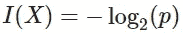

价值 ***I*** 的意义简单来说就是衡量事件 ***x*** 发生的知识有多少/有多少价值。发生 ***p*** 的几率越小，信息价值越高。直觉上，当一个罕见的事件发生时，人们认为它更有价值；相反，如果一个事件太普通，我们往往认为它不包含太多的信息价值。

比如你知道你下周一要上班( ***p = 0.99*** )，那么这个你下周一要上班的知识其实是没有用的，因为它并没有改变你现在的任何决定。然而，如果你的老板突然告诉你，你明天必须去欧洲参加一个非常重要的商务活动( ***p = 0.01*** )，那么这个信息的价值就非常高，它会对你当前的计划产生很大的影响。

## 2.熵

自我信息衡量的是单个离散事件的信息值，而熵则更进一步，捕捉一个随机变量的信息值，无论它是离散的还是连续的。

如果一个随机变量 ***X*** 有***【p(X)***的 p.m.f / p.d.f，那么熵定义如下:

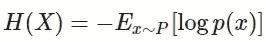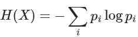

*   如果 ***X*** 是连续的:

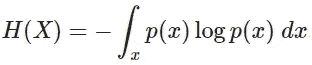

## 3.条件熵

同样，我们将随机变量 ***X*** 和 ***Y*** 的条件熵定义如下:

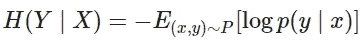

条件熵度量已知事件在***【Y】***发生时的期望信息值，假设我们知道事件在***【X】***已经发生。这一特性特别重要，因为它在低至像素级别的级别上与计算机视觉中的信息论直接相关。

## 4.卷积核中的信息论

几乎所有 CNN 的专业从业者都必须对卷积核的功能有深入的了解，包括步长和特征提取。如果那些概念你不熟悉，我强烈推荐这篇关于卷积神经网络介绍的很棒的文章:[卷积神经网络](/convolutional-neural-network-17fb77e76c05)。

在下一节中，我将介绍卷积核的信息论。

# 卷积核是分类器(惊喜？)

## 1.卷积评论

现代 CNN 中最常见的内核大小是 ***3*3*** 内核。假设我们在原始 RGB 图像上应用单个 ***3*3*** 内核，在感受野中观察到的像素总数将是 ***27*** (H:3，W:3，C:3)。设卷积核为函数 ***f*** ，则 ***f: R ⁷ → R*** 。输入是 27 像素的图像部分，输出是标量值。

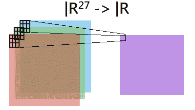

来源:作者图片

**这个输出的标量值是什么？让卷积运算在复杂的视觉任务上工作如此高效的这个像素的真正意义是什么？**

## 2.每个内核都是一个分类器

令人惊讶的是，输出的标量实际上是一个相对概率。换句话说，**每个卷积核都是一个分类器**！这是特征提取的核心思想！

假设内核 ***f: R ⁷ → R*** 负责提取一个特征*(边缘、圆形物体、明亮物体等。)我们可以将内核 ***f*** 改写为:*

*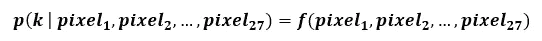*

*直观的描述就是内核 ***f*** 观察其感受野的全部 27 个像素，**学习分类图像中“被看到”的区域是否包含特征 *k* 或**。假设 ***k*** 为“边缘”，请看下图 1 中的实验和评论，以获得直观的解释。*

*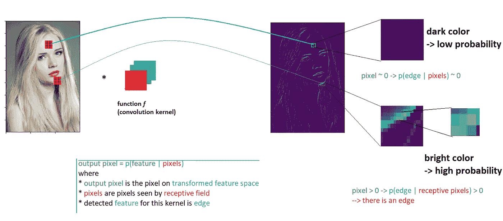*

*图 1:自然图像到特征空间的转换(来源:作者)*

*   ****注意*** *:这只是相对概率，意思是输出的标量可以是任意实数，不一定在****【0，1】****范围内。对于提取的特征图的可视化，已经应用了 softmax 变换来将值转换成精确的概率。**

*综上所述，卷积核的核心思想来自信息论方面:*

1.  ***每个卷积核在技术上是一个分类器**。它观察感受野中的一组像素，并输出一个标量来度量感受野中的图像区域是否包含核特征的概率。*
2.  *一组**输出的概率被组织为像素**也使得提取的特征变得人眼可见。*
3.  *输出像素的组织 ***p(特征 k|像素)*** 对应于原始图像中的像素位置。这个**保持了原始图像**中物体的整体结构和位置，这解释了**信息如何在卷积层之间**流动。*

*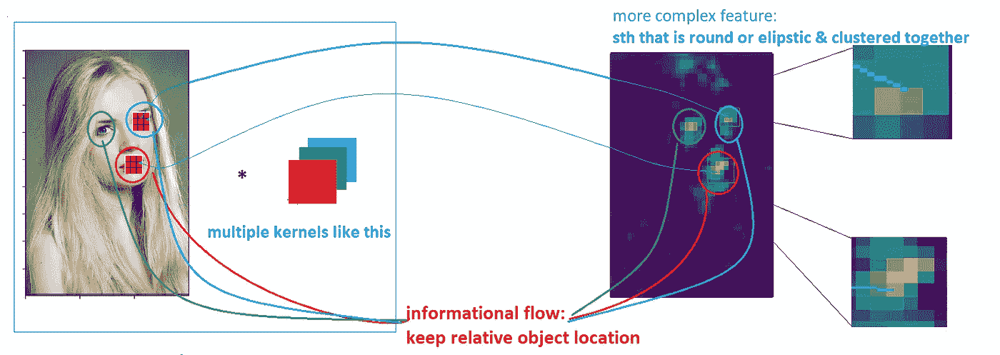*

*图 2:保留对象位置的信息流(来源:作者)*

# *信息论视角下的池层直观观*

*与卷积核类似，池化也可以用信息论和信息流来解释。*

## *从高层次理解池层的一些好处:*

1.  *降维以实现更快的训练和更简单的学习曲线*
2.  *增加信息密度，消除稀疏分布*

## *从信息论角度看池层:*

*如前所述，深度特征图*中的每个像素在技术上是原始图像中相应区域包含特征 ***k*** 的相对概率。高值表示被观察区域很可能具有特征 ***k*** ，反之亦然。**

**由于图像本质上具有稀疏的信息分布，并且汇集层负责**以最小的信息损失进行密集分布**。**

**下图有助于阐明池层之间的信息流:**

**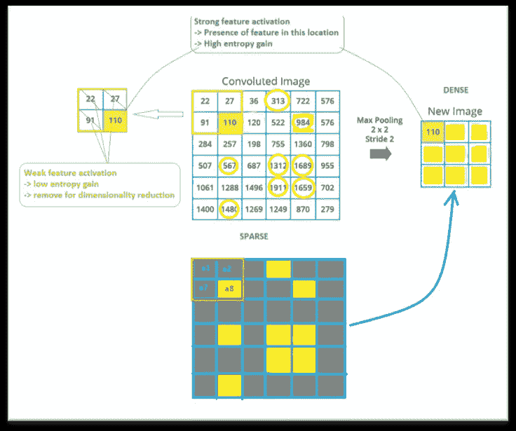**

**图 3:信息密集化(来源:作者)**

**对于相邻像素的移除(例如，在移除 **a1** 、 **a2** 、 **a7** 的同时保留 **a8** )有一种自然的担忧:它是否会显著影响层间的信息流并损害 CNN 的性能？答案是肯定会有信息损失，但这是一个可以接受的损失，以使特征图中的每个像素更有意义。 **a1** 、 **a2** 、 **a7** 、 **a8** 是相邻像素，倾向于相关。因此，这些像素组合的熵增益并不显著，我们可能只需要 1 个像素来表示特征图中这 4 个像素的信息。汇集层过滤三个较不重要的像素，即 **a1** 、 **a2** 、 **a7** ，并保留 **a8** 作为流向更深层的唯一信息。**

# **讨论**

**下面是一系列后续问题，可以帮助你从信息流和信息论的角度更好地理解 CNN:**

1.  **剩余连接中加法的数值意义是什么？传递什么信息？究竟为什么卷积可能有信息损失？(提示:每个卷积核可以捕获 1 个特定的特征，可以是简单的，也可以是复杂的，有些特征集不重叠)。**
2.  **为什么我们使用最大池，有时使用平均池？最小公摊有什么好处？**
3.  **池层是否被认为是 CNN 的瓶颈，为什么是或者不是？**

# **参考**

**[1]潜入深度学习一书，18.11 节:《信息论》:
[潜入深度学习—潜入深度学习 0.17 文档(d2l.ai)](https://d2l.ai/)**

**[2]用信息论理解卷积神经网络:初步探索:[1804.06537.pdf(arxiv.org)](https://arxiv.org/pdf/1804.06537.pdf)**

**[3] [机器学习的信息增益和互信息](https://machinelearningmastery.com/information-gain-and-mutual-information/)**

**[4] [信息熵的温和介绍](https://machinelearningmastery.com/what-is-information-entropy/)**

**[5] [卷积神经网络](/convolutional-neural-network-17fb77e76c05)**