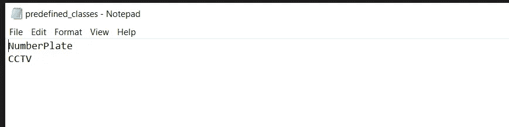
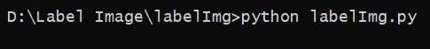
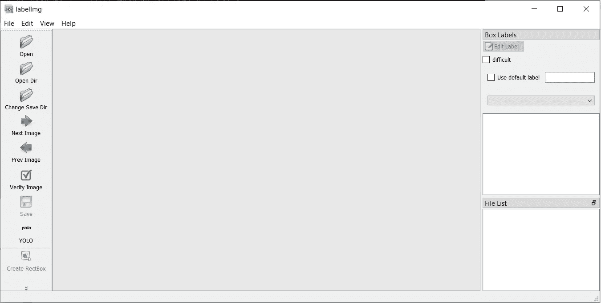
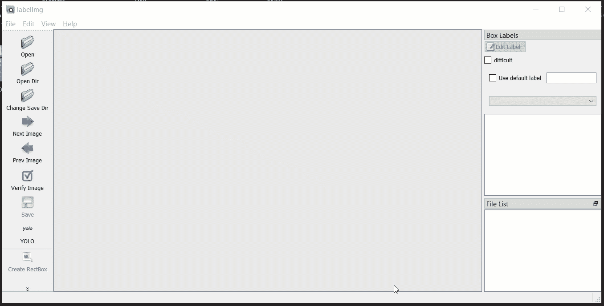
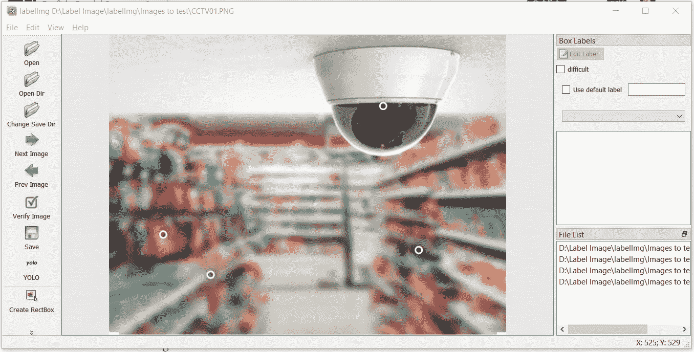
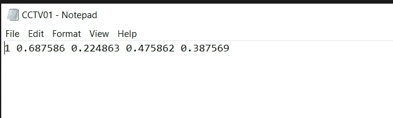

# 用 Python 免费标注图像的最简单方法

> 原文：<https://towardsdatascience.com/easiest-way-to-label-your-images-in-python-for-free-e338b5b5adf3?source=collection_archive---------12----------------------->

## 图像标记过程的需求量很大


照片由 [**亚历山大·巴甫洛夫**波德瓦尔尼](https://www.pexels.com/@freestockpro?utm_content=attributionCopyText&utm_medium=referral&utm_source=pexels)发自 [**派克斯**](https://www.pexels.com/photo/aerial-photo-of-vehicles-in-the-city-1031698/?utm_content=attributionCopyText&utm_medium=referral&utm_source=pexels)

当我们谈论自动驾驶汽车、面罩检测、活动跟踪、对象分割、车牌检测时，每个用例都需要将图像标记作为关键步骤。

图像标记是一个手动过程，需要大量时间来完成。在我们开始深入研究图像标记过程之前，让我们先了解什么是图像标记以及我们为什么需要它。

> 图像标记是给图像中出现的特定对象分配特定标签的过程，以便我们的机器能够区分它们。

图像标记用于计算机视觉领域。每个对象检测系统、图像分割模型、活动检测、运动跟踪器模型都利用图像标记过程作为初始步骤，同时为我们的模型准备数据。

现在，既然你对图像标记和我们为什么使用这个图像标记过程有了一些了解，让我们现在看一下标记我们的图像的一步一步的过程。

要开始这个过程，您必须在计算机上安装 python。这是这项任务的唯一要求。

# 设置环境

对于我们的图像标记任务，我们将使用名为“`labelImg`”的开源 python 包。这个包可以帮助我们标记我们的图像。这个库利用 pyqt5 为我们提供一个 GUI 环境来完成我们的任务。

如果您的机器上安装了 Git 在命令提示符下运行下面的命令来克隆它。

```
git clone [https://github.com/pranjalAI/labelImg.git](https://github.com/pranjalAI/labelImg.git)
```

如果你没有安装 Git，那么你可以直接从[这里](https://github.com/pranjalAI/labelImg.git)下载。只需点击下载按钮，软件包就会被下载。下载后，您可以将其解压缩到任何文件夹中使用。

# 安装 d *附件*

我们需要安装一个名为“pyqt5”的依赖库来使 labelImg 工作。让我们安装它。

*   打开命令提示符。
*   移动到从源文件下载的名为 labelImg 的文件夹。
*   现在，运行下面的命令

```
pip install pyqt5
```

# 设置预定义的类

您需要移动到“labelImg\data”文件夹；在那里，您会找到 predefined_classes.txt

您可以键入图像中的对象名称列表。每个新对象都应该在新的一行。



作者截图

# 运行包

因为这是一个 python 包，所以我们可以像运行任何 python 脚本一样运行它。一旦运行 python 脚本(如下所示)，将会打开一个窗口，它是 python UI 界面的一部分。



这就对了。现在你会发现一个新的 UI 窗口，里面有一些功能。



作者截图

# 图像标签在行动

这个 python 库的目标是标记我们的图像。您可以将一些图像收集到一个文件夹中以供使用。一旦工具启动，你可以在左边找到一些选项。

*   点击“打开目录”选项，选择保存您需要标记的图像的文件夹。
*   现在您需要设置一个路径来保存您的对象细节。单击“更改保存目录”并选择一个文件夹来保存您的对象详细信息。



**Gif** :作者记录

对象细节文件包含图像中对象的坐标和图像的标签。

现在，要标记显示的图像，首先需要设置标签类型。可以在左下方做。在这里，我做的是 YOLO 物体检测，所以我选择了相应的。

然后，你可以点击创建矩形按钮，开始绘制边界框。



**Gif** :作者记录

在绘制边界框时，您可以选择我们之前定义的类。

标记过程完成后，您可以转到对象详细信息文件夹，找到一个单独的图像文本文件。



作者截图

给你！我们现在有了带有各自标签文件的图像，可以用于我们的对象检测任务。

# 结论

在这篇文章中，我们已经涵盖了一步一步的过程来标记我们的图像。我们利用了开源 python 包 labelImg。图像标记任务是手动且耗时的。但是，你在这个过程中花费的时间越多，你的模型就越好。

我希望你喜欢这篇文章。在我接下来的文章中，我们将看到如何利用这些图像来训练我们自己的物体检测系统。

敬请期待！

以下是我的一些最佳选择:

[https://towards data science . com/7-amazing-python-one-liners-you-must-know-413 AE 021470 f](/7-amazing-python-one-liners-you-must-know-413ae021470f)

[https://better programming . pub/10-python-tricks-that-wow-you-de 450921d 96 a](https://betterprogramming.pub/10-python-tricks-that-will-wow-you-de450921d96a)

[https://towards data science . com/5-data-science-projects-the-you-can-complete-over-the-weekend-34445 b 14707d](/5-data-science-projects-that-you-can-complete-over-the-weekend-34445b14707d)

如果你想获得更多关于**数据科技**的精彩知识，有兴趣了解我最喜欢的藏书 [**点击这里**订阅**我的免费频道**](https://www.youtube.com/channel/UCFBGeT5IEH1alywMMRndF2A) 。我将很快开始为所有 python &数据科学爱好者发布一些很酷的东西。

寻找**数据科学& python 咨询** —这里可以联系我[。随时订阅我的免费简讯:](https://linktr.ee/pranjalai) [Pranjal 的简讯](https://linktr.ee/pranjalai)。