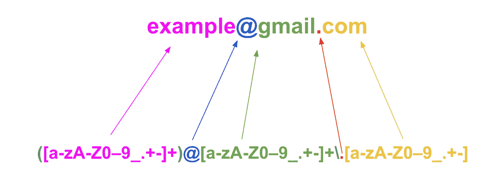
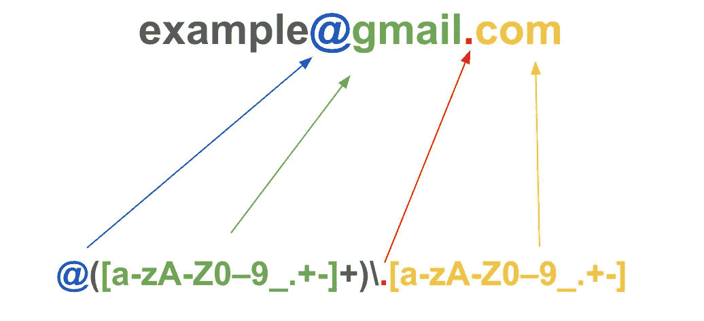

# 记忆正则表达式(Regex)的最简单方法

> 原文：<https://towardsdatascience.com/easiest-way-to-remember-regular-expressions-regex-178ba518bebd?source=collection_archive---------1----------------------->

## [提示和技巧](https://towardsdatascience.com/tagged/tips-and-tricks)

## 理解正则表达式的基础，以便更有效地提取模式

正则表达式示例—按作者排序的图像

如果你像我一样，在开始的时候，正则表达式模式看起来就像胡言乱语。但是仔细观察之后，你会发现它们实际上并不像看起来那么令人生畏。

和许多概念一样，从一个例子开始通常是有帮助的，所以让我们在这里使用这个例子:

> 假设我们正试图从一个电子邮件地址的域名中提取名字，如下所示:example@ **gmail** 。com 因此，在这种情况下，我们将尝试只提取“gmail”部分。

为了练习，我强烈推荐你使用这个网站:[https://regex101.com/](https://regex101.com/)。

在我们开始处理我们的例子之前，让我们看看一些你可能会遇到或需要的常见字符。

*   `+`正则表达式中的字符+表示“匹配前面的字符一次或多次”。**例如** `ab+c` **匹配“abc”、“abbc”、“abbbc”但不匹配“AC”**。正则表达式中使用的加号字符称为克莱尼加号，以数学家斯蒂芬·克莱尼(1909-1994)的名字命名，他引入了这个概念。[来源](https://chortle.ccsu.edu/)
*   `*`这个字符在正则表达式中的意思是“零次或多次匹配前面的字符”。**例如** `ab*c` **匹配“abc”、“abbc”、“abbbc”、“AC”**。这也被称为克林星。
*   问号`**?**`表示前面的元素出现*零次或一次*。**比如** `colou?r` **既匹配“颜色”，又匹配“色彩”。**
*   `.`句号匹配任何单个字符。例如`a.c`匹配“abc”、“adc”、“aec”等。如果我们想要匹配字母“c”之前的多个字符，我们只需使用上面的星号`*`就像这样:`a.*c`并且这将匹配**“a**b defgh**c”。**
*   这非常有用，因为它定义了一个可能值的范围。这里它只是简单的指从 a 到 z 的所有小写字母，对于大写字母和所有正数我们也可以这样做，像这个`[A-Z]` & `[0-9]`。
*   `^` **:** 匹配任意一行的起始位置。
*   `[^b]at`匹配`.at`匹配的除“蝙蝠”以外的所有字符串。因此，当在方括号内使用时，`^`后面的字母被排除在外。
*   `^[hc]at`匹配“hat”和“cat”，但仅在字符串或行的开头。

现在我们已经准备好了，让我们再来看看我们的例子。因此，要获得电子邮件地址域的名称部分，我们将使用以下正则表达式:

`@([a-zA-Z0-9_.+-]+)` \ `.[a-zA-Z0-9_.+-]`

正则表达式示例—作者图片

这将返回“gmail”，这正是我们想要的。

下面是我们例子中每个元素的分解。

*   @:这表示我们希望我们的搜索从“@”开始。
*   `()`:这个括号允许我们只分离出我们想要返回的搜索模式的一部分。移除这些括号并在正则表达式的末尾添加一个`+`，将允许我们匹配“@”:@ Gmail . com 之后的所有内容。
*   `[]`:方括号允许我们包含我们想要匹配的所有字符，甚至包含这样的范围:a-z 和 0-9。范围后面还有其他字符，如“_”、“”、"+"、"-"等等，这些都是我们的表达式要寻找的文字字符。如果需要的话，我们还可以包括像德国字母这样的特殊字符。"*ü*"
*   `+`:我们已经看到加号一次或多次匹配前面的字符。因为这在我们的方括号之外，我们基本上多次匹配方括号中的所有内容。酷是吗？
*   \:退格键[对句号](https://en.wikipedia.org/wiki/Escape_character)进行转义，这样我们的正则表达式就不会认为这是上面定义的量词的一部分。我们需要句号成为我们模式的一部分，因为它出现在我们的搜索词“[example@gmail.com](mailto:example@gmail.com)”中
*   `.`:句号在方括号`()`之外，所以我们的正则表达式将查找该点之前的所有字符串以及其后的方括号。

为了确保“@gmail.com”在字符串的末尾，可以包含`+$`。`$`断言该位置位于行尾。所以我们的成品会是这样的

`@([a-zA-Z0-9_.+-]+)` \ `.[a-zA-Z0-9_.+-]+$`

现在，假设我们只想从电子邮件地址“example@gmail.com”中提取“example”，我们只需在上面使用的模式前面添加另一个模式，就像这样`([a-zA-Z0-9_.+-]+)`。注意，方括号`()`现在位于正则表达式的第一部分之前，表明这是我们想要提取的唯一部分。

`([a-zA-Z0-9_.+-]+)@[a-zA-Z0-9_.+-]+` \ `.[a-zA-Z0-9_.+-]`

作者图片

## 额外的

要使用正则表达式提取德语字符，只需将它们包含在您的模式中，如下所示:

`([a-zA-Z0-9äüö_.+-]+)@[a-zA-Z0-9_.+-]+` \ `.[a-zA-Z0-9_.+-]`

这将从“sch[fer@example.com](mailto:fer@example.com)返回“schfer”

这是一个非常简单的例子，还有许多其他方法可以达到同样的效果。但是我相信这有助于获取更复杂的正则表达式。

我希望你觉得这很有帮助，并在评论中分享其他的技巧和诀窍。

> 可以 [**成为中等会员**](https://medium.com/@tobisam/membership) 享受更多这样的故事。

## **参考文献**:

*   [https://cloud . Google . com/big query/docs/reference/standard-SQL/string _ functions # regexp _ instr](https://cloud.google.com/bigquery/docs/reference/standard-sql/string_functions#regexp_instr)
*   [https://regex101.com/](https://regex101.com/)
*   [https://en.wikipedia.org/wiki/Regular_expression](https://en.wikipedia.org/wiki/Regular_expression)