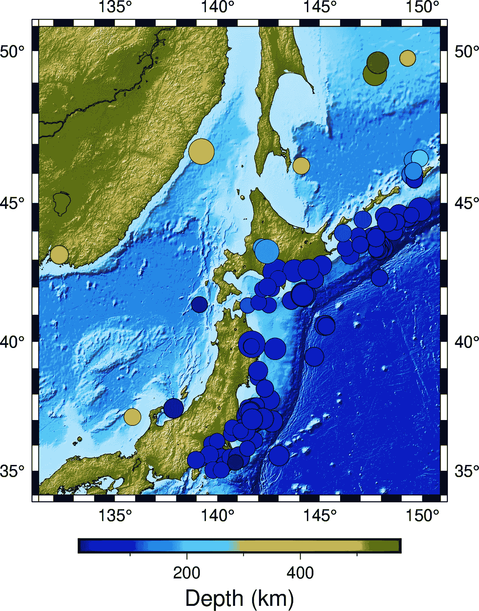

# 只需几个步骤，即可在地形图上轻松绘制地震数据

> 原文：<https://towardsdatascience.com/easily-plot-earthquakes-data-on-top-of-the-topographic-map-in-a-few-steps-c165673035b4?source=collection_archive---------30----------------------->

## 我们从 CSV 文件中读取地震数据，并使用 PyGMT 将其绘制在地图上



地图上的地震数据(图片作者提供)

在本帖中，我们将首先读取一个包含地震位置(纬度和经度)、震级和深度的 CSV 文件，然后将其叠加在地形图上。使用 PyGMT API 自动下载地形数据。

# 读取事件数据的 CSV 文件

我有一个包含地震事件数据的 CSV 文件。数据来自 PyGMT 示例数据集。它可以在本地获得和保存:

```
data = pygmt.datasets.load_japan_quakes()
data.to_csv('my_events_data.csv', index=False)
```

数据是表格形式的，所以我们可以使用 pandas 的`read_csv`方法来读取它。

```
import pandas as pd# this file is retrieved from the pygmt dataset
data = pd.read_csv('my_events_data.csv')
```

# 在地形图上绘制数据

首先，我们根据数据定义区域。

```
# Set the region
region = [
    data.longitude.min() - 1,
    data.longitude.max() + 1,
    data.latitude.min() - 1,
    data.latitude.max() + 1,
]
```

然后我们初始化 PyGMT“Figure”对象:

```
fig = pygmt.Figure()
```

接下来，我们获得高分辨率的地形数据，并使用标准化的`etopo1`色图绘制它。我们设定最低海拔为-8000 米，最高海拔为 5000 米。如果在此范围之外有任何地形区域，则用白色标出。我们选择宽度为 4 英寸的“墨卡托”投影进行绘图。

```
# make color pallets
pygmt.makecpt(
    cmap='etopo1',
    series='-8000/5000/1000', #min elevation of -8000m and max of 5000m
    continuous=True
)# define etopo data file
topo_data = "[@earth_relief_30s](http://twitter.com/earth_relief_30s)"
# plot high res topography
fig.grdimage(
    grid=topo_data,
    region=region,
    projection='M4i',
    shading=True,
    frame=True
)
```

接下来，我们用海岸线绘制海岸线，并在地图上添加了一个框架。

```
fig.coast(shorelines=True, frame=True)
```

最后，我们绘制数据:

```
# colorbar colormap
pygmt.makecpt(cmap="jet", series=[
              data.depth_km.min(), data.depth_km.max()])
fig.plot(
    x=data.longitude,
    y=data.latitude,
    sizes=0.1*data.magnitude,
    color=data.depth_km,
    cmap=True,
    style="cc",
    pen="black",
)
fig.colorbar(frame='af+l"Depth (km)"')
fig.savefig('my_earthquakes.png')
```

我们用代表地震深度的颜色和代表地震震级的圆圈的大小来绘制数据。我们在底部添加了水平色条。


地图上的地震数据(图片作者提供)

# 完整脚本

*原载于 2021 年 5 月 28 日 http://www.earthinversion.com**的* [*。*](https://www.earthinversion.com/utilities/how-to-plot-the-earthquake-data-on-a-topographic-map/)