# 简单，轻松，EDA —我最新功能的更新

> 原文：<https://towardsdatascience.com/easy-breezy-eda-updated-function-using-seaborn-ffe2ccc9f56a?source=collection_archive---------22----------------------->

## 简化您的探索性数据分析流程，以便您可以更快地获得洞察力


照片由[狄龙在](https://unsplash.com/@dillonjshook?utm_source=unsplash&utm_medium=referral&utm_content=creditCopyText) [Unsplash](https://unsplash.com/s/photos/work-smart-not-hard?utm_source=unsplash&utm_medium=referral&utm_content=creditCopyText) 上摇

在[我最新的博客文章](/a-function-that-makes-your-initial-eda-a-breeze-8e9549d69fb3)中，我写了一个我在从事最新项目时创建的函数，以在 EDA 过程中简化代码和节省时间。对于那些不熟悉这篇文章的人来说，这是我创建的函数:

```
def initial_eda(df):
    # List of categorical columns
    cat_cols = df.select_dtypes('object').columns

    for col in cat_cols:
        # Formatting
        column_name = col.title().replace('_', ' ')
        title= 'Distribution of ' + column_name

        # Unique values <= 12 to avoid overcrowding
        if len(df[col].value_counts())<=12: 
            plt.figure(figsize = (8, 6))        
            sns.countplot(x=df[col], 
                          data=df, 
                          palette="Paired",
                          order = df[col].value_counts().index)
            plt.title(title, fontsize = 18, pad = 12)
            plt.xlabel(column_name, fontsize = 15)
            plt.xticks(rotation=20)
            plt.ylabel("Frequency",fontsize = 15)
            plt.show();
        else:
            print(f'{column_name} has {len(df[col].value_counts())} unique values. Alternative EDA should be considered.')
    returnSome examples of the visuals created from this code:
```

通过该函数运行奥斯汀动物中心数据集后，产生了以下一些视觉效果:

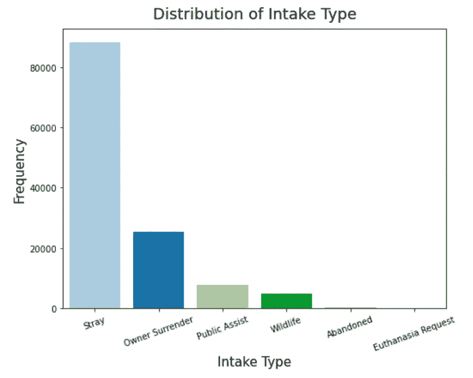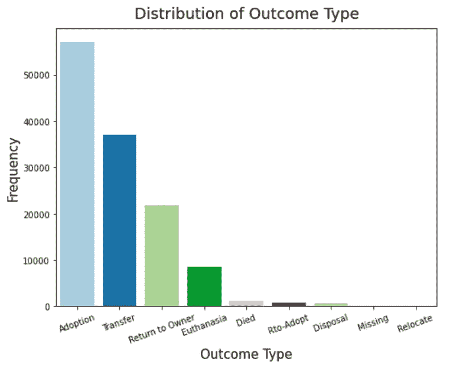

作者提供的图片

正如我在上一篇文章中提到的，虽然这在最初的 EDA 中运行良好，但仍有很大的改进空间。例如，上面的函数只为具有 12 个或更少唯一值的列提供可视化效果。具有更多唯一值的用户提供了以下打印语句:

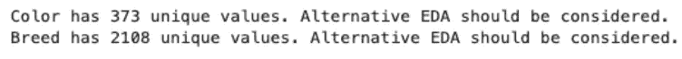

虽然这确实提供了关于这些列中每一列的一些信息，但是错过了提取关于可能有价值的数据的洞察力的机会。下面是该函数的一个新的更新版本:

```
def initial_eda(df):
    # List of categorical columns
    cat_cols = df.select_dtypes(['object','category']).columns

    for col in cat_cols:
        # Formatting
        column_name = col.title().replace('_', ' ')
        title = 'Distribution of ' + column_name
        unique_values = len(df[col].value_counts())

        # unique_values <=12 to avoid overcrowding
        if unique_values<=12: 
            plt.figure(figsize = (10, 6))
            sns.countplot(x=df[col], 
                          data=df, 
                          palette="Paired",
                          order = df[col].value_counts().index)
            plt.title(title, fontsize = 18, pad = 12)
            plt.xlabel(column_name, fontsize = 15)
            plt.xticks(rotation=20)
            plt.ylabel("Frequency",fontsize = 15)
            plt.show();
        else:
            print(f'{column_name} has {len(df[col].value_counts())} unique values. Here are the top 10:')
            print()
            col_count  = df[col].value_counts()
            col_count = col_count[:10,]
            plt.figure(figsize = (12, 6))
            sns.barplot(x = col_count.index, 
                        y = col_count.values, 
                        palette="Paired")
            plt.title(f'Top 10 {column_name}s', fontsize = 18, pad = 12)
            plt.ylabel('Frequency', fontsize=15)
            plt.xticks(rotation=20)
            plt.xlabel(column_name, fontsize=15)
            plt.show()

    return
```

如果列有超过 12 个唯一值，这个函数的更新版本现在将创建一个包含 10 个最常见的唯一值的条形图，而不是返回一个 print 语句。一些例子:

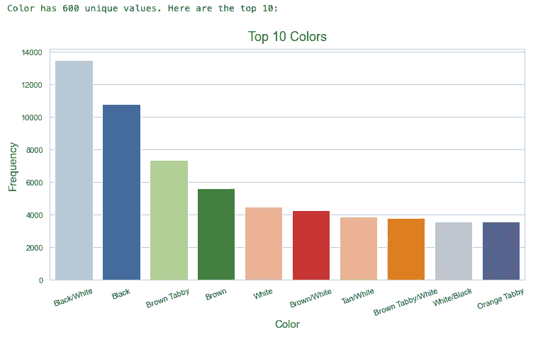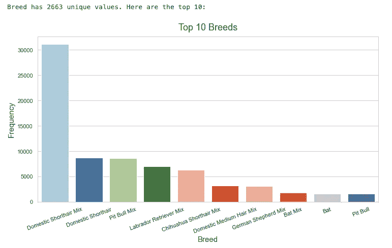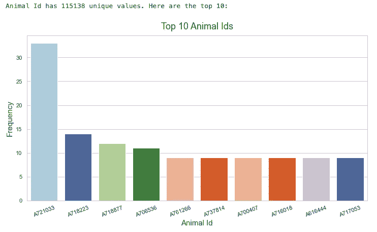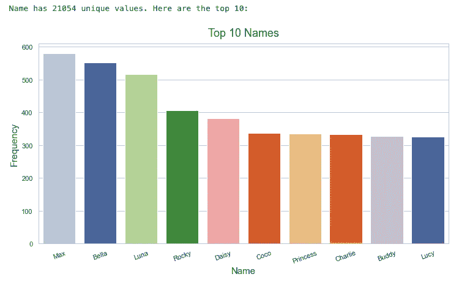

作者提供的图片

这一功能的增加为我们提供了更多的信息，并提出了我们可能选择进一步研究的问题。例如，从这些图片中我们可以看到，编号为 A721033 的动物已经进入庇护所超过三十次。*为什么会这样？是什么动物类型？这只动物是流浪狗吗？这种动物以前被领养过吗？*这些额外的视觉效果可以提供有价值的见解，并在建模过程之前引导项目的方向。

该功能的最后一个附加功能是确保生成的视觉效果在美学上令人愉悦。虽然函数本身为我们提供了有意义的信息，但“一刀切”的方法可能会创建视觉上不吸引人的条形图。例如:

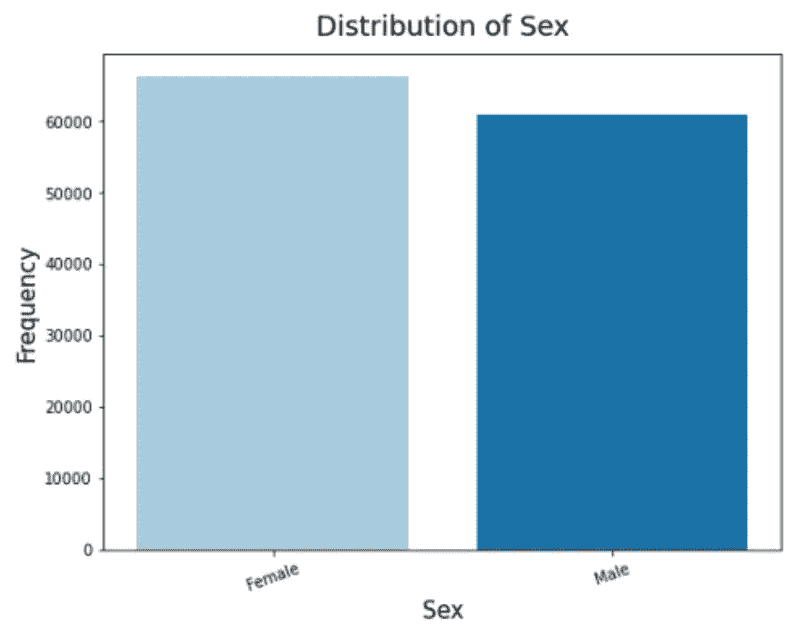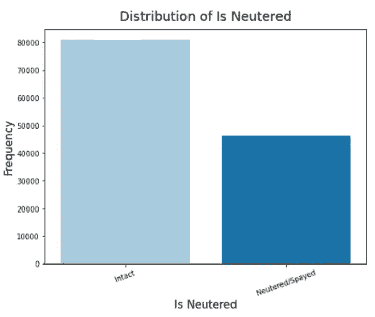

作者提供的图片

也许这是我在吹毛求疵，但我看着这些图表，知道它们可以改进。在我看来，具有两个唯一值的列不应该与具有十二个唯一值的列具有相同的图形大小。下面是最后一个更新的函数，它根据唯一值的数量来配置图形大小:

```
def initial_eda(df):
    # List of categorical columns
    cat_cols = df.select_dtypes(['object','category']).columns

    for col in cat_cols:
        # Formatting
        column_name = col.title().replace('_', ' ')
        title = 'Distribution of ' + column_name
        unique_values = len(df[col].value_counts())

        # If statements for figsize
        if 2<=unique_values<3: 
            plt.figure(figsize = (4, 6))
            sns.countplot(x=df[col], 
                          data=df, 
                          palette="Paired",
                          order = df[col].value_counts().index)
            plt.title(title, fontsize = 18, pad = 12)
            plt.xlabel(column_name, fontsize = 15)
            plt.xticks(rotation=20)
            plt.ylabel("Frequency",fontsize = 15)
            plt.show();
        elif 3<=unique_values<8:
            plt.figure(figsize = (8, 6))
            sns.countplot(x=df[col], 
                          data=df, 
                          palette="Paired",
                          order = df[col].value_counts().index)
            plt.title(title, fontsize = 18, pad = 12)
            plt.xlabel(column_name, fontsize = 15)
            plt.xticks(rotation=20)
            plt.ylabel("Frequency",fontsize = 15)
            plt.show();
        elif 8<=unique_values<=12:
            plt.figure(figsize = (10, 6))
            sns.countplot(x=df[col], 
                          data=df, 
                          palette="Paired",
                          order = df[col].value_counts().index)
            plt.title(title, fontsize = 18, pad = 12)
            plt.xlabel(column_name, fontsize = 15)
            plt.xticks(rotation=20)
            plt.ylabel("Frequency",fontsize = 15)
            plt.show();
        else:
            print(f'{column_name} has {len(df[col].value_counts())} unique values. Here are the top 10:')
            print()
            col_count  = df[col].value_counts()
            col_count = col_count[:10,]
            plt.figure(figsize = (12, 6))
            sns.barplot(x = col_count.index, 
                        y = col_count.values, 
                        palette="Paired")
            plt.title(f'Top 10 {column_name}s', fontsize = 18, pad = 12)
            plt.ylabel('Frequency', fontsize=15)
            plt.xticks(rotation=20)
            plt.xlabel(column_name, fontsize=15)
            plt.show()

    return
```

现在，这个函数将呈现这些视觉效果:

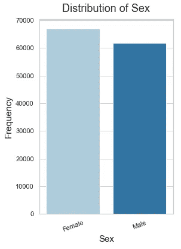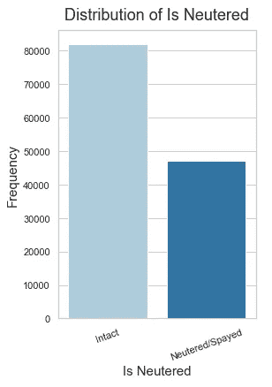

作者提供的图片

在我看来，这些看起来更有吸引力。

探索性数据分析(EDA)可以塑造项目的方向。这是我在数据科学过程中最喜欢的阶段之一，因为在这一阶段可以充分探索一个人的好奇心。虽然数据科学的“魔力”在建模阶段显现出来，但是确定和优化模型以充分发挥其潜力要从正确的数据探索开始。

我希望我自己和其他人不仅可以利用这个功能节省时间，更重要的是利用节省下来的时间来拓展我们的好奇心。

> 重要的是不要停止质疑。好奇心有它存在的理由。当一个人思考永恒、生命和现实的奇妙结构的奥秘时，他不禁感到敬畏。如果一个人每天仅仅试图理解这种神秘的一点点，这就足够了。永远不要失去神圣的好奇心。—阿尔伯特·爱因斯坦，*《生活》杂志*(1955 年 5 月 2 日)

要了解更多关于奥斯汀动物成果项目的信息，你可以在我的个人 GitHub [这里](https://github.com/ksylvia16/Animal-Outcomes-Austin-TX)查看。