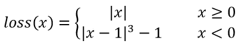
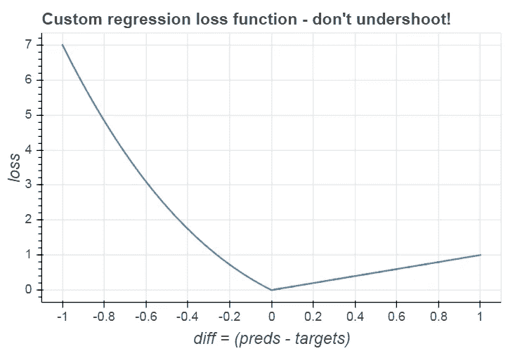
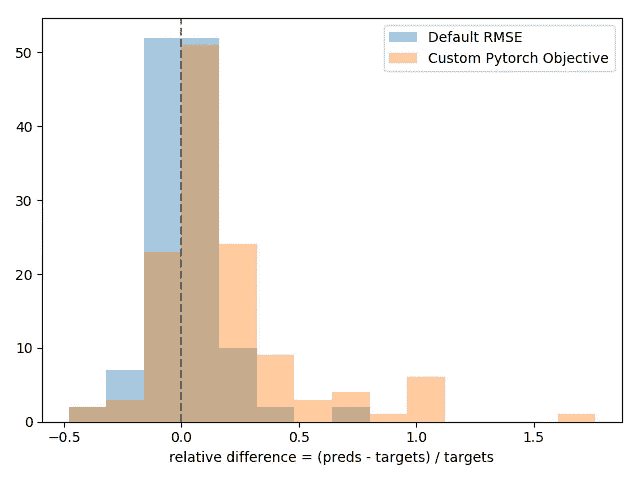

# 使用 PyTorch 的树助推器容易自定义损失

> 原文：<https://towardsdatascience.com/easy-custom-losses-for-tree-boosters-using-pytorch-57ffaa0b2eb3?source=collection_archive---------17----------------------->

## 当您可以让 PyTorch 为您计算时，为什么要为您的自定义目标计算一阶和二阶导数呢？

诸如 [Catboost](https://catboost.ai/) 、 [XGBoost](https://xgboost.readthedocs.io/en/latest/) 和 [LightGBM](https://lightgbm.readthedocs.io/en/latest/) 之类的树加速器是强大的工具，尤其是在处理表格数据时。他们支持[各种现成的损失](https://catboost.ai/docs/concepts/loss-functions.html)，但有时你想使用量身定制的损失，一些有特殊魅力的东西，让你的模型闪闪发光。

幸运的是，所有常见的树提升包都支持自定义目标。不幸的是，为了建立一个模型，你必须提供一个函数来计算你的目标相对于模型输出的一阶和二阶导数，谁愿意这么做？我们已经有现代深度学习包可以为我们做到这一点。只需`[pip install treeboost_autograd](https://pypi.org/project/treeboost_autograd/)`然后为 CatBoost、XGBoost 或 LightGBM 定义您的自定义损耗，就像这样简单:

# PyTorch 前来救援

让我们用[火炬来做这个重担。假设您有一个标量目标值(例如](https://pytorch.org/docs/stable/autograd.html) [minibatch MSE](https://pytorch.org/docs/stable/generated/torch.nn.MSELoss.html) )和一个模型预测的一维向量。首先用 pytorch 计算`objective` w.r.t `preds`的一阶导数:

`create_graph=True`告诉 pytorch 为导数构建一个计算图，允许我们在其上计算更高级别的导数。

然后，把一阶导数的每个元素当作一个标量，重新推导出 w.r.t `preds`:

`retain_graph=True`告诉 pytorch 在计算完导数后不要释放计算图，因为我们需要多次使用它。

这就是它的要点。现在我们只需要将它插入到一个 Catboost 友好的目标类中，并开始使用我们的自定义损失！

# 定义自定义损耗

我们将使用[波士顿房价](https://www.cs.toronto.edu/~delve/data/boston/bostonDetail.html)玩具数据集作为例子。比方说，我们希望我们的模型避免低于房价，而不是高于房价，也就是说，对于低于实际房价的预测，我们希望损失更严重。设 *x =(预测目标)*:

*作者图片*

*作者图片*

# 训练模型

现在我们需要做的就是将我们的自定义损失函数插入到一个`CatboostObjective`对象中，并训练一个`CatBoostRegressor`。

为了了解我们的自定义损失，我们可以绘制模型预测和目标之间相对差异的直方图。正如你所看到的，我们的定制“不低于”模型确实低于目标价格，比使用[默认对称 RMSE 损失](https://catboost.ai/docs/concepts/loss-functions-regression.html)训练的模型低得多。自然，我们的模型更容易超过目标价格。

*作者图片*

# 使用标准 Pytorch 损耗

同样的原理也适用于[标准 pytorch 损耗](https://pytorch.org/docs/stable/nn.html#loss-functions)。如果您想使用默认的 Catboost 超参数进行调优，请选择`reduction="sum"`。例如，使用这些自定义损失(几乎)等同于使用 Catboost 的默认损失进行分类和回归:

# 自己用

图片来自[皮克斯拜](https://pixabay.com/photos/cat-black-cat-work-computer-963931/)

好吧好吧。没必要为此慌张。只需`[pip install treeboost_autograd](https://pypi.org/project/treeboost_autograd/)`就可以了。

完整的实现可以在 [git repo](https://github.com/TomerRonen34/treeboost_autograd) 以及[回归和二进制分类的现成例子](https://github.com/TomerRonen34/treeboost_autograd/tree/main/examples)中找到——针对 CatBoost、XGBoost 和 LightGBM。

 [## to erron 34/tree boost _ autograded

### 当您可以让 Pytorch 为您计算时，为什么要为您的目标计算一阶和二阶导数呢？请查看…

github.com](https://github.com/TomerRonen34/treeboost_autograd) 

也可以在 PyTorch 论坛上查看一下[迪奥戈·佩恩斯](https://github.com/dpernes)关于如何计算二阶导数的精彩回答。

图片由[约翰](https://toppng.com/john3)从[翻唱](https://toppng.com/decision-tree-circuit-board-tree-patter-PNG-free-PNG-Images_250977?search-result=gum-tree)而来，由作者编辑