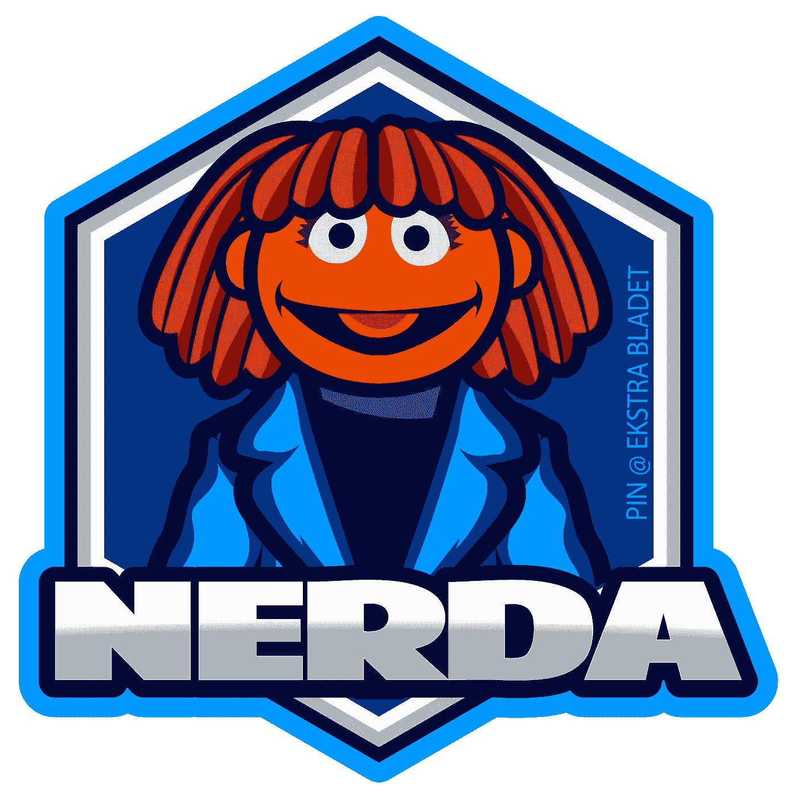

# 用于命名实体识别的变压器的简单微调

> 原文：<https://towardsdatascience.com/easy-fine-tuning-of-transformers-for-named-entity-recognition-d72f2b5340e3?source=collection_archive---------7----------------------->

## 如何轻松地微调任何自然语言处理转换器，以用于任何语言的命名实体识别。


照片由 [vinsky2002](https://pixabay.com/da/users/vinsky2002-1151065/) 在 [Pixabay](https://pixabay.com/images/id-3871893/) 上拍摄

在本文中，我们将介绍如何针对任何语言中的命名实体识别(=NER)，轻松地微调任何预训练的自然语言处理(=NLP)转换器。

你为什么要在乎？NER 是一个强大的 NLP 任务，有很多应用，在《走向数据科学》中已经有详细描述。然而，有效地使用 NER 通常需要基于预训练的转换器对您的 NER 模型进行语言或领域特定的微调，这些转换器在给定的计算预算下是可用的和现实的。

为了向您展示如何做到这一点，我们使用 python 包`[NERDA](https://github.com/ebanalyse/NERDA)`来微调 NER 的 [BERT](/bert-explained-state-of-the-art-language-model-for-nlp-f8b21a9b6270) 转换器。

`NERDA`是一个通用的 NER 系统，可以用最少的代码对*任何*语言中的*任何*NER 变压器进行微调。

# 命名实体识别对于初学者来说

如果你不熟悉 NER，看看维基百科的定义:

> 命名实体识别(也称为(命名)实体识别、实体分块和实体提取)是信息提取的自然语言处理子任务，其寻求定位非结构化文本中提到的命名实体并将其分类成预定义的类别，例如人名、组织、位置、医疗代码、时间表达式、数量、货币值、百分比等。

我们可以用一个 NER 任务的例子进一步说明这一点。

**任务:**识别文本中的人名和组织:

> 吉姆购买了 300 股 Acme 公司的股票

**解决方案:**人员:' Jim '，组织:' Acme Corp . '

为了介绍本文中提到的其他概念和技术，我们在**资源**部分列出了一些以前的数据科学故事。

# 成套工具

现在，让我们转到为 NER 实际微调变压器。

不管您选择的转换器和目标语言是什么，我们向您展示的步骤都是相同的。

我们将利用新的 python 包`[NERDA](https://github.com/ebanalyse/NERDA)`来完成这项工作。



PIN @ [Ekstra Bladet](https://ekstrabladet.dk/) 的[‘NERDA’](https://github.com/ebanalyse/NERDA)python 包的官方标志。

`NERDA`有一个易于使用的界面，用于微调命名实体识别任务的 NLP 转换器。它基于流行的机器学习框架`[PyTorch](https://pytorch.org/)`和[拥抱脸](https://huggingface.co/) `[transformers](https://pypi.org/project/transformers/)`。

`NERDA`是开源的，可以在 Python 包索引(PyPI)上获得。它可以与以下设备一起安装:

```
pip install NERDA
```

# 资料组

我们将使用带有 NER 注释的英语数据集来训练和验证我们的模型。
首先，我们下载数据集并加载预定义的训练和验证数据分割。

```
from NERDA.datasets import get_conll_data, download_conll_data download_conll_data()
training = get_conll_data('train')
validation = get_conll_data('valid')
```

CoNLL-2003 操作以下类型的命名实体(相当标准的类别):

1.  **每**个儿子
2.  **组织**机构
3.  位置
4.  杂项杂项
5.  外部(非命名实体)

来自 CoNLL-2003 数据集的观察结果由单词标记化的句子组成，每个单词标记都有命名实体标签。

下面您可以看到一个来自 CoNLL 数据集中的随机句子的例子，它的单词标记与它们各自的命名实体标记([tag])结合在一起。

```
Germany [B-LOC]
's [O]
representative [O]
to [O] 
the [O]
European [B-ORG] 
Union [I-ORG] 
's [O]
veterinary [O] 
committee [O]
Werner [B-PER] 
Zwingmann [I-PER]
said [O]
on [O] 
Wednesday [O]
...
```

数据集实现了[*内-外-始* (IOB)标注方案](https://en.wikipedia.org/wiki/Inside%E2%80%93outside%E2%80%93beginning_(tagging))。

IOB 标记方案意味着，命名实体开头的单词用*‘B-’*标记，命名实体内部的单词用*‘I-’*标记。

在上面的示例中，“德国”被标识为一个地点，“欧盟”被标识为一个组织，“Werner Zwingmann”被标识为一个人。

# 建立模型

第一步，我们为任务指定可用的 NER 标签(不包括特殊的“outside”标签)。

```
tag_scheme = [
'B-PER',
'I-PER',
'B-ORG',
'I-ORG',
'B-LOC',
'I-LOC',
'B-MISC',
'I-MISC'
]
```

接下来，我们必须决定，从拥抱脸`transformers`的哪个变形金刚，我们要微调。我们将坚持使用[无外壳多语言 BERT 变换器](https://huggingface.co/bert-base-multilingual-uncased)(一个流行的选择)。

```
transformer = 'bert-base-multilingual-uncased'
```

此外，我们可以选择为网络以及模型训练本身提供一组基本超参数。

```
# hyperparameters for network
dropout = 0.1
# hyperparameters for training
training_hyperparameters = {
'epochs' : 4,
'warmup_steps' : 500,                                                   'train_batch_size': 13,                                         'learning_rate': 0.0001
}
```

# 将碎片拼在一起

现在，使用`NERDA`模型接口将这些部分组合成一个完整的模型配置。

```
from NERDA.models import NERDAmodel = NERDA(
dataset_training = training,
dataset_validation = validation,
tag_scheme = tag_scheme, 
tag_outside = 'O',
transformer = transformer,
dropout = dropout,
hyperparameters = training_hyperparameters
)
```

在引擎盖下`NERDA`实现了一个`torch`神经网络，它建立在选择的变压器(在这个例子中是 BERT)上。默认情况下，网络的架构将类似于 [Hvingelby et al. 2020](http://www.lrec-conf.org/proceedings/lrec2020/pdf/2020.lrec-1.565.pdf) 中的一个模型(如果你愿意，你也可以提供自己的网络架构)。

为了训练模型，从而微调 BERT 变换器，剩下要做的就是调用`train`方法。

```
model.train()
```

**注意**:这将需要一些时间，取决于您机器的尺寸(如果您想跳过培训，您可以使用`NERDA`附带的*预烹饪*型号)。

这就是它的全部。我们现在已经为 NER 调整了我们自己最先进的基于 BERT 的模型。

让我们看看该模型在独立测试集上的表现(通过 F1 分数)。

```
>>> test = get_conll_data('test')
>>> model.evaluate_performance(test)
Level  F1-Score 
B-PER  0.963
I-PER  0.987
B-ORG  0.887
I-ORG  0.866
B-LOC  0.922
I-LOC  0.817
B-MISC  0.823
I-MISC  0.680
AVG_MICRO 0.907
```

*‘AVG _ 微’:跨实体标签的微平均 F1 分数。*

如你所见，性能看起来很棒。

我们现在可以使用该模型来识别新文本中的命名实体，即

```
>>> model.predict_text('Cristiano Ronaldo plays for Juventus FC')
([['Cristian', 'Ronaldo', 'plays', 'for', 'Juventus', 'FC']], 
[['B-PER', 'I-PER', 'O', 'O', 'B-ORG', 'I-ORG']])
```

该模型(正确地)将“克里斯蒂亚诺·罗纳尔多”(足球运动员)识别为一个人，将“尤文图斯俱乐部”(足球俱乐部)识别为一个组织。

# 微调任何变压器

目前，拥抱脸网站上有 5000 多个变形金刚模型。那么应该微调哪一个呢？我们不想让你失望，但答案是:视情况而定。天下没有免费的午餐。变压器模型都有其不同的优点和缺点。此外，您需要选择符合您的计算预算和对气候变化的关注程度的变压器。

如前所述，伯特通常是一个很好的选择。然而，与 BERT 相比，新的 kid on the block， [ELECTRA](https://github.com/google-research/electra) 更加轻量级，计算效率更高，并且在 NER 任务中仍然表现出色。

无论你选择哪种转换器，`NERDA`都会支持它。在上面的代码示例中，为了微调 ELECTRA 变压器，您必须改变的是改变`transformer`参数，而不是 BERT，即:

```
model = NERDA(
...,
**transformer = 'google/electra-small-discriminator',**
...
)
```

# 针对任何语言进行微调

有了`NERDA`，你还可以针对任何**语言对转换器进行微调，例如轻松使用你自己的数据集。为了微调丹麦语中 NER 的转换器，我们可以利用由带有 NER 注释的丹麦语句子组成的 [DaNE](https://github.com/alexandrainst/danlp/blob/master/docs/docs/datasets.md#dane) 数据集。**

要实现这一点，您只需更改前面的代码示例:

```
**from NERDA.datasets import get_dane_data**
model = NERDA(
...,
**dataset_training = get_dane_data('train'),
dataset_validation = get_dane_data('dev'),** ...
)
```

如果您没有任何(或只是没有足够的)带有所需语言的 NER 注释的训练数据，您可以使用像 [doccano](https://github.com/doccano/doccano) 这样的工具来注释新文本。

令人惊讶的是，针对特定语言的微调`NERDA`并不像您想象的那样需要那么多带注释的数据，因为`NERDA`利用了转换器中已经存在的知识。例如，丹麦 NER 数据集 DaNE 包括不超过 5500 个句子，这足以训练具有合理性能的`NERDA`模型。

# 关于“内尔达”

> `NERDA`是作为 [Ekstra Bladet](https://ekstrabladet.dk/) 在新闻平台智能(PIN)活动的一部分开发的。PIN 是一个由丹麦[技术大学、](https://www.dtu.dk/)[哥本哈根](https://www.ku.dk/)大学和[哥本哈根商学院](https://www.cbs.dk/)合作进行的工业研究项目，由[丹麦创新基金](https://innovationsfonden.dk/)资助。该项目从 2020 年到 2023 年运行，开发面向新闻出版的推荐系统和自然语言处理系统，其中一些是开源的，如`NERDA`。

资源

<https://github.com/ebanalyse/NERDA>  <https://huggingface.co/>  <https://pytorch.org/>  <https://github.com/google-research/bert>  

[“丹麦人:丹麦人的命名实体资源”。铝(2020)](http://www.lrec-conf.org/proceedings/lrec2020/pdf/2020.lrec-1.565.pdf)

<https://github.com/google-research/electra>  </what-are-transformers-and-how-can-you-use-them-f7ccd546071a>  </bert-explained-state-of-the-art-language-model-for-nlp-f8b21a9b6270>  </understanding-electra-and-training-an-electra-language-model-3d33e3a9660d> 