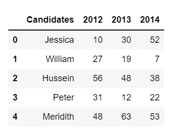
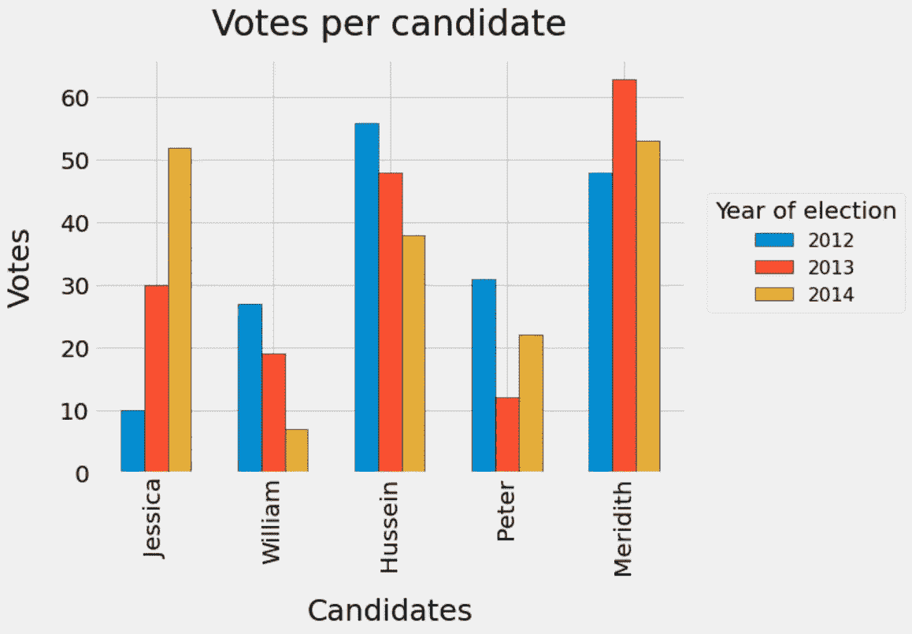

# Python 中的简易分组条形图

> 原文：<https://towardsdatascience.com/easy-grouped-bar-charts-in-python-b6161cdd563d?source=collection_archive---------9----------------------->

## 如何创建每个条目有两个、三个或更多条的条形图


作者图片

我经常想创建一个图，但不记得如何创建，这是一个条形图，其中每个条目或数据帧的每一行都有两个或更多的条形。这样做的目的是比较同一行中的两个不同结果，例如在比较模型的输出或查看不同来源的测量结果有何不同时。虽然有一些例子，但我经常发现自己在无休止地寻找一个简单的实现，或者从各种来源拼凑代码，所以现在我已经能够做到这一点，并记住了代码，我想我会分享我的简单实现，它可以从每个条目两个扩展到三个甚至更多！

为此，我们可以创建一个虚构的数据集，记录五名候选人在一个虚构的学生社团中三年来的投票结果。为了简单起见，我们可以假设三个候选人在三年内没有变化，并且有 172 个成员各自为他们最喜欢的候选人投票。我们可以假设受欢迎程度会随着时间的推移而变化，这样我们就可以使用条形图来检测潜在的趋势。

```
#create the dictionary of voting returns
data_dict = {"Candidates": ["Jessica", "William", "Hussein", "Peter",  "Meridith"],
            2012: [10, 27, 56, 31, 48],
            2013: [30, 19, 48, 12, 63],
            2014: [52, 7, 38, 22, 53]}#convert that into a dataframe
data_df = pd.DataFrame(data_dict)#show the dictionary
data_df
```



然后，我们可以使用这个数据集，例如在一个简单的分组条形图中比较 2012 年和 2013 年这两年的结果。我们可以简单地为每个候选人显示两个条形，这样我们就可以看到他们的受欢迎程度在两年内是如何变化的:

```
#use fivethirty eights style of plots
plt.style.use("fivethirtyeight")#create the base axis to add the bars to
fig, ax = plt.subplots(1,1, figsize = (8,6))#extract the labels
label = data_df["Candidates"]
#use this to create x ticks to add the data to
x = np.arange(len(label))#set a width for each bar 
width = 0.3#create out first bar
#set it so that x will be the centre of the bars
#so that we can add our labels later
#so set the centre of the first to be 1/2 width away
#to the left
rect1 = ax.bar(x - width/2,
              data_df[2012],
              width = width, 
               label = 2012,
               edgecolor = "black"
              )#create the second bar
#with a centre half a width to the right
rect2 = ax.bar(x + width/2,
              data_df[2013],
              width = width,
              label = 2013,
              edgecolor = "black")#add the labels to the axis
ax.set_ylabel("Votes",
             fontsize = 20,
             labelpad = 20)
ax.set_xlabel("Candidates",
             fontsize = 20,
             labelpad =20)
ax.set_title("Votes per candidate",
            fontsize = 30,
            pad = 20)#set the ticks
ax.set_xticks(x)
ax.set_xticklabels(label)#add the legend
#using the labels of the bars
ax.legend(title = "Year of election",
         fontsize = 16,
         title_fontsize = 20)#adjust the tick paramaters
ax.tick_params(axis = "x",
              which = "both",
              labelrotation = 90)
ax.tick_params(axis = "y",
              which = "both",
              labelsize = 15)
```


在这里我们可以看到，从 2012 年到 2013 年，梅里蒂斯和杰西卡的人气上升，而威廉、侯赛因和彼得的人气下降。

实现的关键部分是为要添加的条形创建一个位置数组。这里，它的长度等于我们的数据集中候选值的数量，并使用`x = np.arange(len(data_df["Candidates"])`生成，以确保我们有相同数量的 x 值作为候选值。然后，我们将每组数据的位置调整到 x 刻度的任一侧。在这种情况下，每个条形的中心`width/2`远离`x`值，因此`x`值保持在每个组的中心。这意味着我们可以使用数组将标签添加到绘图中，方法是将 xticks 设置为数组，并将标签添加为刻度标签。

当我们希望每个条目有两个以上的条时，这当然会变得有点复杂，但这种变化并不太难处理。这方面的一个例子是，如果我们想了解人气在三年内的变化情况:

```
#create the base axis
fig, ax = plt.subplots(1,1, figsize = (8,6))#set the labels
#and the x positions
label = data_df["Candidates"]
x = np.arange(len(label))#set the width of the bars
width = 0.2#create the first bar -1 width
rect1 = ax.bar(x - width,
              data_df[2012],
              width = width, 
               label = 2012,
               edgecolor = "black")#create the second bar using x
rect2 = ax.bar(x,
              data_df[2013],
              width = width,
              label = 2013,
              edgecolor = "black")#create the third bar plus 1 width
rects2 = ax.bar(x + width,
               data_df[2014],
               width = width,
               label = 2014,
               edgecolor = "black")#add the labels to the axis
ax.set_ylabel("Votes",
             fontsize = 25,
             labelpad = 20)
ax.set_xlabel("Candidates",
             fontsize = 25,
             labelpad =20)
ax.set_title("Votes per candidate",
            fontsize = 30,
            pad = 20)#set the ticks
#using the labels
ax.set_xticks(x)
ax.set_xticklabels(label)#add the legend
ax.legend(title = "Year of election",
         fontsize = 16,
         title_fontsize = 20,
         bbox_to_anchor = (1.02, 0.7))#adjust the tick paramaters
ax.tick_params(axis = "x",
              which = "both",
              labelrotation = 90,
              labelsize = 20)
ax.tick_params(axis = "y",
              which = "both",
              labelsize = 20)
```



这里的关键是第一个条的中心距离组的中心有一个`width`。这是因为中间的条将具有`width = 0.2`，因此第二条的中心需要至少`width/2 + width/2`远离`x`值。我们可以将宽度增加到`0.3`,它仍然是相同的计算，这种方式使得实现起来很简单，没有什么复杂的记忆！

如果您想在条形图中添加更多的条形，例如四个、五个甚至更多，那么您需要做的就是调整条形的宽度和每个结果的位置，以便 x 值在条形组的中心对齐。例如，如果您希望每个条目有四个条，那么您可以将`x`作为中心，第一个条远离`-1.5 * width`，第二个条远离`-0.5 * width`，第三个条远离`0.5 * width`，第四个条远离`1.5 * width`，只要它们具有相同的宽度。这将意味着标签将集中在`x`上，因此它们将位于每个组的中心。

好了，现在你可以用一种简洁的方式创建简单的分组条形图了，当我将来想再次使用它时，我不会忘记我把代码放在哪里了！

如果你喜欢你所读的，并且想在 medium 上看到更多其他作者的作品，请随意使用我下面的参考代码注册:

[](https://philip-wilkinson.medium.com/membership) [## 通过我的推荐链接加入媒体-菲利普·威尔金森

### 作为一个媒体会员，你的会员费的一部分会给你阅读的作家，你可以完全接触到每一个故事…

philip-wilkinson.medium.com](https://philip-wilkinson.medium.com/membership) 

或者考虑看看我的其他文章:

[](/ucl-data-science-society-python-logic-3eb847362a97) [## UCL 数据科学学会:Python 逻辑

### 讲习班 3:条件语句、逻辑语句、循环和函数

towardsdatascience.com](/ucl-data-science-society-python-logic-3eb847362a97) [](/univariate-outlier-detection-in-python-40b621295bc5) [## Python 中的单变量异常检测

### 从数据集中检测异常值的五种方法

towardsdatascience.com](/univariate-outlier-detection-in-python-40b621295bc5) [](/introduction-to-decision-tree-classifiers-from-scikit-learn-32cd5d23f4d) [## scikit-learn 决策树分类器简介

towardsdatascience.com](/introduction-to-decision-tree-classifiers-from-scikit-learn-32cd5d23f4d)